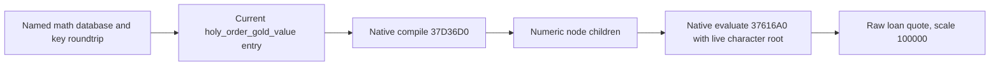
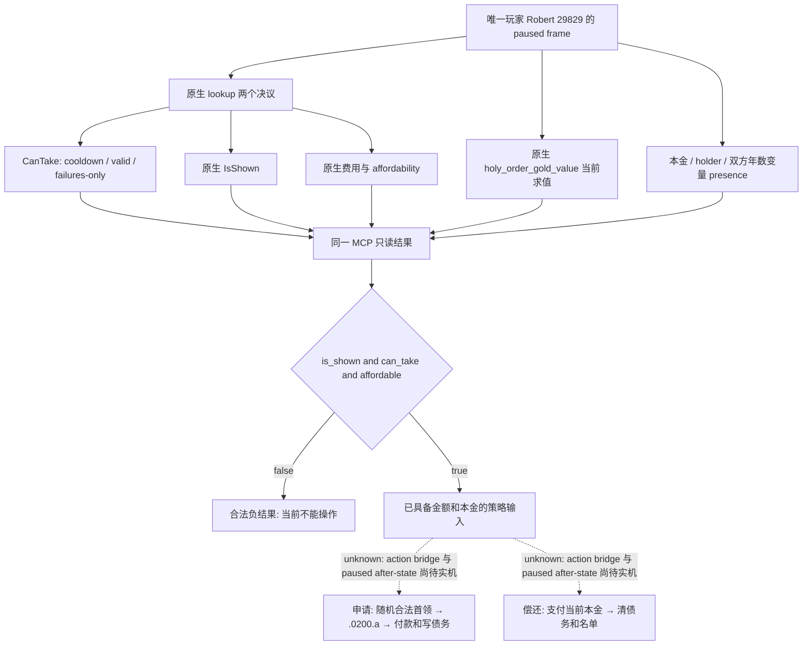
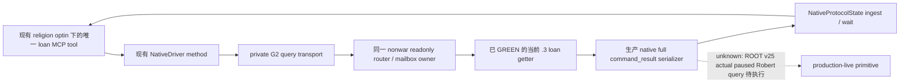

# CK3 1.20.0.3：圣骑士团借贷只读最终判定与偿还条款

2026-10-03。本增量接续已发布的 [holy-order 成立／赞助原生树](religion-holy-order-patronage-native-ai-12003.md)，把非战争财政中明确缺少的借贷观测口落实为最小 native provider；不重复该领域库存。宗教与 holy order 已全面授权，Robert 29829 仍是唯一测试入口。战争研究停止，`WAR_CASH/PREWAR` OFF，本包不涉及军事雇佣或部队操作。

可见价值是让当前帧回答三件事：**现在能否申请贷款、原生会求出多少金额、现有本金是否能准确偿还**。普通 gold/income snapshot 无法回答 final decision、冷却、合格首领是否存在或现有债务的实际本金。必须补观测，不继续把这些缺口留作长期 `unknown`。

| 固定输入 | 值 |
| --- | --- |
| 游戏 | CK3 1.20.0.3 Crozier，Steam build 25652598 |
| EXE SHA-256 | `94B55397ABB687A3DCD436805A5D885E6BE90FA6C693FEB44A9E3BBEEADE02A6`，复用 ROOT intake，未重算 EXE |
| 初始 provider/source 基线 | `a391c881215e06e5b5ff9648140f623ca0ef9267` 的 immutable `resume-12003/production-source-a391c881`；未修改该树 |
| stock 原始证据 | `resume-12003/religion-holy-order-loan-12003/stock/TERM-PROOF.json` 与 `stock/SOURCE-PINS.json`，13 个当前原版文件 |
| ownership | standalone provider 与 transport 仅输出 external patch；ROOT 独占 bridge/router/MCP/CMake/Git、SDK、游戏及窗口；此包仅新增本专题 |

## Stock 条款与真实执行时机

`borrow_from_holy_order_decision` 声明花费 50 虔诚、冷却 5475 天。它只展示给可玩且高于男爵、当前没有 `loan_amount_owed` 和 `loan_holder` 的角色；当前 faith 必须有军事类圣骑士团。合法性和执行时的随机选择都要求首领具有 `government_is_military_holy_order`、金币至少为借款人原生 `holy_order_gold_value`，且对借款人没有 stock 的 bad-relationship trigger。该 trigger 实际覆盖 potential rival、victim、bully 和 rival，不是“总好感必须为正”。决议从合格团中随机选择首领并打开 `holy_order.0200`，没有赞助者要求，也不接受我方指定任意首领。

原生金额表达式为 `clamp(12 × monthly_character_income, 300 × era_factor, 750 × era_factor)`：无文化时系数 1；早期中世纪之前为 0.75，早期为 1，高中世纪为 1.5，晚期为 3。这个表达式没有五金币向上取整，也没有另一个 `major_gold_value` 的 treasury 折扣，不能互相替代。`.0200` immediate 的 `amount_to_loan` 仅保留一天用于 tooltip；选项 a 实际重新求值 `holy_order_gold_value`，写入借款人 `loan_amount_owed`、`loan_holder`、`years_since_loan=0`、原始双方身份，并把借款人加入首领 `owes_me_money` 列表，随后由首领 `pay_short_term_gold` 支付同额。Tooltip 的 `pay_treasury_or_gold` 不是实际付款。这条 setup/年度/催收/偿还链没有本金利息累加或偿还附加费；该结论限于本链，死亡继承仍可合并对同一首领的债务。

正常偿还入口是 `repay_loan_decision`，不是角色互动。显示条件要求本金变量存在且当前首领的债务人列表含本人；合法条件是 available 且本人金币足够。执行按当前 `loan_amount_owed` 付款，清除本金、首领和原始双方等变量、移除借款 flag 和首领列表成员；clear effect 没有删除 `years_since_loan`。`gift_interaction` 在双方贷款变量存在时隐藏向当前债主赠礼，不能借赠礼冒充还款。

年度随机脉冲对所有角色调用 `.0206`，债主遍历债务人列表为有借款年数变量的借款人加一；同一脉冲的随机事件列表有空分支权重 500 与 `.0202` 权重 100。这里有一个必须保留的精确源码差异：setup/年度增长把 `years_since_loan` 放在借款人，而 `.0202` trigger 却在 `var:loan_holder` 作用域读它并检查 `>=10`。本包不把这件事升级为游戏修复阻点，但不能声称已验证“十年必然催收”；读取时应区分双方年数变量，并使用实际 native legality/活跃事件。

`.0202` 可以执行正常还款，或在虔诚等级至少 3 时保存 `asked_for_time` 并五年后再次安排催收。单纯拒绝的 after 在可用分支中以 25/75 stock 权重选择地产或子女要求，延迟 30–90 天；这不是无条件实测概率。`.0203` 可以租出一处合法城堡/城市男爵领；`.0204` 可以把成年、武学教育、可当战士的本廷子女送至团长廷中，必要时改为团长信仰，并获 stock 的虔诚/宗族威望和 +20 好感。拒付可能使团长和宗教领袖对本人产生 −30、20 年衰减好感，以及虔诚等级下降。各违约/抵偿分支主要删除 `borrow_from_holy_order` flag，没有调用清本金效果；因此不能把 flag 消失当成债务消失。`.0201` 已标为 deprecated orphan，实际继承看 `death_management.0001`：它重写双方身份与列表，可承继或合并同一债主本金；此分支未复制借款年数与 holy-order 借款 flag。

## 当前 `.3` 金额表达式与 exact caller proof

Exact Steam build: **25652598**. Frozen EXE SHA-256:
`94B55397ABB687A3DCD436805A5D885E6BE90FA6C693FEB44A9E3BBEEADE02A6`.
Immutable production source:
`a391c881215e06e5b5ff9648140f623ca0ef9267`.

[ABI-PROOF.json](Z:/ck3_mod_rewrite/artifacts/g2-maintainer-2026-10-02/resume-12003/religion-holy-order-loan-12003/abi/ABI-PROOF.json) contains 24 focused native byte spans, each with
RVA, end, SHA-256, first 16 bytes, signature and frozen disassembly path. It also
pins the exact existing variable binder sources. The whole EXE hash was reused
from the existing freeze. This agent performed offline ABI research only;
compilation, provider integration and Robert paused production verification
belong to the parent work package.

## Final decisions and current debt

Resolve `borrow_from_holy_order_decision` and `repay_loan_decision` in the native
decision database at global slot `0x5D1DEF0`, hash `0x3F7E240`, lookup
`0xCAA8D0`, then roundtrip the definition key string at +0x18. The fallback
global slot is `0x5D1F7E8`.

The actual execute-command validator `0x288D650` calls:

1. `0x3103400`: final IsShown(definition, character).
2. `0x889F60`: construct aligned 0x168-byte root scope; root kind 4 at +0,
   complete character ID zero-extended at +8.
3. `0x3103510`: CanTake(definition, character, scope, context, failure sink).
4. `0x14706D0`: select primary/fallback cost object.
5. `0x310B3B0`: affordability(cost, scope, character, failure sink).
6. `0x87E0E0`: destroy root scope.

CanTake includes cooldown: its call at `0x310355B` invokes `0x2957F30` first,
and a true result rejects before the valid trigger at definition+0x6B0 and
failures-only trigger at +0x780. The stock loan decisions need no widget context;
context and failure sink can be null. Do not call the execute command itself.

Cost evaluation is `0x310CE70(cost, scope, out10)`. Ten int64 resources use
scale 100000: gold index 0, prestige 1, piety 2, treasury 6. Repayment's empty
decision cost does not erase the debt: show principal separately from
`loan_amount_owed`.

Reuse namespace `xar::ck3_12002` in the pinned
`include/xar_bridge/ck3_12002_phase_definitions.hpp`. Bind with
`BindPhaseDefinitionsImage`, resolve identifiers with
`ResolvePhaseVariableIdentifier(bindings, key, out_id)`, and request
`PhaseVariableTarget{4, {}, full_character_id}` from `variable_context`.
The current exact getter RVAs are 0x370EB10, 0x3F8A800, 0x3F8A680, 0x3F8A6F0.
Use the parent's exact .3 outer binding; the helper's old internal filename is
not an independent version admission.

Variable context data is +0x10/count +0x1C. Rows stride 0x20, identifier +8,
uint16 kind +0x10, int64 payload +0x18. `loan_amount_owed` and each party's
`years_since_loan` are number kind 1, scale 100000. `loan_holder` is character
reference kind 4 and retains the full ID. A missing loan variable is a normal
no-loan state; a failed read remains a read failure.

## Native amount expression

Use [holy_order_amount_native_recipe.hpp](Z:/ck3_mod_rewrite/artifacts/g2-maintainer-2026-10-02/resume-12003/religion-holy-order-loan-12003/abi/holy_order_amount_native_recipe.hpp),
entry point `EvaluateNamedAmount(base, entry, scope, raw)`, after the parent's
native named database lookup and key roundtrip. Native database getter
`0x3763060` loads slot 0x5D37DE0; lookup is 0x37630C0 and fallback slot
0x5D37DB8.

The rejected shortcut is important: **named entry+0x40 is parameterizable
definition data, not an already compiled math object**. The real load caller
`0x37D36D0` passes +0x40 into argument substitution, reads the serialized
expression at +0xA8, and constructs a parser itself. Passing entry+0x40 directly
to 0x37616A0 would misinterpret its layout.

The 0xD0-byte named node constructor is inlined at 0x3760DBC–0x3760E72. The
recipe reproduces its exact fields, including native argument and numeric
allocator bindings, then calls `0x37D36D0(node, entry, context16)`.
The context is a node pointer at +0 and uint16 root kind 4 at +8, proved by
0x37D30AA–0x37D30C0. Numeric children appear at node+0x88/count+0x94.

The node's numeric virtual +0x30 is 0x37D3670. A local 0x40-byte compiled math
prefix holds one pointer to that node, raw constant 0 at +0x28, nodes +0x30,
capacity +0x38 and count +0x3C. Call `0x37616A0(math, &raw, scope)`; it creates
and releases the native evaluation contexts and calls the numeric nodes through
0x37617A0. Destroy local node internals with
`0x3760C60(node, flags=0)`; flags 0 retains caller-owned 0xD0 storage.

This evaluates the actual current loaded `holy_order_gold_value`, preserving
stock monthly income, era factor, lower/upper clamp and fixed-point behavior.
The provider need not reproduce the stock formula. No scripted effect, loan
command, event option or game time advancement is executed by this getter.

Stock semantics and file hashes are independently recorded in
[SOURCE-PINS.json](Z:/ck3_mod_rewrite/artifacts/g2-maintainer-2026-10-02/resume-12003/religion-holy-order-loan-12003/stock/SOURCE-PINS.json). Parent delivery must include the
actual compile/test artifact and eventual paused Robert query before claiming
production-live readiness.

## Native 最终检查与只读实现

决议查找走当前 `.3` 的 `CDecisionTypeDatabase`：global slot `0x5D1DEF0`、key hash `0x3F7E240`、lookup `0xCAA8D0`、fallback `0x5D1F7E8`，并确认定义对象 `+0x18` 的名称。只使用本包的 `borrow_from_holy_order_decision` 与 `repay_loan_decision`，不把旧版 found-kingdom 专用查询当成通用决议入口。

真实决议 validator `0x288D650` 调用 `CanTake 0x3103510`、cost selector `0x14706D0` 与 affordability `0x310B3B0`。CanTake 首先在 `0x310355B` 调用 `0x2957F30`，传入 `character+0x1C0` 的 cooldown 状态、定义、root scope 和可空 failure sink；未到期即拒绝，再读取 valid/failures-only 条件。provider 因而直接复制 `is_shown`、`can_take` 和 `affordable`，不在 Python 重写 stock 条件或假造冷却。

`is_shown` 走 `0x3103400`，真实 validator 同样调用此检查；cost evaluator `0x310CE70` 返回十资源 raw 向量，本包使用现成 four-currency mapping：gold index 0、prestige 1、piety 2、treasury 6，Q100000。一个可见、可执行的决议须 `is_shown && can_take && affordable`，三项保持单独的原生观测。尤其 repay 的声明 cost 全零，实际支付在 effect，**偿还金额必须用当前 `loan_amount_owed_raw`，不得用 prospective `loan_amount_quote_raw` 或零 cost 代替**。

Root scope 用当前 `.3` constructor `0x889F60`、完整 destructor `0x87E0E0`，局部 16-byte aligned `0x168` storage，构造后 kind 4 / payload 当前玩家完整 character ID。求值和销毁都位于既有 application-main query owner；没有事件、决议提交或资源 effect。

金额 adapter 按实际 inline constructor 初始化局部 named node，经原生 `0x37D36D0` 编译已加载 `holy_order_gold_value` 的 serialized expression，再用 `0x37616A0` 创建/回收正常数值 eval context。每次仍以当前玩家 root scope 求值收入、文化时代与 clamp 分支。此次查询采用局部 node 而不是 recipe 的长期缓存，读取返回前调用 native destructor `0x3760C60(node, flags=0)` 释放 children；无需新增常驻对象或 cleanup 生命周期。实际 ctor/caller/virtual/evaluator/dtor 的证据见下节 exact proof。

当前债务与年数复用已闭合的变量 identifier/context primitive：context `0x370EB10`、identifier table `0x3F8A800`、lookup `0x3F8A680`、name round trip `0x3F8A6F0`。row data `+0x10` / count `+0x1C`、stride `0x20`、identifier `+8`、kind `+0x10`、payload `+0x18`。金额和年数为 kind 1/Q100000，holder 为 kind 4/full-generation character ID。每项提供独立 presence，因此不存在与数值零不会互相替代；holder 已删除时保留既有 ID 与 `loan_holder_resolved=false`。

新 provider 自身只接受真实 `.3` SHA 94B553…；被复用的 `BindPhaseDefinitionsImage` 仍保留内部 reviewed `.2` identity，provider 仅在真实 `.3` admission 后用它初始化已复用的变量 RVAs。这个兼容名称不能被外层 envelope 当成游戏版本。没有再次 hash EXE 或重新运行旧全量 ABI/L0。

本包刻意先交付能回答贷款资格、原生报价与当前偿还本金的最小查询。候选首领列表、逐条拒绝原因、借款 flag、单独 cooldown 天数和债主名单成员不作为这次静态完成字段；stock 输入已记录，aggregate native final predicate 直接消费当前名单/资格/冷却。若后续策略要比较首领或解释拒绝原因，下一项是在同一查询补相应 native getter，而非借用已撤销的宗教禁令。实际 loan event 的随机首领选择不能被任意 candidate 参数取代。

## 逻辑图与尚未执行的环

虚线指尚未实现/验收的动作环，不否认已经闭合的 stock 语义。只读资格合法负结果可以完成 primitive 验收；ACK 或 schema 不能完成实际观测，也不能冒充借贷 OODA。

## ROOT 接入与分级

外置 provider/transport 包和同一 MCP 的接线细节见本目录下 `ROOT-WIRING-RECIPE.md` 与 `transport-plan.json`，tool 名为 `ck3_query_player_holy_order_loan_context_v1`，step `query-player-holy-order-loan-context-v1`，schema `ck3_12003_holy_order_loan_context_v1`，domain `player_holy_order_loan_context_v1`。ROOT 负责共享 CMake/router/mailbox/function admission、NativeDriver/MCP permit、编译冷切与 runtime/source freeze。本代理未访问 SDK、pipe、游戏或窗口。

交付状态须用定向检查结果填写。native reader 的 C++ 编译与 fixture callback/真实 Python normalizer 通过后，外置实现为 `static-ready`。只有 ROOT 同一 paused Robert frame 的真实 `observed` 查询才能升为 `production-live primitive`；借款或还款的完整观察→决策→操作→验证仍未完成。本包不为了验证查询而申请贷款，不将 stub、缺金额或持续 null 算作金额能力完成。

## 定向验证与实际交付状态

`Z:\ck3_mod_rewrite\artifacts\g2-maintainer-2026-10-02\resume-12003\religion-holy-order-loan-12003\test-build\attempt-02/focused-check-result.json` 为 **GREEN**，MSVC `/std:c++20 /EHsc /W4 /WX` 编译真实 provider 与复用 variable primitive，通过两个 native-reader fixture，并把其序列化 JSON 交给真实 Python transport normalizer。检查的是当前本金 125 金币与新报价 750 金币不同、repay 声明 cost 为 0 但本金仍存在、borrow 虔诚费用 50、native gate 的复制、零年数与不存在变量的区别、root scope 正常销毁。金额、gate 等引擎调用由 fixture callbacks 供给；真实 `.3` ABI 独立来自 EXE caller proof，fixture 未调用游戏进程。

本包 **static-ready，非 live**。ROOT 在当前唯一入口 Robert 29829、minimized/no-focus 既有查询 owner 中进行一次真实 paused MCP 查询后才能记录 `production-live primitive`。完整借贷动作环未实施。`attempt-01` 是 harness RED：MSVC C4324 报 RootScope alignment padding，`/WX` 提升为错误；重排 storage/reference 成员后 `attempt-02` GREEN。两个 attempt 均保留在 `test-build/`，这不是 capability RED；未重新跑无关旧全量测试。

external 证据根目录：`artifacts/g2-maintainer-2026-10-02/resume-12003/religion-holy-order-loan-12003/`；stock 在 `stock/`，native exact 在 `abi/`，新代码在 `provider/`，定向测试在 `test-build/`。同目录 `SOURCE-PINS.json`、`DELIVERY.json` 和 `REPORT-FIELDS.json` 是 ROOT 发布及日/周/月账本聚合输入。本代理未执行 Git；ROOT 唯一提交/推送。

## 82c03174 完整接线增量

2026-10-03。本增量将此前已编译的四文件 getter 包接成完整、可 apply 的 source packet，基线为 immutable `production-source-82c03174` / `82c0317448eb8c83c4bf17364a02373b61c0775b`（native `6c87`）。此前 a391c881 的 exact ABI/stock/native-reader 证据继续复用；本增量不重新执行已 GREEN 的 reader/normalizer/L0。

完整 packet 位于 `artifacts/g2-maintainer-2026-10-02/resume-12003/religion-holy-order-loan-12003/ROOT-PROJECTION/`。ROOT 接入时使用 `holy-order-loan-complete-glue.patch` 的最小 hunks；`combined/` 同时保存精确修改后的文件，供其余 v25 包同一源码区域合并参考。`GLUE-SOURCE-PINS.json` 固定每个 before/after、完整 patch、native wire 与新测试；初始 getter 的 `DELIVERY.json` / `REPORT-FIELDS.json` 没有覆盖。

不新增 framework、编译开关、CLI permission 或持续进程。Native leaf 复用现有 `XAR_CK3_ENABLE_G2_PLAYER_RELIGION_CONTEXT_PRIVATE_QUERY_V1`；Python MCP 注册和 transport 均复用现有 `allow_private_player_religion_context_query`。初始接线 recipe 中的独立 loan flag/permission 只是早期方案，已由这份实际 source packet 替代，不应用到候选运行时。War/PREWAR 开关不变。

实际现有 MCP 宗教查询直接调用 NativeDriver，`service.py` 不在该执行链。因此本 packet 修改实际 NativeDriver/MCP 和 transport，没有额外虚构 service 转发。唯一新增 tool 是 `ck3_query_player_holy_order_loan_context_v1(expected_revision)`，绑定当前玩家 actor/root；不要求 lender 枚举，合法 negative 与当前原生报价、本金、偿还成本均可返回。

Native 包补齐当前主线程邮箱、只读 step/revision 路由、函数 admission 和 CMake source wiring。沿用 Enter/FinishQueryMailbox、expected paused actor/date/revision 和正常 wait/reclaim，生产 full `command_result` 外层与 provider body 均使用实际 `.3` 身份，不将内部 reviewed `.2` 名称当成版本。原生 IsShown、CanTake（含冷却）与 affordability 三项依然分别观测；本金仍与 repay 零声明 cost 分开。

新增必要验证仅覆盖 registered MCP tool → NativeDriver → private transport → NativeProtocolState 的完整结果路径。fixture 必须来自新增生产 native serializer 的一次实际 C++ 输出；Python 不拼装或改写贷款结果。原生输出会原样进入 portable research fixture，默认 unit discovery 可独立运行；真实 registry/driver/transport/ingest 路径与 source pins 落在该 packet 的报告。它证明静态注册和 wire 链通畅，仍不是实机 snapshot。

交付仍是 `static-ready`。ROOT 与 task/progress/Feast 包合并 v25 后执行同一次 strict build、冷切与当前唯一测试入口 Robert 29829 的 paused/minimized 查询，成功才升级 `production-live primitive`；此代理未访问游戏、SDK、pipe、窗口或共享 Git，也未停止 ROOT 正常 live 主线。

已交付 **19 个源文件**：native 14（6 新增 / 8 修改），Python 5（driver/MCP/transport/注册路径 unit/native-produced portable fixture）。原生 mailbox/router/callback `/W4 /WX` 编译 GREEN；生产 full command_result serializer GREEN；一次新增真实 MCP registry→NativeDriver→transport→NativeProtocolState ingest/wait 1 case 首次 GREEN（旧测试重跑 0）。完整 1509-byte wire SHA-256 为 `2e2330b29cf630e4ece6c70807a3541306b43a5a97586be1f601737ad42e2c68`，其 snapshot revision 701 / date 53222376 / Robert 29829 / capture epoch 909 均是 **fixture observations，非实机记录**。

新增验证的失败 attempt 保留并明确分类：native glue attempt-01 是 harness 缺 base `src` include；native wire attempt-01 是 isolated link 缺现有七个 mailbox callbacks，生产 serializer 拆为小 `wire.cpp` 后 attempt-02 GREEN。没有把这类 harness RED 算成能力 RED，没有重跑已有 getter/reader/normalizer fixture。

正式 receipt：同一 `ROOT-PROJECTION/GLUE-DELIVERY.json`、`GLUE-REPORT-FIELDS.json` 与 `GLUE-SOURCE-PINS.json`；native 子线日志在 `native/GLUE-REPORT.json` / `WIRE-RESULT.json`，Python 一次实际链证据在 `python/registered-path-once-01/REPORT-FIELDS.json` / `PATH-RESULT.json`。ROOT sole owner apply 这份源码 hunks，并与 Growth/Task/Feast 包做一次 v25 strict/fresh build 及真实 paused 查询；本代理已经完成全部获授权的 source packet 施工，没有留下重新研究 glue 的工作。
