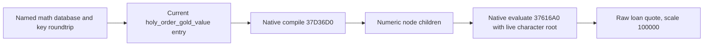
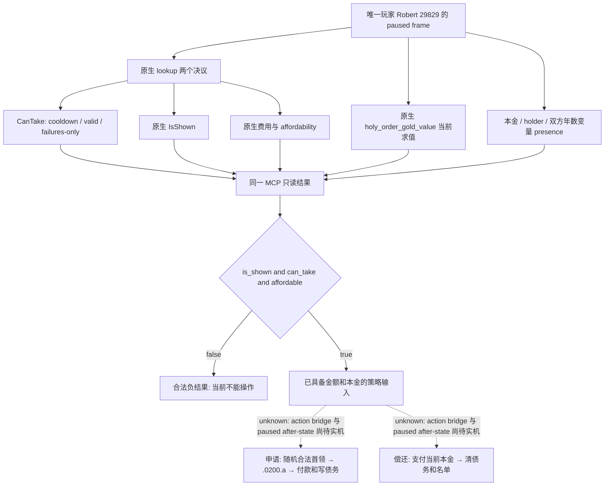
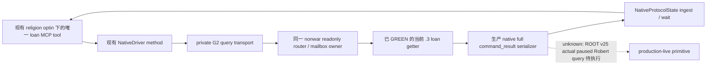
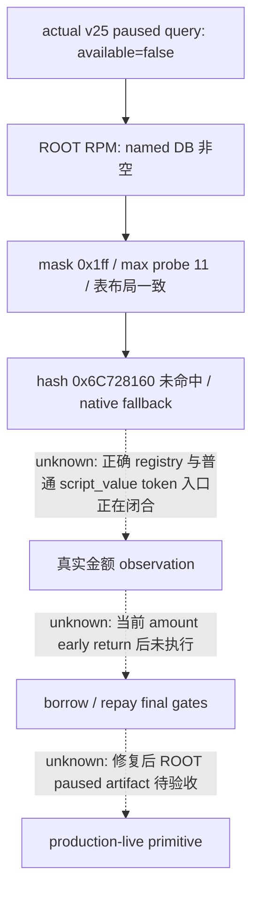
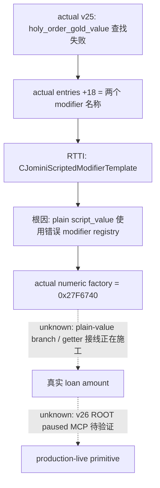
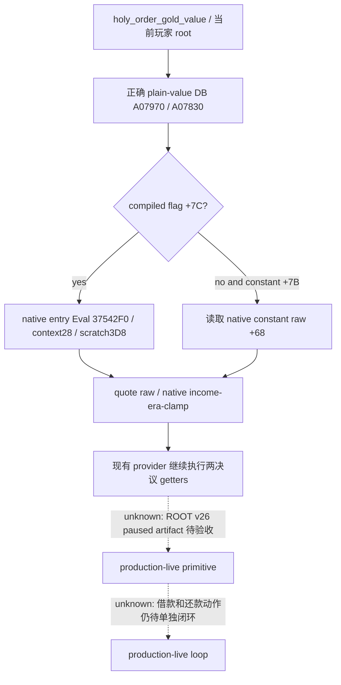
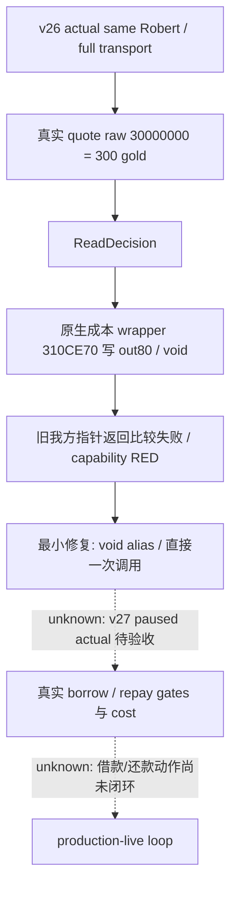
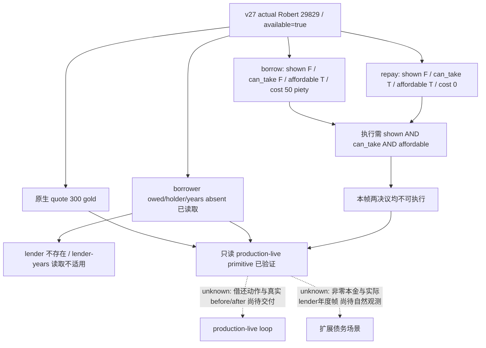

# CK3 1.20.0.3：圣骑士团借贷只读最终判定与偿还条款

2026-10-03。本增量接续已发布的 [holy-order 成立／赞助原生树](religion-holy-order-patronage-native-ai-12003.md)，把非战争财政中明确缺少的借贷观测口落实为最小 native provider；不重复该领域库存。宗教与 holy order 已全面授权，Robert 29829 仍是唯一测试入口。战争研究停止，`WAR_CASH/PREWAR` OFF，本包不涉及军事雇佣或部队操作。

可见价值是让当前帧回答三件事：**现在能否申请贷款、原生会求出多少金额、现有本金是否能准确偿还**。普通 gold/income snapshot 无法回答 final decision、冷却、合格首领是否存在或现有债务的实际本金。必须补观测，不继续把这些缺口留作长期 `unknown`。

**当前实际状态：v27 完整只读借贷查询 GREEN，已达 `production-live primitive`。**
真实报价为 300 金币，两个决议的独立原生 bool/cost 与借款人债务变量均已读出。
本帧两个决议都隐藏，不能执行；尚未借款、还款或取得收益，也未形成 OODA loop。
下文 v25/v26 RED 与 static-ready 记录保留为历史，当前结论以末尾 v27 actual 为准。

| 固定输入 | 值 |
| --- | --- |
| 游戏 | CK3 1.20.0.3 Crozier，Steam build 25652598 |
| EXE SHA-256 | `94B55397ABB687A3DCD436805A5D885E6BE90FA6C693FEB44A9E3BBEEADE02A6`，复用 ROOT intake，未重算 EXE |
| 初始 provider/source 基线 | `a391c881215e06e5b5ff9648140f623ca0ef9267` 的 immutable `resume-12003/production-source-a391c881`；未修改该树 |
| stock 原始证据 | `resume-12003/religion-holy-order-loan-12003/stock/TERM-PROOF.json` 与 `stock/SOURCE-PINS.json`，13 个当前原版文件 |
| ownership | standalone provider 与 transport 仅输出 external patch；ROOT 独占 bridge/router/MCP/CMake/Git、SDK、游戏及窗口；此包仅新增本专题 |

## Stock 条款与真实执行时机

`borrow_from_holy_order_decision` 声明花费 50 虔诚、冷却 5475 天。它只展示给可玩且高于男爵、当前没有 `loan_amount_owed` 和 `loan_holder` 的角色；当前 faith 必须有军事类圣骑士团。合法性和执行时的随机选择都要求首领具有 `government_is_military_holy_order`、金币至少为借款人原生 `holy_order_gold_value`，且对借款人没有 stock 的 bad-relationship trigger。该 trigger 实际覆盖 potential rival、victim、bully 和 rival，不是“总好感必须为正”。决议从合格团中随机选择首领并打开 `holy_order.0200`，没有赞助者要求，也不接受我方指定任意首领。

原生金额表达式为 `clamp(12 × monthly_character_income, 300 × era_factor, 750 × era_factor)`：无文化时系数 1；早期中世纪之前为 0.75，早期为 1，高中世纪为 1.5，晚期为 3。这个表达式没有五金币向上取整，也没有另一个 `major_gold_value` 的 treasury 折扣，不能互相替代。`.0200` immediate 的 `amount_to_loan` 仅保留一天用于 tooltip；选项 a 实际重新求值 `holy_order_gold_value`，写入借款人 `loan_amount_owed`、`loan_holder`、`years_since_loan=0`、原始双方身份，并把借款人加入首领 `owes_me_money` 列表，随后由首领 `pay_short_term_gold` 支付同额。Tooltip 的 `pay_treasury_or_gold` 不是实际付款。这条 setup/年度/催收/偿还链没有本金利息累加或偿还附加费；该结论限于本链，死亡继承仍可合并对同一首领的债务。

正常偿还入口是 `repay_loan_decision`，不是角色互动。显示条件要求本金变量存在且当前首领的债务人列表含本人；合法条件是 available 且本人金币足够。执行按当前 `loan_amount_owed` 付款，清除本金、首领和原始双方等变量、移除借款 flag 和首领列表成员；clear effect 没有删除 `years_since_loan`。`gift_interaction` 在双方贷款变量存在时隐藏向当前债主赠礼，不能借赠礼冒充还款。

年度随机脉冲对所有角色调用 `.0206`，债主遍历债务人列表为有借款年数变量的借款人加一；同一脉冲的随机事件列表有空分支权重 500 与 `.0202` 权重 100。这里有一个必须保留的精确源码差异：setup/年度增长把 `years_since_loan` 放在借款人，而 `.0202` trigger 却在 `var:loan_holder` 作用域读它并检查 `>=10`。本包不把这件事升级为游戏修复阻点，但不能声称已验证“十年必然催收”；读取时应区分双方年数变量，并使用实际 native legality/活跃事件。

`.0202` 可以执行正常还款，或在虔诚等级至少 3 时保存 `asked_for_time` 并五年后再次安排催收。单纯拒绝的 after 在可用分支中以 25/75 stock 权重选择地产或子女要求，延迟 30–90 天；这不是无条件实测概率。`.0203` 可以租出一处合法城堡/城市男爵领；`.0204` 可以把成年、武学教育、可当战士的本廷子女送至团长廷中，必要时改为团长信仰，并获 stock 的虔诚/宗族威望和 +20 好感。拒付可能使团长和宗教领袖对本人产生 −30、20 年衰减好感，以及虔诚等级下降。各违约/抵偿分支主要删除 `borrow_from_holy_order` flag，没有调用清本金效果；因此不能把 flag 消失当成债务消失。`.0201` 已标为 deprecated orphan，实际继承看 `death_management.0001`：它重写双方身份与列表，可承继或合并同一债主本金；此分支未复制借款年数与 holy-order 借款 flag。

## 当前 `.3` 金额表达式与 exact caller proof

Exact Steam build: **25652598**. Frozen EXE SHA-256:
`94B55397ABB687A3DCD436805A5D885E6BE90FA6C693FEB44A9E3BBEEADE02A6`.
Immutable production source:
`a391c881215e06e5b5ff9648140f623ca0ef9267`.

[ABI-PROOF.json](Z:/ck3_mod_rewrite/artifacts/g2-maintainer-2026-10-02/resume-12003/religion-holy-order-loan-12003/abi/ABI-PROOF.json) contains 24 focused native byte spans, each with
RVA, end, SHA-256, first 16 bytes, signature and frozen disassembly path. It also
pins the exact existing variable binder sources. The whole EXE hash was reused
from the existing freeze. This agent performed offline ABI research only;
compilation, provider integration and Robert paused production verification
belong to the parent work package.

## Final decisions and current debt

Resolve `borrow_from_holy_order_decision` and `repay_loan_decision` in the native
decision database at global slot `0x5D1DEF0`, hash `0x3F7E240`, lookup
`0xCAA8D0`, then roundtrip the definition key string at +0x18. The fallback
global slot is `0x5D1F7E8`.

The actual execute-command validator `0x288D650` calls:

1. `0x3103400`: final IsShown(definition, character).
2. `0x889F60`: construct aligned 0x168-byte root scope; root kind 4 at +0,
   complete character ID zero-extended at +8.
3. `0x3103510`: CanTake(definition, character, scope, context, failure sink).
4. `0x14706D0`: select primary/fallback cost object.
5. `0x310B3B0`: affordability(cost, scope, character, failure sink).
6. `0x87E0E0`: destroy root scope.

CanTake includes cooldown: its call at `0x310355B` invokes `0x2957F30` first,
and a true result rejects before the valid trigger at definition+0x6B0 and
failures-only trigger at +0x780. The stock loan decisions need no widget context;
context and failure sink can be null. Do not call the execute command itself.

Cost evaluation is `0x310CE70(cost, scope, out10)`. Ten int64 resources use
scale 100000: gold index 0, prestige 1, piety 2, treasury 6. Repayment's empty
decision cost does not erase the debt: show principal separately from
`loan_amount_owed`.

Reuse namespace `xar::ck3_12002` in the pinned
`include/xar_bridge/ck3_12002_phase_definitions.hpp`. Bind with
`BindPhaseDefinitionsImage`, resolve identifiers with
`ResolvePhaseVariableIdentifier(bindings, key, out_id)`, and request
`PhaseVariableTarget{4, {}, full_character_id}` from `variable_context`.
The current exact getter RVAs are 0x370EB10, 0x3F8A800, 0x3F8A680, 0x3F8A6F0.
Use the parent's exact .3 outer binding; the helper's old internal filename is
not an independent version admission.

Variable context data is +0x10/count +0x1C. Rows stride 0x20, identifier +8,
uint16 kind +0x10, int64 payload +0x18. `loan_amount_owed` and each party's
`years_since_loan` are number kind 1, scale 100000. `loan_holder` is character
reference kind 4 and retains the full ID. A missing loan variable is a normal
no-loan state; a failed read remains a read failure.

## Native amount expression

Use [holy_order_amount_native_recipe.hpp](Z:/ck3_mod_rewrite/artifacts/g2-maintainer-2026-10-02/resume-12003/religion-holy-order-loan-12003/abi/holy_order_amount_native_recipe.hpp),
entry point `EvaluateNamedAmount(base, entry, scope, raw)`, after the parent's
native named database lookup and key roundtrip. Native database getter
`0x3763060` loads slot 0x5D37DE0; lookup is 0x37630C0 and fallback slot
0x5D37DB8.

The rejected shortcut is important: **named entry+0x40 is parameterizable
definition data, not an already compiled math object**. The real load caller
`0x37D36D0` passes +0x40 into argument substitution, reads the serialized
expression at +0xA8, and constructs a parser itself. Passing entry+0x40 directly
to 0x37616A0 would misinterpret its layout.

The 0xD0-byte named node constructor is inlined at 0x3760DBC–0x3760E72. The
recipe reproduces its exact fields, including native argument and numeric
allocator bindings, then calls `0x37D36D0(node, entry, context16)`.
The context is a node pointer at +0 and uint16 root kind 4 at +8, proved by
0x37D30AA–0x37D30C0. Numeric children appear at node+0x88/count+0x94.

The node's numeric virtual +0x30 is 0x37D3670. A local 0x40-byte compiled math
prefix holds one pointer to that node, raw constant 0 at +0x28, nodes +0x30,
capacity +0x38 and count +0x3C. Call `0x37616A0(math, &raw, scope)`; it creates
and releases the native evaluation contexts and calls the numeric nodes through
0x37617A0. Destroy local node internals with
`0x3760C60(node, flags=0)`; flags 0 retains caller-owned 0xD0 storage.

This evaluates the actual current loaded `holy_order_gold_value`, preserving
stock monthly income, era factor, lower/upper clamp and fixed-point behavior.
The provider need not reproduce the stock formula. No scripted effect, loan
command, event option or game time advancement is executed by this getter.

Stock semantics and file hashes are independently recorded in
[SOURCE-PINS.json](Z:/ck3_mod_rewrite/artifacts/g2-maintainer-2026-10-02/resume-12003/religion-holy-order-loan-12003/stock/SOURCE-PINS.json). Parent delivery must include the
actual compile/test artifact and eventual paused Robert query before claiming
production-live readiness.

## Native 最终检查与只读实现

决议查找走当前 `.3` 的 `CDecisionTypeDatabase`：global slot `0x5D1DEF0`、key hash `0x3F7E240`、lookup `0xCAA8D0`、fallback `0x5D1F7E8`，并确认定义对象 `+0x18` 的名称。只使用本包的 `borrow_from_holy_order_decision` 与 `repay_loan_decision`，不把旧版 found-kingdom 专用查询当成通用决议入口。

真实决议 validator `0x288D650` 调用 `CanTake 0x3103510`、cost selector `0x14706D0` 与 affordability `0x310B3B0`。CanTake 首先在 `0x310355B` 调用 `0x2957F30`，传入 `character+0x1C0` 的 cooldown 状态、定义、root scope 和可空 failure sink；未到期即拒绝，再读取 valid/failures-only 条件。provider 因而直接复制 `is_shown`、`can_take` 和 `affordable`，不在 Python 重写 stock 条件或假造冷却。

`is_shown` 走 `0x3103400`，真实 validator 同样调用此检查；cost evaluator `0x310CE70` 返回十资源 raw 向量，本包使用现成 four-currency mapping：gold index 0、prestige 1、piety 2、treasury 6，Q100000。一个可见、可执行的决议须 `is_shown && can_take && affordable`，三项保持单独的原生观测。尤其 repay 的声明 cost 全零，实际支付在 effect，**偿还金额必须用当前 `loan_amount_owed_raw`，不得用 prospective `loan_amount_quote_raw` 或零 cost 代替**。

Root scope 用当前 `.3` constructor `0x889F60`、完整 destructor `0x87E0E0`，局部 16-byte aligned `0x168` storage，构造后 kind 4 / payload 当前玩家完整 character ID。求值和销毁都位于既有 application-main query owner；没有事件、决议提交或资源 effect。

金额 adapter 按实际 inline constructor 初始化局部 named node，经原生 `0x37D36D0` 编译已加载 `holy_order_gold_value` 的 serialized expression，再用 `0x37616A0` 创建/回收正常数值 eval context。每次仍以当前玩家 root scope 求值收入、文化时代与 clamp 分支。此次查询采用局部 node 而不是 recipe 的长期缓存，读取返回前调用 native destructor `0x3760C60(node, flags=0)` 释放 children；无需新增常驻对象或 cleanup 生命周期。实际 ctor/caller/virtual/evaluator/dtor 的证据见下节 exact proof。

当前债务与年数复用已闭合的变量 identifier/context primitive：context `0x370EB10`、identifier table `0x3F8A800`、lookup `0x3F8A680`、name round trip `0x3F8A6F0`。row data `+0x10` / count `+0x1C`、stride `0x20`、identifier `+8`、kind `+0x10`、payload `+0x18`。金额和年数为 kind 1/Q100000，holder 为 kind 4/full-generation character ID。每项提供独立 presence，因此不存在与数值零不会互相替代；holder 已删除时保留既有 ID 与 `loan_holder_resolved=false`。

新 provider 自身只接受真实 `.3` SHA 94B553…；被复用的 `BindPhaseDefinitionsImage` 仍保留内部 reviewed `.2` identity，provider 仅在真实 `.3` admission 后用它初始化已复用的变量 RVAs。这个兼容名称不能被外层 envelope 当成游戏版本。没有再次 hash EXE 或重新运行旧全量 ABI/L0。

本包刻意先交付能回答贷款资格、原生报价与当前偿还本金的最小查询。候选首领列表、逐条拒绝原因、借款 flag、单独 cooldown 天数和债主名单成员不作为这次静态完成字段；stock 输入已记录，aggregate native final predicate 直接消费当前名单/资格/冷却。若后续策略要比较首领或解释拒绝原因，下一项是在同一查询补相应 native getter，而非借用已撤销的宗教禁令。实际 loan event 的随机首领选择不能被任意 candidate 参数取代。

## 逻辑图与尚未执行的环

虚线指尚未实现/验收的动作环，不否认已经闭合的 stock 语义。只读资格合法负结果可以完成 primitive 验收；ACK 或 schema 不能完成实际观测，也不能冒充借贷 OODA。

## ROOT 接入与分级

外置 provider/transport 包和同一 MCP 的接线细节见本目录下 `ROOT-WIRING-RECIPE.md` 与 `transport-plan.json`，tool 名为 `ck3_query_player_holy_order_loan_context_v1`，step `query-player-holy-order-loan-context-v1`，schema `ck3_12003_holy_order_loan_context_v1`，domain `player_holy_order_loan_context_v1`。ROOT 负责共享 CMake/router/mailbox/function admission、NativeDriver/MCP permit、编译冷切与 runtime/source freeze。本代理未访问 SDK、pipe、游戏或窗口。

交付状态须用定向检查结果填写。native reader 的 C++ 编译与 fixture callback/真实 Python normalizer 通过后，外置实现为 `static-ready`。只有 ROOT 同一 paused Robert frame 的真实 `observed` 查询才能升为 `production-live primitive`；借款或还款的完整观察→决策→操作→验证仍未完成。本包不为了验证查询而申请贷款，不将 stub、缺金额或持续 null 算作金额能力完成。

## 定向验证与实际交付状态

`Z:\ck3_mod_rewrite\artifacts\g2-maintainer-2026-10-02\resume-12003\religion-holy-order-loan-12003\test-build\attempt-02/focused-check-result.json` 为 **GREEN**，MSVC `/std:c++20 /EHsc /W4 /WX` 编译真实 provider 与复用 variable primitive，通过两个 native-reader fixture，并把其序列化 JSON 交给真实 Python transport normalizer。检查的是当前本金 125 金币与新报价 750 金币不同、repay 声明 cost 为 0 但本金仍存在、borrow 虔诚费用 50、native gate 的复制、零年数与不存在变量的区别、root scope 正常销毁。金额、gate 等引擎调用由 fixture callbacks 供给；真实 `.3` ABI 独立来自 EXE caller proof，fixture 未调用游戏进程。

本包 **static-ready，非 live**。ROOT 在当前唯一入口 Robert 29829、minimized/no-focus 既有查询 owner 中进行一次真实 paused MCP 查询后才能记录 `production-live primitive`。完整借贷动作环未实施。`attempt-01` 是 harness RED：MSVC C4324 报 RootScope alignment padding，`/WX` 提升为错误；重排 storage/reference 成员后 `attempt-02` GREEN。两个 attempt 均保留在 `test-build/`，这不是 capability RED；未重新跑无关旧全量测试。

external 证据根目录：`artifacts/g2-maintainer-2026-10-02/resume-12003/religion-holy-order-loan-12003/`；stock 在 `stock/`，native exact 在 `abi/`，新代码在 `provider/`，定向测试在 `test-build/`。同目录 `SOURCE-PINS.json`、`DELIVERY.json` 和 `REPORT-FIELDS.json` 是 ROOT 发布及日/周/月账本聚合输入。本代理未执行 Git；ROOT 唯一提交/推送。

## 82c03174 完整接线增量

2026-10-03。本增量将此前已编译的四文件 getter 包接成完整、可 apply 的 source packet，基线为 immutable `production-source-82c03174` / `82c0317448eb8c83c4bf17364a02373b61c0775b`（native `6c87`）。此前 a391c881 的 exact ABI/stock/native-reader 证据继续复用；本增量不重新执行已 GREEN 的 reader/normalizer/L0。

完整 packet 位于 `artifacts/g2-maintainer-2026-10-02/resume-12003/religion-holy-order-loan-12003/ROOT-PROJECTION/`。ROOT 接入时使用 `holy-order-loan-complete-glue.patch` 的最小 hunks；`combined/` 同时保存精确修改后的文件，供其余 v25 包同一源码区域合并参考。`GLUE-SOURCE-PINS.json` 固定每个 before/after、完整 patch、native wire 与新测试；初始 getter 的 `DELIVERY.json` / `REPORT-FIELDS.json` 没有覆盖。

不新增 framework、编译开关、CLI permission 或持续进程。Native leaf 复用现有 `XAR_CK3_ENABLE_G2_PLAYER_RELIGION_CONTEXT_PRIVATE_QUERY_V1`；Python MCP 注册和 transport 均复用现有 `allow_private_player_religion_context_query`。初始接线 recipe 中的独立 loan flag/permission 只是早期方案，已由这份实际 source packet 替代，不应用到候选运行时。War/PREWAR 开关不变。

实际现有 MCP 宗教查询直接调用 NativeDriver，`service.py` 不在该执行链。因此本 packet 修改实际 NativeDriver/MCP 和 transport，没有额外虚构 service 转发。唯一新增 tool 是 `ck3_query_player_holy_order_loan_context_v1(expected_revision)`，绑定当前玩家 actor/root；不要求 lender 枚举，合法 negative 与当前原生报价、本金、偿还成本均可返回。

Native 包补齐当前主线程邮箱、只读 step/revision 路由、函数 admission 和 CMake source wiring。沿用 Enter/FinishQueryMailbox、expected paused actor/date/revision 和正常 wait/reclaim，生产 full `command_result` 外层与 provider body 均使用实际 `.3` 身份，不将内部 reviewed `.2` 名称当成版本。原生 IsShown、CanTake（含冷却）与 affordability 三项依然分别观测；本金仍与 repay 零声明 cost 分开。

新增必要验证仅覆盖 registered MCP tool → NativeDriver → private transport → NativeProtocolState 的完整结果路径。fixture 必须来自新增生产 native serializer 的一次实际 C++ 输出；Python 不拼装或改写贷款结果。原生输出会原样进入 portable research fixture，默认 unit discovery 可独立运行；真实 registry/driver/transport/ingest 路径与 source pins 落在该 packet 的报告。它证明静态注册和 wire 链通畅，仍不是实机 snapshot。

交付仍是 `static-ready`。ROOT 与 task/progress/Feast 包合并 v25 后执行同一次 strict build、冷切与当前唯一测试入口 Robert 29829 的 paused/minimized 查询，成功才升级 `production-live primitive`；此代理未访问游戏、SDK、pipe、窗口或共享 Git，也未停止 ROOT 正常 live 主线。

已交付 **19 个源文件**：native 14（6 新增 / 8 修改），Python 5（driver/MCP/transport/注册路径 unit/native-produced portable fixture）。原生 mailbox/router/callback `/W4 /WX` 编译 GREEN；生产 full command_result serializer GREEN；一次新增真实 MCP registry→NativeDriver→transport→NativeProtocolState ingest/wait 1 case 首次 GREEN（旧测试重跑 0）。完整 1509-byte wire SHA-256 为 `2e2330b29cf630e4ece6c70807a3541306b43a5a97586be1f601737ad42e2c68`，其 snapshot revision 701 / date 53222376 / Robert 29829 / capture epoch 909 均是 **fixture observations，非实机记录**。

新增验证的失败 attempt 保留并明确分类：native glue attempt-01 是 harness 缺 base `src` include；native wire attempt-01 是 isolated link 缺现有七个 mailbox callbacks，生产 serializer 拆为小 `wire.cpp` 后 attempt-02 GREEN。没有把这类 harness RED 算成能力 RED，没有重跑已有 getter/reader/normalizer fixture。

正式 receipt：同一 `ROOT-PROJECTION/GLUE-DELIVERY.json`、`GLUE-REPORT-FIELDS.json` 与 `GLUE-SOURCE-PINS.json`；native 子线日志在 `native/GLUE-REPORT.json` / `WIRE-RESULT.json`，Python 一次实际链证据在 `python/registered-path-once-01/REPORT-FIELDS.json` / `PATH-RESULT.json`。ROOT sole owner apply 这份源码 hunks，并与 Growth/Task/Feast 包做一次 v25 strict/fresh build 及真实 paused 查询；本代理已经完成全部获授权的 source packet 施工，没有留下重新研究 glue 的工作。

## v25 首次实际查询：金额 capability RED，继续修复

真实 frozen native/public `f9da88f9119223b150356ec110392c0f67073cc1` / `production-source-f9da88f9`、DLL 8117760 bytes SHA `4119de2275a9d1adfbc951fe93a8d8e407519301f36c8818567ec04ac83b033e`。ROOT 在 Robert 29829 / PID 95636 / paused date 53224008 调用现成注册 MCP；完整返回已到达，但 `available=false`、`unavailable_reason=loan_amount_expression_unavailable`、`loan_amount_quote_raw=null`。真实 artifact 为 `artifacts/g2-maintainer-2026-10-02/resume-12003/actual-v25-religion-feast-sway-combined-01/004-ck3_query_player_holy_order_loan_context_v1.json`（capture epoch 8924、native revision 3）。

此结果是 **loan capability RED**，此前 provider/serializer/registered-path fixture GREEN 只证明静态代码和 transport，不能算金额或决议观测已经可用。f9 调用顺序是变量 → amount → 两决议；amount 失败提前 return，当前 borrow/repay false 和 cost 0 确定未执行原生读取。总体 unavailable 时也不把变量 presence false 用作可执行的无债务结论。

立即施工入口限定实际失败链：`ReadAmountRaw` 的 native database → named entry/key → local native compile → native eval。DB/key 与 parser actual root/context 两条窄线并行；`3F7E240` 已由直接当前函数数据流排除 RCX 首参形态差异（函数实际只用 RDX bytes/R8 length），不据此修改 hash getter。当前 parser 重点核对实际 loader 在编译前写入的 source-location/recursion字段与 local ctor 是否一致。仅在真实层级仍无法闭合时，由 ROOT 在自然 saved-paused 边界执行一次明确地址/长度的只读 RPM；此代理不碰 live/SDK/pipe/window/Git。

只提交针对金额实际失败的外置最小修复；不重跑旧 GREEN fixture，不新增框架、flag、理论 gate 或宗教禁令，不阻断 ROOT 的 a588 普通游玩/经济材料主线。金额与真实两决议观测须由修复后的 paused MCP artifact 确认，才能再次讨论 production-live readiness。

### v25 金额故障：一次 paused RPM 已闭到命名查找未命中

ROOT 在自然保存暂停边界一次只读捕获 PID 95636、罗贝尔 29829、日期 raw 53224296；
证据为 `Z:/ck3_mod_rewrite/artifacts/g2-maintainer-2026-10-02/resume-12003/religion-holy-order-loan-12003/ACTUAL-V25-AMOUNT-FIX/root-paused-named-math-rpm-01.json`（SHA-256 `237fa60887cf5a317c7f78bf0251ddfabc949633347d208545454b171b339ae7`）。
该日期是补定位的暂停边界，不能替换首次 query 的 raw 53224008 / capture epoch 8924。

数据库与 fallback 槽均可读；命名表 mask `0x1ff`、最大探测 `11`。当前 helper
计算 `holy_order_gold_value` 的 hash `0x6C728160`，其原生桶及探测范围没有匹配条目，
故 entry、key 校验、Build 和 Evaluate 尚未触及。表内已读行的桶位及 probe distance
与 Robin Hood 布局相符，不能把未命中误写成表布局错误。金额后的决议 getters
也未执行，首次 unavailable envelope 的 false/0 仍是默认值，不构成合法性或无欠款观测。

下一项只核对冻结 exact 的名称 hash / registry 类别与原生 script-value token 调用路由，
据真实缺口修最小 amount lookup；不部署无必要的 diagnostic build，不重复旧 GREEN
fixture，不扩日志扫描。ROOT 继续正常游玩，当前借贷观测仍为 capability RED / research。

### v25 实际根因：scripted modifier registry 不能代替普通 script_value

第二次必要窄读只使用首次已定位的两条 entry 与 fallback。它们在 `+0x18`
的实际名称分别为 `inspiration_region_court_grandeur_attraction_modifier` 和 `laamp_contract_scheme_basic_success_chance_modifier`；
`+0x08` 不能按合法 std::string 解码。两条实际 vtable RVA `0x493CB40` 的
冻结 EXE RTTI 为 `CJominiScriptedModifierTemplate`；fallback RVA `0x4929340`
是对应 `TPdxNullObject<CJominiScriptedModifierTemplate>`，magic `Null`。

因此已确认 v25 `ReadAmountRaw` 所用 `0x3763060 / 0x37630C0` 是 scripted modifier
registry，不能查普通 `holy_order_gold_value`。此前 NamedMath constructor/parser/eval
的 direct caller proof 证明的是该 modifier 类型，静态 callbacks 测试没有实际走入
游戏命名查找，不能用来证明这条 amount 接线正确。上文旧接线说明以本实机纠正为准；
不通过改 `+0x08`、hash RCX、probe 布局或添加猜测 metadata 来掩盖错误入口。

普通 numeric parser `0x37D30F0` 先调用 game factory slot `0x5C6A4C8`，
只有 callback 不提供节点时才回退旧 Jomini modifier path。ROOT 最后只读 8 字节
得到当前 factory RVA `0x27F6740`。下一项只追该 exact native plain-value 分支，
用正确 native object/evaluator 替换 amount lookup，不猜报价公式，不扩其它领域。
证据与 SHA 见 `Z:/ck3_mod_rewrite/artifacts/g2-maintainer-2026-10-02/resume-12003/religion-holy-order-loan-12003/ACTUAL-V25-AMOUNT-FIX/WRONG-REGISTRY-REPORT-FIELDS.json` 和
`Z:/ck3_mod_rewrite/artifacts/g2-maintainer-2026-10-02/resume-12003/religion-holy-order-loan-12003/ACTUAL-V25-AMOUNT-FIX/lookup/WRONG-REGISTRY-ROOT-CAUSE.json`。

精确 factory 分支继续闭合后，`0x27F6740` 只提供 FirstValid 与专用 modifier tokens，
不能直接当成普通 `holy_order_gold_value` getter。新的正确 scalar 类型入口已由
direct RTTI 证明：`0xA13AE0(storage 0xF0)` 构造 `CJominiScriptValue<CFixedPoint>`，
vtable RVA `0x44A7B48`，其 Load 虚表槽 `+0x18` 指向 `0xA136A0`。它也是 clamp
数字节点 `+0x48` 的内嵌数值对象；当前最小修复只闭该对象的 Load、root-kind 4
Evaluate 和回收签名。此前 callback 调查作为排除错误入口的证据保留，不能将
它或 constructor/RTTI 单独写成真实金额观测完成。

### v26 最小修复已交付：借原生 compiled plain fixed-point value

修复严格基于 immutable native/public `f9da88f9119223b150356ec110392c0f67073cc1`，
只替换 `ck3_12003_holy_order_loan_amount.hpp` 与 amount provider 内部接线。
正确 plain-value registry getter 是 `0xA07970`，lookup 是 `0xA07830`，fallback
是 `0x5D1DD48`。这些入口来自 `CJominiScriptValue<CFixedPoint>` 的原生 scalar
loader `0xA13180`；不使用先前 modifier registry。native success 仍要求合法
entry magic，沿原生顺序优先 `entry+0x7C` 的 compiled expression，其次 `+0x7B`
常数分支直接读 `+0x68` 的 Q100000 raw，不再套用 modifier 的 name layout。

compiled 分支直接借游戏自有 entry 调 `0x37542F0(entry, out, context, RNG=null,
entry+0x40 metadata)`。`context` 为 `0x28`，三个作用域指针都引用当前玩家
RootScope；原生临时 scratch 为 `0x3D8`，由 `0x3736060` 与
`0x3735FB0(scratch+0x128)` 初始化，在 `+0x3D0` 引用 root，mode 读
`0x5D1DADC`。只按原生 caller 顺序清理这两个临时 vector；不构造 parser，
不复制/重编 stock 表达式，不析构游戏 entry，不手算报价。完整参数、调用链与
字段 proof 见 `Z:/ck3_mod_rewrite/artifacts/g2-maintainer-2026-10-02/resume-12003/religion-holy-order-loan-12003/ACTUAL-V25-AMOUNT-FIX/parser/FIXED-POINT-REGISTRY-PROOF.md`
及 eval 子线的冻结 proof。

完整外置 patch：`Z:\ck3_mod_rewrite\artifacts\g2-maintainer-2026-10-02\resume-12003\religion-holy-order-loan-12003\ACTUAL-V25-AMOUNT-FIX\holy-order-loan-plain-value-amount-fix.patch`，SHA-256 `e34d557ec2b2d2ed495c5befd33e37c002dce9b7d68cae0c80b58cfb367b450f`；
逐 leaf before/after hashes 与 corrected proof pins 见 `Z:/ck3_mod_rewrite/artifacts/g2-maintainer-2026-10-02/resume-12003/religion-holy-order-loan-12003/ACTUAL-V25-AMOUNT-FIX/SOURCE-PINS.json`。
一次新真实 provider `/std:c++20 /EHsc /W4 /WX` 编译 **GREEN**，
`Z:/ck3_mod_rewrite/artifacts/g2-maintainer-2026-10-02/resume-12003/religion-holy-order-loan-12003/ACTUAL-V25-AMOUNT-FIX/compile/attempt-01/RESULT.json`；没有重跑旧 callbacks/serializer/MCP fixtures。
现有宗教 opt-in、query owner、mailbox、router、Python driver 与注册 MCP 全部复用。

本次仅为修复后的 **static-ready**；v25 actual RED 和失败 artifact 继续保留。
ROOT 一次 combined v26 strict build 后必须捕获暂停罗贝尔的 `available=true`、
真实 quote 和已执行的 borrow/repay native gates/cost，才能升为
`production-live primitive`。借款/还款操作与完整 OODA 不由此单次只读查询完成。

最终正确求值 proof 已冻结： `Z:/ck3_mod_rewrite/artifacts/g2-maintainer-2026-10-02/resume-12003/religion-holy-order-loan-12003/ACTUAL-V25-AMOUNT-FIX/lookup/fixed-point-eval/ABI-PROOF.json`，SHA-256
`53b666afc18c65a2987102c063e0f30521cd2285fab903022b1606f9cfdc0da5`；其 source pins 为 `Z:/ck3_mod_rewrite/artifacts/g2-maintainer-2026-10-02/resume-12003/religion-holy-order-loan-12003/ACTUAL-V25-AMOUNT-FIX/lookup/fixed-point-eval/SOURCE-PINS.json`。
plain registry/load 的 unique native span pins 为 `Z:/ck3_mod_rewrite/artifacts/g2-maintainer-2026-10-02/resume-12003/religion-holy-order-loan-12003/ACTUAL-V25-AMOUNT-FIX/parser/FIXED-POINT-REGISTRY-SOURCE-PINS.json`。
这些 direct caller proof 与已编译的两份最终 source 一致，未另跑 fixture、RPM、
EXE 全量 hash 或源编译。最终 patch hash 仍为 `e34d557ec2b2d2ed495c5befd33e37c002dce9b7d68cae0c80b58cfb367b450f`。

## v26 实际增量：金额真实成功，成本函数返回类型使决议 capability RED

ROOT 的注册 MCP 实机 artifact `Z:/ck3_mod_rewrite/artifacts/g2-maintainer-2026-10-02/resume-12003/actual-v26-loan-sway-cold-01/005-ck3_query_player_holy_order_loan_context_v1.json`（SHA-256
`aaf9bc83dd14bc3169bef225fc919519425db34afa1ec09f629d7a83967e5cbc`）为完整 transport / harness GREEN，same Robert 29829，
新 PID 15592，raw date `53225304`，public/native revision 2，capture epoch `7554`，
source/native/env `1bb3eee96e00216464e8269ec5153c60b22aca43`。
`loan_amount_quote_raw=30000000`、scale `100000`，真实报价 **300 金币**：v25 的错误
modifier registry 已被正确 plain-value 求值修复，这个真实字段无需重研或再跑旧 scalar fixture。

总体仍 `available=false` / `decision_evaluation_unavailable`。源码中 `ReadDecision`
只有 definition 未找到、cost selector 为 null、cost evaluator 返回比较失败三个 early-return；
原生 `is_shown/can_take/affordable=false` 本身不会使读取 unavailable。两决议 bool/cost
尚未赋值，不能把 envelope 默认 false/0 当作门槛事实。变量调用在 amount 之前实际已
返回，但本次总体 unavailable，不将 presence=false 升格为可执行的无欠款 readiness。

成本侧 direct callee/caller 已证明 `0x310CE70(cost, rootScope, out80)` 是写出 80 字节
资源结果的 wrapper；它没有 `RAX=&out80` 返回契约，原生 caller 不依赖此返回值。
我方 `CostEvaluate=int64_t*` 及 `return != resources.data()` 判定误将这个函数当
输出指针 getter。最小修复是 alias 改 `void` 并直接调用一次，再继续既有的三个 bool
getter 和 four-currency 投影，不引入新 field、framework 或 gate。

FindDecision 的 DB/hash/lookup、key `+0x18` 与两 stock 决议 key 已匹配冻结原生
caller/constructor，见 `Z:/ck3_mod_rewrite/artifacts/g2-maintainer-2026-10-02/resume-12003/religion-holy-order-loan-12003/ACTUAL-V26-DECISION-FIX/lookup/LOOKUP-PROOF.json`；
未因理论缺口追加 table 读取，额外 RPM 草稿取消且没有请求或执行。
已同步 `g2_m6_law` 的 v27 copied reader 与 synthetic fixture owner 使用相同 void ABI；
synthetic GREEN 仍不代替实机决议读器成功。

### v27 成本返回类型最小修复：已投影并编译，等待实际决议字段

仅两 native leaf：`ck3_12003_holy_order_loan_context.hpp` 将 `CostEvaluate`
改为 `void(*)(cost, scope, out80)`；`ck3_12003_holy_order_loan_context.cpp`
调用一次后继续 native IsShown/CanTake/CostAffordable，并复制原始资源结果。
完整外置 patch `Z:\ck3_mod_rewrite\artifacts\g2-maintainer-2026-10-02\resume-12003\religion-holy-order-loan-12003\ACTUAL-V26-DECISION-FIX\holy-order-loan-decision-cost-void-fix.patch` 的 SHA-256 为 `9c83f40d4e50722b890890d8c6f50ca4020e619124cd7d64a6bccecbab6b43d6`，
基准 `1bb3eee96e00216464e8269ec5153c60b22aca43`；逐 leaf before/after hash
和 corrected proof 在 `Z:/ck3_mod_rewrite/artifacts/g2-maintainer-2026-10-02/resume-12003/religion-holy-order-loan-12003/ACTUAL-V26-DECISION-FIX/SOURCE-PINS.json`。

`Z:/ck3_mod_rewrite/artifacts/g2-maintainer-2026-10-02/resume-12003/religion-holy-order-loan-12003/ACTUAL-V26-DECISION-FIX/cost/COST-VOID-ABI-PROOF.md` 及
`Z:/ck3_mod_rewrite/artifacts/g2-maintainer-2026-10-02/resume-12003/religion-holy-order-loan-12003/ACTUAL-V26-DECISION-FIX/cost/SOURCE-PINS.json` 复用 frozen native bytes，
纠正旧 `abi/ABI-PROOF.json` 的 `int64_t*` 返回 label；native caller
`0x31D40DE` 不读取 RAX，affordability validator `0x288D81A` 保留自己的 bool
检查。没有修改 selector、资源缩放、真正的 final bool、lookup/key 或已真实成功的
金额逻辑，也没有用额外 gating 代替读取。

新真实 provider `/std:c++20 /EHsc /W4 /WX` 一次编译 **GREEN**，
`Z:/ck3_mod_rewrite/artifacts/g2-maintainer-2026-10-02/resume-12003/religion-holy-order-loan-12003/ACTUAL-V26-DECISION-FIX/compile/attempt-01/RESULT.json`，约 2.42 秒。未跑旧 scalar/getter/wire fixtures，
未执行新 RPM。当前修复为 `static-ready`；v26 amount 300 金币是已观察的真实字段，
但 whole loan context 的 production-live readiness 仍须 ROOT v27
`available=true` 和真实两决议 bool/cost artifact。代码/ABI receipt 与本专题已释放，
ROOT 负责 combined build、实机与统一 report/commit/push。

## v27 CLOSED：完整只读查询 production-live primitive

ROOT 单次实机查询 `Z:/ck3_mod_rewrite/artifacts/g2-maintainer-2026-10-02/resume-12003/actual-v27-religion-sway-conversion-cold-01/005-ck3_query_player_holy_order_loan_context_v1.json`（SHA-256 `8fa5a86841fc9850040be68a499909c43668f97440e3df231cc82fe2b6b09fbe`）
完整返回 `available=true / unavailable_reason=null / status=observed`。same Robert
29829，新 PID 64876，raw date `53226552`，capture epoch `9052`，Python queried
revision `2`、native/snapshot revision `3`，source/native/env
`f30579bf6405e183192c96ea6b9bc35dddd11eec`。复用 exact `.3` / build 25652598
与 EXE SHA；本次只提取 ROOT 已 CLOSED artifact，未重新 query、测试或扫描 registry。
完整 compact 及 pins 在 `Z:/ck3_mod_rewrite/artifacts/g2-maintainer-2026-10-02/resume-12003/religion-holy-order-loan-12003/ACTUAL-V27-OBSERVED/OBSERVED-COMPACT.json`、
`Z:/ck3_mod_rewrite/artifacts/g2-maintainer-2026-10-02/resume-12003/religion-holy-order-loan-12003/ACTUAL-V27-OBSERVED/SOURCE-PINS.json`。

| 本帧原生观测 | 值 | 语义 |
| --- | --- | --- |
| prospective quote | raw `30000000`，scale `100000` = **300 金币** | 原生 plain compiled value 已真实求值 |
| borrow | shown `false` / can_take `false` / affordable `true` | 隐藏且不合法，本帧不可执行 |
| borrow cost | gold/treasury/prestige `0`，piety raw `5000000` = **50 虔诚** | 真实成本 output，不再是 v26 default |
| repay | shown `false` / can_take `true` / affordable `true` | 三项独立；隐藏使本帧不可执行 |
| repay declared cost | 四项均 `0` | 不代表 effect 免本金；真正偿还仍支付 owed principal |
| borrower debt variables | owed present `false`/raw `null`，holder present `false`/ID `null` | available frame 内合法读取的缺席，不是读取失败或本金为零 |
| borrower years | present `false`/raw `null` | 借款人变量缺席已读出 |
| lender years | output present `false`/raw `null` | **不适用，未读取**：没有 holder，源码未进入 lender ReadVariable |

本帧完整执行了两决议的成本、IsShown、CanTake 与 CostAffordable；这些 bool/cost
现在是 observed，不是 v25/v26 early-return defaults。执行判定必须使用
`is_shown && can_take && affordable`：隐藏的 repay 即使 `can_take=true` 也不证明
有债务，不能作为可执行还款动作。`loan_holder_resolved=false` 在无 holder 时同样
是不适用，没有进行“债主已删除”判定。条件读取在冻结 source 的 181–193 行；
这项解释直接来自该 source，不能宣称已观察一个不存在 lender 的年数。

readiness 升为 **`production-live primitive`（已授权 religion opt-in 的只读口）**。
尚未借款、还款、支付或取得任何财政收益，没有动作前后验证或完整 OODA loop；
不得升为 `production-live loop` 或 `complete`。非零本金/真实 lender 年数的自然帧、
动作入口及完整策略结果仍为后续游戏任务，不能用本帧填满这些分支。v25/v26 失败
artifact 原样保留，实际修复链与 native proof 继续可回链。

