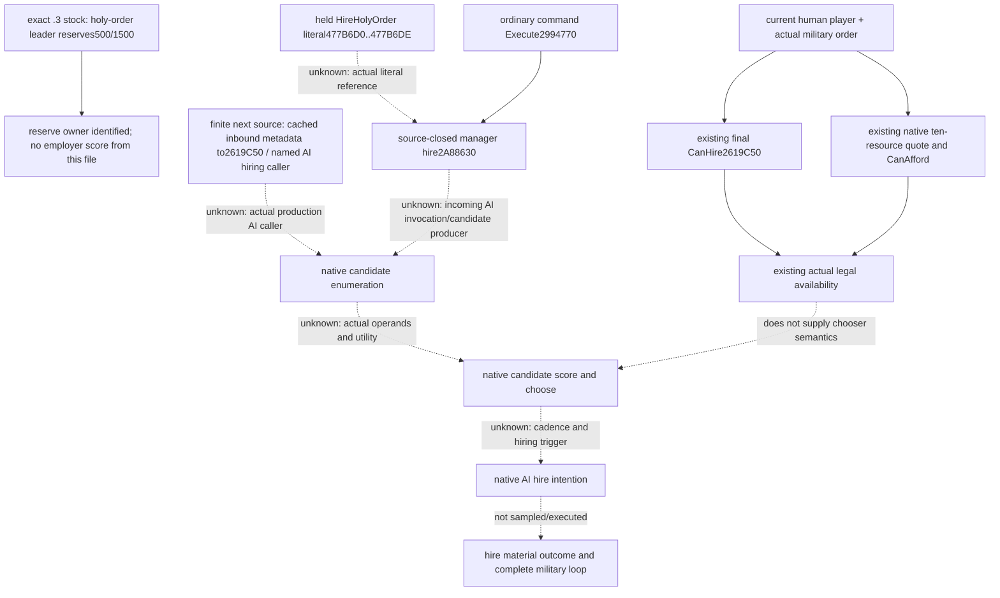

# Holy-order native AI candidate choice — exact CK3 1.20.0.3

Research started at **2026-10-06 23:38 Asia/Shanghai** in isolated source
`69a2fe5c560e399ef5a0e98e60a45b0cabbc4b1b`. The executable identity is reused:
CK3 **1.20.0.3 Crozier / Steam25652598**, SHA-256
`94B55397ABB687A3DCD436805A5D885E6BE90FA6C693FEB44A9E3BBEEADE02A6`.
This package performs background file research only. It does not launch,
attach, query, advance or control CK3, touch Steam, or change the runtime.
Religion and warfare authorization is open; human-player actions remain
limited to Robert29829 in the original ordinary campaign.

## Decision being closed

The existing [current-player organisation query](religion-holy-order-context-native-query-12003.md)
answers which actual military order can presently be hired, its current troops,
and its final native quote. The requested new decision is **which of those
orders the original AI would choose, and why it would hire now**. A boolean
final permission is not an AI score, choice, cadence or hire intention.

The already closed sources are reused without another byte read or old test:

| Existing source | Supported decision value | Does not establish |
| --- | --- | --- |
| `2619C50(order, actor, reason)` | Final native hire permission and literal failures | Candidate utility, ranking, tie-break or AI intention |
| `261C120(order, actor, reason)` | Current opposing-war-member Faith hostility qualification | Holy-war CB scoring or an AI candidate choice |
| `26198E0(order, out80, actor)` and `310E710` | Current ten-resource quote and separate affordability | AI expenditure budget or whether an army deficit warrants hire |
| `261AD10(order)` | Actual current soldier headcount | Expected contact contribution or AI valuation |
| `2A889C0` service lifecycle and `order+88 -> ArRg -> CArmy` | Existing release/army-association source boundaries | Hiring chooser or successful command execution |

Ordinary hire provider and typed action are already static-qualified in the
[hire construction topic](religion-holy-order-hire-command-construction-12003.md).
No action implementation or old FIRST validation is repeated here.

## Current stock result

The finite stock read covers
`Z:/SteamLibrary/steamapps/common/Crusader Kings III/game/common/defines/ai/00_ai.txt`
for the literal `HOLY`. Lines **136–161** define
`MIN_RESERVED_GOLD_HOLY_ORDER=500` and
`MIN_RESERVED_TREASURY_HOLY_ORDER=1500`. Their comments explicitly apply to
holy-order **leaders** using their own money. These are not an employer's
hire budget and do not supply a score for military-order candidates.

Other matched stock AI entries concern holy-site CB value or great-holy-war
army gathering/staging. They do not close ordinary military-order hiring.
This is a negative result for this exact file/literal search, not a claim that
all native AI lacks a holy-order chooser. Existing NHolyOrder cost/hire-limit
and enemy-hostility defines are already pinned in the
[war eligibility topic](religion-holy-order-war-eligibility-12003.md); their
previous evidence is reused.

## Native caller frontier

The next source request is deliberately finite: an **existing exact `.3`
inbound-callsite index entry for `2619C50`**, or an already named military
HolyOrder AI hire caller. Start with metadata: callsite RVA, containing
function RVA/unwind span, exact executable identity, and whether the record is
held. Only a reached missing named callee may then receive one bounded body
request. The parent/Root owns that source acquisition. No broad RTTI, whole
text, whole-EXE hash, neighbouring-body or artifact-filename scan is performed.

No actual AI caller is held by this package at this cutoff. Therefore no
new score, budget, deficit, cadence or selection field is invented, and no
read-only helper is implemented yet. The current query already exposes all
inputs needed to answer present **legal availability**; relabeling those
fields as AI choice would add no actual observation. The missing caller is a
concrete source dependency, not a religious/war authorization hold.

The approved cache metadata was read once in the named packets:
`hire-military-observation/native-leaf/NATIVE-LEAF-RECIPE.json`,
`stock-eligibility/ROOT-DELIVERY.json`, and the ordinary hire packet's
`HANDOFF-SUMMARY.md`/`ROOT-DELIVERY.json`. Their caller links are reflection,
UI, final validator and command construction, with no AI chooser/index entry.
The retained automatic-release `research-plan.json` and
`native/TABLE-0x477b520.json` additionally preserve the constructor-bound
secondary table. Its `+8 -> 2A89390` and `+18 -> 2A89760` are already closed
release callbacks. A manager callback table does not establish an AI hire
scheduler. Other unnamed table entries are not assigned hiring semantics or
used as speculative body-read requests. No closed lifecycle body was reread.

One actual named discovery anchor is retained. The lifecycle-caller packet's
`native/SPANS-0x477b65f.json` holds the data slice
`477B65F..477B6EF` (**144 bytes**, native-byte SHA
`6eb3decdbbc16db00308ec3cbd47697fbad0c41cbdce3f04b5abd906ba9cb2ad`).
Its copied hex places the NUL-terminated **`HireHolyOrder`** literal at
`477B6D0..477B6DE`. The same retained slice names
`holy_order_manager.cpp`; a string is a locator, not a call chain.

Independently, the canonical release source already establishes ordinary
command **`2994770 -> 2A88630(manager, order, actor, mode)`**, with manager
hire span **`2A88630..2A889B1`**, 897 bytes/native-byte SHA
`cd8c02b6bc8fe6872751a5f25e2034d5a9eb22b2843c6a49c54a517f28b9a753`.
That is an actual mutation producer, not an AI utility function. This package
only reuses the source receipt; it does not reread or invoke either body.

The finite discovery request is now anchored to two exact index targets:
**`477B6D0`** inbound literal references and **`2A88630`** inbound manager-hire
calls. Request at most **16 existing metadata rows per target**, with actual
reference instruction/function identity. If a cache entry is absent, stop
before acquiring bytes and have Root name the exact index or justified code
range and its byte budget. No full-text search is proposed. The literal to
function link and an AI caller remain unknown; the already-known command
caller must be labelled as ordinary execution. The missing metadata request
is preserved in the external `DISCOVERY-REQUEST.json`.

## Minimum observer and qualification rule

After the actual native tree closes, choose **one useful missing read-only
operand** on that tree and add it to the same played-character holy-order
query. Freeze producer/caller/consumer, native ABI/offsets, identity and value
units here before writing code. Avoid a separate speculative policy and avoid
copying mercenary wealth rules into holy-order hiring. Parent owns shared
query glue; this child owns dedicated topic/helper/DTO/fixture files only.

Prepare one minimal genuine new native fixture plus a compiled-wire consumer
case for Root's central FIRST. Compilation, tests, imports, dispatch, runtime
prepare/deploy and live observations remain **NOTRUN**. Native synthetic
inputs would prove only the observer's implementation path; full original AI
optimality, future availability, actual payment/employer, war execution,
monthly persistence and complete OODA stay separately unqualified.

Current status: **research**. New executable code/metadata reads, duplicate
bytes, native calls and gameplay operations are all **0**. The external
finite request and cost record is
`C:/codex-ck3-background/packets/holy-order-next-decision-20261006/ai-choice/BOUNDARY-AND-REQUEST.json`.
Daily/W41 reporting fields will record actual cutoff time, source/commit,
unadopted inputs, quality gap and remaining source dependency; Root merges
shared reports.
