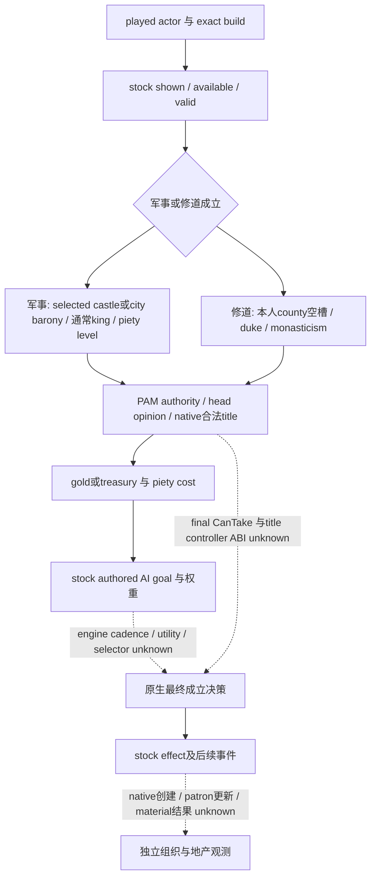
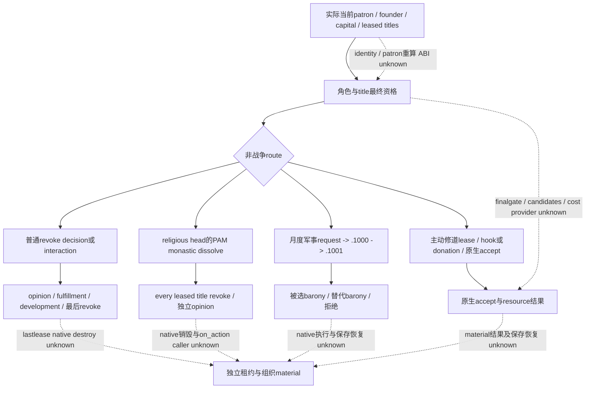

# CK3 1.20.0.3：holy order 成立、赞助与地产原生树

2026-10-03 离线研究。宗教领域已按项目所有者 2026-10-02 授权全面开放，holy order 也在其中；本页聚焦成立、patronage、地产租约、财政和解散。当前 readiness 为 **research**。本包没有连接游戏、SDK 或 pipe，没有占用窗口、成立或解散组织、出租地产、借款、改变日期或修改运行源码。Robert 29829 仍是唯一实机入口；战争研究停止与 `WAR_CASH/PREWAR` OFF 保持，本页不研究雇佣、集结或战场策略。

## 冻结输入

| 输入 | 值与证据边界 |
| --- | --- |
| 游戏 | CK3 **1.20.0.3 Crozier**，Steam build **25652598** |
| EXE SHA-256 | `94B55397ABB687A3DCD436805A5D885E6BE90FA6C693FEB44A9E3BBEEADE02A6`；复用已完成 intake，没有重算 EXE 或重跑 ABI |
| 发布源码 | `b59464e0367bafbdc0d344aeb2c6f9ababcb4716`；只读 `resume-12003/production-source-b59464e0` |
| source freeze | `resume-12003/robert-v22-child-adapter-council-and-religion-source-source-freeze.json` |
| 原版数据 | 本机 `Z:/SteamLibrary/steamapps/common/Crusader Kings III/game`；相关文件逐个 SHA-256 和行范围见外置 `religion-holy-order-patronage-12003/SOURCE-PINS.json` |
| 实机身份 | 此包不读取 Robert 的当前 holy order、地产、DLC、piety、tier 或 patron 状态；既有宗教身份可复用，但不能替代这些观测 |

下文的 stock 分支是当前版本的 authored 规则。GUI 命名是 exact-build 原生调用的搜索入口，不是已闭合的 RVA、ABI 或 provider；尚未反向闭合的分支在图中用虚线标明。基础宗教身份回链 [Rite/Faith/Religion 原生身份](religion-native-ai-faith-identity-12003.md)，PAM 任免与宗教领袖身份回链 [realm priest 原生树](religion-realm-priest-council-native-ai-12003.md)。

## 成立：军事组织与修道组织必须分流

当前原版 `common/holy_orders/_holy_orders.info:8–22` 明确区分 `military`、`monastic`、`mendicant` 类型和锁定的 government；此页闭合现存两条成立 decision 的 stock 输入，不把它们当作同一地产操作。

| 项目 | `create_holy_order_decision`，军事组织 | `create_holy_order_monastic_decision`，修道组织 |
| --- | --- | --- |
| 可见性 | landed；kingdom 或存在合法出租 barony，另有 struggle duke 可见分支；没有 patroned military order；basic trigger 排除 `immaterial_harmony_no_holy_orders` 与同 Faith 已赞助军事组织；FP1 Jomsviking 有专用分流 | landed、至少 duke；Faith 满足 `faith_has_monasticism_trigger`，且本人没有同 Faith patroned monastic order |
| 实际资格 | available adult、和平；通常 kingdom，struggle 参数允许 duke；至少一个实际合法 barony；有非本人 religious head 时检查 head→root opinion；PAM 已启用时要求 theocracy 或 theological-agent puppet；玩家 piety level ≥3，AI ≥1 | available adult、和平；至少一个本人持有且有空槽的县；PAM 已启用时要求 theocracy 或 theological-agent puppet；玩家 piety level ≥3，AI ≥1 |
| 地产选择 | `create_holy_order` controller 的 selected barony；castle/city，未出租；holder 与 root 关系及 `can_be_leased_out` 按 trigger 分支判断 | `select_county_title_in_realm` 的 selected county；holder 必须是 root；至少一个无 holding 且无施工的 province |
| 玩家标准费用 | 500 gold，或有 treasury 时改付 500 treasury；1000 piety；`next_free_ho_hire_modifier` 会使该 piety 项为 0 | 500 gold，或 treasury；1000 piety；decision cooldown 10 年 |
| AI 标准费用 | 200 gold/treasury、400 piety | 200 gold/treasury、500 piety |
| 直接 effect | 必要时把 selected barony 的 holder 转为 root；创建 leader 并设置 root Rite；`create_holy_order_neutral_effect` 指定 founder、capital、military type；accompanying effect 发通知、给予 leader 100+250 gold 和 piety level | `create_monastic_decision_effect` 从 selected county 的空槽排序并开始建造 church holding，设置 50 年 capital 变量，触发 `holy_order.2009`；此处不是立即已有完整修道团的证明 |

来源：`common/decisions/00_holy_order_decisions.txt:2–272,583–742`；`common/scripted_triggers/00_religious_triggers.txt:996–1012,1034–1084,1113–1128`；`pam_scripted_triggers.txt:994–1005`；`00_holy_order_values.txt:6–53`；`00_holy_order_effects.txt:347–419`；`00_religion_effects.txt:557–585`；`00_decisions_effects.txt:71–115`。

有两处必须按实际 stock 保存：军事 decision 的 head-opinion 阈值包含 **religious-head scope 内**的 `is_ai=no` 加 `high_positive_opinion=60`，不能移成 root 的玩家判断；两条 `ai_will_do` 都遍历未加类型 filter 的 `every_faith_holy_order`，分别逐项减 40、减 10。注释中的“五个军事团／二十个修道团”不是只计各自类型的代码证明。军事 base 200、mandala −150；修道 base 200、mandala −150，gold 与 piety 同时满足各自 `<=cost` 的分支 factor 0。`ai_goal=yes` 不能证明当前引擎实际检查频率、最终 utility、title selection 或 tie-break。

`pam_monastic_order_new_movement_decision` 的定义入口在同一 decision 文件 `:746`，涉及把已有租约拆出新组织；本页不把未逐支闭合的 movement 计为完成。具体下一入口已经明确，可在 Robert 的实际候选机会出现后继续，不受旧宗教禁令限制。

## Patron、Founder 和 Capital 是三个独立事实

当前 `localization/english/game_concepts_l_english.yml:697` 将 patron 解释为同 Faith、至少 duke 且 realm 包含 capital 的统治者，可能失去给 duke 以上 vassal；这是玩家说明，不能单凭它生成原生合法性。`grant_title_holy_order_patronage_warning_effect` 的实际脚本会比较 patroned order 的 `leader.capital_county`、grant 的 `target_titles`、recipient tier 与 de-jure hierarchy，并区分确定警告与潜在警告（`00_holy_order_effects.txt:5827–5907`）。这闭合了地产授予可能改变 patronage 的输入，尚未闭合原生 patron 重算函数、优先级或实际结果。

可直接用于下一轮 narrow reverse 的 exact-build GUI 入口为 `HolyOrder.GetPatron`（`gui/window_title.gui:2194`）、`HolyOrder.GetLeasedTitles`（`gui/shared/cooltip.gui:9081`）与 `HolyOrder.GetFounder`。其中 `HOLY_ORDER_COOLTIP_PATRON` 的英文文案实际调用 **GetFounder**（`holy_orders_l_english.yml:430`），而 title 窗口调用 GetPatron。不能用 cooltip 的“Patron”标签替代当前 patron native identity，也不能把 founder 或拥有某处租约等同于 patron。

## 租约：扩张请求、主动出租与财政

军事组织索取地产链为 `on_faith_monthly → faith_holy_order_land_acquisition_pulse → holy_order.1000 → holy_order.1001`。月度 caller 在 `religion_on_actions.txt:1276–1287`；pulse 有 authored `chance_to_happen=17`、no-event weight 和 100:0 / 500:event 分支（`:1536–1571`）。这些是月度抽样输入，不是保证六个月发生一次。

`holy_order.1000:970–1125` 要求存在可用 military order 与同 Faith、至少 duke、available、有合法 barony 的 request target。组织 title 的 `received_new_land/discarded_for_being_too_big` 和 ruler 的 request/receive 标志参与候选筛选。soft threshold 为 10；达到 10 会取消本次请求并保存五年 too-big 变量。组织 weighted pick 偏好少租约者；ruler weighted pick 对当前 patron 加 5，并根据已有供地数量扣分；barony weighted pick 偏好 ruler 直辖域。其最终随机抽样实现与候选枚举 native ABI 尚未闭合。

`.1001` 的三选项 stock 结果如下（`:1128–1291`），只在实际出现并有原生合法选项时才能进入事件策略：

| 分支 | authored 结果 |
| --- | --- |
| 接受原地产 | landed 且 tier>barony、target 未出租；给 ruler treasury/gold 的 barony value、minor fulfillment；必要时取 title，再 `lease_out_to_holy_order`；grandmaster→ruler opinion +25 |
| 替代地产 | 只在 alternative barony 存在时显示；类似租约和付款，grandmaster opinion +20；alternative value 不高于原 target |
| 拒绝 | grandmaster opinion −10；没有租约转移或该笔付款 |

接受两分支保存 order title 三年 `received_new_land`、ruler 十年 receive flag；immediate 已保存三年 request flag。`.1001` 的三个 `ai_chance base=100` 分别叠加 greed/zeal 或 ruler→grandmaster opinion，不是 1/3 的实际概率。地产 value（`00_holy_order_values.txt:65–118`）受 request target 的收入档、county development、castle/holding等级乘数与上限影响，不能以固定售价代替。

修道请求 `.1010/.1011` 与 `faith_monastic_order_land_acquisition_pulse` 已存在独立 stock 定义（同文件 `:1574–1609`），但本页所读 `on_faith_monthly` 没有这个名字；其真实调度 caller 未闭合，不能从军事链复制月度资格。monastic 租约 trigger 接受 church，可能覆盖非 monastic 的既有 lessee，仍排除已出租给 monastic（`00_religious_triggers.txt:1057–1084,1721–1759`）。

主动 `lease_title_to_existing_monastic_order_interaction`（`00_religious_interactions.txt:11381–12000`）则是本人/puppet authority 直辖 title、同 Faith 现有 monastic leader、diplomatic range、合法 church barony、非县首府、未监禁等独立 route。强 hook 的 auto-accept 分支与 `auto_accept=no` 的常规接受度保留；不能无条件按 auto-accept 执行。接受度 stock 包含 base 50、hook +100、huge donation +50、recipient→actor opinion×0.25、house/dynasty关系、piety level、租约数、同 Rite +30、heretical Rite −100 与个人/order tenet等；原生 final accept / rejection reasons 应直接读取，不能在 Python 复算成可执行许可。

其 donation 是 send option，decision/interaction 的空 cost block不代表无付费。**on_accept 只把 helper放进 `show_as_tooltip`，并触发 `holy_order.2040`；真正的 helper入口在该 letter event 的 option `.a`（`holy_order_events.txt:4055–4099`）**。不能把提议被接受或出现信件等同于地产已经出租。`lease_to_monastic_order_interaction_effect:2059–2153` 定义出租 title、给 county 五年 modifier、按直辖县数/trait/founder状态计算 fulfillment、给 piety；huge donation 通过 `pay_short_term_gold(monastic_donation_value)` 给 recipient，并可给 county 二十年 modifier。`monastic_donation_value` 当前是 `major_gold_value`（`00_interaction_values.txt:1066–1068`）。当前 generic gold snapshot 不能回答这笔特定最终资源费用或目标。

`borrow_from_holy_order_decision:275–378` 是另一条财政 route：同 Faith 必须有 military order、没有现有 `loan_amount_owed/loan_holder`、至少 county、available；匹配 leader 有足够 gold 且无 bad relationship。cost 50 piety、cooldown 5475 天，选中 order 后触发 `.0200`。借款金额读取 `holy_order_gold_value = monthly_character_income × major_income_multiplier`，夹在两个 gold 上下限（`01_dynamic_values.txt:552–557`）。AI authored base 50、已有 gold≥loan value 时 factor0，zeal/greed 各影响权重；实际借贷 ledger、还款和违约结果未在本包闭合。

## 撤销租约与解散：两条 route 的后果分开保留

普通 `cancel_holy_order_lease_decision:381–579` 需要实际 sub-realm 可撤销 lease，非 landless adventurer、available、age≥12、和平，widget 为 `revoke_holy_order_lease`。`barony_is_valid_for_holy_order_lease_cancellation_trigger:1086–1111` 还检查强 hook 与异 Faith 的 religious-protection vassal 分支。费用同 Faith 500 piety、其他 Faith 且 hostility≤astray 100，其他分支该 cost表达式为0；实际 affordability 与 failures 仍必须由原生 final query 判定。

隐藏 `revoke_leased_title_interaction` 的目标/permission不同：title target filter、county owner 与 actor 的层级关系、避免替其他玩家上级撤销、不可与 recipient 交战、recipient无actor强hook；它为 auto-accept，并走同一个 lease effect。decision 的 AI authored base0，异 Faith +75、hostile再+25、cynical非patron+100；interaction 额外区分 Rite divergence、greed、monastic compassion/generosity 和 military factor10，其 frequency 也不同（decision county以上36，interaction county60、duke以上12）。不能拼成一条原生 AI score或用一条路的资格套另一条路。

`revoke_holy_order_lease_effect`（`00_interaction_effects.txt:4864–5148`）先抓 order/title 和所有 recipient 信息，最后才 `revoke_lease=yes`，因为该 effect 会清除 lessee。单一租约与对应 order-title 条件会给 destroy warning；order 对 actor −50、宗教领袖/rite head 某些条件下 −30、已有 founder opinion移除、patron-vassal某条件 −40、county development按holding等级 −1 至 −4；同 Faith/astray 分支还有 fulfillment/stress，不同 Faith 更敌对分支可能给 actor +250piety、head opinion+20、target Faith fervor和十年county modifier。它不是单一“花piety取回holding”。

最后一处 lease 的原生组织销毁、identity失效、patron重算与 `on_holy_order_destroyed` dispatch 尚未闭合；warning和通知定义不能代替 material outcome。已有 destroyed on_action 会通知同 Faith 玩家并清理 leader 借贷列表中存活借款人的变量（`holy_order_on_actions.txt:537–592`），也不能据此宣称当前借款自动消失。

`pam_destroy_monastic_order_interaction` 是独立解散入口（`pam_interactions.txt:28846–28989`）：actor是本人 Faith religious head、PAM、adult/available且非监禁/hostage，recipient为同 Faith、和平的 monastic leader；500 piety，cooldown10年，auto_accept=yes。其 effect 对全部 leases 调用 `revoke_lease`，recipient opinion−75、其他同 Faith monastic leaders−30。AI authored base0，prohibited order-tenet或excommunicated recipient各+100，friend/best-friend/family/spouse factor0。这条 route直接遍历 revoke，不应套入普通 lease effect 的每笔 −50/发展/piety 后果。

## 现有能力与下一项可施工入口

现存 bridge/MCP 的固定发布源码库存见外置 `bridge-inventory.json`（SHA `c247422f4c4eedf17c89849d47935c36c838b2df621a05021012540d1d5eb6f1`，20 direct source pins）。当前发布源码没有 holy-order 专用 provider、MCP、动作或结果 consumer；focused 命中只有 government 身份/flags。可复用输入与限制如下：

| 当前接口 | 可复用事实 | 不支持的 holy-order 决策输入 |
| --- | --- | --- |
| `ck3_query_government_runtime_adapter_private_v1` | actor government key/flags、DLC keys、同帧 readiness | 不枚举组织；holy-order 专用 adapter 仍是 `religious_adapter_implementation_pending`、core readiness false，不是 owner 禁令 |
| `ck3_query_player_religion_context_v1` | actor Rite/Faith/Religion、main Rite、fervor、fulfillment | 不枚举组织、成员、patron 或成立规则 |
| `ck3_take_snapshot` | actor gold/prestige/piety、date、paused | 余额不是最终资源报价、affordability 或组织结果 |
| `ck3_query_campaign_root_context_v1` | primary title、held-title partition、domain、capital、income、direct vassals | 不枚举合法租约 barony、holding、lessee 或 final gate |

源码中旧 `major_decision_found_kingdom_*_v1` 固定 **1.19.0.6** 及 `found_kingdom_decision`，read evaluator 没有 selected barony/title/widget context，submit 合同记录 null context；它是研究参考，不能当作当前 generic decision MCP 或可复用的 holy-order final query。以下是落实宗教功能的依赖顺序，不是增加实机门禁：

1. 从 exact-build `HolyOrder.GetPatron/GetFounder/GetLeasedTitles`、stock `holy_order_patron/num_leased_titles/leader.capital_county` 对应 reflection 注册与 caller，闭合同 Faith/current actor 相关组织集合和身份。新增同一 MCP 的只读组织/租约 context：order opaque ID、type、leader、founder、current patron、capital county、每个实际 lease 的 title/holder/lessee 和合法零值。先让 Robert 能真实判断“我当前赞助什么、有哪些地产出租”。
2. 当前没有 generic decision MCP，需闭合当前 exact-build final observation；从 `DecisionViewWidgetSelectBarony.HasValidTitles/GetCurrentTitle/OnSelectCapital` 和 `LeaseOutBaroniesWindow.GetTitles` 追具体 title候选 producer、selected-context、native final gates/cost/reasons。修道县选择另追 `select_county_title_in_realm`，避免用军事barony reader套县空槽。旧 found-kingdom库只作为调用模型参考。只读 output 必须反映真实 current candidate和具体成本；未实现字段不能长期为 null且宣称资格已完成。
3. 原生树/只读输入落盘并取得 Robert paused snapshot 后，才选择一个实际合法且有价值的非战争 route。若自然索地事件先出现，沿原事件合法选项与独立租约/资源/opinion material扩充该叶；不为研究制造事件，不用另一个ruler取得live。主动lease需finalaccept和donation选择，普通revoke需最后一处lease的native结果，PAM解散需真实religious-head权限。
4. 成立/出租/撤销后，用独立 order/lease与resource查询、正常时间推进、完整checkpoint和规定cold验证业务结果。ACK、通知文本、函数名、stock effect或本页 research 都不增加 G2、NW loop或完成一局计数。

最优下一只读增量是 **current actor 的 patroned orders及其capital/leases**，它立即为地产授予、宗教财政与现有组织机会提供决策价值。尚未闭合的真实输入列为施工，不恢复旧“holy order 暂缓”拒绝。native patron重算、AI最终检查/utility、movement/monastic请求调度、创建与销毁ABI、borrow ledger和所有live结果保持 **unknown/research**。

## 交付与报告

外置目录：`Z:/ck3_mod_rewrite/artifacts/g2-maintainer-2026-10-02/resume-12003/religion-holy-order-patronage-12003/`。`SOURCE-PINS.json` 固定原版和当前发布source输入；`bridge-inventory.json` 为一次有限能力库存；`REPORT-FIELDS.json` 供 ROOT 合并 [2026-10-03 日报](../autonomous-agent-progress/daily/2026-10-03.md)及 [W40 周报](../autonomous-agent-progress/weekly/2026-W40.md)。本包只有这一份独占新文档，没有运行源码、schema、test或live变更；ROOT统一 commit/push，不由并行研究代理操作 Git。
