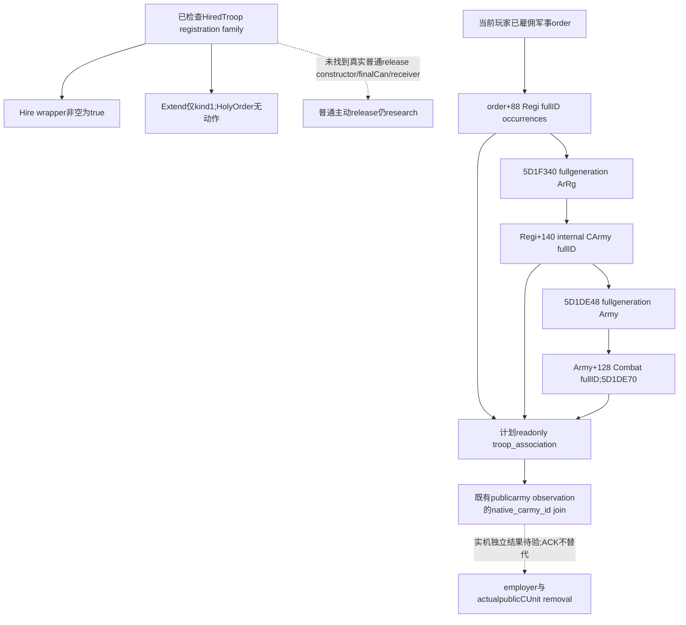

# CK3 1.20.0.3：普通释放命令缺口与当前玩家圣骑士团的 Army 归属

2026-10-06，普通主动 release/dismiss **research**；source-closed readonly Army association **已实现，待中央 validation**。复用 exact `.3 / Steam25652598`、冻结 EXE SHA-256 `94B55397ABB687A3DCD436805A5D885E6BE90FA6C693FEB44A9E3BBEEADE02A6`。前一包[自动释放与服务生命周期](religion-holy-order-automatic-release-native-query-12003.md)的中央 source `89cb683dbed31bad3bc0c008ea525faf1db08db0` 已通过新 native target 与一次 registered MCP：一份 genuine wire 包含四个 sample，103 checks；输入 static-ready，仍无实机雇主或公开部队移除结果。本包全程后台，无 CK3/process/pipe/UI/Steam/profile/save/cache 操作。

## 普通主动释放仍须真实命令，不复用自动 manager 清理

有界原生注册 locator 从已知 `HiredTroopItem.GetHolyOrder` / `CanBeHired` 的 `.pdata` 收窄，检查 `8D490..8F63F` 中 28 个实际函数，新增 code7,689B、复用旧已冻结 registration 字节726B。仅沿真实 instruction boundary 的 callback pointer 做结论，保留 `BINDING-LOCATOR.json`。这不是全 engine/type 库存，不能宣称不存在任何普通命令。

| 实际动作链 | 源已闭合结论 |
| --- | --- |
| `8E9C0` literal inline `Hire` → `CCFA70..CCFA8C` → 旧已闭合 `CCC670` | wrapper 对非空 Item 返回 true；bool不表示 native queue acceptance、雇主改变或军队创建。普通 kind0 hire 的 source/clone/finalCan 保持原实现。 |
| `8ED10` literal `Extend` → `CCFC40..CCFC5C` → `CCCBD0..CCCC92` | 最内 callback 首先检查 Item.kind==1；HolyOrder kind0 直接返回，无提交。wrapper仍对非空 Item返回true，不能当作 HolyOrder release 成功。 |
| 已有 `2A889C0` / `261A280` | 内部自动清理，不是已找到普通 player constructor/finalCan/reasons。新 readonly release bool不授权直接调用它。 |
| generic `296A4E0 → 2A978A0` Army disband | 已知真实 Army registry removal 不等于 HolyOrder employer 清空。未闭合的 polymorphic teardown 仍不作猜测替换。 |

该窗口未得到 release-specific command callback、factory、最终 Can/reasons 或 receiver。普通命令的精确下一 producer 是 **release-specific 命令注册/factory或实际 `MilitaryView.PlayerDisbandAll` callback/receiver**；后者必须源证明 HolyOrder employer 的改变，不是仅 Army destruction。现有 cache没有该 binding RVA，故不能凭 GUI 名称指定任意地址。邻接 cached qword `29956F0` 的32B新 leaf只做 global atomic reset，也不作为命令名/普通释放 locator。

## 已闭合 Army 归属是独立后态的真实依赖

当前圣骑士团口已有 employer、troop count、当前战争资格及 service_lifecycle；但缺少该 order 的真实 CArmy 身份，无法将其增援/撤出与现有公开 CUnit observation对应。沿上一包完整 native combat leaf `261D5F0..261D738` 直接复用以下 source，无新增 EXE 读取：

1. 读取 order `+88` 的 Regi fullID vector、count `+94`，保留原顺序和重复。
2. 全局 `5D1F340` 是 Regi registry；stride16 entry `+8`，范围 `+2C`，逐项核对完整对象 `+10` ID 与 `+14` 的 `ArRg` tag。有效 Regi 的 `+140` 给出 **internal CArmy fullID**。
3. 全局 `5D1DE48` 是 Army registry，按同样 fullgeneration解析并核对 Army `+10/+14`。有效 Army 的 `+128` 给出 Combat fullID。
4. 全局 `5D1DE70` 是 Combat registry，比较 Combat `+8` fullID及 `+C` 的 `Comb` tag。真实 Combat bool只在存在至少一个完整有效的 chain 时成立。

原生 leaf 对未 raised 的 `UINT32_MAX`、generation miss 和无效对象跳过；本查询保留 source row、raw非空 reference和独立 `resolved` bool，不把 invalid reference当未知读取，也不把 missing binding/读内存失败说成合法空集合。**internal Army ID不是公开 CUnitID**。现有 `army_strength` 序列化已提供 `native_carmy_id`，可按完整32bits与此输入 join，之后再观察其真正public ID；不得改名冒充同一身份。

最小实现：现成 registered readonly context 新 `military_terms.troop_association`；仅实际 employer==played actor时读取上述关联，其他行明确 inapplicable。每个 source occurrence保留 `regiment_id`、`regiment_resolved`、nullable `native_carmy_id`、`native_carmy_resolved`、nullable `combat_id`、`combat_resolved`、row availability/reason。现有 query/military结果独立，不依赖 CanHire/resource 可用性、不增造普通 release command。数组没有 dedup 或重排序。

原生 null registry、null slot、out-of-range、generation miss、`UINT32_MAX` 都保留为已知 canonical-invalid resolution，区别于 binding缺失或 memory/vector读失败。count0则为 available knownempty rows。valid未 raised Regi保留 `regiment_resolved=true / native_carmy_id=null`；stale Army ref保留 raw完整ID而 `native_carmy_resolved=false`，避免给新generation错配public军队。

新 target `xar_ck3_12003_holy_order_troop_association_test` / CTest `ck3_12003_holy_order_troop_association` 输出一份生产 serializer wire、四个 sample。单一新 `test_holy_order_troop_association_registered_mcp_v1.py` 将经实际注册 MCP、normalizer消费该 genuine fixture，并演示与 signed `army_strength.native_carmy_id` 按32bits匹配，保留两次同 Army source occurrence，绝不改名为 publicCUnit。Root集中编译后只消费一次；尚未运行新 native/MCP test，不重跑旧 path。

一次 source plan check为 plan-consistent：8 evidence，4 static / 2 unknown / 2 implementation edges；只验证文件/记录结构。source账本先于 provider code 落盘，association implementation 新 EXE 读取为0。普通 command locator共7,971B新code、1,024B新literaldata、726B复用；known实际 I/O17,031B，另一个无 `.pdata` start 的短 leaf失败仅发生未记录数目的headers/pdata窄metadata读，不伪造精确总量。失败与局部无命中保留。外置本包：`Z:/ck3_mod_rewrite_process_assets/g2-background-round5-20261006/holy-order-player-release/`，保存 source-cost、negative attempt与确切普通命令缺口。

## Compiled registered-MCP association qualification (2026-10-06T01:22:10+08:00)

Exact `3fb869c751d9050caffa790716a332ca71238c1a` central native batch GREEN; first association CTest GREEN0.09s. One genuine native JSON, four new samples and83 registered-MCP checks GREEN once atOct6 01:16:13. Source order/duplicates, full-generation Regi→CArmy→Combat, legal fallback versus unavailable, empty/unraised and nonplayer applicability remain distinct. Actual CArmy IDs can join army_strengths.native_carmy_id; they are not public CUnit IDs. RESULT SHAa1fd1d8a902da8cbcc747c5d9708745d1392a103fda9b3e9700e5c3a91a6d2c4 and VALIDATION-RECEIPT.json are sealed centrally. Old lifecycle4 samples/tests repeat0. This independently useful postcondition input is static-ready; normal player release command/factory and actual hire/release employer/publicCUnit outcome remain research/no live credit.
