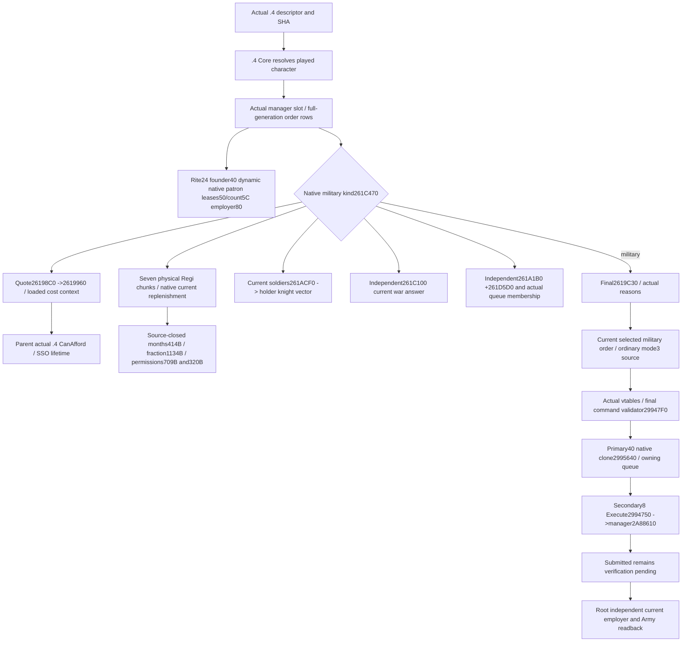

# CK3 1.20.0.4: holy-order context and ordinary hire migration

The actual installed build is **1.20.0.4 / Steam25734779**, with retained executable SHA-256 `98702F88A547CDE2EAF29A85F93B85F68EE4CF8148336A4F7AFAEB75319DD518`. This source-first package migrates the existing holy-order context and ordinary mode3 action. It adds no leader, total-strength, AI chooser, release action or strategy. Old 1.20.0.3 live and fixture receipts remain historical evidence.

The source baseline is `caa4adc3d1278e324cf4ec19774028e9b9138e28`. Before implementation, the finite manifests, native tree and operand ledger were frozen in `C:/codex-ck3-background/packets/holy-order-mercenary-12004-implementation-20261007/hire-context-actions/`. The sole mapper uses retained PE/runtime-function metadata, cached old bytes and exact new spans. Runtime ordinal is candidate generation only. Complete instruction comparison retains all member offsets and ordinary immediates; ordered actual calls, RIP targets and vtable slots close the published bindings.

## Native input and command tree

The reader continues to enumerate the current native manager, rather than a GUI cache. Manager/fallback slots are actual RIP targets `5D1DF10/5D1DF00`; the full-generation lookup retains `20` entries, `2C` range, stride16, entry pointer8 and object fullID10. Tags/full IDs, legal empty lists and generation misses retain their existing meanings.

| Existing input | Actual .4 native entrance | Source closure |
| --- | --- | --- |
| Dynamic patron | `2618D60` | Actual call from mapped final CanHire; exact78B leaf, not a founder/holder substitution. |
| Military kind | `261C470` | Actual mapped `261CD40` reflection callback call; exact28B leaf. |
| Final CanHire/reasons | `2619C30` | Complete1395B; native reasons and final authority unchanged. |
| Ten-slot quote | `26198C0` | Complete160B plus actual direct `2619960`690B cost branch. |
| Current soldiers | `261ACF0` | Complete263B across all five unwind fragments; plain int32 headcount. Actual holder-knight dependency `261C700 →28CBDB0` is separately mapped. |
| Independent current war eligibility | `261C100` | Complete876B; current actor wars, actual opponent members and native Faith hostility; no guessed CB whitelist. |
| Current service release predicate | `261A1B0` | Complete176B; native release bool independent of CanHire. |
| Associated regiment combat | `261D5D0` | Complete328B across three fragments; ArRg140→Army128→Combat, full-generation and tag checks. |
| Rite full ID | `106B470` | Actual mapped `261CBB0` callback; exact9B proves order24. |
| Founder full ID | `AEAF60` | Actual mapped `261D120` callback; exact9B proves order40. |
| Current leases/employer/cost context | Existing copied reader | Cost body proves order50/count5C, employer80, title28, effective holder128, actor18 and genuine registry fallback. Actual title slots `5D1DAF8/5D1DAE0`, loaded patron multipliers `5C69250/5C69248` retain their RIP identities. Holder exemption leaves undemanded patron/factor null. |
| Native months to full | `262BC70` | Complete414B, actual .4 monthly getter call. |
| Native monthly fraction | `262CAB0` | Army-owned complete logical1134B: retained133B prefix plus source-closed1001B continuation, contiguous normalized instructions and whole local control flow through terminal `RET262CF1D`. |
| Independent replenishment permissions | `262C6E0`, `2657EF0` | Reuse Army owner's complete709B/320B source proofs; do not manually AND the two native answers. |

The queue producer `2A89370..2A8973E` retains the actual secondary-this writes to `+24A0/count24AC`, equivalent to manager `+24A8/count24B4`. Its complete974B comparison has two concrete pre-date byte-table operands swapped (`444C4B0/444C340`); this package does **not** claim whole-producer semantic equality or call that producer. The copied query needs only the source-proved queue layout/membership, which remains unchanged. This delta is recorded in the operand ledger.

## Ordinary command source and owning ABI

Mapped actual UI constructor `CCC670..CCC8F1`641B and clone `2995640..29956C2`130B preserve the caller-owned0x30 source: primary0, secondary18, played Character fullID20, HolyOrder fullID24, **mode28=3**, metadata byte8 and zero fieldsC/10/14. Channel flags remain `0x0E`. Native clone retains the hidden single-pointer return storage and owning heap pointer; the existing software submission helper uses the parent-owned actual .4 command binding, never an old SHA alias.

Actual constructor/clone RIP operands identify primary `476D9D8` and secondary `476D9A8`. Only72B primary and16B secondary data were read. Primary `+30=29947F0` is CanExecute; primary `+40=2995640` is Clone. **Secondary `+8=2994750` is Execute**, whose actual160B source tails into mapped manager hire `2A88610..2A88991`897B. Primary `+38=86D5C0` is not this Execute target. Earlier cross-source inventory wording that assigned Execute to primary38 was a slot-label error; the retained ordinary mutation body itself remains valid old source evidence.

The complete actual manager hire body retains order80 employer assignment and the native patron-recall/release call. Its body is an ordinary mutation consumer, not an AI choice producer or default factory. The provider retains current-row resolution, native final permission, exact mode3 construction and native validation. Queue acceptance is a pending submission, never hired/employer/army/payment success.

## Software reuse and remaining qualification

`ck3_12004_holy_order_bindings.hpp/.cpp` supplies explicit actual4 binders returning the existing caller-owned DTOs. No old native image binder receives an alternate hash. Existing read-only context and action software reuse is justified by the source-proved field/ABI operands. The two existing mailboxes select actual4 descriptor, core binder and resolver; the .4 envelope keeps the actual adapter. Fresh C++ serialization uses `game::Render12004BuildIdentity`, including its actual4 schema-prefix rendering; the existing structure and action semantics remain compatible. The Python owner consumes actual4 metadata and schema identifiers while preserving historical3 wires.

Shared dependencies are independently owned: parent actual4 CanAfford/SSO/owning command binding; Army actual Regi chunk fields/Unit role join and complete monthly-fraction continuation; Root actual4 generic mailbox admission/frame capture. Army's actual `24E9EB0` complete61B getter separately proves commander120, and complete `2C11BF0/2634860` source proves Character1C tag. The adopted Regi tag witness is actual `2A9867E`7B, `cmp [rdx+14],52656769`; chunk ordinalC is actual `2A932C1`3B, `mov ecx,[rbp+C]`, and pendingbyte14 is actual `2A931A5`4B, `mov byte [rbp+14],1`. Together with this lane's complete414B months getter, these close the copied seven-chunk operands and four native replenishment methods. The monthly-fraction proof is Army's `LOGICAL-FUNCTION-SOURCE-CLOSURE.json` row `support_262CAD0`, joining retained133B and1001B suffix into complete1134B through actual `RET262CF1D`. The exact reused receipts are in the operand ledger; none were recaptured by this lane.

All adopted reinforcement inputs are **source-closed, qualification pending FIRST**. This candidate remains **research / implementation authored, qualification NOTRUN** until Root's one new-build compiled and registered consumer recipe passes. Parent/Root still own shared integration, the English integration commit and runtime qualification. No build, test, SDK, process, game, profile, save, live query or action was run here. Robert29829's original ordinary campaign remains the Root-owned paused validation entrance.

Owned native source cost at freeze: **8021 unique new executable bytes /25 seek-read calls**, comprising7933 code bytes and88 source-reached vtable bytes. Old executable reads, duplicate reads, whole-file scans/hashes, new header/pdata reads and native executions are0. Shared owner costs are excluded and separately linked: the final Regi tag witness cost7newB/1read, chunk witnesses7newB/2reads, and fraction suffix2002physicalB/2reads (1001old+1001new) belong to Army. Oct7/ISO2026-W41 reporting fields and formal qualification recipe are external packet members; parent merges the daily/week reports and owns the integration commit.
