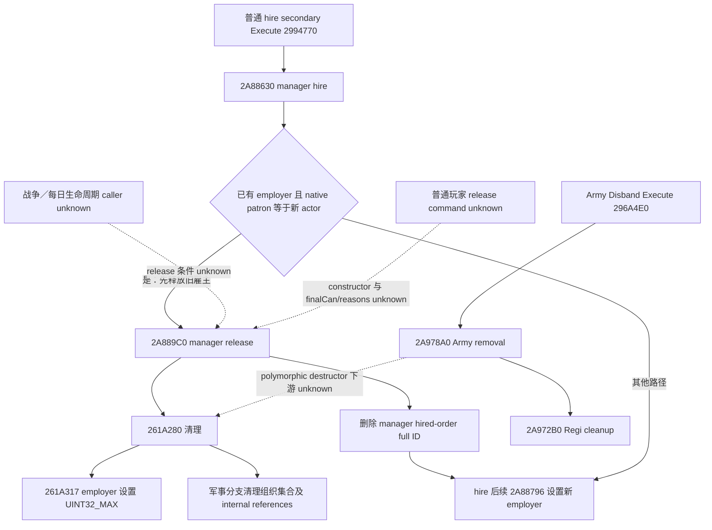
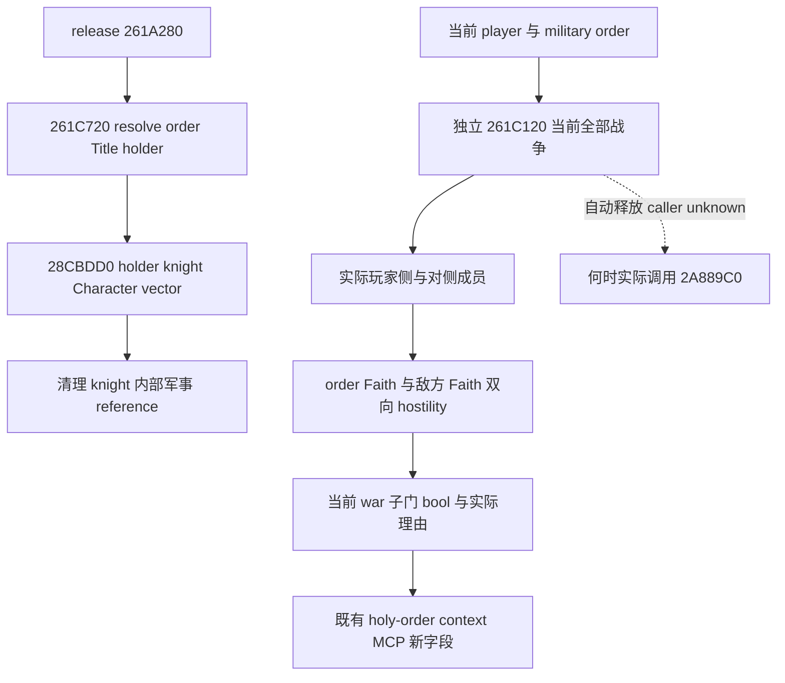

# CK3 1.20.0.3：圣骑士团释放、召回与部队销毁的原生边界

2026-10-05 后台增量，readiness 为 **research**。本轮闭合了真实雇佣命令的 Execute、召回旧雇主时的释放调用，以及清空 employer 的写入函数。尚未找到普通玩家主动 release/dismiss 的命令构造、最终许可与理由；也未闭合战争结束触发该清理的 caller。没有实现猜测的释放动作。

游戏绑定 `1.20.0.3 Crozier / Steam25652598`，复用冻结 EXE SHA-256 `94B55397ABB687A3DCD436805A5D885E6BE90FA6C693FEB44A9E3BBEEADE02A6`。研究只读 `artifacts/migrations/2026-10-02/installed-build/binaries/ck3.exe` 中已定位的 vtable、函数及其直接分支范围，并二分读取 `.pdata` 定位函数片段；没有全 EXE 扫描或重新计算 EXE hash。本轮未启动、连接、查询或操作 CK3，也没有读写玩家会话、Steam、profile、save、workshop cache。现成[组织与雇佣查询](religion-holy-order-context-native-query-12003.md)的历史 live 状态及[普通雇佣命令](religion-holy-order-hire-command-construction-12003.md)的 static-ready 状态分别保留，不给本轮新增 live 信用。

外置证据目录：`Z:/ck3_mod_rewrite_process_assets/g2-background-round2-20261005/holy-order-release/`。`native/SPANS-*.json` 保存实际读取范围、选中字节及各 span SHA；`native/span-*.txt` 是对应 Capstone 文本。`research-plan.json`、`RESEARCH-PLAN-CHECK.json` 与 `NATIVE-TREE.md` 保存问题、证据层和同一 Mermaid 图。计划检查只验证记录与文件，不证明作者解释或任何游戏结果。

## 真实雇佣 Execute 在召回分支先释放旧雇主

| 链条 | 本版源入口 | 本轮闭合的含义 |
| --- | --- | --- |
| 雇佣命令执行 vtable | secondary table `476D998` 的 `+8` 为 `2994770` | 必须从 secondary this 解释字段。primary table 的其他槽不是这里的 Execute。 |
| 命令 Execute | `2994770..299480A`，冻结 slice 到 `2994810` | 解析 source `+20` actor full Character ID、`+24` order full ID，读取 source `+28` mode，尾调用 `2A88630(manager, order, actor, mode)`。没有 release mode 的证据。 |
| 实际雇佣／召回 | `2A88630..2A889B1` | 旧 employer `order+80 != UINT32_MAX`，且由首 lease title 解析的实际 patron 等于新 actor 时，调用 `2A889C0(manager, order, true)`，然后进入正常新雇主登记。 |
| 旧雇主释放 | `2A889C0..2A88B5D` | 在 `2A88AA2` 调用 `261A280(order, manager, flag)`，并从 manager `+E8` vector／`+F4` count 中移除该 order full ID。 |
| 新雇主赋值 | `2A88793..2A8879C` | `2A88796` 将新 actor `+18` 的完整 Character ID 写入 `order+80`。释放与后续赋值是同一 hire 执行中的两个实际步骤。 |

`2A88630` 的召回分支只在上述旧 employer 与实际 patron 条件成立时进入；有费用 flag 时，还沿原生十槽成本 getter及支付／返还路径处理费用，再清除该费用 bit。该执行体没有最终玩家 CanRelease、拒绝理由 sink 或单独 release 目标参数，不能据此新增主动释放 API。它也没有证明 mode0、mode1 或其他值表示释放。

这条源证据独立解锁了一个真实生命周期结论：**patron 召回已被他人雇佣的组织时，原生 hire 执行会先调用完整旧雇主释放路径，再登记新雇主**。它不是 war-end 条件的证据，也不是新动作的实机 postcondition。

## employer 的实际清空与军事实体清理

`261A280` 首个 `.pdata` 记录只覆盖 `261A280..261A346`，后续分支进入独立 unwind 片段。本轮沿函数中实际分支及最终 epilogue 冻结完整有限范围 `261A280..261A4AA`（554 B），不把首段 `.pdata` 冒充整个函数。

1. 读 `order+80`。已经为 `UINT32_MAX` 时直接返回；否则按 full Character ID 解析旧雇主。
2. 若旧雇主有效、传入 flag 为 true 且其 landstate 存在，则从旧雇主 landstate `+150` vector 删除 order full ID。
3. **`261A317` 写 `order+80 = UINT32_MAX`**。这是此次闭合的真实 employer 清空点；它发生在军事类型分支之前。
4. 若 definition `+38` 为原生 holy-order definition tag 且 `+2D0 == 0`，调用 `2874210` 处理 `order+88` 集合，并将 count `order+94` 清零。
5. `261C720(order)` 返回的 Character full ID 集合逐项解析；若对应 `Character+1B8` 存在且其中 `+F8` internal reference 有效，则调用军事 manager 的 `2A971A0` 清理该 reference。
6. 接着调用 `261B3B0`、`26191A0` 和 `2873280` 等重置／维护函数；没有把尚未命名的子字段自创为公开 Army ID 或 release 许可。

该函数本身没有检验“玩家还有几场战争”“对侧 Faith hostility”或普通主动释放的资格；传入 bool 仅闭合为控制旧雇主 vector 清理，不能命名为“战争结束”。真正选择何时释放的责任在 caller。

## 普通 Army Disband 没有被证明等价于释放组织

现成 generic disband ABI 仍沿本版已复核的 `ck3_12002_military` bindings 使用：0x28 source command、secondary table `476AE18`、validate `296A620`。本轮读该表的 `+8` 得到真实 Execute `296A4E0`。

`296A4E0..296A536` 解析 internal Army full ID，校验解析对象的 full reference，然后尾调用 `2A978A0(military_manager, Army)`。沿实际分支冻结的 `2A978A0..2A97EC1` 会解除 Army 的战斗／舰队／角色引用、遍历其 regimental references，调用 `2A972B0` 等清理，再虚调用 Army destructor并移除其 registry entry。`2A972B0..2A977A0` 则清理 Regi 对象及其子引用。

在这两个完整有限范围内，没有直接调用 `2A889C0` 或 `261A280`，也没有上述 holy-order employer 清空写入。但其中的 polymorphic destructor 和若干下游维护函数尚未全部闭合，因此这里**不宣布 generic disband 永远不会间接释放**；只记录当前证据不能支持将 `ck3_disband_army_v1` 当成 holy-order release。销毁一个公开 Army 与改变组织 employer 是两种独立的 postcondition。

普通 stock hired-troop 详情 GUI 没有命名的 release/dismiss 按钮；Military GUI 的 `PlayerDisbandAll` 是 Army 操作。这个库存结果只限定已检查的 GUI/data binding 表面，不证明全引擎不存在普通释放命令。邻接 manager 函数 `2A88B60..2A88C59` 是 serializer，其调用链也没有闭合自动释放条件，不能拿地址邻近替代 caller 证据。

## 当前交付与下一段最小施工

本包交付真实 release 写入点、完整 cleanup 范围、一个已闭合的召回 caller，以及 Army disband 的独立销毁路径。新增普通主动释放动作仍为 **research**，没有 provider/executor/MCP 新增，没有 native fixture、Python 动作测试或新 live artifact，因而无需重编译或重跑已完成的 hire 测试。

下一段只定位 **`2A889C0` 的另一个实际 incoming caller**，优先复用 exact-build 缓存中的 manager constructor／vtable／daily-update 绑定，再读一个完整函数：闭合何时因战争结束或合法对侧消失而释放、是否多战争共享服务，以及 caller 的 flag 值。没有对应绑定时先交付这一 caller 的窄定位，而不是再次检查 GUI 库存、扫描整个 EXE 或猜 hire mode。自动释放条件闭合后，现成 holy-order context 的 employer full ID 与军队查询的公开 CUnit 集合可以独立核验状态；Army 消失或命令 ACK 都不能替代 employer 观测。

只有找到独立普通玩家 command、其 source constructor/clone/submission、当前玩家最终许可及真实理由，才实现 typed release action。若引擎只有自动生命周期释放，则维护自动条件与独立结果观察，不把内部 manager 清理函数包装成虚构的玩家命令。

## 关键冻结 span

| 实际范围 | Bytes | 选中原生字节 SHA-256 |
| --- | ---: | --- |
| `2994770..2994810` | 160 | `b3bbcba8a3c6d31e7c8584d2cace6efbc253f9c565f4b050a864e5422918f10e` |
| `2A88630..2A889B1` | 897 | `cd8c02b6bc8fe6872751a5f25e2034d5a9eb22b2843c6a49c54a517f28b9a753` |
| `2A889C0..2A88B5D` | 413 | `cddf5ef7174d802ad9e81d50ad0931db61e4a41248f21acb474956ec44dd4602` |
| `261A280..261A4AA` | 554 | `79adda5214b0c329e303131029088316570c02d1bd4232ebee0b3eb4ffa888fc` |
| `296A4E0..296A620` | 320 | `10747d3a2b5d282af758bf2404aea348046e22f316362fc70b31109ecf03c267` |
| `2A978A0..2A97EC1` | 1569 | `b324251def171eaf33abbef8e4e5eea70c359611a9619787dcb76bf4063f8aef` |
| `2A972B0..2A977A0` | 1264 | `d3e762cd774d31fc7d1436f7305f23123295be9977f65afe2369a6f8357524a4` |
| `2A88B60..2A88C59` | 249 | `ba81b0ff43bc850478daa3f5ebff29bc3f6a8ddf28728e2e0fd80698d10631b6` |

失败的 `.pdata` exact-begin 查询保留在外置 `ATTEMPTS.json`：两个无 unwind 的小 Execute 改用已知边界有限 slice，`261A49F` epilogue interior 没有冒充函数起点。历史初段 span 与后续完整范围都保留，不给部分读取源闭合信用。

## 后续后台增量：释放清理对象与独立战争输入

同日继续查已有 cached manager 绑定：已检查的 holy-order-systems `NAMES/PTRS/XREFS/SPANS` 与当前 native bindings 没有 manager constructor/vtable/update 或 `2A889C0` incoming-xref 定位。cached literal `477B65F` 的有限读取确认 stock 源文件名 `holy_order_manager.cpp` 及 `AddLeasedTitleToHolyOrder/HireHolyOrder` 名称，但没有给出 update 目标；这些名称不被转写成任意代码 RVA。第二 attempt 保存在外置 `lifecycle-caller/`，第一包原样保留。

沿真实 release 的直接 callback `261C720` 前进：它解析 `order+28` 的 Title full ID、Title `+128` 的 holder full Character ID，再尾调用 `28CBDD0(holder)`。后者返回 holder Character `+1C8` vector，缺席时返回原生合法空 vector。既有[佣兵当前兵数源树](ck3-1.20.0.3-mercenary-candidates-native-query.md)已将同一 getter 命名为 holder 的 knights；因此 release 函数逐项清理的是这些 knight Character 的内部军事 reference，不能直接称作公开 CUnit 集合。getter 完整 substantive leaf 为 `261C720..261C79E`，其直接 getter `28CBDD0..28CBE41` 完整113 B，SHA `96beb1cb1e0bf6eb5c731b2ce97983df4caf39460a0e7063d9598df2fa948dff`。这个 callback 不提供战争结束条件。

独立可施工输入直接复用[已冻结战争资格树](religion-holy-order-war-eligibility-12003.md)：`bool 261C120(order, played_actor, reason_sink)` 遍历当前 actor 全部 WarID，解析实际参战侧及对侧所有成员，调用 `261BFB0` 比较 order Faith 与敌方 Faith 的双向 loaded hostility，任一当前战争满足即返回 true；阈值小于等于0时原生直接返回 true。它与最终 CanHire 分开调用，可以在组织已经由当前玩家雇佣或其他 hire 门拒绝时仍回答当前战争宗教子门是否满足，保留实际原生理由，不从 CanHire 文案猜条件。它的用途是解释当前圣骑士团相关战争输入、识别哪些当前局面仍符合宗教军雇条件；**不是 war-end release、持续服务许可或主动 dismiss 判定**。

同一 `ck3_query_player_holy_order_context_v1` 增加 `military_terms.current_war_eligibility`：独立 `available/unavailable_reason`、native `qualifies` bool 和理由。军事行才采样；其他条款或旧 wire 是否有这个字段分别处理。原生 callback 绑定缺席或调用失败时保留真实 unavailable，不用 null 冒充已完成的正常读取。普通 release action 与自动生命周期 producer readiness 仍为 research。

