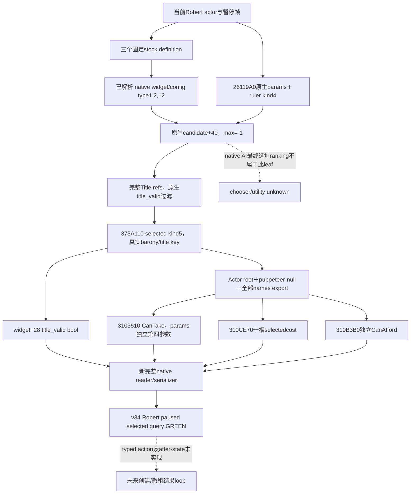

# CK3 1.20.0.3：圣骑士团创建／撤租的选地产原生树与只读 leaf

2026-10-03 当前工作包收尾。冻结 Steam `25652598`、EXE SHA `94B55397ABB687A3DCD436805A5D885E6BE90FA6C693FEB44A9E3BBEEADE02A6`，源码输入为 immutable `production-source-8cf176b4`。既有创建／赞助 stock 树、决议 final ABI、v32 组织查询及 Robert 实机证据直接复用。本专题为新的 selected-title 原生研究与独立只读读取器；两篇已 release 的组织／雇佣专题没有修改。

当前状态：**production-live primitive；v34新PID真实paused查询GREEN，三个固定决议与全部九个候选的选中地产报价/资格/原生理由完整实读**。当前native可执行候选为0，typed action及收益after-state未实现，不声称自动策略循环或complete。

## 三个固定原版决议

| Definition key | Controller | Native configuration type | 选中 scope／层级 |
| --- | --- | --- | --- |
| `create_holy_order_decision` | `create_holy_order` | 1 | `barony`／tier1 |
| `cancel_holy_order_lease_decision` | `revoke_holy_order_lease` | 2 | `barony`／tier1 |
| `create_holy_order_monastic_decision` | `select_county_title_in_realm` | 12 | `title`／tier2 county |

撤租的 definition key 是 `cancel_holy_order_lease_decision`。controller 名称不能替代它。既有 stock 权威文件 `common/decisions/00_holy_order_decisions.txt` 的 pins 与树沿 patronage 专题复用，不重复审查。monastic movement 的第四类决议不在当前固定三类读取器内。

## 无窗口候选集合已闭合

原生 parser 根据 keyword registry 的 `{uint64 keyword_id, const char* literal}` 配置记录选择类型：军事创建 `30A6→1`、撤租 `338C→2`、realm county `42DD→12`。解析后 definition+`1E20` 的 configuration+`40` 已持有真实 native widget，不需要打开 DecisionView、Military 或 Faith 窗口。factory `260E6C0` 与类型映射的完整证据位于外置 `selected-title-candidates`。

| 实际 native widget | Candidate vtable+40 | 逐项 title_valid vtable+28 | 行为 |
| --- | --- | --- | --- |
| Military VT `4743B48` | `260EE10` → `260EF70` | `260EB30` | 亲持 Title refs 筛 barony tier1，沿 native vassal refs 递归；创建深度1，撤租深度6。 |
| Generic county VT `4743988` | `260F5D0` | `260F410` | widget+F0 为真实 tier2，realm 模式经 `2BF1600` 取得该 actor 的层级集合，再用 native landed 条件、`230D850` 和 authored title_valid 过滤。 |

candidate 调用签名为 `(widget, actor, out_title_ref_vector, native_params, int32 max_count)`。`HasValidTitles` 的 1 是数量上限；读取完整集合用 **−1**。原生 producer 输出完整4-byte Title refs，保留 generation，不在 Python 重写过滤或排序。两个 producer 都建立 Title root scope，导入 params 的全部 named rows，再由 `372DF30(widget+20, scope)` 求原版 `title_valid`。

已有 `construction_held.cpp` 的亲持地产来源用于识别实际 producer 与复用 Title fullref／holder／tier 布局。它已过滤到 barony 的 output 只是一种候选下界，不能替代原生完整决议集合；county 不能从该 output 反推。当前 unique helper 直接调用闭合的原生完整 producer，保留其 county 层级和军事 vassal 范围。

输出 vector 与 allocator 都是24 bytes。沿既有 `18D2A90` caller 的实际生命周期，allocator VT `4524FD8`、fallback `54DEBA0`，native init `855A50` 得到 inline data／capacity1；copy refs 后用 `855830(allocator,data,4)` 释放 native heap。桥不以自己的 delete 释放原生候选内存。选地产 helper 只调用 candidate+40 与 predicate+28；军事 widget+38 的组织准备分支不属于只读枚举或验证。

## Named Title 参数与导出已闭合

native 参数对象由 **`26119A0(out_unique_ptr)`** 创建，大小 `110`；由 **`CA9AD0(params)`** 释放。名字来自 native intern initializer 写入的实际槽：`barony→5D4BE20`、`title→5D4BDC8`、`ruler→5D4BEB4`、`puppeteer→5D4C0D8`。这些是当前 native key，未猜字符串 hash 或硬编码 intern ID。

`373A110` 是 replace／append named row setter，三个 logical unwind continuation 都已保留。参数对象+`28` rows／count+`34`，stride24，row+0 是 name key，row+8 是16-byte typed scope token。Title token kind5，payload+8 为完整 Title ref。helper 使用实际 widget+18 的选中 name key，先设置 `ruler` 的 kind4 当前 actor，再逐项设置 `barony` 或 `title` 的 kind5 fullref。

新的真实验证 caller **`288D650..288D86C`** 建立 native `168` Character root scope，插入 `puppeteer` kind4／payload `00000000FFFFFFFF`，把全部 params named rows 通过 `373A110(scope+18,key,token)` 导出，然后调用：

```cpp
CanTake(definition, actual_actor, exported_actor_scope, native_params, reason32);
CanAfford(cost, exported_actor_scope, actual_actor, reason32);
```

第三个 scope 与第四个 params 是不同原生对象。native constructor／setter／scope export 由 new unique RAII helper 完成；未手造 params rows，没有用 root-only quote 代替 selected quote。`889F60`／`87E0E0` root 生命周期与既有 String32／`856050` reason 生命周期复用；不构造或执行游戏命令。

## 逐地产条件、理由与报价

固定 decision definition lookup 与已发布 final leaves 原样复用：IsShown `3103400`、CanTake `3103510`、cost getter `14706D0`、十槽 cost evaluate `310CE70`、CanAfford `310B3B0`。新 reader 在真实候选的 selected Title 已导出后调用它们；两个独立 reason32 sink 分别保留 final CanTake 和 affordability 原生文字，合法空理由保留为空字符串。`title_valid` 的实际 bool、final CanTake、CanAfford 三种值分别输出。

十槽顺序沿既有 resource ABI：gold、prestige、piety、renown、influence、herd、treasury、treasury_or_gold、merit、barter_goods，signed int64／Q100000。撤租 stock lines443–465 读取 **scope:barony.lessee.faith**，所以不同 selected lease 可有不同费用；parent fixture必须验证读取器把真正选中的 fullref导出进 evaluator，不在 Python 计算报价。

新的 GUI quote callers为另一个独立互证：`GetCostDescription` callback `14722B0`→`1470E10` 使用 wrapper+E0 的实际 scope；`CanConfirm`／`GetConfirmTooltip` 经 `1471C30` 调普通验证命令的只读资格回调。其 optional view+248 UI state不进入无窗口 reader；原生 final validation链由上述直接 leaf完成。完整 callback/caller pins 见外置 `selected-title-final-terms`，未重复扫描旧 final ABI。



## 当前封存与下一采用点

六个 unique native文件为 `ck3_12003_holy_order_selected_parameters.hpp/.cpp`、`ck3_12003_holy_order_selected_candidates.hpp/.cpp`、`ck3_12003_holy_order_selected_title_terms.hpp/.cpp`。新 schema 为 `ck3_12003_holy_order_selected_title_terms_v1`，三个 decision各报告 visibility、candidate集合与逐项 fullref／title_valid／CanTake／十槽cost／CanAfford／两个原生理由。真实空候选是 available-empty；读取失败明确 unavailable。没有永久 null stub。

唯一联合 focused case 使用完整 production reader、两个实际 helper 与 production serializer，并覆盖军事合法空候选、两条不同 fullref 撤租报价、county tier2、完整参数导出、独立许可／支付、reason 转义和 native scope／参数／候选内存释放。MSVC `/std:c++20 /EHsc /W4 /WX /utf-8 /MT` 编译、链接及唯一场景执行 GREEN，EXIT 0，耗时1.94秒。三个决议／三个 Title 的 fixture callback 分别返回11、42与25虔诚，仅用于验证 selected scope 传递，不能当成 Robert 的实机原版报价。

GREEN receipt 为外置 `selected-title-parameters/fixture/attempt-02/RESULT.json`（SHA-256 `3c9ec0c963bc327c9cb21522c3d18b582c333f38d3aa8395412b6ad50448e895`）；实际生产 inner serializer 输出 `native-selected-title-terms.json`（SHA-256 `d1d58cb6e22af909612fdcfbae1863375dcb01f933251cab1c0afde31c914e14`）。首轮 `attempt-01/RESULT.json` 的 MSVC C4324 对齐警告为 harness compile RED，reader 未执行；针对必需的16-byte scope对齐，仅增加类局部 pragma 后通过，不改变 ABI 或读取行为。成功 candidate object 与既有冻结 mystic production object 直接复用，未重建旧 reader 或重跑旧 case。

完整测试、RED 与 source／proof pins 以 `SELECTED-DELIVERY.json` 封存；没有重跑 v32 manager／雇佣32checks、旧 ABI、旧 live 或更广 suite。

用户要求度假温和收尾后，本包只完成正在运行的联合 case并封存，不新增 glue、normalizer、fixture、ABI方向或 v33部署。ROOT后续采用入口是：把三个 cpp加入现宗教 opt-in CMake source list；在现 application-main reader callback中绑定 `BindHolyOrderSelectedTitleTermsImage12003`，以当前actor/frame调用 `ReadHolyOrderSelectedTitleTerms12003` 并正式序列化；再接同宗教 opt-in的单独 current-player MCP transport，并完成一次真实 Robert paused selected query。当前只记录这些入口，没有开始实现它们。

收尾采用说明：本页新增代码如有，仅封存为外置补丁，尚未应用到生产 v32；实际读取以本文标注的 artifact/date 为准。接续入口：[度假交接](../handover/2026-10-03-g2-religion-v32-maintainer-vacation-handoff.md)。

## 2026-10-03T12:31 接续源码采用

实际原生失败帧明确 error=player_holy_order_selected_title_terms_mailbox_submit_unavailable，原生reader尚未执行。新typed callback遗漏现有主线程executor名单；五共享源码最小补全 main_thread_query_mailbox environment/mailbox字段、Register/Have/TrySubmit名单、nonwar executors/environment和router具体函数指针。无reader/ABI/产品flags/策略改变。一次真实production Register→TrySubmit场景从缺字段invalid_request到注册后submitted/cancel/reclaim GREEN；router严格编译GREEN，保留link/ICF harness RED及第一版diagnostic筛选无step帧失败。修复static-ready，等待v34严格组合及新PID真实paused查询，不重跑旧reader矩阵、不宣称实际报价/收益。补丁只存在行尾差异，Root以ignore-space-change逐hunk应用，保留所有既有宗教siblings。

实际记录：`2026-10-03T12:31:35+08:00`。源码已采用；严格组合DLL和Robert暂停实读仍待完成，不能记为live或增加日数/动作/收益/G2信用。ROOT负责正常commit/push。

交付回执：[holy-selected-executor-fix](Z:/ck3_mod_rewrite_process_assets/g2-resume-20261003/holy-order-title/actual-analysis/mailbox-submit-fix/ROOT-DELIVERY.json)。


## 2026-10-03 v34 实际 paused selected query GREEN

ROOT以source/native前缀 `5b203`、environment前缀 `12ced0ab`、新PID119724执行只读查询。实际帧为Robert29829、raw date53236608、native revision3、public queried revision2、capture epoch9147，`available=true`、`status=observed`。capture010对应snapshot009；本批五项查询整体GREEN并正常save由ROOT提供，worker仅消费冻结文件，不操作SDK、pipe、CK3、窗口或Git。

| 固定 decision | isShown | 实际原生候选，按FullTitle顺序 | title_valid／CanTake／CanAfford |
| --- | --- | --- | --- |
| `create_holy_order_decision` | true | barony tier1：2144、2176、2117、2104、2114 | 五项均为true／false／false |
| `cancel_holy_order_lease_decision` | false | barony tier1：available-empty，0项 | 没有候选，无逐Title条款 |
| `create_holy_order_monastic_decision` | false | county tier2：2102、2111、2115、2142 | 四项均为true／false／false |

九个实际候选的完整signed十槽报价均为 `[50000000,0,100000000,0,0,0,0,0,0,0]`，scale100000，即500金币与1000虔诚，其他八槽实际为0。资源顺序为gold、prestige、piety、renown、influence、herd、treasury、treasury_or_gold、merit、barter_goods。该报价来自当前Robert选中地产的真实native evaluator，不是fixture的合成11／42／25；这些fixture值实际写在index3 renown，不能当成Robert实机报价。

CanTake与CanAfford的18条reason均sampled且中文文字完整，实际包含“你处于战争”“你未满足所有要求”以及“缺少虔诚629”，并保留原生格式控制符与war／piety_i token。这些是当前资格解释输入，不表示已穷尽所有失败条件。先前worker报告的U+FFFD／中文乱码结论已更正：严格UTF-8解析原始capture及完整原生body后，18条literal的U+FFFD计数为0；原因是PowerShell 5.1默认GB2312显示层误读。原交付的部分新中文报告文案还受ASCII OutputEncoding影响，本次采用直接UTF-8文件写入替代。原capture、原始字段和旧报告均保留。没有生产文本损坏的实证，不新增生产fix或测试矩阵。

实际reader按String32长度逐字节复制；serializer只转义JSON控制符，保留UTF-8非ASCII字节；native协议按完整payload字节长度写帧，Python endpoint在整帧读取后执行严格 `payload.decode("utf-8")`，normalizer原样返回literal。对应只读定位与更正回执见外置 `reason-encoding-correction/REASON-ENCODING-DIAGNOSIS.json`。

当前输入完整度为3／3决议、3／3候选集合、9／9完整Title，包含独立visibility、title_valid、CanTake、CanAfford、十槽signed报价与reason。撤租的available-empty是已观测的合法空集。所有候选CanTake=false且CanAfford=false，结合独立isShown判定，当前native可执行候选为0。能力为production-live primitive；未交付typed action、after-state收益或完整OODA，不能记录建团收益。

原始实际artifact：`Z:/ck3_mod_rewrite_process_assets/g2-resume-20261003/runtime-preparation/v34/actual-paused-v34-01/010-ck3_query_player_holy_order_selected_title_terms_v1.json`，23359 bytes，SHA-256 `f239a9fc46ae843ed50ebe8e15be3795e66cd98488239597980e7a749a658628`。v33实际executor admission RED由最小注册修复与v34新PID真实查询关闭；原v33 capability RED、诊断wrapper筛选失败与focused harness失败均保留。更正交付回执：`Z:/ck3_mod_rewrite_process_assets/g2-resume-20261003/holy-order-title/actual-analysis/reason-encoding-correction/ROOT-DELIVERY.json`。
