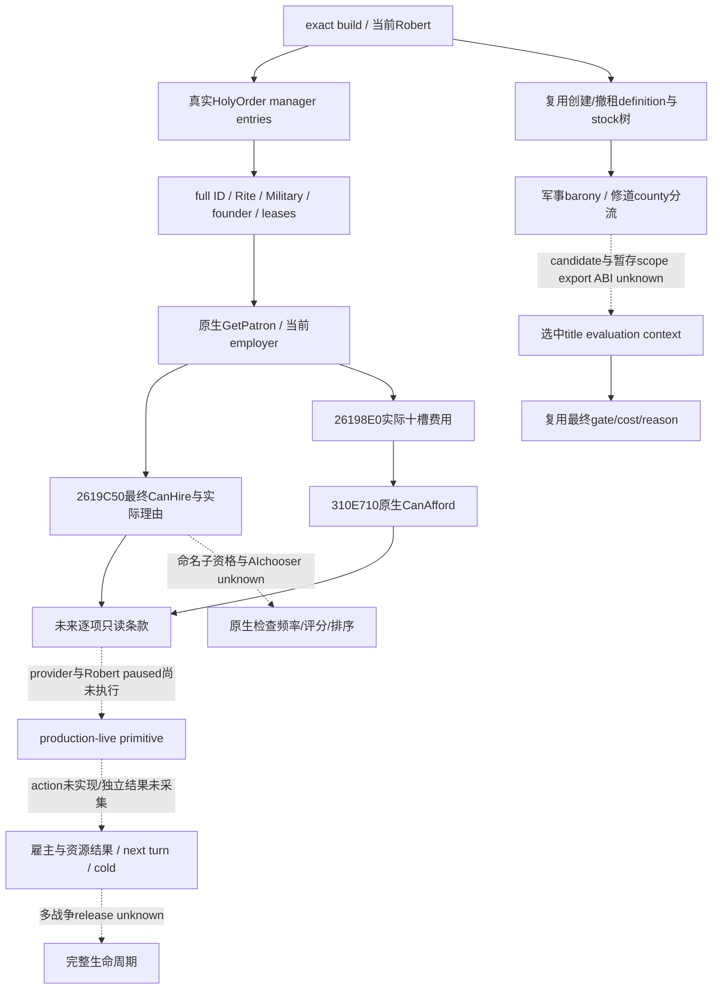

# CK3 1.20.0.3：圣骑士团身份、创建与雇佣只读施工树

2026-10-03 后台磁盘研究；readiness 为 **research**。游戏固定 `1.20.0.3 Crozier / Steam25652598`，EXE SHA-256 `94B55397ABB687A3DCD436805A5D885E6BE90FA6C693FEB44A9E3BBEEADE02A6`，复用此前 intake 的完整版本证据。此次仅读 frozen EXE 和原版数据，没有重算 EXE、连接 CK3/SDK/pipe、访问窗口、运行新 fixture 或修改运行源码。Robert29829 仍是唯一实机入口；宗教全面授权允许本专题研究，独立战争执行开关保持 OFF。

本页补充组织身份与雇佣的 exact-build 入口。创建、军事／修道分流、AI authored 创建权重、索地、主动修道出租、撤租和解散的 stock 全树直接复用[成立、赞助与地产专题](religion-holy-order-patronage-native-ai-12003.md)，不重复审阅同一规则。借款实际费用和 ledger 与组织雇佣分开，见[借贷只读专题](religion-holy-order-loan-native-observation-12003.md)。下述 native 函数仍未实现成 bridge/MCP，不能写成 static-ready 或 live。

## 当前组织身份有了具体原生读取路径

外置证据目录为 `artifacts/g2-maintainer-2026-10-02/resume-12003/religion-holy-order-systems-12003/native/`。完整函数按 PE unwind span 冻结；无 unwind 的短 getter 截止真实 `int3` padding。`SPANS-*.json` 保存 bytes、范围和 SHA-256，`span-*.txt` 是对应逐指令文本。registration slices 只用于将实际方法名对应到 callee，不冒充完整函数。

| 原生读取 | 本版入口／布局 | 已闭合的实际含义 |
| --- | --- | --- |
| `HiredTroopItem.GetHolyOrder` | registration `8D8A2..8D924` → getter `CCC070` | Item kind 必须为 **0**，`+4` 为 order full ref；manager slot `5D1DF10`、fallback `5D1DF00`。manager `+20` 指向 stride16 entries，`+2C` 是范围上限，entry `+8` 为对象指针；比较 **HolyOrder+10** 的 full ref，不使用 Character+18。 |
| `HolyOrder.GetRite` | registration `516557..5165E4` → `261CBD0` → getter `106B470` | 原始 Rite full ref 在 **order+24**；getter `uint32_out*(order,out)` 返回 out。reflection 经 Rite manager 解析并比较 Rite+8。当前 Rite→Faith→Religion 读取沿[既有身份口](religion-native-ai-faith-identity-12003.md)复用，不把 Rite 当 Faith。 |
| `HolyOrder.IsMilitary` | registration `516B99..516C20` → wrapper `261CD60` → getter `261C490` | 校验 order+30 的 definition，要求其 `+38` type tag 为 `0x4744624F` 且 `+2D0==0`。直接原生 bool，不能从 government 字符串猜军事／修道类型。 |
| `HolyOrder.GetFounder` | registration `51773B..517774` → `261D140/261D1B0` → getter `AEAF60` | 原始 founder full Character ref 在 **order+40**；getter同样写4-byte out并返回 out。完整 generation 必须保留。 |
| `HolyOrder.GetLeasedTitles` | registration `5168A9..516943` → `261CCC0` → `8CED10` | getter 返回 **order+50** 的原生 vector；GetPatron／cost caller 证明 `+50` 为 data、`+5C` 为 count，每项 title full ref。合法空集合需要与读取失败分开。 |
| `HolyOrder.GetPatron` | registration `517832..5178B5` → thunk `261D1F0` → `2618D80` → `261B000` | 从当前第一处 lease title 出发，解析 Title full ref，再取实际 title holder并沿其层级／liege 状态和原生 tier阈值求当前 patron。它是动态计算结果，**不是 founder+40，也不是首 lease 的直接 holder**。应调用 `2618D80(order)` 返回 Character pointer，再取已有 Character full ref。 |

`261B000` 的完整 span 是 `261B000..261B119`（SHA `d3e9bbc616861919fe3e829d3977e7a9cfa60ea521de6e2234b842cab0cd0264`）。它使用实际 holder、tier getter `28AC6B0`、原生阈值，以及 `+1C0/+1B8` 对应的层级路径。此包没有把这些未命名子字段自行解释成新的 patron 优先级表；直接复用原生最终结果。第一租约缺席或有效层级不存在时的 fallback 是合法无 patron，不应造出 founder 代替。

GUI 仍有一个已知文案陷阱：英文 `HOLY_ORDER_COOLTIP_PATRON` 实际调用 GetFounder，而 title 窗口调用 GetPatron。既有 patronage 专题已记录该差异；本包新增的 PE 调用链为读取正确当前 patron 提供具体实现入口。

最小有价值的集合读取可以从上述已命名 manager 的实际 entries 枚举 order，保留完整 ID、当前 Rite、军事类型、founder、原生 patron 和实际租约。每条租约再复用 Title resolver、holder、county/province读取。先输出“Robert 当前赞助／成立哪些组织、哪些地产租给它们”，不依赖 Military/Faith GUI 是否初始化；world registry 集合也不等于当前玩家可雇佣候选，资格仍交给下节具体 order 的最终原生判定。

## 雇佣最终许可与费用已经闭合到直接 native leaf

本版界面 `window_hired_troops_detail.gui:564–572` 以 `HiredTroopItem.CanBeHired` 控制按钮，用 `GetHireTooltip` 显示理由。费用来自 `HolyOrder.GetCostDescForPlayer`；它与 final gate 独立。两者的 actual registration/caller 本次已冻结：

1. **最终许可**：`CanBeHired` registration `8E86B..8E899` → wrapper `CCF9F0` → `CCC4E0`。kind0 的 holy-order 分支构造临时命令形状、actor full ref、order full ref和mode3，再通过冻结表 `476D9F8 → 2994810` 的 **CanExecute** 回调进行只读求值。`2994810` 验证真实对象后调用 **`2619C50(order, actor, native_reason_sink)`**，返回 bool。本包没有调用执行／发送函数；未来 provider 可直接复用这个最终 leaf和已知32-byte native string生命周期。
2. **拒绝说明**：`GetHireTooltip` registration `8E93B..8E973` → wrapper `CCFA30` → `CCC900`。kind0 分支使用同一命令资格回调且提供 native string sink。最终 `2619C50` 在 sink非空时可积累多个原生失败说明；sink为空时出现失败即短路。不能把英文本地化键的库存或 Python 推导当作实际拒绝理由。
3. **费用**：`GetCostDescForPlayer` registration `CC7623..CC7655` → callback **`CC7330`**。它取得实际 played Character，再调用 **`26198E0(order, out80, actor)`**，随后用现成 cost description renderer `310E440`。`26198E0` 返回 out pointer，明确写满80 bytes，即十槽 int64 原生 resource cost；它不是旧决议 evaluate 的 void-return ABI。provider可直接读取这十槽，复用已有 resource槽映射及 Q100000，不解析费用文案。
4. **独立支付能力**：最终 gate 在 `261A173..261A18E` 调上述 `26198E0`，再调用 **`310E710(cost80, actor, native_reason_sink)`**。该真实 caller给出 actor及reason参数；不重用签名不同的 decision CanAfford `310B3B0`，也不把 CanBeHired=false误解成余额不足。

关键完整 spans：`2619C50..261A1C3`（1395B，SHA `aead2d84550189d1aeff30801a480822927fc07d320485a05d6001352743afa4`）；`26198E0..2619980`（160B，SHA `600271fa8a0f2b1d6b8630921d81c6f4b6c0eee121e9478082e18b508b6b8d10`）；其真实成本子函数 `2619980..2619C32`（690B，SHA `ef5e17e22ff4d6e046e38567f935354521d1f8faef15a1c9022bfc3668b2046b`）。最终 leaf 内仍有 `261BCC0`、`261C120` 等未命名子资格分支，本页保留为 unknown，**不会因此阻止调用已闭合的原生最终 bool／理由／费用**。

成本子函数实际重新求 GetPatron，并比较当前 **order+80 employer full Character ref**：patron正常hire和从他人召回分开选原生 multiplier；随后使用当前 actor、组织军团、文化匹配、realm大小输入及 loaded费用函数求值、取整，再写入 piety资源槽。原生 multiplier与当前 modifier决定真实数值，不能用“patron base multiplier0”推出所有召回免费。`26198E0` 还有 order title holder 本人费用零分支，须与 patron分支保留，不能合并。

`MilitaryView.GetAllHolyOrders` 的 registration `1BDB83..1BDC00` → callback `1303FD0` → `D55CC0` 仅返回已初始化 view+110 的列表。`FaithWindow.GetHolyOrders` 也返回窗口列表。这些是候选 producer后续调用搜索入口，**不能把未打开窗口时的列表缓存当成完整当前状态**；当前优先用实际 manager集合与逐项原生 final leaf实现无窗口依赖查询。

## 原版参数、生命周期与原生 AI 的诚实边界

以下 stock 输入本次新增 hire lane闭合，详细12-file pins和行范围在外置 `hire-stock/REPORT-FIELDS.json`：

| 项目 | 当前原版规则及边界 |
| --- | --- |
| `NHolyOrder`费用 | levy每100人5虔诚、MaA原购买费用比例0.2、realm size系数0.05；真实费用由上述native getter求，不在Python重建公式。 |
| patron分支 | 正常hire multiplier0，已被他人雇佣的steal multiplier1；不能当成每个同Faith角色免费。 |
| 资格数据 | hire limit1、至少一名enemy的hostility≥2。本版提示还包括绝罚、大圣战预留、组织自身战争、已雇佣和不可负担；以actual final理由为准。 |
| 费用修正 | 普通／同文化 holy-order hire cost add/mult，以及可能消费的免费hire modifier。朝圣modifier的−0.33是stock值，不是Robert已获得收益。 |
| 续约 | `extend_area`只在`IsMercenaryCompany && IsHiredByPlayer`显示；佣兵36个月等参数不能套holy order。 |
| release | PAM概念文案说战争结束后停止服务；多战争release绑定、主动dismiss及cold后的employer结果仍unknown，不能把普通军队Disband等同释放组织。 |
| native AI | 创建两条decision的authored权重复用既有树；雇佣候选评分、检查频率、utility、tie-break尚未定位。AI defines中holy-order金币500／treasury1500是**团长自身支出保留线**，不是雇主的hire budget；不能套邻近佣兵策略。 |

## 创建与撤租下一依赖是选中的 title context

当前共融／忏悔 reader已闭合 `.3` definition lookup、IsShown `3103400`、CanTake `3103510`、cost getter `14706D0`、void cost evaluate `310CE70`、CanAfford `310B3B0`及reason sink。它只构造玩家根CharacterScope，CanTake第四参数传null。不要重新研究这些已实读ABI，也不能只换 key就声称创建／撤租 final query完成。

军事 `create_holy_order` 和 `revoke_holy_order_lease` controller导出 **scope:barony**；修道 `select_county_title_in_realm` 导出 **scope:title**。尤其撤租的原版cost `00_holy_order_decisions.txt:443–465`检查 `scope:barony.lessee.faith`：未导出barony的root-only evaluator会走未加值的0，不能视为已选租约的实际报价。这是现有生产stock路径的直接依赖，不是新增假设安全门禁。

下一段只读施工应沿 `DecisionViewWidgetSelectBarony.HasValidTitles/GetCurrentTitle`、`LeaseOutBaroniesWindow.GetTitles`及独立`DecisionViewWidgetSelectTitleOfTier`，闭合实际候选producer、暂存selected上下文和named scope导出，再复用上述final条款。`OnSelectCapital/OnConfirm`仅是磁盘caller搜索词，不调用它们打开窗口。CanTake第四参数的具体类型仍unknown，不猜成widget或title pointer。完整recipe见外置 `create-stock/RESEARCH.md`。

最优下一增量为 **同一宗教 MCP opt-in内的当前组织／租约集合＋军事组织逐项final hire许可、费用与理由**。它先解锁当前赞助、地产和财政判断，再研究实际候选producer与原生AI选择；无需打开军队或宗教窗口。ROOT在Robert真实paused帧验收之后，才设计依赖这些输入的策略。创建／撤租另按selected-title依赖施工；此次没有paid action、组织变化、游戏天数或G2/NW完成信用。

外置总交付 `REPORT-FIELDS.json`／`DELIVERY.json`汇集两条子lane、原生byte pins和本页hash，由ROOT合并当天／当周报告并统一commit/push。探索中无匹配的literal引用和误选的非合同spans保留在外置目录，但不作为上述getter合同证据；原生AI未闭合分支不冒充live或complete。
