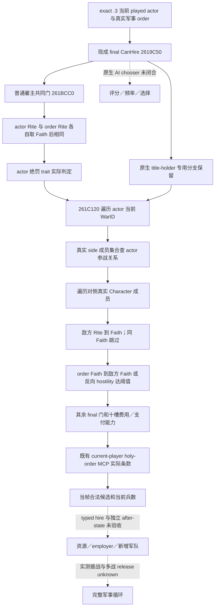

# CK3 1.20.0.3：军事圣骑士团的战争资格与三战消费边界

2026-10-03 后台增量：**research / exact-build native branches confirmed**。复用既有[组织与最终雇佣树](religion-holy-order-systems-native-ai-12003.md)、[当前玩家条款口](religion-holy-order-context-native-query-12003.md)、[当前兵数 primitive](religion-holy-order-current-soldiers-native-observation-12003.md)和[Faith/Rite 身份](religion-native-ai-faith-identity-12003.md)，仅闭合它们此前标为 unknown 的普通雇主宗教／战争资格子链。没有修改源码或运行测试、SDK、CK3、pipe、窗口、资源交易；没有新增日数、军力、战争或 G2 完成信用。

版本固定 `1.20.0.3 Crozier / Steam25652598`，EXE SHA-256 `94B55397ABB687A3DCD436805A5D885E6BE90FA6C693FEB44A9E3BBEEADE02A6`。复用冻结 EXE 和既有 intake/hash，不重新验证整个 ABI。原版数据来自 `Z:/SteamLibrary/steamapps/common/Crusader Kings III/game`。战争及宗教已获全面授权，Robert `29829` 原普通战役仍是唯一初始测试入口，实际运行保持最小化且不抢焦点。

## 普通雇主资格是 Faith 和真实战争参与关系

既有 final `2619C50(order, actor, reason_sink)` 在 `2619C9B` 调 `261BCC0`。后者首先检查组织的真实 military definition，以及 actor 的 landstate；普通雇主再走以下链。

| 分支 | 当前 exact `.3` 直接证据 | 可用于判断的含义 |
| --- | --- | --- |
| 同 Faith | `261BD73 → 261BF10`：解析 actor `+B4` Rite 与 order `+24` Rite，分别取 Rite `+4B8` 后比较 | 比较完整 **Faith** ID；并非要求相同 Rite，也不是仅同 Religion。不能把 Rite divergence 文案自行加成独立 hire 禁令。 |
| 绝罚 | `261BD88..261BEC2`：从原生 trait 定义取 ID，在 actor `+F8/count+104` trait refs 中搜索；失败字符串指向 `HOLY_ORDER_MUST_NOT_BE_EXCOMMUNICATED` | 普通被绝罚 ruler 不能雇佣。现成 final reason 已能实际报告，不能把历史绝罚填成今天仍有。 |
| 当前参战 | `261BECE → 261C120`：遍历 actor landstate `+318` 的当前完整 WarID vector | 判断真实战争集合，不按目标省份、围城参与者或 CB 名称代替。 |
| 自方与对侧 | `261C24B..261C284` 对 war `+20`／`+80` 的 side 成员集合调 `2494B60`；遍历 side `+8` pointer vector／count `+14`，逐项调用 leaf `2494B50` 比较 member `+8 == actor FullCharacterID` | actor 在攻击方时选防御方，actor 在防御方时选攻击方；检索对侧参战成员，**不只看 primary attacker**。该搜索不是递归自身。 |
| 敌人宗教 | `261BFB0` 遍历选中对侧的成员，解析该成员 Character→Rite→Faith；与 order Faith 相同则跳过 | 至少有一名符合实际宗教条件的战争敌人即可满足这个子门。当前军队 public ID 与 CharacterID／RiteID 不可互换。 |
| 双向 hostility | `261C0AF`：`243E950(orderFaith, enemyFaith, false)`；不足阈值再在 `261C0C8` 调反向，任一达到 loaded threshold 即 true | 用 **Faith** 两个方向的最终等级；不是仅 actor→enemy，也不是 Rite hostility 等级。等级 `2 hostile / 3 evil` 可满足 stock 阈值。 |

`261C120` 的完整 substantive 控制流没有读取 CB key、CB definition 或“宗教战争”标签。它确定 actor 的战争侧，再访问对侧成员的宗教。因此 `minor_religious_war` 不是充分条件，`individual_county_de_jure_cb` 或 `populist_war` 也不能仅凭名称排除。现有 final CanHire 直接复用这条引擎判断，无需 Python 重建或新门禁。

保留两个原生专用边界：`261BCC0` 在解析 order title holder 等于 actor 时有 early-true；final `2619C50` 的 holder 分支还会另调 `261C120`。`ENEMY_MIN_HOSTILITY_LEVEL <= 0` 时战争敌人子门直接 true。不能把这些特殊分支抹掉，再将普通 ruler 的树称作所有 actor 的完整等价表达式；实际查询仍以 final leaf 为准。

## Loaded define 与费用分支

exact leaf `23AE160..23AE17D` 将 `NHolyOrder` literal `4719570`、`ENEMY_MIN_HOSTILITY_LEVEL` literal `47197F0` 和全局槽 **`5C68CDC`** 交给 define getter；上述两条战争子函数均读取同一槽。当前 stock `common/defines/00_defines.txt:1320–1324` 的 `HIRE_LIMIT=1`、`ENEMY_MIN_HOSTILITY_LEVEL=2`。该段注释说明：雇佣时必须与达到敌对等级的敌人处于战争，已雇佣后可用于全部敌人。它是 authored stock 规则；本包未新增一次玩家圣骑士团接战来证明实际战斗循环。

标准雇佣许可仍包括既有 final leaf 的独立分支：军雇数量限制、当前 employer 与 patron 召回、已由玩家／本人雇佣、大圣战预留、组织自身战争，以及最终 cost affordability。`localization/english/gui/hired_troops_view_l_english.yml:46–57` 是这些原生失败说明的原版键；具体当前失败列表必须读 actual final reason，不从静态键拼装。

费用继续调用已闭合的 `26198E0` 十槽 signed Q100000 cost 与 `310E710` 独立 CanAfford。stock 每100征召兵5虔诚、MaA购买费用比例0.2、realm size系数0.05；普通 patron hire multiplier0、从他人召回 multiplier1（defines `:1314–1318`）。这些值不替代最终报价，也不说明任何同 Faith ruler 免费。金币余额、300金贷款报价、建团500金／1000虔诚都不是军事 hire cost；借款口见[独立贷款专题](religion-holy-order-loan-native-observation-12003.md)。免费 hire modifier 消费、完整原生 chooser utility/cadence 和多战争 release 生命周期仍未闭合，直接沿已有 final bool／cost 消费，不扩大本包。

非军事组织仍只提供身份，`military_terms=null`；修道组织的 holdings／development 价值不能算作军雇增援。真正军事组织的 `current_soldiers` 是原生当前总兵数，不带 Q100000，合法零值与 unavailable 分开；它不是尚未加入 Robert 的实际新增军力。

## 三场已知防御战怎样消费

下表只索引此前冻结的战争身份，[初始两战专题](robert-defensive-war-readiness-12003-2026-10-03.md)和[拒绝后实际战争专题](robert-post-refusal-military-actual-2026-10-03.md)保留各自日期。它不声称这三场在下一次查询仍存续，也不填造当前敌人的宗教身份。

| 历史 WarID | 历史 CB / 主攻方 | 当前应消费的字段边界 |
| --- | --- | --- |
| `16777231` | `individual_county_de_jure_cb/index17`；`30097` | 真实当前 actor 在哪侧、对侧实际参战成员、各成员 Rite→Faith；不能从非宗教 CB 或 Pope 的战略 power 映射推断资格。 |
| `129` | `minor_religious_war/index41`；`32750` | 仍需实际对侧 Faith 与 order Faith 的两个方向等级；CB 中 religious 不能替代 native predicate。 |
| `50331736` | `populist_war/index4`；`70766` | 用拒绝后真实 WarID 和当前对侧集合；不从 faction demand 的被割让县、造反军 public ID 或 populist 标签猜 Faith。 |

当前最小有用输入已经是 `ck3_query_player_holy_order_context_v1(expected_revision=<fresh snapshot.revision>)` 返回的可用 manager 行、军事类型、完整组织 ID／Rite、实际 employer／patron、最终 `military_terms.can_hire`、独立 `can_afford`、十槽 cost、双理由和 `troop_strength.current_soldiers`。这是无窗口查询：完整可用军事行均 `can_hire=false` 即能回答当帧无法军雇；不用先补上述逐 war 解释字段。若行 unavailable，则保留具体读取失败，不能写成所有组织不可雇佣。

若需要解释哪一战或哪一敌人解锁宗教子门，当前缺失的参战成员 Faith／Rite 必须从真实原生观测取得，再复用已注册 `ck3_query_player_religion_hostility_v1` 的 **Faith** 双向输出（其 target 是明确 full `target_rite_id`）；不要拿 Rite 双向等级代替本包证实的 Faith 判断。现口 final CanHire 已经内部消费完整战争集合，此解释依赖不阻塞合法动作研究。

历史 v37 military order4 的1008兵、106虔诚、`can_hire=false/can_afford=true`、employer39004，以及绝罚／已雇佣说明，只属于该历史暂停帧。本包没有下一帧 query，**不能据此宣称当前仍无可雇佣增援**。typed hire、实际资源扣减、独立 employer／新 CUnitID 与实测接战、战争结束后的 release 分别属于后续动作与结果层；原生 ACK 或报价不提供这些完成信用。

## 可复现 evidence 与报告边界

外置证据根：[stock-eligibility](Z:/ck3_mod_rewrite_process_assets/g2-resume-20261003/war-holy-order/stock-eligibility/ROOT-DELIVERY.json)。新增 spans 由冻结 EXE 的 unwind 完整函数／短 leaf 至 padding 输出；没有执行函数、改代码、连接游戏或复跑既有 getter fixture。

| 原生 span | bytes / SHA-256 | 类型 |
| --- | --- | --- |
| `261BCC0..261BF04` | 580 / `597789b6fc049c841527ab52b6bb4989f65b76ef3eb65e20e39a6de22dde3f49` | 完整共同资格函数 |
| `261BF10..261BFA5` | 149 / `f09631d7e2cb4e9bdacfa2ce44070bb43aeee3e24506290d95090bcbcfd4f747` | 完整同 Faith leaf 至 padding |
| `261C120..261C48C` | 876 / `d297e1205e302b60f678b345fa32cc233a6c2a80e0769c9a7f025ddfdfeec2fc` | 完整战争集合函数，含冷路径初始化 |
| `261BFB0..261C11C` | 364 / `0c2a80d79045453b74fdce0cdfb79028426d03875f8c52547b89ef6287d70d39` | 完整对侧成员 Faith 判定 |
| `2494B60..2494BE2` | 130 / `d3f63a0875e33bdffc3f058809e0c4e4c24224e378813e78ea3cbc72b55acaff` | 完整战争侧成员 vector 搜索 |
| `2494B50..2494B57` | 7 / `c2af87302b715b8acec91c68c48b58474b6ce6118d12c0b71d2dc16bc8140b04` | 完整 Character full-ID 比较 leaf |
| `23AE160..23AE180` | 32 / `53807ed2183736626c2c2761ed9d5b2a452e1ba4f3c4a4dd60f6b0bb300bdbb7` | define lookup 入口 slice，尾部3B padding；不是完整上层注册函数 |

既有 final span `2619C50..261A1C3` 的1395B／SHA `aead2d84550189d1aeff30801a480822927fc07d320485a05d6001352743afa4`、cost spans 和 Faith final ABI直接复用。stock define、GUI、localization、on_action 的旧 hash 继续回链系统专题与原 hire-stock pins，不重新跑同一验证。日报／周报可记：已消除“只允许宗教 CB”“必须同 Rite”“只查主攻方”“只查单向 hostility”等猜测输入；新增原生分支研究成立，实际 hire/action/收益及完整 loop仍未完成。ROOT统一采用单新文档、合并报告并正常 commit/push。
