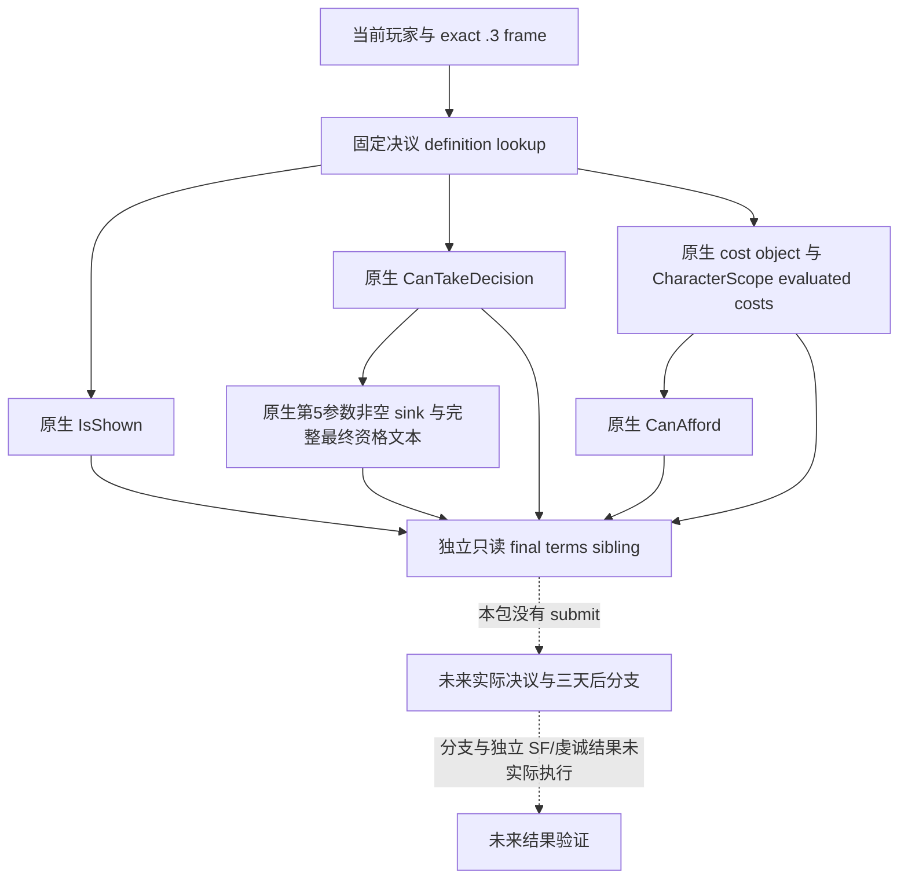

# 神秘共融：1.20.0.3 原生最终资格与费用只读口

2026-10-03。项目所有者已全面开放宗教域。本专题仅处理当前玩家的固定 `hold_mystical_communion_decision`：显示、最终资格、实际费用、支付能力和最终资格拒绝文本。外置源码及同 wire focused 验证属于 **static-ready candidate**；同组决议 reader 的 v26 实机失败已由 Holyloan owner 闭合为错误的 CostEvaluate 返回指针合同，本新 leaf 同步必要 void 修复。ROOT 严格构建及当前 Robert paused 实测仍待完成，不能自动认定夹具通过就已适用于真实决议。没有执行决议、付费、改宗或新增完整 OODA 信用。

游戏冻结为 CK3 **1.20.0.3 Crozier / Steam build 25652598**，EXE SHA-256 为 `94B55397ABB687A3DCD436805A5D885E6BE90FA6C693FEB44A9E3BBEEADE02A6`。本包以不可变 `artifacts/g2-maintainer-2026-10-02/resume-12003/production-source-f9da88f9` 为源码输入；共享 bridge、CMake 和 Python 修改只交外置 ROOT patch，ROOT 独占 apply、构建、实机和 Git。

## 已有原生树与当前价值

有限原版研究已落盘到 `resume-12003/m6-law/religion-progression-robert-next-inputs-20261003/{README.md,stock/FACTS.json,stock/PROOF.json}`，这里复用其结果，不重扫原版宗教系统。

| 依赖 | 已闭合的原版事实 | 决策边界 |
| --- | --- | --- |
| 显示与资格 | `common/decisions/00_lifestyle_decisions.txt:435–485` 要求 Mystic 特质、可游玩角色、`is_available_adult`，冷却 1825 天 | Catholic 身份不能证明合法或非法；当前 trait/cooldown 的最终结论必须来自原生 getter |
| 费用 | authored `medium_piety_value=100`，基础值在 `common/script_values/00_basic_values.txt:1133` | 100 是脚本基础值；发布 native evaluated quote，不能用当前余额大于 100 代替 affordability |
| 延迟结果 | 决议三天后 authored `random_list` 50/50；正常分支 `mystic_lifestyle.0001` 的 immediate 调用 `mystical_communion_outcome_effect` | 提交 ACK、预览 tooltip 和最终资格都不代表已经获得成长 |
| 正常分支收益 | `common/scripted_effects/00_lifestyle_focus_effects.txt:747–764` 基础精神满足度 +3，并含学习生活方式 XP、五年 divine guidance modifier 和 Mystic XP | 不是保证 +3；另一半 `mystic_communion_side_effect_events` 未在本有限包展开，也不计算猜测期望收益 |

当前 v25 Robert 既有实机观测可直接复用：actor 29829、date raw 53224008、Catholic；精神满足度 5、等级 index 3/7、区间 −30 到 +30、原生进度 58.333%；虔诚 414.0125、总每月虔诚 0.4375。它们说明比较一次成长机会有价值，但不赋予当前共融资格。实际 packet 为 `resume-12003/actual-v25-religion-feast-sway-combined-01/003-ck3_query_player_religion_context_v1.json`；本包没有重新查询或把旧 packet 当作新决议 final。

## 最小生产接线合同

复用现有 `ck3_query_player_religion_context_v1(expected_revision)` → `query-player-religion-context-v1` 和 `allow_private_player_religion_context_query`。不增加 feature flag、gateway、actor override、generic decision framework 或 paid submit。新结果只增加独立可选 sibling `player_mystical_communion_decision_terms`，旧 Context 的 17 key、成长的 19 key、`_CONTEXT_KEYS`、原查询 status、paid final 和 conversion outcome 均不改。

| 字段 | 原生含义与空值合同 |
| --- | --- |
| `schema/read_only` | `ck3_12003_mystical_communion_decision_terms_v1` / true |
| `available/unavailable_reason` | 读取完成与读取失败原因；原生 predicate 的合法 false 仍是 available true |
| `capture_epoch/date_raw/played_character_id` | 与同次原宗教 Context 相同的 owner frame，不接受替代 actor |
| `decision_id` | 固定 `hold_mystical_communion_decision` |
| `is_shown/can_take/affordable` | 原生 bool；未读到才是 null，不把 false 写成 unavailable |
| `costs_raw` | 始终四 key：gold、treasury、prestige、piety；每项带符号 int64 或 null，完成费用读取时四项都有值 |
| `raw_scale` | 100000；不把负数或零改成缺失 |
| `reasons_available/can_take_reasons` | 专属于最终 CanTake 的原生完整 UTF-8 文本；实际空字符串有效，读取未完成为 false/null；不能冒充独立 affordability 理由 |

原生定义 lookup 和 **0x168（360 字节）** CharacterScope 复用已证 Holyloan 的 .3 输入：decision database/fallback slot `5D1DEF0/5D1F7E8`、hash `3F7E240`、lookup `CAA8D0`；`889F60` 构造 scope、kind 4、full actor reference 位于 +8、`87E0E0` 析构。已有最终方法分别是 shown `3103400`、CanTake `3103510`、cost getter `14706D0`、cost evaluator `310CE70`、afford `310B3B0`。费用 evaluator 保留原生十槽输出，发布与已有生产 ReadDecision 相同的 gold/treasury/prestige/piety 四项。Holyloan 的当前 numeric registry 故障属于另一 domain，不能拿其 early false 充当本决议的真实结果。

拒绝文本 ABI 已闭合：已有 CanTake 非空分支 `3103832` 调用 `885FD0(sink, UTF8 bytes, length)`；本次新 exact .3 `885FD0` 字节证明 32-byte、align 8 字符串对象，size 位于 +0x10、capacity 位于 +0x18，capacity <16 使用 inline[16]，否则从首字段读取 heap pointer。新 `856050` 原生析构按 native allocator 释放后重置 size 0、capacity 15、首字节 0，提供相同 canonical empty 初始化。decision command validator 在 `288D806` 把 r15 作为最终方法的第五个文本参数。这里没有调用 command；只把原有那一次 final 调用的 null reason 改为已初始化 sink，复制完整 UTF-8 后原生析构。

实际 GUI reflection `D2ACD0 → D3CD60` 的 DecisionTooltip 属于显示 tooltip，已排除，不拿它替代最终资格理由。该文本也不冒充独立 affordability 原因。所有相关 exact-byte 及复用输入保留于外置包 `reason-sink/`；没有读取到真实当前文本时不得声称拒绝观测已 production-live。

## 验证与剩余项

外置包：`resume-12003/m6-law/mystical-communion-terms-12003`。一条新的原生 production owner/mailbox/reader/serializer focused case 已 `/O2 /W4 /WX` 编译退出 0、运行退出 0；既有 Python NativeDriver 方法通过原 private transport 解码同一 wire 的唯一 case 也退出 0。native wire 为 2161 bytes，SHA-256 `eb796dac1c462c347ede49971023e8c5fdf2172df7334b5d11158887a4e7e24d`；Python 完整结果为 2465 bytes，SHA-256 `f0dbad4dd4e539caaf0039c8cc34af082bbfe81884e3ba0cdfd4c8b2c2d3e88b`。

该单一用例的 lookup 与最终/费用/afford 调用由 **synthetic callbacks** 提供；生产 owner、reader、mailbox、serializer 和 Python route 是真实源码。它证明 `available=true/is_shown=false/can_take=false/affordable=true`、callback 费用 gold −12500 / treasury 0 / prestige 54321 / piety 10012345 及完整中文、换行、引号、Tab 文本均能穿过实际生产接线，费用没有替换成 authored 100。它不证明当前 EXE 的 decision lookup、getter/evaluator 能成功，不是 Robert 或 paused live 材料。

首次原生运行的 **harness RED** 保留：旧夹具 tag 的 heap capacity 硬编码 31，而固定决议 key 长 32 bytes，生产 KeyEquals 正确拒绝了不完整 synthetic definition。仅修新夹具 capacity 后重跑同一 case；生产 leaf、ABI 和合同未改变，也未增加矩阵或重跑旧 suite。

ROOT 随后提供新的 **真实输入 RED**：v26、PID 15592、Robert、date raw 53225304、native `1bb3eee9`，`resume-12003/actual-v26-loan-sway-cold-01/005-ck3_query_player_holy_order_loan_context_v1.json` 的 Holyloan 金额已成功读取 30000000，但 ReadDecision 返回 `decision_evaluation_unavailable`。borrow/repay false 和 cost 0 是未赋值 defaults，不能当真实资格或费用。Holyloan owner 的窄诊断闭合实际根因：`310CE70` 是 **void-return wrapper**，复制 80 bytes 到 out，没有 RAX=out 合同；完整冻结 span `310CE70..310CED1` 和真实 caller `31D40DE` 证明调用方不使用 RAX。lookup/key 未见错误，cost selector `14706D0` 返回合法内嵌 cost，不改这些输入。

必要修复只有 CostEvaluate typedef 改为 `void (*)(cost, scope, int64_t*)`，直接调用，不再把成功写入但 RAX 不等于 out 误判成读取失败。Holyloan owner 的真实修复包为 `resume-12003/religion-holy-order-loan-12003/ACTUAL-V26-DECISION-FIX/holy-order-loan-decision-cost-void-fix.patch`，SHA-256 `9c83f40d4e50722b890890d8c6f50ca4020e619124cd7d64a6bccecbab6b43d6`，source base `1bb3eee9`；ROOT 已应用其两 leaf。本共融包只同步自己的 helper typedef、调用及同一 synthetic callback，不包含 Holyloan 两 leaf，保留独立七路径 patch，f9 基线由 ROOT 按明确当前输入合并。初始 pre-void candidate 保留于 `pre-void-packet-archive/`，不重复 getter 字节研究。

void 修复后的同一必要原生 case 再次 compile 0 / run 0，genuine wire 的 2161 bytes 与 SHA 完全未变，因此复用此前唯一 Python GREEN，不重复解码测试。`PYTHON-WIRE-REUSE-PROOF.json` 保留输入字节一致性和原 case pins；这仍是 synthetic routing 验证，actual paused 决议结果待 ROOT。

下一项由 ROOT 按明确 source base 合并独立完整包、严格 native 构建和一次真实当前 paused 现有宗教查询。只读 final primitive 完成后，才能依据实际 shown/final/afford/cost/reasons 决定保持还是继续研究具体成长行动；本包不自动执行共融，也不把当前能力提升记成行动、天数、M6 整体或完整世代完成。
