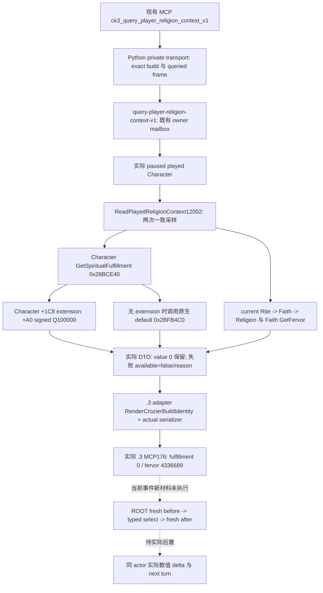

# CK3 1.20.0.3：宗教效果的独立材料观测入口

2026-10-02，offline source/evidence review。项目所有者最新授权已恢复全面宗教研究；本页按该授权接续历史专题，旧页的暂缓文字保留为历史截点。本包只读取既有冻结源码、ABI manifest 和实机 artifact，未启动或操作 CK3、SDK、pipe、Steam、构建或测试，也未修改策略代码。

**当前可直接施工的结果：`rite_growth.0010` 的精神满足度后置复用现成 `ck3_query_player_religion_context_v1`。** 当前值已经有 exact `.3` 的真实零值观测，不需要新 RPC、faith gate 或 binary。当前自然事件的 fresh before、typed select、fresh after 和 next turn 仍由 ROOT/M2 owner 执行；本页不把旧查询算成该事件的前态或物质结果。

## 版本、源码与既有 live 边界

- 游戏：CK3 `1.20.0.3`，EXE SHA-256 `94B55397ABB687A3DCD436805A5D885E6BE90FA6C693FEB44A9E3BBEEADE02A6`。复用已冻结身份，不重新读取或核验 EXE。
- 本页源审阅：`artifacts/g2-maintainer-2026-10-02/resume-12003/production-source-4ee2e755`，HEAD `4ee2e7558dbc32c69cfa1caaeaf232a287a5ee34`；该树不修改。
- 历史语义输入：[当前宗教 context](ck3-1.20.0.2-religion-context.md)、[转换结果 state](ck3-1.20.0.2-religion-conversion-outcome-state.md)、[新版 stress/fulfillment 效果边界](event-stress-and-fulfillment-1.20.0.2-source-review.md)。方法沿 [README](README.md#原生-ai-研究工作流) 与 [research tooling](research-tooling-workflow.md)，区分状态解析、NPC 决策、我方策略与真实后置。

实际 `.3` MCP 回执：

`Z:/ck3_mod_rewrite/artifacts/migrations/2026-10-02/live-preparation/sdk-nonwar-04/176-ck3_query_player_religion_context_v1.json`

SHA-256 `66d634aa8cba6aec847cd3be1241ba4580efa8a1f140f29c1be31b46dc9b5854`。其 `structuredContent` 记录：

| 绑定/字段 | 实际值 | 证明范围 |
| --- | --- | --- |
| `game_version` / `executable_sha256` | `.3` / 上述 exact SHA | 当前 provider 经过实际 `.3` adapter 与 MCP |
| `available` / `status` | `true` / `observed` | 本次 context 成功；不是命令 ACK |
| actor / date / capture epoch | `29829` / `53169072` / `873` | 历史当前玩家帧；不代填今晚 `.0010` 前态 |
| public queried revision / native revision | `3` / `2` | 两者独立，pump epoch 也不等同 revision |
| current Rite / Faith / Religion / main Rite | `152` / `23` / `8` / `152` | 独立 native identities，不合并成一个 faith 字段 |
| faith / religion key | `catholic` / `christianity_religion` | 本次实际 stable tags |
| `faith_fervor_raw` | `4336689` | signed Q100000，实际热忱 `43.36689` |
| `spiritual_fulfillment_raw` | **`0`** | 已成功观测的合法零，不是读取失败 |
| `raw_scale` | `100000` | 不将当前值换成 authored effect、基线或预测收益 |

这份查询足以复用 **production-live primitive** 的当前数值读取能力；它不证明事件效果、宗教转换、改革或完整宗教 OODA。当前 v20 的组合构建资格由其 manifest 和 ROOT adoption 单独管理。

## 当前实际数据路径

这是状态观测树，不是 NPC 选择树。`.0010` authored 选项与 AI 权重的原生树由 `/root/patch_game_input_delta` 负责；本页不重复解析其 stock，不用 indicator 代替数值读取。

## Getter、类型与版本证据账本

下列是冻结 production reader **实际绑定的地址与 ABI**。保留 `.2` 源命名不代表 `.3` 已逐函数重新静态定位；最后一列明确证明来源。

| primitive | reader 实际 RVA / 字段 | typed 单位与调用 | 本页能支持的 `.3` 边界 |
| --- | --- | --- | --- |
| 当前精神满足度 | `0x28BCE40`; `Character+0x1C8 -> extension+0xA0` | `int64_t*(Character*, int64_t* out)`，signed Q100000；返回同一 `out` 才成功 | MCP176 实际 `.3` provider 成功；本 getter 不由 102 ABI manifest 单独静态闭合 |
| 无扩展的默认精神满足度 | `0x2BFB4C0` | `int64_t*(int64_t* out, Character*)`，参数顺序不同；由 public core 调用 | `.2` 原生语义已闭合；MCP176 未证明 default 分支实际执行，不能将其零值称作 default 样本 |
| 当前 Faith 热忱 | `0x243EA90`，`Faith+0x2F8` | `int64_t*(Faith*, int64_t* out)`，signed Q100000 | MCP176 实际数值已观察；本函数不由 102 inventory 独立证明 |
| 当前 Rite | `0x28D2F90`，`Character+0xB4` | `Rite*(Character*)`，full uint32 generation ref | 既有 `.3` reuse inventory regions `775`/`794` 覆盖入口；MCP176 有实际 identity |
| Character / Rite -> Faith | `0x289E750` / `0x24FC560`，`Rite+0x4B8` | `Faith*(Character*)` / `Faith*(Rite*)` | MCP176 实际生产路径；不把未覆盖的旧 RVA 标成新增 `.3`静态闭合 |
| Faith -> Religion | `0x2443D40`，`Faith+0x8C` | `Religion*(Faith*)`，full uint32 ref | 同上；Religion reflection integer 不代替 full ref |
| Faith main Rite | `0x2444360`，`Faith+0x98` | `Rite*(Faith*)` | reuse regions `4470`/`4471` 覆盖；MCP176 实际 main Rite |
| Faith / Religion stable tag | Faith `0xB801A0`; Religion definition `+0x20 -> CString+0x18` | 实际 native CString；SSO/heap 复制 | MCP176 两 tag 成功；废弃 `0x247CA20` reflection 元数据分支不重新绑定 |

既有 `abi-comparison/core-comparison.json` 的 28 modules 不包含宗教 context 专题；`abi-comparison/religion-supplement/summary.json` 的 16 topics 也不包含 `religion12002_native_abi.json`。冻结 `ck3_1_20_0_3_abi_reuse.json` 的 `expected_regions` 已按 getter 入口做一次 inventory 查询：current fulfillment、default、fervor 等上述缺失入口确实无覆盖。因此 **复用实际 `.3` live packet 与复用 `.2` 静态语义必须分开表述**。这不是当前 notice 的新前置门禁，不重跑 102 ABI、旧矩阵或游戏。

如之后确有需要补 current getter/default 的 `.3` 静态账本，最小 reverse 入口是现 `research/religion12002_native_abi.json` 中命名 reflection registration `GetSpiritualFulfillment`、core `0x28BCE40` 与 default call edge `0x2BFB4C0`，只冻结这条实际 `.3`链；不用扩成全部宗教重新验收。[rite-growth 专题](religion-native-ai-rite-growth-12003.md)已闭合实际 `.3` effect setter/clamp：vtable `0x4849B28` 的 `+0xB0` executor `0x2D43A90` → `0x28BCF70` 按 gain/loss modifiers `0x25E/0x25F` 调整 → extension `+0xA0` → `0x28BCE80` 用 globals `0x5C68E00/0x5C68DF8` 的上下限写回。精确上下限数值尚未 observed，不从旧 defines 或基础 evaluator 代填；具体 source artifact 由该 sibling 专题记录，本包不重复逆向或测试。

## `.0010` 可立即复用的独立材料 recipe

ROOT 已交接的自然事件绑定为 player `29829`、date raw `53222280`、instance `13`，native option `0` 的 authored `add_spiritual_fulfillment = 5`，AI base `100`。这些只是 owner 给出的当前 source/instance 输入，本包没有执行事件。

1. 用当前 published snapshot 的 revision 调用现 MCP，保存 fresh result；确认 `.3` exact identity、actor `29829`、当前事件相同日期，`available=true` 且 `spiritual_fulfillment_raw` 为实际 int64。**历史 MCP176 的零不能充作这次 before。**
2. 沿 M2 owner 已有 source-reviewed typed event 路径选择 native `0`；既有 receipt 记录事件 instance，不发额外宗教动作。
3. 独立 fresh paused query 读回同一 actor 的 `spiritual_fulfillment_raw`，保存 before/after 两个实际值与其各自 revision/date，计算 signed raw delta。请求 ACK、event instance 推进和 indicator 方向分别记录，不替代该数值后置。
4. authored `5` 的尺度对应 `500000` raw 输入；实际 gain/loss modifier 调整及 clamp 链已由 [rite-growth 专题](religion-native-ai-rite-growth-12003.md)闭合，完整实际 delta 按真实后态记录。上下限数值未 observed 不阻断已可执行的独立数值观测，stock `5` 不保证实际 `+500000`，不将非增或较小增量自动伪装成该值。next turn/checkpoint/cold 按现 M2/ROOT 验收执行，本包没有新增门禁。

现 provider 的 `available=false` 会保留 failure reason 并不发布部分成功值；whole query 失败不能以原有 `0` 继续对账。合法 absent Rite/Faith 的 nullable fervor 与 fulfillment 的有效数值是不同语义；该选项无需新建 Faith/tenet readiness gate。

## 效果材料扩展的最小入口

| 实际需要的材料 | 现有可复用入口 | 下一块只在具体动作需要时施工 |
| --- | --- | --- |
| fulfillment / fervor / 玩家当前 Rite | 本页现宗教 context MCP | `.0010` 直接消费；不新增 DTO/RPC |
| stress 与 fulfillment 组合效果 | `ck3_12002_event_window_context.cpp:631-641` 有 fulfillment / combined indicator；现 snapshot 有 stress，context 有 fulfillment | indicator 只给方向，幅度未提供；同玩家两个独立数值 before/after，原始 trait 条件须由具体事件树解释 |
| Rite growth progress | 当前 context header/serializer 与 transport `_CONTEXT_KEYS` 没有此字段 | 先由具体需要该 progress 的当前 stock/GUI caller 定位原生 getter/collection及单位，再扩同 query。`rite_growth.0010` 的事件名与 instance 不是 progress，当前 +5 notice 无需此字段；不编造 RVA、默认0或长期null |
| 实际定向好感 | `ck3_12002_gift_opinion.hpp/.cpp` 的 `ReadCharacterOpinion12002`；实际 getter `0x28BC490`、signed int32 scale1，owner=recipient、toward=actor；已有 `.3` gift-opinion comparison 覆盖 | 优先复用现有 Sway/gift outcome 的目标绑定；总好感能验证总值，不能证明某个宗教 opinion modifier 存在。需要新宗教目标时只扩既有结果 query 的相同方向 |
| named character/county modifier | 既有 [treatment rows](ck3-1.20.0.2-epidemic-treatment-modifier-rows.md) / [county modifier](ck3-1.20.0.2-epidemic-recovery-county-modifiers.md) 与 `.3` corresponding comparisons 提供 collection/definition seam | 按具体 authored modifier key、实际受影响 owner 与期限扩既有 reader；现 CE1 allowlist 不冒充通用宗教 modifier 查询，当前 notice 无此后果，不做额外施工 |
| target Rite knowledge / current-vs-baseline fulfillment | [conversion outcome state](ck3-1.20.0.2-religion-conversion-outcome-state.md) 现有 provider/query | 只在实际转换目标需要时复用；baseline、predicted base change 与 actual current fulfillment 不互相替代，旧 `.2`资格不自动扩成 `.3`完整转换效果 |

任何确需新增的当前材料字段都沿现 `Bindings/Context -> ReadOnce/Same -> SerializePlayedReligionContext -> mailbox -> player_religion_context_private_transport._CONTEXT_KEYS -> 现 MCP` 接线；source-specific unit 与合法 absence 先落盘。现 Python normalizer 检查精确 key set，添加 DTO 字段时必须同时更新该 normalizer，不能只新增 schema key 或返回长期 `null`。

## 本包精确 source pins 与交付状态

以下路径均相对上述 immutable `production-source-4ee2e755`，只读哈希一次，用于报告回链，不是新运行验证。

| path | SHA-256 |
| --- | --- |
| `ck3_autonomous_player/native_bridge/include/xar_bridge/ck3_12002_religion_context.hpp` | `a871b0923b4a84a473c28a7595c72b959d26ecfabd5f3c51c412c66e8cf37aae` |
| `ck3_autonomous_player/native_bridge/src/ck3_12002_religion_context.cpp` | `cc49540b7a4ddbbd3f0e2fbb6dabf0ae2b51b46454777eaa129829194a2d9126` |
| `ck3_autonomous_player/native_bridge/src/ck3_12002_religion_mailbox.cpp` | `80b48ed633e517a87aff005b7e86cf0544b0010bb8157ce2b8a95167e1c19361` |
| `ck3_autonomous_player/native_bridge/src/ck3_12003_abi_profile.cpp` | `9c6828f932d9fe7b4d1a112c3f43f580f4456b12e73cda7eb99aa2eeceed8856` |
| `ck3_autonomous_player/native_bridge/src/ck3_12003_adapter.cpp` | `f255c46744b7fc4cfd591b664ce791a4b78a0aa97ff06e132336602e935d2559` |
| `ck3_autonomous_player/src/xar_autoplayer/bridge/player_religion_context_private_transport.py` | `3d4c3b9aa8288be40c2ea552971d13fc61635a6aeedc0498bc6896d663bcd8eb` |

`religion-supplement/summary.json` SHA-256 `a335cb03ce7fed8913570e8bf663b1f764c827c66c2c11bbbcb6daa25efc7c0c`。该比较只覆盖其16 topics，未重执行。

本包完成：现成 getter/typed单位/source接线图、真实 `.3`零值证据、`.0010`最小独立材料 recipe、未来真实字段缺口与具体施工 seam，并回链 sibling 已闭合的 setter/clamp。新能力状态为 **research 文档增量**；既有宗教 context 的 production-live primitive 证据直接复用，不新增 live、M2/M7/G2 credit。当前事件后置与最终 source/doc commit/push由ROOT及对应owner记录；共享日报/周报由ROOT合并本页字段。
