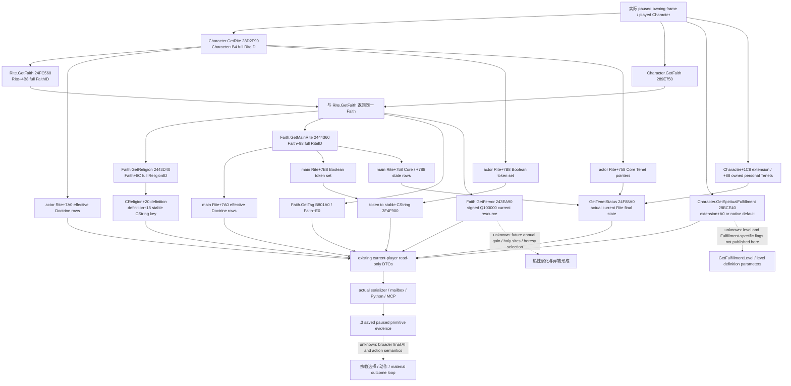

# CK3 1.20.0.3：宗教身份、现行教义与资源观测链

本页把已经存在的宗教只读能力映射到最新 Steam 构建。当前玩家身份、有效 Doctrine、布尔参数与 Core/personal Tenet 查询已有 **1.20.0.3 production-live primitive**；v20 的同一生产读取链已经编译冻结。它们可直接作为后续宗教决策的输入，不需要重新建立一套默认 null 的上下文。完整宗教 AI、热忱演化、宗教动作及完整 OODA 不由这些读取能力自动完成。

## 授权、冻结与范围

- 本工作包于 **2026-10-02 23:30（Asia/Shanghai）** 核对记录：ROOT 已转达用户“全面深入宗教域，并全球撤销宗教暂缓”的最新授权。这个时间是本页记账时间，不冒充原始指令发送时间。当前 [README 的全面开放节](README.md) 已记录同一授权；索引下方按日期保存的 owner-deferred 限制与旧专题限制是历史状态。本页依最新授权施工，不编辑共享索引。
- 游戏冻结：**CK3 1.20.0.3 Crozier / Steam build 25652598**，EXE SHA-256 `94B55397ABB687A3DCD436805A5D885E6BE90FA6C693FEB44A9E3BBEEADE02A6`。直接复用已冻结身份，没有重新读 EXE、运行 ABI verifier 或操作 CK3。
- 实际盘点源码：commit **`4ee2e7558dbc32c69cfa1caaeaf232a287a5ee34`**，完整树 [production-source-4ee2e755](Z:/ck3_mod_rewrite/artifacts/g2-maintainer-2026-10-02/resume-12003/production-source-4ee2e755/)。下文相对 source links 指向 canonical 源路径；结论来自该冻结树，而不是同时变动的开发树。
- v20 [manifest](Z:/ck3_mod_rewrite/artifacts/g2-maintainer-2026-10-02/resume-12003/binaries/native-nonwar-12003-family-chancellor-v20/manifest.json) 绑定这个 HEAD 与 933 个实际编译输入；DLL SHA-256 `008ac31847c16de15fe6985f087a5c75f0d6d8f6a3da7701045644230dcbcac7`。这是编译与输入绑定，不冒充这次工作包的实机验证。
- 本页只盘点身份与状态读取、现成 query 的调用链及下一项只读施工入口。`rite_growth.0010` 的 stock 事件解析由 M2 owner 独占；改宗、改革、祭司/组织、AI scheduler/desire 的选择树复用各原生专题，不重复全 stock，也不实施我方 counter-policy。

## 当前原生状态输入树

这是原生状态解析树。身份 getter 自身没有宗教 AI 的选择分支；下游 AI/动作最终求值另有专题。实线表示已有生产 reader 和已有来源证据，虚线表示尚未由本页闭合的输入或选择逻辑。

`Character+0xB4` 是 RiteID，不能叫作 FaithID。玩家采用的 Rite 与 Faith 的 main Rite 是独立来源；它们本帧恰好相等也不能在 wire 中合并。原生 getter 校验完整 ref 与对象 `+0x08`，provider 保留 32 位 generation；`0xFFFFFFFF` 表示合法 absent，Rite `0` 仍可合法。宗教 definition 与 Doctrine/Tenet definition 用真实 stable key，不编造 full-generation definition ID。

## Getter、槽与当前发布值

地址以本构建模块基址为零点。实现名保留 `12002`，这是实际复用源名。原始 .2 ABI 留在原专题与 manifest；.3 绑定及 live 证据边界见下节。

| 输入 | 现有 native getter / 布局 | 实际实现与输出 | 当前边界 |
| --- | --- | --- | --- |
| 玩家 Rite / Faith | `0x28D2F90`, `0x289E750`, `0x24FC560`；Character `+B4`、Rite `+4B8` | [religion_context.hpp](../../ck3_autonomous_player/native_bridge/include/xar_bridge/ck3_12002_religion_context.hpp) / [reader](../../ck3_autonomous_player/native_bridge/src/ck3_12002_religion_context.cpp)：`rite_id`, `faith_id` | .3 当前玩家身份已实际读取；不接受任意 actor |
| Religion / main Rite | `0x2443D40`, `0x2444360`；Faith `+8C`, `+98` | 同 reader：`religion_id`, `faith_main_rite_id` | .3 actual identities；Religion.GetID reflection `0x2481A30` 的 `+10` 整数不替代 full ref |
| Faith / Religion key | Faith `0xB801A0` 返回 `+E0` CString；Religion `+20 → definition+18` | 同 reader：`faith_key`, `religion_key` | .3 actual keys；废弃 `0x247CA20` reflection 分支在历史实机返回 string metadata，不再调用 |
| 当前 Faith fervor | `int64_t*(Faith*, int64_t* out)`，`0x243EA90`；实际 `Faith+2F8` | 同 reader：`faith_fervor_raw`, scale `100000` | 只表示当前资源，不表示年度增长或未来热忱 |
| 当前 Spiritual Fulfillment | `int64_t*(Character*, int64_t* out)`，`0x28BCE40`；extension `+A0` 或原生 default `0x2BFB4C0` | 同 reader：`spiritual_fulfillment_raw`, scale `100000` | default ABI 是 `out, Character*`，仅由原生 core 调；当前资源与等级/参数分开 |
| actor / main Rite effective Doctrine | 各自 Rite `+7A0` pointer array、`+7AC` count，stride 8；Doctrine `+18` key、`+B08` group pointer、group `+18` key | [intrinsic](../../ck3_autonomous_player/native_bridge/src/religion_doctrine12002_intrinsic.cpp)、[rite](../../ck3_autonomous_player/native_bridge/src/religion_doctrine12002_rite.cpp)、[composition](../../ck3_autonomous_player/native_bridge/src/religion_doctrine12002_query.cpp)：两个完整当前集合 | Faith.HasDoctrine `0x2439C20` / UI GetDoctrines `0xC59360` 都走 main Rite；未证明独立 current Faith intrinsic runtime 表 |
| Rite / Faith Boolean parameters | Rite `+7B8`；data `+0`, count `+C`, token stride 4；membership `0xB9DE80`, stable key `0x3F4F900` | [parameter reader](../../ck3_autonomous_player/native_bridge/src/religion_doctrine12002_tenet.cpp)，组合 query 的 `boolean_parameters` | .3 两套 complete 集合已读；完整集合中缺 key 才能解释为 false。普通 parameters 是 Boolean，不是通用数值 map |
| Core / personal Tenet rows | Rite `+758` core pointer array；main `+788` state rows stride 16；Character `+1C8 → extension+88` personal pointers；definition `+18` key；native status `uint8_t(Rite*, Def*)` at `0x24F88A0` | [tenet_rows](../../ck3_autonomous_player/native_bridge/src/religion_doctrine12002_tenet_rows.cpp)：分别保留两个 Core 来源、personal keys 与 native effective status | 原生 `0 Unknown / 1 Known / 2 Prohibited / 3 Permitted / 4 Core`；无 extension 是合法 personal 空，不是 reader 失败；现行拥有列表不是 draft slot |
| Loaded Doctrine catalogue | `0x5C67198` initialized `CDoctrineTypeDatabase*`；DB `+50` data、`+5C` count、stride 8 | [catalogue](../../ck3_autonomous_player/native_bridge/src/religion_doctrine12002_catalogue.cpp)：完整 loaded rows / stable-key resolver | 可读实际 loaded mod definitions；不调用可能 lazy init/log 的 `0x8FC740`，catalogue 不是角色最终合法 choices |
| 已学 Doctrine / named knowledge | Character `+1C8 → +E0/+EC` learned pointer array；`bool(Character*, Def*)` at `0x28B0C00` | [knowledge reader](../../ck3_autonomous_player/native_bridge/src/religion_doctrine12002_choices.cpp)，现成 named-key query | learned 状态与 DoctrineItem.ShouldDisplay / CanPick / `prophet_perk` 最终选择门分开 |
| Five numeric special parameters | Rite cache `+7D0`：minimum `+C` int32；holy-site gain `+10`、fervor gain `+18`、threshold adjustment `+28` int64 Q100000；protection `+20` int32 | [numeric](../../ck3_autonomous_player/native_bridge/src/religion_doctrine12002_numeric.cpp)：current/main 各五项，带 raw/scale/unit/value-state | `minimum_fervor=-1` 是 unset；effective zero 不能反推未 authored；不声称全部 special fields |
| Faith 最终 heresy threshold | `int64_t*(Faith*,out)` at `0x2440920`；main Rite `+7F8` adjustment + define slot `0x5C68D88` | [numeric_final](../../ck3_autonomous_player/native_bridge/src/religion_doctrine12002_numeric_final.cpp)；[reform Rite](../../ck3_autonomous_player/native_bridge/src/religion_reform12002_rite.cpp) 也已经读取 | .3 reform-context 已实际读到最终 `7000000`；不能把 actor Rite adjustment 当 Faith final，也不是 create/edit 总许可 |
| Character personal Boolean parameters | collection getter `0x28BD090`，DB slot `0x5D1DEB8` / supported tokens `+F20`；owned Tenet definition `+740` membership | [personal_parameters](../../ck3_autonomous_player/native_bridge/src/religion_doctrine12002_personal_parameters.cpp) | 已有独立 query；扩展缺失为支持 key 全 false。它不是 Fulfillment flags，未持有 definition 不贡献值 |
| Explicit target Rite identity / directional hostility | Rite storage slot `0x5D1E2F8`，full ref 解析；Rite final `0x2591CE0`、Faith final `0x243E950`，Faith offset 固定 false | [hostility](../../ck3_autonomous_player/native_bridge/src/religion_doctrine12002_hostility.cpp)：双方 Rite/Faith/Religion/main Rite IDs、两方向等级、same-faith/religion | 等级 `0 righteous / 1 astray / 2 hostile / 3 evil`，不是婚姻/改宗最终接受度；现成 query 已可观测 target identity |

CString copy 复用 native union `+0`、size `+10`、capacity `+18`、SSO `<16`。Context reader 在一个 owning capture 内读取两次，确认同一 actor/date/identity/value；实际调用 getter 的 out pointer 也是原生求值成功条件。不同独立 MCP 查询有各自 pump epoch；相同日期和 snapshot revision 不能改写成多域 atomic epoch。

## .3 ABI 选择与端到端接线

调用路径已有真实代码：

1. `bridge/mcp_server.py` 按显式 `allow_private_*` 注册 `readOnlyHint` 工具，调用 [NativeHeadlessGameplayDriver](../../ck3_autonomous_player/src/xar_autoplayer/bridge/native_driver.py) 的 wrapper。
2. 各 `player_religion_*_private_transport.py` 通过 [g2_private_query_transport](../../ck3_autonomous_player/src/xar_autoplayer/bridge/g2_private_query_transport.py) 发送实际 `execute_step` selector，并将 public revision 绑定到 current native revision。以 [context consumer](../../ck3_autonomous_player/src/xar_autoplayer/bridge/player_religion_context_private_transport.py) 为例：外层 backend 与内层 schema/build 必须对应真实 hello/snapshot；null、full refs、signed values、epoch 原样保留。
3. [bridge.cpp](../../ck3_autonomous_player/native_bridge/src/bridge.cpp) `RunConnectedSession` 的 private branch（冻结源约 `12340–12526`）解析 revision，要求当前 `ReadSnapshot` 与发布帧一致，交 [nonwar_router](../../ck3_autonomous_player/native_bridge/src/ck3_12002_nonwar_router.cpp) 的 `HandleNonwarPrivate12002`。
4. Router 使用 `NativeAdapter12002` 解开 semantic wrapper，各域 handler 调真实 `TrySubmitMainThreadQueryV1 → paused owner drain → EnterQueryMailbox → domain reader → Finish → Wait/Reclaim`。专用 executor 由 [nonwar_mailbox](../../ck3_autonomous_player/native_bridge/src/ck3_12002_nonwar_mailbox.cpp) 登记到既有 owning-thread mailbox；没有新增另一个进程读取入口。
5. .3 descriptor 的 adapter ID/version/SHA 三者都由 [ck3_12003_abi_profile.cpp](../../ck3_autonomous_player/native_bridge/src/ck3_12003_abi_profile.cpp) 的 `IsCk3_12003Descriptor` 精确识别。`ReviewedCrozierAbiSha256/Version` 在这个 .3 描述符下选择已审阅 .2 ABI。各原 .2 binder 的 SHA 条件仍严格，实际函数仍绑定现有 header RVA；这不是运行时扫描或猜测版本。
6. Reader / domain serializer 生成完整 `command_result`。`bridge.cpp:11845` 的 `write_frame` 调 [RenderCrozierBuildIdentity](../../ck3_autonomous_player/native_bridge/src/ck3_12003_adapter.cpp)：将实际输出版本、EXE SHA、backend 与 schema 渲染为 **.3**；实际源路径保留 `12002`。Python 同时接受 .2/.3 对应 exact identity，拒绝跨当前帧的 build。

```mermaid
flowchart LR
    MCP[existing readonly MCP / explicit driver switch] --> PY[typed private transport / native revision]
    PY --> DISP[bridge private selector / current published snapshot]
    DISP --> ROUTE[nonwar router / NativeAdapter unwrap]
    ROUTE --> ABI[exact .3 descriptor / reviewed ABI selection]
    ABI --> OWNER[named mailbox / paused application-main callback]
    OWNER --> READ[actual identity / Doctrine / Tenet reader]
    READ --> DTO[actual C++ serializer / Finish Wait Reclaim]
    DTO --> ID[RenderCrozierBuildIdentity / actual .3 provenance]
    ID --> PYV[Python exact-build typed validation]
    PYV --> OUT[MCP available or actual unavailable reason]
```

既有 [migration comparison](Z:/ck3_mod_rewrite/artifacts/migrations/2026-10-02/abi-comparison/README.md) 与 [reuse manifest](../../ck3_autonomous_player/native_bridge/research/ck3_1_20_0_3_abi_reuse.json) 是冻结的新 SHA 输入账本。16-contract [religion supplement](Z:/ck3_mod_rewrite/artifacts/migrations/2026-10-02/abi-comparison/religion-supplement/summary.json) 包含 reform/conversion/clergy 的既有 exact spans；例如 `religion_reform12002_willingness_abi.comparison.json` 直接记录 main-Rite getter `0x2444360`，tenet-sources comparison 记录实际 `call 0x24F88A0`。**不能把这 16 条目称为覆盖所有宗教文件**：它没有逐项列入根 `research/religion12002_native_abi.json` 与 `research/religion_doctrine12002_*_abi.json`。本页对 context/doctrines/current-tenets 的新版资格主要复用下面保存的 actual .3 caller 与数值读取证据，配合 v20 同源接线及输入冻结；没有伪造一份新 verifier receipt，也不把一次实读外推成全部 branch coverage。

## 可以直接调用的工具与开关

以下 CMake flag 在 v20 manifest 均 **ON**。源码默认 OFF 与生产 binary ON 是不同层；MCP discovery 还须现有对应 CLI/driver 开关启用。这些现成开关是运行条件，不因本页再扩展一个宗教总门禁。每行工具名都带前缀 `ck3_query_player_religion_`，selector 带 `query-player-religion-`；省略前缀只为表格可读。

| MCP suffix / selector suffix | 参数（均需 `expected_revision`） | native macro suffix（完整前缀 `XAR_CK3_ENABLE_G2_PLAYER_RELIGION_`） | actual result / consumer |
| --- | --- | --- | --- |
| `context_v1` / `context-v1` | 无额外参数 | `CONTEXT_PRIVATE_QUERY_V1` | `player_religion_context` / `player_religion_context_private_transport.py` |
| `doctrines_v1` / `doctrines-v1` | 无额外参数 | `DOCTRINES_PRIVATE_QUERY_V1` | `player_religion_doctrines` / `player_religion_doctrines_private_transport.py` |
| `tenets_v1` / `tenets-v1` | 无额外参数 | `TENETS_PRIVATE_QUERY_V1` | `player_religion_tenets` / `player_religion_tenets_private_transport.py` |
| `doctrine_catalogue_v1` / `doctrine-catalogue-v1` | 无额外参数 | `DOCTRINE_CATALOGUE_PRIVATE_QUERY_V1` | `player_religion_doctrine_catalogue` / 同名 private transport |
| `doctrine_knowledge_v1` / `doctrine-knowledge-v1` | 可选 `doctrine_key`；未给时读完整 learned 集合 | `DOCTRINE_KNOWLEDGE_PRIVATE_QUERY_V1` | `player_religion_doctrine_knowledge` / 同名 private transport |
| `numeric_special_parameters_v1` / `numeric-special-parameters-v1` | 无额外参数 | `NUMERIC_SPECIAL_PARAMETERS_PRIVATE_QUERY_V1` | `player_religion_numeric_special_parameters` / 同名 private transport，含 Faith final 子观测 |
| `personal_parameters_v1` / `personal-parameters-v1` | 无额外参数 | `PERSONAL_PARAMETERS_PRIVATE_QUERY_V1` | `player_religion_personal_parameters` / 同名 private transport |
| `hostility_v1` / `hostility-v1` | 显式 full `target_rite_id` | `HOSTILITY_PRIVATE_QUERY_V1` | `player_religion_hostility` / 同名 private transport |

CLI 分别为 `--private-player-religion-context-query`、`--private-player-religion-doctrines-query`、`--private-player-religion-tenets-query`、`--private-player-religion-doctrine-catalogue-query`、`--private-player-religion-doctrine-knowledge-query`、`--private-player-religion-numeric-special-parameters-query`、`--private-player-religion-personal-parameters-query`、`--private-player-religion-hostility-query`，由 [MCP server](../../ck3_autonomous_player/src/xar_autoplayer/bridge/mcp_server.py) 注册与消费。selector 是 private readonly，不等于 advertised stable capability。

宗教身份的目标源已有 hostility 和 [conversion choices](ck3-1.20.0.2-religion-conversion-choices.md) 两条入口，不必为了拿一个目标 Rite/Faith/Religion 再造通用世界信仰枚举。草案 Doctrine/Tenet choices、resource costs、AI reform inputs、Rite governance/member/clergy 的工具均已在相同 server 中登记，属于各 owner 专题；已有存在的 provider 应优先复用。

## 实机与历史证据，不跨版本改名

新版保存证据为 [ACTUAL-MURCHAD-V10-REPORT-FIELDS.json](Z:/ck3_mod_rewrite/artifacts/g2-maintainer-2026-10-02/resume-12003/religion-murchad-observation/ACTUAL-MURCHAD-V10-REPORT-FIELDS.json) 及 [原始 SDK packets](Z:/ck3_mod_rewrite/artifacts/g2-maintainer-2026-10-02/resume-12003/religion-murchad-v10-01/)。**2026-10-02 08:47–08:48 Asia/Shanghai**，实际 PID `54636`、actor `31853`、paused date raw `53328600`；source `0ccc3f00b741598bc7ef72798a831ed2f7157abf`、v10 DLL SHA `af88527cd99d18cdd0b3f493ccc84f25fbe70e58bc1dfacac38647071909c876`。这是普通 `xar_off/no-pact` Murchad 存档；五项连续查询不是 v20 新跑的一轮。

| 实际 .3 查询 | 观测 | packet SHA-256 / 资格 |
| --- | --- | --- |
| Context | Rite `1` → Faith `145` / `christian_faith` → Religion `8` / `christianity_religion`；main Rite `1`；fervor `5000000`、Fulfillment `0`，Q100000 | `040404fe33c7c1a17700e876835bf404ce4145db3462d46c7d63498d2560b121`；production-live primitive |
| Current doctrines | actor/main 各 `31` effective Doctrine rows、各 `62` Boolean tokens；两个 complete flag 为 true | `67e61ec6ebd3526d3883573b78eceda57e6e8d41ff7c7dbc1e1da34ad1deb8c0`；production-live primitive |
| Current tenets | 两来源各 `3` Core：confession、communal_identity、vows_of_poverty；native status `4`；personal `[]`、complete=true | `45402f7f160894a677bda6ca3d4f5c3c74a90d355fdf4d2ee5123ad4a648488a`；production-live primitive |
| Reform context 的 Faith/main Rite 子观测 | main=true、head `34676`、divergence `0`、native heresy threshold `7000000`；窗口 present=true/visible=false/draft=false | `39fc2062635df69613c1bc8dca72216ec7fe31c08aa72364e8e3a4b0027d9e73`；production-live primitive；隐藏 draft 不是 final-action 判定 |

第五项 AI reform inputs 的 `5003` actual holder rows / observed-no-AI 与 180 prepare ticks 已在 [doctrine overview 的 .3 节](religion_doctrine12002_overview.md) 记录，本页不重建该 AI 选择树。当前身份源已真实读取，后续只为玩法所需的新字段施工。

历史 .2 source/fixture/live 各自保留版本：

- Context 的 R2 `tag_unavailable` capability RED 与 `CReligion+20 → definition+18` 修复来源在 [context](ck3-1.20.0.2-religion-context.md)；不能把直接内存诊断冒充 MCP GREEN。
- [numeric](religion_doctrine12002_numeric.md) 的 .2 R6 paused query 曾读取两来源完整五项缓存与 final threshold `6500000`；[personal_parameters](religion_doctrine12002_personal_parameters.md) 的 .2 R6 读到完整 `190` supported keys、个人拥有集合合法空、全部 known false。两者是历史 production-live primitive；本页没有为对应 **.3 专用 query**找到或新增 paused packet，不把历史值搬到当前 Murchad。
- Catalogue、knowledge、target hostility 等已有 producer/mailbox/Python 证据，见各原专题。它们已经在 v20 有编译接线；本页仅确认这点，不把 compiler success、单元夹具或 schema 计作新版 live。
- 所有这些 query 都没有在本工作包执行动作、推进时间或形成 production-live loop；完整宗教 OODA / G2 完成数没有增量。

## 真实缺口与最小下一项施工

| 缺口 / 目标 | 已有可复用入口 | 最小可施工的只读工作 | 当前 readiness |
| --- | --- | --- | --- |
| 对当前身份、Doctrine、Tenet 作首次全面宗教决策输入采集 | 上表现成 context/doctrines/tenets；必要时调用现成 numeric/personal/knowledge | root 消费当前 fresh paused revision 的现成 queries，记录这次目标所需字段；无需新的 query/DTO，也不重跑历史 fixture/102 ABI | 三核心 query 已有 .3 production-live primitive；其余值以本次 actual packet 为准 |
| Spiritual Fulfillment 等级与 `has_fulfillment_parameter` 最终支持值 | 当前 raw getter `28BCE40`；[personal parameter 专题](religion_doctrine12002_personal_parameters.md) 已定位 Evaluate `2B29320 → GetFulfillmentLevel 3181D60 → level definition+1C0` | 从这条具体 reflection/trigger caller 继续冻结 .3 getter 返回类型、level definition identity/key 与 token-set/count 布局；复用 token CString copier，发布实际 level/key 与完整 Fulfillment parameter Booleans。不得把 personal Tenet flags 混入；原生值可读以后才定义相应 typed 输出 | research：当前 context 没有 level/flags；不是长期 null 字段 |
| Faith 年度 fervor gain / heresy protection 最终值 | 已有五项 main-Rite special cache；[numeric 原生 consumer slices](religion_doctrine12002_numeric.md)：`243EE24..243EE7D` gain、`243EF4B..243EFA2` holy-site traversal、`243F626..243F685` protection | 只在该真实决策需要未来比较时，继续定位对应 Faith final getter/reflection callback 与受控 holy-site 输入，复用 main-Rite身份及 current fervor；发布原生最终值/实际依赖，不自行把五项 cache 算成未来预测 | research；current fervor / threshold primitive 已可用，未来演化未完成 |
| 已加载全部 Tenet 定义候选 / 任意非当前 Faith 独立 catalogue | 现行 Tenet rows、现成 conversion choices、当前 draft Tenet choices 与 [tenet sources](religion_reform12002_tenet_sources.md) | 先用现成候选 query 满足实际目标；只有它们缺少目标输入时才沿 `CTenetTypeDatabase` / 已有 choices 构造链确认 initialized slot、row count、stable key，再补同一 bridge/MCP 的实际 complete catalogue。Faith/Rite 任意枚举仍需独立 storage/生命周期证据 | 未声明 complete；没有只填 null 的 catalogue 草案 |
| Faith authored intrinsic seed 的独立运行时来源 | Faith.HasDoctrine `2439C20` / UI GetDoctrines `C59360` 均转 main Rite；[intrinsic](religion_doctrine12002_intrinsic.md) 保留 exact xref | 当前决策使用现成 effective main-Rite rows；只有需要 authored 来源比较时才沿 Rite initializer `24FA130` 与 `243EA30` container source 追 definition/path，明确区分当前结果与初始 authoring | current effective 可用；历史 intrinsic provenance 未查明 |
| 某个具体宗教决策的最终合法性/费用/选择分支 | conversion、reform、clergy 现成 native final queries；generic decision/event final evaluators；M2 负责 `rite_growth.0010` | 由对应 owner 先冻结其 AI/stock final tree，再复用本页实际 identity/parameter inputs。若最终 evaluator 缺值，新增那个必要 native query，而不是把本页升级成全宗教总 gate | 本页不修改 counter-policy 或动作；各域实际 outcome 单独验收 |

新增读取能力仍复用已有 paused application-main mailbox、C++ serializer、版本选择、typed Python consumer 与 MCP 注册链。只对真实新增 getter/reader 路径做一次相称的 focused 验证及 root paused readback；现成 L0、历史 native fixtures、migration 102-contract comparison 和已保存五查询不在这次工作包重跑。没有新实际故障支撑总门禁、额外 WAL、安全审计或 world-wide religion 枚举，因此本页不提出它们。

## 收口与报告字段

- 完成：v20 exact source 的身份、fervor/Fulfillment、effective Doctrine、Boolean、Tenet、catalogue/knowledge/numeric/personal/hostility 现有 native → wire → Python → MCP 链盘点；独立原生状态 Mermaid；明确 .3 actual caller 与历史 .2 边界；给出 Fulfillment 等级/flags 与 Faith final evolution 的具体 RVA/xref 施工入口。
- 为什么做：最新全面宗教授权后立即利用已经生产观测过的字段，避免再次将宗教身份标为长期 unknown，也避免重复实现已有 queries。
- 能力变化：本页是新的 **research/source inventory** 交付；已存在 .3 primitives 继续复用，不新增 production-live credit、游戏日或 G2 完成数。
- 验证：仅离线读冻结源码、原专题、manifest 与既有报告字段；**0 次新 build/test/ABI/game/SDK/pipe/UI/Git 操作**。历史 RED 维持原分类与 artifact。
- 遗留：现成更多 queries 的本次目标实读由 ROOT 执行；需要 Fulfillment level/flags 或 future fervor 输入时先从上表具体 native caller 施工；M2 stock 解析和其他宗教 owner 按各自树推进。
- 文件所有权：仅本新文档。日报/周报/月报汇总与 commit/push 由 ROOT 合并；文档 SHA 由交付消息记录，不在文件内自引用。
