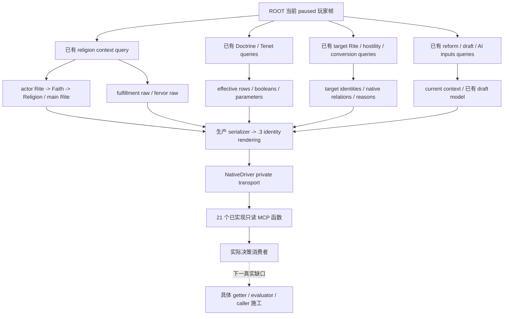
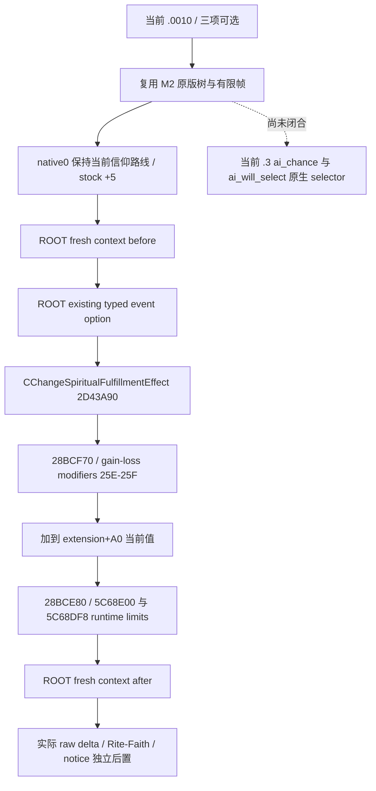

# CK3 1.20.0.3 宗教原生 AI 与只读能力施工入口

## 2026-10-02 最新授权与当前结论

项目所有者本轮明确要求从现在全方位深入宗教研究，并全局撤销此前的宗教暂缓要求。此后不能再用 owner hold 拒绝宗教、信仰、教义、核心教义、热忱或宗教治理研究。旧文档中的暂缓段落保留为历史截点；本专题按最新授权施工。当前任务是原生研究和只读入口规划，实际游戏动作、SDK、状态、发布与统一原生构建仍由 ROOT 执行。

当前 `rite_growth.0010` 的最小观测口已经存在：`ck3_query_player_religion_context_v1` 发布当前玩家的 `spiritual_fulfillment_raw`、`raw_scale=100000`、Rite/Faith/Religion 身份及热忱。因此这次 notice 不需要再构建 DLL、不需要等待完整教义模型，也不需要新建长期返回 null 的字段。已有成功的 `.3` 零值观测与完整 M2 原版事件树可以直接复用；本轮新的效果执行链研究说明源码 `+5` 经过 modifier 和上下限调整，最终净增必须实际观察。

独立专题：

- [宗教身份、教义与 Tenet 的已有原生查询](religion-native-ai-faith-identity-12003.md)：身份层级、getter/RVA、Doctrine/Tenet 读取、八类核心 MCP 的生产调用链与版本边界。
- [`rite_growth.0010` 的原生执行与当前决策](religion-native-ai-rite-growth-12003.md)：原版输入复用、精神满足度执行与 modifier/clamp 链、当前最低材料、AI selector 下一逆向入口。
- [宗教效果材料 getter 与扩展入口](religion-native-ai-effect-material-12003.md)：当前/default 精神满足度、热忱、只读 wire、真实零值样本与下一组件的具体源触点。
- [撤销旧原生授权限制后的实现边界](religion-authorization-native-implementation-boundary-2026-10-02.md)：教育宗教输入与政府观测撤禁后的真实已实现/未实现边界，由另一 owner 维护。

## 冻结输入与现有证据

| 输入 | 本轮复用值 | 含义 |
| --- | --- | --- |
| 游戏 | CK3 `1.20.0.3 Crozier` / Steam build `25652598` | 已冻结，不重新读取或计算 EXE SHA |
| EXE SHA-256 | `94B55397ABB687A3DCD436805A5D885E6BE90FA6C693FEB44A9E3BBEEADE02A6` | 与现 `.3` adapter/query 身份一致 |
| 原生源码 | `4ee2e7558dbc32c69cfa1caaeaf232a287a5ee34` | 本轮盘点读取 immutable `production-source-4ee2e755` |
| v20 DLL | `008ac31847c16de15fe6985f087a5c75f0d6d8f6a3da7701045644230dcbcac7` | 一次四产物 strict build 成功，933 actual input pins；不重复编译 |
| v20 manifest | `artifacts/g2-maintainer-2026-10-02/resume-12003/binaries/native-nonwar-12003-family-chancellor-v20/manifest.json` | compiler inputs、toolchain、63 ON / 6 OFF 的真实账本 |
| 只读函数库存 | `artifacts/g2-maintainer-2026-10-02/resume-12003/religion-native-ai-12003/INVENTORY.json` | exact4ee 的 21 个 MCP 函数、21 个 NativeDriver 对应方法、参数与现有许可条件 |
| 当前事件有限帧 | `artifacts/g2-maintainer-2026-10-02/resume-12003/m2-events/actual-robert-rite-growth-0010-blocker-01/actual-typed-context.json`、`actual-context-and-route.json` | M2 owner 读取实际 finite event/turn；本包不重新采样 |

现有 `.3` context 成功样本为 `artifacts/migrations/2026-10-02/live-preparation/sdk-nonwar-04/176-ck3_query_player_religion_context_v1.json`：actor `29829`、raw date `53169072`、Rite `152`、Faith `23`、`catholic`、精神满足度 raw `0`，scale `100000`。这证明当前 getter/serializer/query 管道曾在真实 `.3` 帧发布合法零值；它不是当前 `.0010` 的 before 或 after。

另有 2026-10-02 08:47–08:48 的 Murchad `.3` context、effective doctrines、current tenets、AI reform inputs、reform context 五项实际观测，回链[既有宗教能力总览](religion_doctrine12002_overview.md)。旧 `.2` 文件名不会自动把真实 `.3` 结果降为不可用；同样，历史 primitive 不自动成为当前 Robert 帧或新宗教动作完成。

ABI comparison 的 core 与 religion-supplement 结果按其实际覆盖条目复用。`0x28BCE40` 当前满足度 getter、`0x243EA90` 热忱 getter不在已读 102-contract expected-region 列表中，不能用该列表的通过数冒写它们各自的静态证明；对应实际 `.3` query 样本与本轮新执行链证据分别记录。未知函数需要有明确 reverse entry，不能要求把旧 ABI 矩阵重新跑一遍。

## 已有只读管道

当前 `.3` adapter 使用已 review 的 Crozier ABI 绑定路径，query 再通过 `RenderCrozierBuildIdentity` 发布真实 `.3` 版本、SHA、schema/backend provenance。`Character+B4` 是 **Rite ID**；actor Rite 与 Faith main Rite 独立，不能改名为 Faith ID，也不能把主 Rite 的教义默认为玩家当前 Rite 的教义。

现 MCP 查询直接进入 NativeDriver/private transport；`service.py` 没有同名宗教聚合方法。因此已有 21 个口并不意味着 turn bundle 已包含完整宗教域，也不意味着所有宗教策略已接线。v20 库存中 17 个宗教/Rite compile options 已经 ON，属于原 63 ON；现有 query 使用相应私有只读许可导出。当前没有新增宏、默认开启动作或新执行协议的必要。

| 已有查询族 | 可读取的决策材料 | 下一消费方式 |
| --- | --- | --- |
| `ck3_query_player_religion_context_v1` | 当前 Rite/Faith/Religion/main Rite、keys、满足度 raw、热忱 raw | 当前 `.0010` 首先用这一口 |
| doctrines / doctrine knowledge / catalogue / tenets | 当前与主 Rite 的 effective Doctrine、定义/参数、Core/personal Tenet 与状态 | 只在决策实际依赖时取相应 rows，不用教义全集阻塞 notice |
| numeric / personal special parameters | 最低热忱、bonus/threshold 与人物参数等既有 typed 输入 | 当前 getter输出保持实际单位，合法 0 不改为 unavailable |
| hostility / conversion terms / choices / inputs / reasons / outcome | target Rite 身份、关系、费用与最终理由等已有组件 | 需要转换/关系决策时使用现成目标参数入口；不能把 target scope 当 current Faith |
| rite governance / members | 当前 Rite 组织、head、成员与治理相关组件 | 依各组件真实 available 状态消费；没有默认假造治理数值 |
| reform context / draft groups / doctrine choices / tenet choices / resource costs / AI reform inputs | 当前/已存在模型、选择与费用、原生 AI controller/schedule 输入 | hidden/current model 与需要 draft 的组件分开；不把 absent window 等同整个宗教不可知 |

全部函数的准确名称、参数和条件见 `INVENTORY.json`；八项核心口的 C++ reader→serializer→mailbox→Python→MCP 文件触点见身份专题。本表是库存摘要，不额外声称所有 21 项都已在当前角色上实机观察。

## 当前 `rite_growth.0010` 的最小闭环

M2 实际 finite 事件为 instance `13`、root actor `29829`、raw date `53222280`。原始 scopes 中 origin Faith、source/new Rite 等仍为 typed opaque 原始值；三项 native option `0/1/2` 已 shown/enabled。事件 stock 和依赖树由 M2 owner 独占冻结，本包没有重复扫描 stock 全树。

| 选项 | 已知 authored 后果与 AI base | 当前材料要求 |
| --- | --- | --- |
| native 0 | `change_spiritual_fulfillment = 5`，AI base `100` | current player fulfillment before/after；当前 Rite/Faith 与事件实例的独立后置 |
| native 1 | 转 new Rite；founder reverse opinion `+30`；recent conversion、court/county 等 cascade；AI base `0` | 只有实际选择转换时才需要目标 Rite/最终转换与后继材料 |
| native 2 | medium piety gain；founder reverse contempt `-15`；AI base `0` | 只有实际选择时才需要 piety 和关系材料 |

立即触发阶段已有创建/改变 Rite 的 effect，不能记为玩家点击的结果。当前 stock 已足以支持 M2 的最小 native0 continuation，AI base `100/0/0` 不冒充已调用 `.3` native AI weighted selector，也不声称全局最优。

现成调用 recipe：

1. ROOT 使用当前已绑定会话中的 fresh public revision，调用 `ck3_query_player_religion_context_v1(expected_revision=<fresh revision>)`。SDK driver 的既有 `allow_private_player_religion_context_query=True`，stdio 的既有开关为 `--private-player-religion-context-query`；这只导出已有只读口。
2. 记录真实 `played_character_id/date_raw`、Rite/Faith/full references、`spiritual_fulfillment_raw/raw_scale` 与 query/frame provenance。capture epoch 是 owner-pump 标识，不能重写为 snapshot revision。
3. M2/ROOT 按已落原版树执行 native0；本规划代理不操作游戏。
4. ROOT 独立查询 fresh after，记录真实 delta、同玩家身份/当前信仰与 notice 消失。stock `5` 不是无条件 `raw+500000`，不能把 preview 指示、ACK 或 immediate 前置变化当成这个后置。

若当前已绑定 query 失败，按实际 `unavailable_reason` 修它的具体 caller/reader/registration；已有 publisher 的合法零值证据与本次源码映射不能被长期空字段替代。若 reading succeeds，立即消费真实值并继续 notice，不增加 doctrine completeness、全域 ABI 或理论限制作为前置。

## 下一包按实际决策缺口施工

| 优先级/触发 | 最短现成或新增入口 | 限定源触点与下一证据 |
| --- | --- | --- |
| 当前 notice 的满足度后置 | 直接用现 context query，已经发布 raw/current identities | 不新增 C++/schema/RPC；ROOT fresh before/after |
| 决策需要满足度等级与默认值/范围 | `Fulfillment Evaluate 0x2B29320`→`GetFulfillmentLevel 0x3181D60`→level definition `+0x1C0`；default getter `0x2BFB4C0` 有独立参数顺序 | 最小扩同 context reader/DTO/serializer/normalizer；先闭合真实 receiver/units，不能套用 current getter 的 callback ABI；只验证新 getter 一次 |
| 决策需要热忱未来增益与保护机制 | 已有 current fervor 与 numeric parameters；沿 `0x243EE24`、`0x243EF4B`、`0x243F626` 已知 consumer slices 闭合 final gain/protection | 同现 query 加必要最终量/原因；库存字段存在不等于演化预测已经发布 |
| 实际目标信仰/仪式需要解析 | 先用已有 hostility/conversion choices 的 target Rite 参数与 identities | 如事件 opaque scope 还不足，再沿真实 resolver补该 scope 的 typed identity；不创造全图扫描前置 |
| 需要解释原生事件最终选择 | 当前 `.3` 的 `ai_chance/ai_will_select` reflection→option evaluator→weighted selector | 旧 `.19` selector 不能用；具体当前入口与虚线边界见 rite-growth 专题。目标是发布真实计算输入/结果，不用 stock base 冒充 native final |
| 宗教教育、政府/适配器与旧事件定义迁移 | 已授权 cleanup 的真实未实现入口；旧 `fervor.1002`/`court_chaplain_task.0313` 仍是 source migration pending | 回链 cleanup 专题/报告；owner hold 已撤，缺实现不能标成完成，亦不阻挡现成 context 使用 |

潜在原生 source 修改先形成独立 scratch 包和最小具体字段合同，交 ROOT 统一 source freeze/build。ROOT 新包实际需要 native 改动时才编译；纯消费者或许可导出变化不触发 DLL 重建。验证只覆盖新增 getter/caller 的真实 receiver/collection/合法零值、nullptr 和 typed结果一次，既有模型、query、ABI 与实际样本直接复用。

## readiness 与交付范围

本包新增四份研究专题和机器可读只读库存，状态是 **research**。已有 `.3` context/doctrine/tenet 等成功样本保持其 **production-live primitive** 资格；v20 build 保持其既有静态交付。本包没有执行新的 SDK query、游戏动作、窗口输入、配置、构建、旧 ABI/fixture/CLI 测试或 Git；没有新增 M2/G2/M7 complete、游戏日或完整宗教 OODA credit。

文档由本 native 规划 owner 独占新增；M2 原版事件解析/消费者、Python 撤禁、原生撤禁各有独立 ownership，未编辑这些共享源。发布、日报/周报合并和后续实机由 ROOT 处理；相关源码与测试不被这份库存代替。
