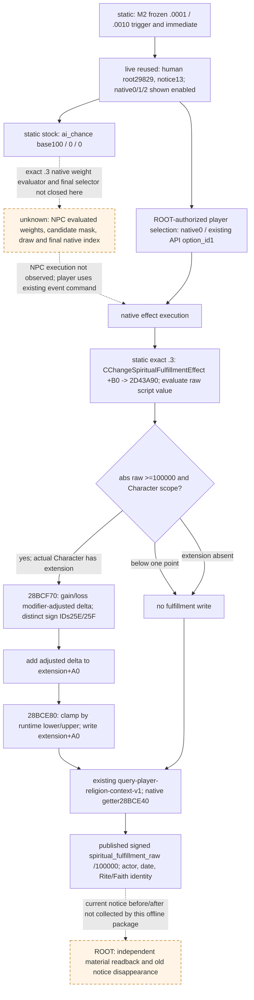
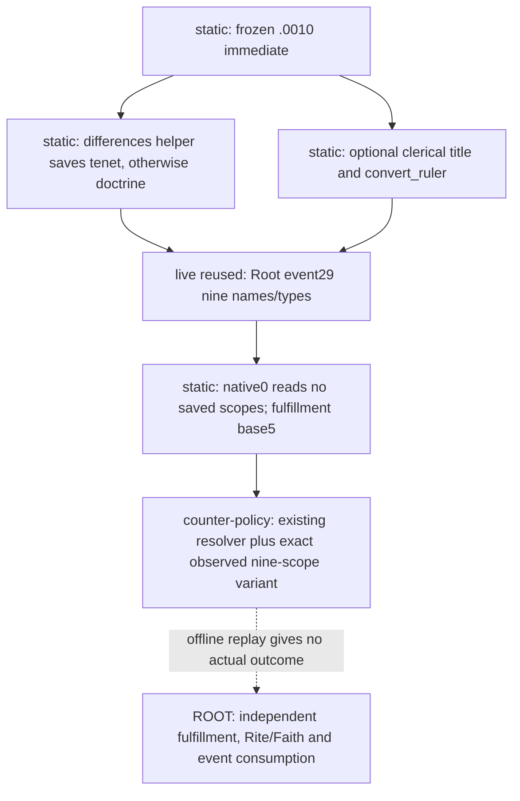

# CK3 1.20.0.3：rite_growth.0010 原生最终效果与最小观测

状态：**`research`，offline-only**。本页记录当前自然通知所需的原生执行语义、已发布的观测入口和未闭合的 AI consumer；不实现 counter-policy，不执行游戏动作，也不把源码预期写成实机结果。宗教研究已由项目所有者开放；历史索引中的暂缓说明不适用于本工作包。

本页复用 M2 owner 的 stock 提取，不重复全量宗教解析。M2 的原生 stock 树与当前选项策略仍由 [vanilla-event-knowledge-registry](vanilla-event-knowledge-registry.md) 和下列 source artifact 维护。本页仅补它们需要的 exact-build 原生效果与读回边界。

## 冻结与本次问题

- 游戏：CK3 **1.20.0.3 Crozier / Steam build 25652598**，EXE SHA-256 `94B55397ABB687A3DCD436805A5D885E6BE90FA6C693FEB44A9E3BBEEADE02A6`。只读取已有冻结 `artifacts/migrations/2026-10-02/installed-build/binaries/ck3.exe`；复用 [intake-build-identity.json](Z:/ck3_mod_rewrite/artifacts/migrations/2026-10-02/intake-build-identity.json)，未重新核对安装、SDK、进程或旧 ABI。
- 原生 source baseline：v20 的 `4ee2e7558dbc32c69cfa1caaeaf232a287a5ee34`；严格构建 GREEN 复用 [v20 manifest](Z:/ck3_mod_rewrite/artifacts/g2-maintainer-2026-10-02/resume-12003/binaries/native-nonwar-12003-family-chancellor-v20/manifest.json)。本包不重建，不修改 flags、旧缓存或冻结树。
- 研究目的：`engine-transition` 和 `player-legality`。当前 human played actor 是 `29829`；founder / `bg_override_char` 是 `36108`，不能将 founder 的 immediate 创立、改宗和传播过程记成玩家 option 的结果。
- 当前事件身份：`rite_growth.0010` / instance `13` / calculated ID `3910010`；实际 paused `date_raw=53222280`，native revision `19`，public revision `6`。这组身份来自 M2 保存的有限文件，未读取大的整局 result。
- 停止条件：确认能解除这次 notice 的最小观测，冻结一次新效果链，明确 AI selector 的现有证据边界后交付。没有被动运行或采样窗口；新 paused readback 由 ROOT 独占执行。

## 当前 notice 已知的最终门

`static-confirmed` stock：`events/religion_events/rite_growth_events.txt:73–413`，major trigger 是 `faith = scope:origin_faith`；`.0001` 的 source-rite / founder 选择与 `.0010` immediate 的创立、转换、传播都发生在玩家看到通知前。原版没有 authored `after` block。全部源码、依赖和中英文见 M2 冻结文件，本文不再次推导 conversion cascade。

`live-confirmed, reused` 当前 presentation：native indices `0/1/2` 都是 `shown=true`、`enabled=true`、非 fallback、非 cancel。选项 0 的已有 indicator 只证明 `fulfillment/increase`，其 magnitude 不可用，`complete_effect_set=false`；该 indicator 不是完整效果预览。

| authored native index | M2 已冻结的 stock 效果与 AI 输入 | 当前决策所需的新增观测 |
| --- | --- | --- |
| `0`，源码 326–332 | `change_spiritual_fulfillment = 5`；`ai_chance` base `100`；保持当前 Rite / Faith | 当前玩家精神满足度的真实 before / after；当前身份及原事件消失读回 |
| `1`，源码 334–399 | 转入 `scope:new_rite`，founder 反向 opinion `+30`，domain/court cascade；`ai_chance` base `0`；非宗教 head 的 authored trigger | 如果以后选择此分支，才需要真实 new-Rite 身份、转换及各受影响对象的后置状态 |
| `2`，源码 401–412 | medium piety（源码值 `100`），founder contempt opinion `−15`；`ai_chance` base `0` | 如果以后选择此分支，才需要 piety 和该方向的 founder opinion / modifier 后置状态 |

当前选项 0 没有读取 `differing_doctrine`、new-Rite 比较、county development、Faith fervor 或 doctrine 相容性。当前 stock 和实际 shown/enabled 已经够 M2 推进这一 bounded choice；不需要将这些未用输入列成新的前置 gate。`faith/rite/doctrine/value` saved-scope 的 typed identity 仍 opaque，不把它们宣称已经解析。

原生 stock 权重与原生最终选择必须分开：`100/0/0` 是 **authored AI weight input**，不是玩家效用、接受概率或当前 AI 已选择 option 0 的证据。

## 独立原生树



图中的人类分支描述已授权动作的验证入口，不是本页实施的新策略。source effect 与 native final writer 有确切静态证据；当前 notice 的效果结果仍需要独立 paused artifact。

## exact .3 精神满足度执行链

本次直接读取冻结 PE 的新函数，按 `.pdata` 完整区间与 Capstone 指令审阅；不调用其中任何函数。`CChangeSpiritualFulfillmentEffect` 的 type descriptor `0x5A77DC8`、COL `0x4EC6B70`、主 vtable `0x4849B28`，COL `this` adjustment 为 `0`。vtable `+0xB0` 的实际指针是 `0x2D43A90`。字符串 `change_spiritual_fulfillment` 在 `0x46DC710`；注册函数 `0x5DAA20` 的 `0x5DAA31` 指令引用它。vtable `+0xB8 -> 0x2D43C30` 是独立的效果描述路径，不将描述调用冒充写回。

**`static-confirmed` 实际执行：**

1. `0x2D43A90` 对 effect `+0x50` 用 `0x9D7060` 求 raw script value；对该值取绝对值，`abs(raw)<100000` 直接返回。因此小于 1 个语义点的 authored change 在此入口不执行，不应以普通浮点模型重建。
2. root scope 的类型必须是 Character `4`，payload `+0x8` 是 full CharacterID；按 storage mask 查找后仍检查 Character `+0x18` 的完整身份。其它 scope 使用原生 absent/null-object 路径。
3. 实际 Character `+0x1C8` extension 不存在时，该入口进入名字/错误输出路径并返回，不创建 extension，也不写精神满足度。存在时调用下面的 native delta evaluator，再从 extension `+0xA0` 取当前值相加。
4. `0x28BCF70(Character*, out*, signed raw_delta)` 先检查 Character `+0x1A5`；该 byte 非零时返回 zero delta。该 byte 的业务名称本页 **unknown**，不改名成已证明的死亡、囚禁或 AI 门。
5. 常规分支通过 `0x28C3AE0` 取 native character modifier view，在 view `+0x68` 上调用 `0x2303700`。非负 raw delta 使用 modifier type `0x25E`，负 raw delta 使用 `0x25F`；把读到的 Q100000 modifier 加 `100000` 并下限至 `0`，再作原生定点乘法返回调整后的 delta。两个 type 与具体 authored modifier key 的注册对应本页未闭合；字符串 `spiritual_fulfillment_gain_mult` / `spiritual_fulfillment_loss_mult` 分别位于 `0x46DCABA` / `0x46DC972`，仅是下一步定位锚点。
6. `0x2D43C02` 把调整后的 delta 与 extension `+0xA0` 相加，`0x2D43C0C` 调用 `0x28BCE80(Character*, signed target_raw)`。
7. `0x28BCE80` 读取下限 slot `module+0x5C68E00` 和上限 slot `module+0x5C68DF8`，以 signed comparison 将 target clamp 到区间，再写 extension `+0xA0`。它随后对当前玩家发 UI 更新，不把该通知当物质验证。

由此：**源码 base `5` 不保证实际净增 `500000` raw**。modifier、zero-delta 分支、extension 是否存在与最终范围都会影响结果。当前 bounded option 可以继续由 ROOT 执行，并把真实 before / after 与实际 delta 留档；不为验证这一低值 notice 去采集所有 trait modifier 或完整 Faith 系统。

### 新 PE 证据的完整 span pin

这些是本次新研究的 exact .3 字节 pin，不是旧 102 ABI 验证结果；旧 102 expected regions 不覆盖 `0x28BCE40` / `0x243EA90`，不能借其 PASS 宣称这两个 getter 已被该比较证明。

| 原生区间，end exclusive | 证据范围 | SHA-256 |
| --- | --- | --- |
| `0x5DAA20..0x5DAAC4` | effect keyword registration 完整函数 | `a02d67b3a8757b367d752508da2a6efc8ba4e44ed0f6dbe2bbe87ceb3f829322` |
| `0x4849B28..0x4849BE8` | 主 vtable 24 slots；含实际执行 / 描述两个指针 | `0c84b2f5d304fd6542e046b6c85f4f5e1ee1adb92741d915502fa7c373522dd8` |
| `0x2D43A90..0x2D43C22` | 实际 effect execution 完整函数 | `84fea9eccb2b5120e7594e9d19bfbaca03c2fa928b103b8b68b97e3da14069f8` |
| `0x2D43C30..0x2D43D29` | 独立 effect description 完整函数 | `fccbb95e5a9563a8fec666350b47bd44918c4d8079bd24a5c6dd9fc016a59246` |
| `0x28BCF70..0x28BD08C` | 原生 modifier-adjusted change 完整函数 | `6311c97877e6d9644093c6486684df17b1bc7b1ee1ba0d887af05ac01d8b4b41` |
| `0x28BCE80..0x28BCF16` | 原生 final clamp / storage writer 完整函数 | `b6e7ad42973ad86130296bf6ed4f4c6d38deb4ba444f25a2eb4556de4d398626` |

以下 exact instructions 是语义边的直接证据；对应 PE 与完整区间 pin 可以重取，不需要凭反编译命名判断：

```text
2D43AD7: 48 3D A0 86 01 00          abs(raw) cmp 0x186A0; jl 2D43C11
2D43AE6: 66 83 38 04                 cmp word ptr [rax],4
2D43B31: 48 83 BB C8 01 00 00 00    cmp qword ptr [rbx+1C8],0
2D43BEE: E8 7D 93 B7 FF             call 28BCF70
2D43C02: 48 03 90 A0 00 00 00       add rdx,qword ptr [rax+A0]
2D43C0C: E8 6F 92 B7 FF             call 28BCE80
28BCF7F: 80 B9 A5 01 00 00 00       cmp byte ptr [rcx+1A5],0
28BCFB9: 8B C7; 0F 98 C0            raw sign -> sets al
28BCFBE: 44 8D 80 5E 02 00 00       lea r8d,[rax+25E]
28BCFC5: E8 36 67 A4 FF             call 2303700
28BCFD4: 48 05 A0 86 01 00          add rax,100000
28BCFE4: 48 85 C0; 48 0F 4F F8      test multiplier; cmovg rdi,rax (else 0)
28BCE95: 48 8B 05 64 BF 3A 03       mov rax,[module+5C68E00]
28BCE9C: 4C 8B 05 55 BF 3A 03       mov r8,[module+5C68DF8]
28BCEA3: 48 3B D0; 7C 0A            target below lower -> lower
28BCEA8: 49 3B D0; ... 49 0F 4F C0 target above upper -> upper
28BCEB2: 48 89 81 A0 00 00 00       mov [extension+A0],rax
```

限幅 slot 是运行时 define 值；本页未读取游戏进程，磁盘槽值不能冒充当前有效上下限。范围实际数值未知不阻断已发布 getter 的直接结果。

## 可直接使用的 query 与最低字段

已有接口 **`ck3_query_player_religion_context_v1`** / native step **`query-player-religion-context-v1`** 已发布；当前 v20 candidate 对应 compile flag 已 ON。无需新增 publisher、schema、flag、SDK 口或 doctrine gate。

链路和 source 文件（相对 repo root；实际审阅 frozen v20 source）：

| 层 | 现有 source 与真实职责 |
| --- | --- |
| domain reader | `ck3_autonomous_player/native_bridge/include/xar_bridge/ck3_12002_religion_context.hpp`、`src/ck3_12002_religion_context.cpp`：actual played actor → `Character.GetRite` `0x28D2F90` / `Character.GetFaith` `0x289E750`；`Character.GetSpiritualFulfillment` `0x28BCE40` 返回 signed Q100000，extension 缺失走原生 default，不写伪 zero |
| native mailbox / serializer | `native_bridge/include/xar_bridge/ck3_12002_religion_mailbox.hpp`、`src/ck3_12002_religion_mailbox.cpp`：现有 paused application-main，真实 query stamp、date、actor、native snapshot revision；`SerializePlayedReligionContext12002` 保留 zero / signed / null |
| exact .3 selection / wire identity | `native_bridge/include/xar_bridge/ck3_12003_adapter.hpp`、`src/ck3_12003_adapter.cpp` 与已有 reviewed adapter seam；内部 source 保持 `.2` 命名，外部 `RenderCrozierBuildIdentity` 输出真实 `.3` EXE、schema/backend provenance |
| production Python consumer | `ck3_autonomous_player/src/xar_autoplayer/bridge/player_religion_context_private_transport.py`：明确接纳 exact `CK3_12003`，检验同 queried frame 的 actor/date，把 native context signed raw / full IDs 原样发布 |

getter 的结构与 default 分支旧研究见 [religion-context](ck3-1.20.0.2-religion-context.md)。本页不复跑该旧 verifier，也不把旧 `.2` 静态结论泛化为 `.3` 全域验证。下列已有真实 `.3` query 独立证明该 provider primitive 已可读取这些输出。

`live-confirmed, reused` [既有 actual SDK packet 176](Z:/ck3_mod_rewrite/artifacts/migrations/2026-10-02/live-preparation/sdk-nonwar-04/176-ck3_query_player_religion_context_v1.json)，SHA-256 `66d634aa8cba6aec847cd3be1241ba4580efa8a1f140f29c1be31b46dc9b5854`：

- `schema=ck3_12003_religion_context_v1`，实际 `.3` SHA、`status=observed`、`available=true`；
- actor `29829`，`date_raw=53169072`，`snapshot_revision=2`，capture epoch `873`；
- Rite `152`、Faith `23`、Religion `8`、main Rite `152`，`faith_key=catholic`；
- `spiritual_fulfillment_raw=0`、`raw_scale=100000`，Faith fervor raw `4336689`。

这个历史 packet 不是当前日期 `53222280` notice 的 before。ROOT recipe：取 fresh 当前 snapshot → 用同一现有 query 的当前 public `expected_revision` 请求 before → 按已授权原生 index `0`（既有 API `option_id=1`）选择 → 重新取 fresh paused snapshot → 同一 query 请求 after。每次请求由现有 transport 转换、核对 native revision；不要把 public revision、native revision、capture epoch 混成一个字段，也不要照搬历史 revision `2/3`。

最低可用于此次决策和结果验证的**真实非空**字段是：

| 字段 | 本次用途 |
| --- | --- |
| exact build / schema / `available` / `status` | 识别这次查询的生产 reader 与成功状态 |
| `played_character_id`、`date_raw`、`snapshot_revision` | 绑定实际 before / after 玩家与 paused frame |
| `rite_id`、`faith_id` | 独立检查“保持当前信仰/礼仪”的实际身份；无需 target doctrine 或转换 gate |
| `spiritual_fulfillment_raw`、`raw_scale=100000` | 独立 material before / after；记录实际 `after−before`，base `5` 单独保留为源码输入 |
| 现有 snapshot 的 old instance `13` 是否仍 current / outstanding | 独立检查原 notice 已消费；ACK 不替代该检查，也不替代精神满足度 |

无需新增 `development`、完整 modifiers、全部 Faith / Rite catalogue、fervor 或 doctrine 字段。已有 context 仍同时返回其它观察；只有上表字段承担此次 option 0 的验证义务。读取失败只能报告实际原因；不为本页创立长期全-null readiness schema。

## native AI final choice：明确未闭合的最短入口

当前 stock 和 actual presentation 只提供 `ai_chance=100/0/0` 与 shown/enabled。历史 [events-and-interactions](events-and-interactions.md) 中 `0x33E71B0` selector / `0x33E7E60` weight helper 的完整树**仅绑定 1.19.0.6**，不能照搬 RVA 或宣称 `.3` 的最终选择已证明。

本次一次 bounded offline locator 已尝试历史 selector 114-byte / helper 94-byte 指令前缀（仅 call/jump/RIP displacement wildcard），在 exact `.3` 均无匹配；没有用近似地址补成 ABI。原生 `.3` 入口具体锚点是：

- `ai_chance` keyword RVAs `0x4705628` / `0x47FE397` / `0x47FE499`；
- `ai_will_select` keyword RVA `0x47078F8`；
- 当前 notice 的实际 CEventOption authored native indices 0/1/2，由已经发布的 event-window reader 读取。

若未来要改善 NPC religion option prediction，最短可施工 scope 是沿上述 parser keyword registrations定位 `.3` CEventOption 的 compiled AI weight 字段，再定位同一 option 的实际 weight evaluator caller与 final selector、candidate mask / draw consumer。只研究同一事件的三项，发布 native evaluated weights 时必须保留实际 final evaluator 的结果；随后才做 NPC passive outcome 校准。当前人类 option 0 的选择和材料验证不依赖该未施工工作，也不等待它。

## 来源与交付边界

| 复用文件 | SHA-256 / 证明范围 |
| --- | --- |
| [M2 stock-source-exact-12003.json](Z:/ck3_mod_rewrite/artifacts/g2-maintainer-2026-10-02/resume-12003/m2-events/actual-robert-rite-growth-0010-blocker-01/source-evidence/stock-source-exact-12003.json) | `7ac4375fb419a4ace5f41c8b29d03b3f734b470d9eba8db3f5c0e69cc86fe1ae`；exact `.3` stock、37 个最小 conversion 依赖与 EN/SCH 源 pin，不含 native 执行或新 live |
| `rite_growth_events.txt` raw source / `.0010` token block | raw file `d09c0eb94e1a81c0d456f55c049004d7ef1ebe38464a1274cf151d0214418895`；block `ecdb6ad5179b47cffc2114a3030a1cce5f9231ecec29ced3dc4b64a961ab4e42`；本页复用，未重复冻结 |
| [actual-typed-context.json](Z:/ck3_mod_rewrite/artifacts/g2-maintainer-2026-10-02/resume-12003/m2-events/actual-robert-rite-growth-0010-blocker-01/actual-typed-context.json) | `d14bffa3a0bddc0d7d14ad38a2379c21d1d6781053d51ab5de677059957f6ff4`；当前玩家 / 事件 / saved scope / presentation，6222 bytes |
| [actual-context-and-route.json](Z:/ck3_mod_rewrite/artifacts/g2-maintainer-2026-10-02/resume-12003/m2-events/actual-robert-rite-growth-0010-blocker-01/actual-context-and-route.json) | `6e37ab6551d55eccbb6bcc54b6bec6667e1886a10141c27662cb50a251f8a4a8`；当前 finite route/frame，94814 bytes |
| [M2 native-source-tree.md](Z:/ck3_mod_rewrite/artifacts/g2-maintainer-2026-10-02/resume-12003/m2-events/actual-robert-rite-growth-0010-blocker-01/source-evidence/native-source-tree.md) | M2 负责的独立 stock trigger→immediate→major→options 树；本页链接，不改写 |

本工作包只新增此文档：没有代码、Git、build、cache、flags、fixture/tests、SDK、游戏、pipe、窗口或共享索引修改。已发布 religion context 的历史成功属于 **production-live primitive**；本页新 effect / AI 研究本身保持 **research**。当前 `.0010` before / after、实机选择结果和后续 normal run 由 ROOT/M2 保存，本页不宣称已完成宗教 OODA、M2、M7、G2 或整局游玩。

当前可施工小 scope 是 **零 native publisher 改动，M2 leaf 消费现有 fulfillment query 的实际 before / after**。后续如出现真实 outcome 差异，再针对具体失败扩充同一 observer；本次不提前展开未影响这次可选事件的系统。

## 2026-10-06：实际 event29 的九 scope 变体

本次仍绑定 CK3 **1.20.0.3 / Steam25652598** 与上文 EXE SHA，复用已冻结 stock；不新增 PE 研究。ROOT 的原 Robert29829 普通战役 R0047 在 paused raw53265288 出现 `rite_growth.0010` / instance29 / calculated4350010 / runtime6859。保存 h9060 后的 [022 typed context](Z:/ck3_mod_rewrite_process_assets/g2-resume-20261006/gameplay-responses/022-event29-context-after-save.json) 是 native18/public19，实际九 scope 为 `origin_faith:faith`、`source_rite:rite`、`founder:character38699`、`bg_override_char:character38699`、`rite_growth_target_share:value`、`new_rite:rite`、`differing_tenet:tenet`、`founder_clerical_title:landed_title18382`、`convert_ruler:character34092`。三项 native0/1/2 均 shown/enabled。Faith、Rite、Tenet 和 value 的 identity 仍 opaque，角色/头衔 ID 只记录该次实读，不成为固定匹配值。

`static-confirmed`：冻结 `.0010` immediate 的源码240行调用 `rite_growth_resolve_differences_effect`；该 helper 先清除 `differing_tenet`/`differing_doctrine`，按 prohibited → known → 其它的顺序寻找新 Rite 独有 tenet，找到时保存 `differing_tenet`，只有未找到才进入 founder doctrine 分支。源码242–249的 archbishop/clerical-region 条件保存 `founder_clerical_title`；283–291的 clerical-region county-holder 传播分支保存 `convert_ruler`。这些是通知前的 founder immediate，不是玩家选项效果。实际九 scope 与这些生产分支相容，但单次 scope 快照不证明原生随机 roll 或全部传播结果。

原 native0/API1 保持原有含义：326–332行只有 `change_spiritual_fulfillment=5` 与 `ai_chance.base=100`，没有 dereference 上述 scope，也没有 authored `after`。因此现有三选项选择可复用；新合同只增加这次已观测的精确九名九型变体，保留原七名七型 `differing_doctrine` 基础合同，使用现有 scope-variant resolver。Rite/Faith 的真实身份、fulfillment 实际 delta 与旧事件消失继续由 ROOT 的独立读回判断；opaque extras 不用于选择 native0。



施工前 [SOURCE-QUERY-PLAN-02.json](Z:/ck3_mod_rewrite_process_assets/g2-background-round5-20261006/rite-growth-observed-scope/SOURCE-QUERY-PLAN-02.json)、[native plan](Z:/ck3_mod_rewrite_process_assets/g2-background-round5-20261006/rite-growth-observed-scope/native-research-plan-02.json) 与工具生成的 [研究树](Z:/ck3_mod_rewrite_process_assets/g2-background-round5-20261006/rite-growth-observed-scope/source-research-graph-02.md) 已落盘；工具只核对记录和文件，不证明语义或授予实机权限。初始 plan 将 differences helper 锚点误写为230，已在02改为240，原 attempt 保留；策略修改前完成更正。

新回放使用022的原 context，不伪造 opaque payload 或 snapshot。真实 authored `option_count=3` 来自 [010 movement result](Z:/ck3_mod_rewrite_process_assets/g2-resume-20261006/gameplay-responses/010-movement-day-04.json)，同事件29/actor/raw但 native17/public18；其后 ROOT 正常保存而未选择，再查询022。这是相邻真实观察，**不是同一个 native revision 的证据**。回放仅证明新合同能消费该实际形状；本包不执行游戏、动作或物质验收，不增加游戏日、完整宗教能力或新 live 信用。

离线资格：唯一新增 `test_actual_event29_nine_scope_replay_keeps_native0_and_opaque_payloads` 于 2026-10-06T02:27:59+08:00 首次 **1/1 GREEN**（unittest 0.172s，进程0.647852s）。新8596B夹具从022原 context直接提取，标注010的相邻 authored count；现有 `tools/replay_vanilla_event_research.py` 调生产 policy/registry，返回 `recommended`、native0/API1、failed_checks空，material_plan因未提供 snapshot保持 `not_evaluated`。测试也确认原七 scope基础合同仍在；没有重跑其旧回放。实际命令、输入来源与日志哈希见 [new-case-01.json](Z:/ck3_mod_rewrite_process_assets/g2-background-round5-20261006/rite-growth-observed-scope/new-case-01.json)。新识别合同为 **static-ready**，不将 ROOT 独立手选结果记作新策略实机验收。
