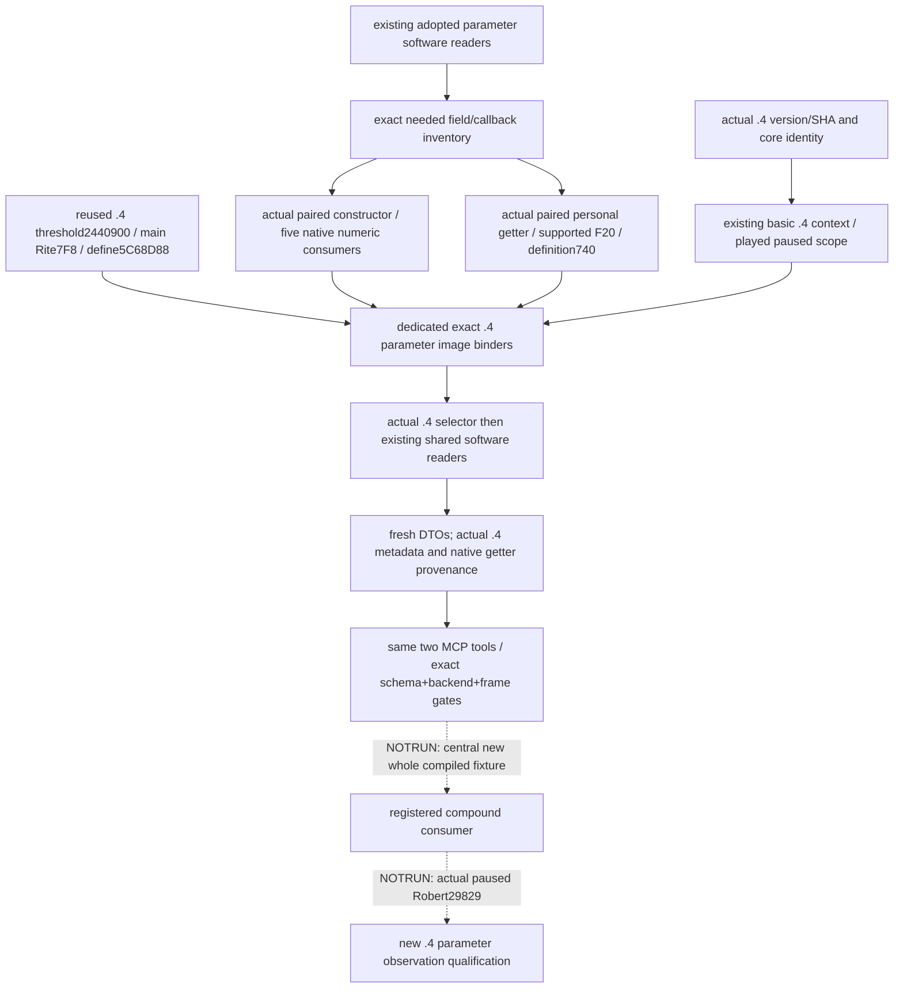

# Existing numeric and personal parameters — CK3 1.20.0.4 migration

Source plan frozen **2026-10-07 03:28:08 Asia/Shanghai**, before implementation,
against joint source `66cfb479801f0fc9f9fd518c7705c807e640cc4b`. Actual build is
**1.20.0.4 / Steam25734779 /
98702F88A547CDE2EAF29A85F93B85F68EE4CF8148336A4F7AFAEB75319DD518**.
This is migration of the two existing enabled read-only parameter tools. The
old `.2`/`.3` source and qualifications remain historical; new `.4` native
bindings, compiled packets and paused Robert29829 evidence receive their own
qualification. No new policy, action or arbitrary-character input is added.

The adopted numeric software reader publishes current and Faith-main Rite
effective cache values independently: minimum fervor, holy-site gain, fervor
gain, heresy protection and threshold adjustment. The same existing query also
publishes the final native Faith heresy threshold. Cache zero does not prove
authored absence; minimum-fervor `-1` remains unset. Personal parameters publish
the complete supported token registry with true and known-missing false values
from the player's owned personal Tenets; Rite parameters and Character extra
Tenets remain separate observations.

| Input | Current source boundary | Actual `.4` evidence / remaining dependency |
| --- | --- | --- |
| Played Character/core, Rite, Faith and main Rite | Existing paused played scope | Reuse actual `.4` basic `BindReligionContextImage12004` and core proof. |
| Five numeric cache fields | Rite `+7D0`; relative `+C/+10/+18/+20/+28` | Actual `.4` source uses `7DC` i32, `7E0` i64, `7E8` i64, `7F0` i32 and reused `7F8` i64; constructor explicitly writes minimum `-1`. |
| Final Faith threshold | Native getter and scalar define | Existing basic exact `.3` `2440920` → `.4` `2440900`, complete84B; main Rite `+7F8` and reached define `5C68D88` retained. |
| Personal collection | Character `+1C8` → owned Tenets `+88` | Actual complete getter `.3` `28BD090` → `.4` `28BD070`; actual Evaluate calls this getter and reads pointer/count/stride. |
| Supported parameter tokens and owned definition membership | Tenet database `+F20`; definition `+740` | Actual validation prefix `.4` `2B2BC10` gets database via `A154B0`, then `+F20`; actual Evaluate `2B2BCF0` checks owned definition `+740` through mapped membership. |

Shared proof root is
`Z:/ck3_mod_rewrite_process_assets/g2-migration-20261007/faith-tenet/implementation-caa4/`.
`basic-map/BASIC-MAPPING-CLOSED.json` contains the actual threshold row and
`basic-map/leaf8/FaithHeresyThreshold-DETAIL.json` retains both complete decoded
bodies. `tenet-map/SOURCE-READY.json` closes common database, identity/string,
Character extension and personal/extra collection layout inputs. The legacy
`.2` topic's entry names are discovery seeds, not `.3` evidence relabelled.
Only the named reached parameter spans may be sent to the sole shared mapper;
held overlaps are reused and every newly read/duplicate byte remains in the
operand ledger. There are no hash, whole-image, metadata-wide or xref scans.

This lane owns new `ck3_12004_religion_parameter_bindings.hpp/.cpp`, this topic
and its operand ledger, and exactly the two Python modules
`player_religion_numeric_special_parameters_private_transport.py` and
`player_religion_personal_parameters_private_transport.py`. The new image
binders return existing software binding/context types. Approved APIs cover
numeric cache, Faith numeric final and personal parameter binders plus actual
`.4` played readers. No `.4` SHA is passed to a legacy whole image binder.
Parent owns existing mailbox routing, whole query composition, serializer
packet fixture, shared adapter/CMake, Git index and commit. The basic Faith
binder/profile remains owned by its original agent.

Python changes add exact `CK3_12004` to the two existing tuple/backend/frame
gates. Shared `private_native_schema` already selects the correct `.4` prefix.
No captured wire is retagged. The final DTO's `native_getter_rva` must publish
actual `.4` `0x2440900`; changing the build prefix alone would preserve a stale
old getter provenance field.

At **2026-10-07 03:42:39 Asia/Shanghai**, the eight exact source blocks had
complete instruction/edge equality and their actual field/callback roles were
decoded. A ninth actually reached `A154B0` registry accessor was entirely
cache-reused, closing the returned Tenet database slot before `+F20`. This is
direct source-use closure, not runtime-ordinal identity alone. The minimum
fervor setter leaf had no containing `.pdata` record; two adjacent retained
gap boundaries agreed on its finite candidate before decoding. The first
metadata miss remains recorded. No neighbor body, full merge/rebuild, generic
logger or fallback allocator source was expanded.

The actual new captures total **1,722 B / 16 reads**: 861 B from exact `.3` and
861 B from exact `.4`; duplicate bytes0. The reached accessor reused87 B/build
from the shared cache, **174 B / two cache reads**, with zero extra capture.
Common basic/Tenet and threshold proof remains reused source dependency credit,
not a second capture or a new qualification. Proof and cost receipts are in
`C:/codex-ck3-background/packets/religion-addons-12004-migration-20261007/parameters/`
under `map01/FAMILY-MAP.json`, `map02-receiver/FAMILY-MAP.json` and
`SOURCE-READY.json`. The preserved named historical metadata path misses and
cmd text-filter over-output are source/coordination attempts, not capability RED.

Readiness at plan freeze was **research; source work in progress**. The six
owned files now form a **source-ready implementation candidate / FIRST
NOTRUN**. The exact `.4` numeric/personal factories and played wrappers are
complete; the two Python leaves admit the matching `.4` schema/backend/frame
tuple while preserving `.2`/`.3` behavior. The new final serializer publishes
actual getter `0x2440900`. A scoped diff check passed on the two tracked Python
edits; no build or test was run. No null placeholder completes these providers.
All builds, tests,
application imports, FIRST and game operations are **NOTRUN/0**. Parent/Root
will qualify one genuinely new whole fixture and the actual paused original
Robert campaign; historical live parameter reads do not grant `.4` credit.
