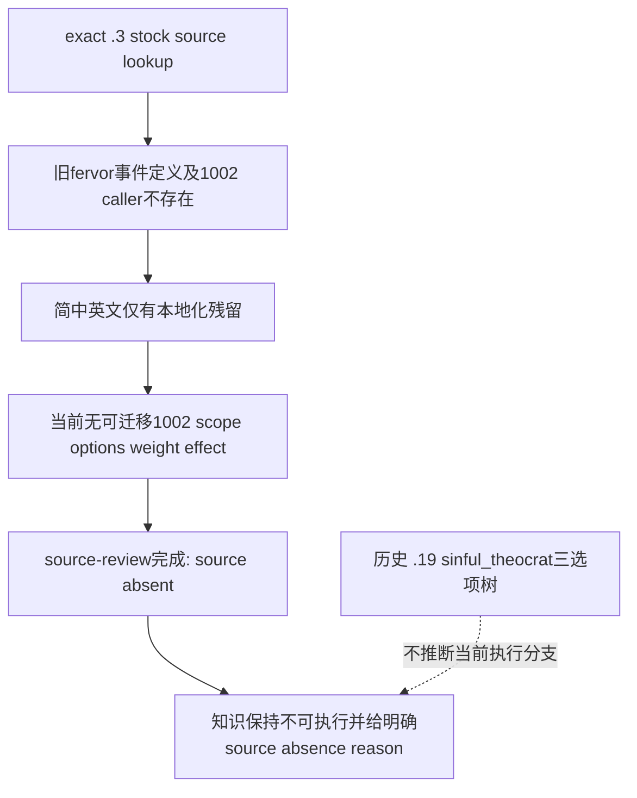
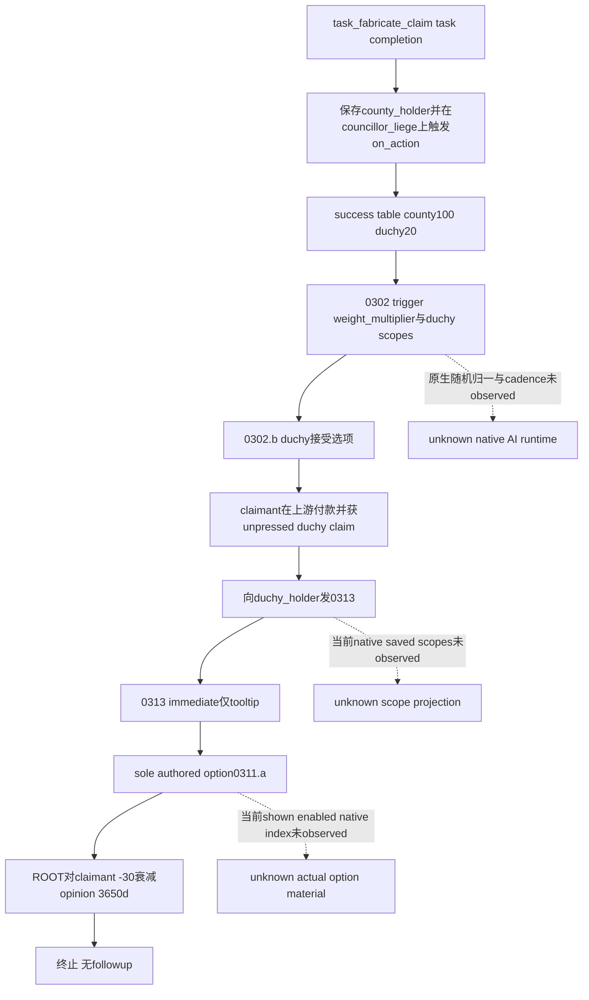

# 普通宗教事件来源迁移：1.20.0.3

2026-10-03，项目所有者已全面开放宗教域。按 [原生 AI 入口](README.md)先审阅 exact-build 原版来源，当前只处理先前因 owner policy未审的 `fervor.1002` 与 `court_chaplain_task.0313`。CK3 **1.20.0.3 / Steam25652598**，EXE SHA-256 **`94B55397ABB687A3DCD436805A5D885E6BE90FA6C693FEB44A9E3BBEEADE02A6`**；当前 stock root为 `Z:/SteamLibrary/steamapps/common/Crusader Kings III/game`。真实 .2 archive为 `artifacts/migrations/2026-09-30/post-update-1.20.0.2/installation/game`，对应 `.2 / Steam25588574`、EXE `AE1BA6FF060BA603842F6F4A2DED0AF4B7D3666B3DD271F75FB01B0DA8E81B2D`。

本包 file-only，不操作 game/SDK/pipe/state/Git，不重跑旧195suite，不强制触发事件。当前建设 war1/army1 hold直接复用，宗教源码审阅不授权建设支出。初次source-review草案阶段仅写本专题；随后ROOT正式授权建设代理独占最小migrator、builds和两层source compatibility/index/review JSON及迁移测试，已经完成下述生产只读迁移。ROOT仍独占Git发布/SDK，中央报告由ledger合并。现有历史失败和旧版观察保留，不改称新版本实机。

## 实际迁移入口与已复现的待审状态

投影前 `.2` 与 `.3` compatibility两条事件行都为 `source-review-pending`；当时production `query_vanilla_event_knowledge_v1(key, "1.20.0.3")` 对两条都实际返回 `unavailable/event_source_migration_pending`。这次一次离线 production知识查询保存在 `artifacts/g2-maintainer-2026-10-02/resume-12003/m4-construction/religion-event-source-review-20261003/REGISTRY-BEFORE.json`；table inputs和旧`.19`既有知识另存 `REGISTRATION-INPUTS.json`、`LEGACY-REGISTERED-CONTRACTS.json`。Before失败原样保留，当前after结果另存下文implementation包；没有生产执行leaf或新paused事件被创建。

`migration_1_20_0_3.migrate_event_knowledge` 首先调用 `.2 migrate_previous`，其不available即原样返回。因此只更新`.3`行不会解除这个真实early unavailable；正式投影处理了两层metadata。投影前 `.2/.3 source-index` 各192条，均未含这两个key；不是两者都没有新版本source。如下两条实际结果必须分开；投影后仅加入存在的0313，各193条。

## fervor.1002：当前 stock已移除定义，loc残留不提供执行来源

当前 `.3` 在 `events`/`common` 对精确 `fervor.1002` 的已有一次搜索无match，旧 `events/religion_events/fervor_events.txt` 不存在。真实 `.2 stock-inventory` 同样把该文件记为 removed：旧`.19`路径 `Crusader Kings III/game/events/religion_events/fervor_events.txt`，size52559、1938行、SHA `06807E780BFF670DD8319B9A54270952990DD146BC5B069420DFDE3E784B3F63`；`.2 new=null`。该既有inventory是 `artifacts/g2-offline-2026-10-01/religion/stock/stock-inventory.json`，实际冻结SHA `a4468289cb85d6e1ae268dd4e9172fefe632e5da4b0c4b9ffe371d41b1f29dff`；原样entry为2301–2311行。`.2 archive`下该event路径也不存在，当前并不声称做过不存在body的token比较。原样entry、current查找结果、loc bytes与旧compatibility输入均保存于外置 `fervor1002/SOURCE-PROOF.json`。

当前简中和英文 `fervor_events_l_*.yml` 各仍有44个 `fervor.1002.*` keys。这些是文本残留，不是event定义、caller、scope保存、option、AI weight或effect。原 [fervor旧专题](fervor-1002.md)的 `.19` faith monthlypulse、sinful_theocrat/scandal_type和三选项树仍属历史；不能把native2 stress路线注册为`.3`实际执行leaf，也不能把新版本不存在的body标记unchanged。

| 当前原始loc文件，均为game相对路径 | 原字节SHA-256 | 当前1002 keys行号与数量 |
|---|---|---|
| `localization/english/event_localization/religion_events/fervor_events_l_english.yml` | `cc48ee92f53e55d65b1b5052dfd2a702d4be4aba32d1f74dfaca0d9ea1d1ed3a` | 3–46，44keys |
| `localization/simp_chinese/event_localization/religion_events/fervor_events_l_simp_chinese.yml` | `fd6fe59a6b4dc826b17382475bd3be892f5dacdb35f2f8b372a224a135951bd2` | 3–46，44keys |

两个原始文件副本与局部excerpt都已保存；当前`.2 archive`缺这些loc文件，故不声称`.2→.3`localization字节相同。词条覆盖角色罪恶分支与旧b/c/d选项，仅按文本来源保留，不据此推导新版本事件树。

最小登记建议为source审阅终态 `source-absent/reviewed-source-removed`，`new_definition=null`，policyreuse=false，保留absence范围与locpins。只需让`.2`迁移consumer对这个已证状态返回 `event_definition_not_present_in_current_build`；`.3`既有early-return随之保留正确不可用理由，两版真实absence证据分别登记。它解决“尚未审阅”的错误状态，不伪造available/新的宗教动作，也不深入寻找当前其他fervor机制作为额外scope。

## court_chaplain_task.0313：当前仍有单选的claim后通知

当前 `.3` 定义在 `events/councillor_task_events/court_chaplain_task_events.txt:518–551`，整文件SHA **`EA86AEAE9A122F06699D8CB0550D3D299E72BC460520A704D050499196D4AF71`**。唯一stock lexical caller在同文件 **376行/column21**，属于 `.0302.b`，向 `scope:duchy_holder` 发 `.0313`。这是已审阅的script调用边，不是原生日程/运行期调用链实测。ROOT是收到通知的duchy holder，`scope:councillor_liege` 是已经取得claim的另一统治者。

`.0313 immediate` 仅在 `show_as_tooltip` 中重述 councillor_liege 对duchy的unpressed claim；不是此时给玩家ROOT新claim。上游`.0302.b`已经按struggle条件支付prestige或short-term gold并给claimant授予claim；这不是本通知的再次费用。sole option借用 `court_chaplain_task.0311.a`，给 **ROOT→councillor_liege** `court_chaplain_fabricated_claim_opinion`，持续3650天。直接modifier在 `common/opinion_modifiers/00_council_task_opinions.txt:78–82`，为 **opinion−30/decaying=yes/years10**，整文件SHA **`DFB08810CC43692B4AE88B22161390B8D284D9FC0919ACDE20F2ED77F61085DD`**。没有follow-up；它是effectful notice，不能登记为effectless ACK，也不据此增加ROOT claim/payment信用。

直接效果读取root/councillor_liege/duchy；portrait和共享文案另读councillor/county。county_holder由任务源保存，province是历史task projection中的名称，leaf自身不读或保存它。原版标题/description仍使用county，tooltip目标另为duchy，不得从标题反推claim对象。旧 R343 七scope（councillor、councillor_liege、province、county、county_holder、duchy、duchy_holder）仍属`.19`实际观察，当前`.2/.3`原生投影没有实读。

Leaf无自身trigger、option trigger或显式 `ai_chance`。源的唯一authored ordinal是0，原生可见index/最终enabled与engine默认AI权重未知，不能用单选文本代替真实snapshot。上游task结束on_action的county/duchy权重是100/20；`.0302`的trigger/weight_multiplier仍依赖duchy存在、holder/liege关系、已有claim、claimant地位及learning/faith输入。`.0302.b ai_chance` base100，short-term gold低于费用时add−95，余额负数时factor0；不推为归一概率或当前AI行为。费用formula、struggle分支/utility、自然cadence和引擎scope producer未扩入本叶迁移。

一次真实`.19→.2→.3`对比中，旧reference整文件SHA **`89C83B76EE40DCE0C78FCEA0C5B0A42407568EF760343C9DCC41635906DC423C`**与已有`.19 source-index`吻合。78个leaf ordered tokens三版相同，token SHA **`1509EBEDDFEDD7B1D82C840F48C4BC7E9B8C052852DE2839047C13CC3F94E9D7`**；直接opinion block13tokens也三版相同。`.2/.3`的event全文、opinion全文、task、on_action、两份eventloc六文件实际byteequal。因此本叶source复用可静态结案；没有声称整个`.19→.2`文件相同或其他宗教行为均已迁移。

| 当前原始loc文件，均为game相对路径 | 原字节SHA-256 | `.2→.3`实际比较 |
|---|---|---|
| `localization/english/event_localization/councillor_task_events/court_chaplain_task_events_l_english.yml` | `3BCA7FBBCE296750410C68DAEC1C246D3EEC601AD5904A073E946860A8D16086` | byteequal；直接keys行21/15/16/17 |
| `localization/simp_chinese/event_localization/councillor_task_events/court_chaplain_task_events_l_simp_chinese.yml` | `994E1FB75B104F0918E68FD52AE2037FE01EFFC7ADA9C971D8A6A9CC7E2F3386` | byteequal；直接keys行16/12/13/14 |
| `localization/english/opinions/council_task_opinions_l_english.yml` | `9065B8A8E1E58ECB8CEC9D15A61299589A3B5F4901D473A258DAEBF60C21D2C4` | `.2 archive`缺此文件，not-compared |
| `localization/simp_chinese/opinions/council_task_opinions_l_simp_chinese.yml` | `287947DF4A754C143CDF54211A0CECBE3D31F6304FF8A2DAA03167D498BB91A3` | `.2 archive`缺此文件，not-compared |

四个直接event keys是`.0313.t`、共享`.0311.opening/.0311.end/.0311.a`；当前loc均有UTF-8 BOM。两份opinionloc比较未闭合表示归档未保存，不是脚本效果改变或游戏删key，没有为补齐它们增加研究/测试。完整实际路径、定义和caller、所有依赖SHA、字节/token/loc证据在外置 `chaplain0313/SOURCE-REVIEW-PROOF.json`，SHA **`FA2AC895C76128144B601FF0BEA711976A61F2895BE585573215FD7CC759C1F9`**。

正式合并范围是source-index真实definition/caller metadata、两层compatibility和review输入；已完成source-only迁移。当前未自然observed的`.3`窗口、shown/enabled/native index、独立opinion后置及followingturn仍待真实材料。本包不预注册新执行leaf，不把metadata可读性或source相同升级为production-live。

## ROOT最小登记与生产focused建议

外置目录 `artifacts/g2-maintainer-2026-10-02/resume-12003/m4-construction/religion-event-source-review-20261003/` 保留初次 `fervor1002/REVIEW-ROW-DRAFT.json`、`chaplain0313/SOURCE-INDEX-ROW-DRAFTS.json`、`chaplain0313/SOURCE-COMPATIBILITY-ROW-DRAFTS.json`。`analysis-integration/0313-ANALYSIS-UPDATES.json`明确替代早期compat草案的analysis_updates：旧`.19`analysis本来就是effectful，没有effectless review；省略错误草案里的 `source_reviewed_effectless_notice:null`，补当前精确opinion、完整source-input graph与evidence boundary。现policy按该key是否存在判断effectless review，null会触发invalid；无需改policy。Early draft和before留档，最终canonical状态以`implementation/DELIVERY.json`及下述after为准。

对0313应同时补真实`.2/.3 source-index`条目及两层`unchanged` source compatibility/review，带effectful notice、非ROOT claim/payment和scope/native material边界；不要新增current执行leaf或重写旧R343观察。对fervor应同时登记两版明确absence终态，保留旧`.19`可查询资料；不能用`unchanged`伪解锁。`.2 migrator`只需在compatible判断前识别`source-absent`并返回明确reason，`.3`现early previous-return就能传递这一实际两版absence结论。ROOT再使用现dataset/hash投影方法更新涉及metadata，不运行旧195suite。

## 正式实现与一次production focused结果

ROOT授权后已正式投影：`.2 migration_1_20_0_2.py`新增已审source-absent终态reason，`.3`consumer沿用既有early previous-return；两层0313 compatibility/reviews、真实definition/caller index及source-input graph字节来源已写入。`builds.py`仅从 `NONWAR_MIGRATION_DEFERRED_EVENT_KEYS`移除0313，保留无source的fervor及nonwar范围外战争key，注释明确宗教已开放。现 `gen_vanilla_event_source_index.py`既有默认catalog表达式因此包含0313，未来正常生成不会再次漏它；本次复用已冻结row与现有canonical hash/audit算法，没有重扫stock。

两版index各193条，definition文件73/caller文件83/caller refs536/same-file事件35/external事件158，其余缺定义、歧义、namespace mismatch均0。两版compatibility仍195行：193 source-compatible、1 reviewed-source-removed、1 war范围排除；source-review-pending清零、current adaptation pending0，absence另记1。`.2`review byteSHA→`.2 compat dataset/file SHA→`.3`inherited review、baseline compat、旧`.2 index`引用→`.3 review/compat SHA依赖全部更新。`.19`数据、registry、policy、Familyconsumer/native/DLL未修改。

现有迁移测试的 `test_religion_authorization_retains_real_source_review_readiness` 作为唯一focused case，直接调用实际knowledge loader/migrator和source loader，两key同时覆盖`.2/.3`。一次执行 **GREEN**，结果在 `implementation/FOCUSED-AFTER.json`、`FOCUSED-SUMMARY.json`：

| 当前key | `.2/.3`生产只读状态 | 通过的语义与边界 |
|---|---|---|
| `fervor.1002` | unavailable / `event_definition_not_present_in_current_build` | contract与定义为null，不入当前index；before pending原样留档 |
| `court_chaplain_task.0313` | available来源知识 | 当前518–551、caller376、EXE与六共同source graph pins一致；−30/3650d效果、无ROOT新claim/payment；effectless key完全不存在；旧contract/observations保持historical，new_live=false |

同一case确认默认catalog包含0313且排除真实absent1002、两层数据与review/index/hash引用闭合。初次JSON序列化引入Windows CRLF，必要diff审阅发现后已保持原文件LF并重绑依赖byte SHA；`implementation/FINAL-BYTEBINDINGS.json`只检查新的字节引用和已经保存after语义不变，没有重复production case或stock比较。没有额外旧195suite、ABI检查或第二次focused重跑。已有 `.3`迁移测试中的旧owner-deferred断言仅同步为实际source absence/war package理由，未借机展开战争。

这完成了source-review pending到真实来源状态的生产只读迁移，readiness为**static-ready / source knowledge**；不是完整eventstrategy或production-live。当前自然event出现后才按actual typed context、物质后置、nextturn/cold验收。Commit/push由ROOT selective发布；10-03字段交ledger。整个包0gamecalls/0actions/0days/0新增live/G2信用。
