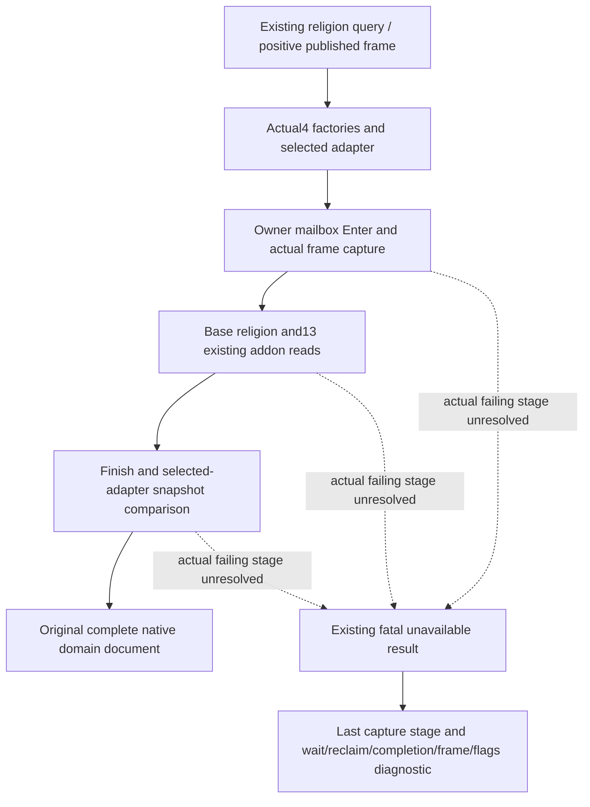
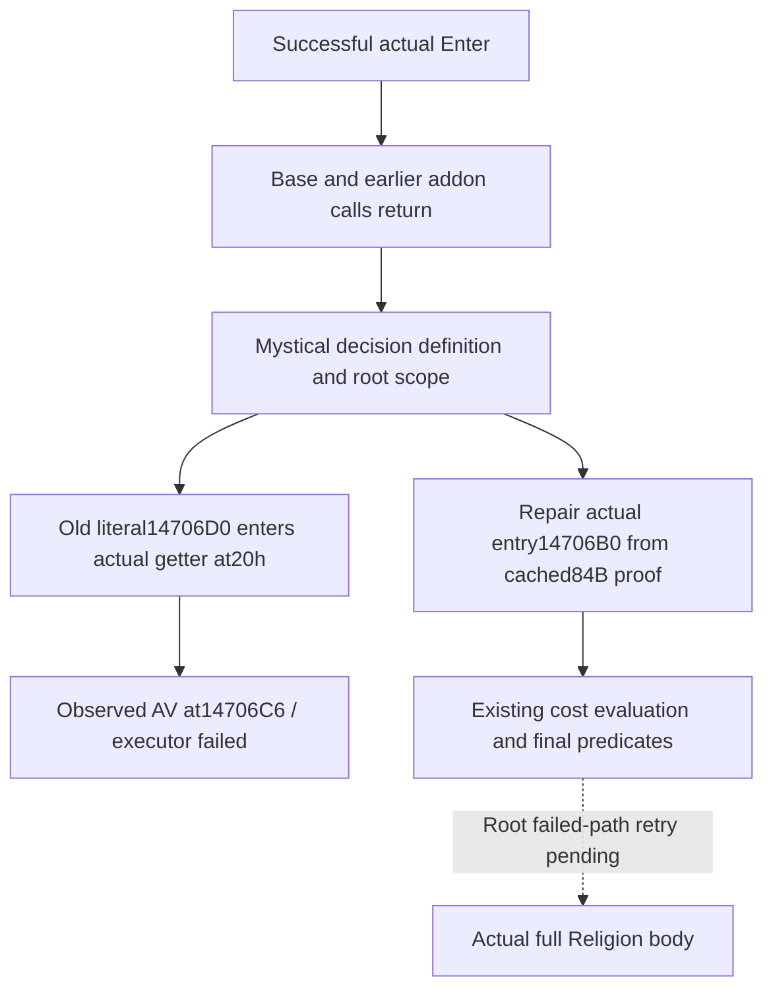

# Religion paused mailbox capture failure in CK3 1.20.0.4

R0054's first actual `ck3_query_player_religion_context_v1` returned native
`command_result ok=false` with `player_religion_paused_capture_unavailable`.
The tool response is retained at
`managed-full-h9613-entry02/operator/gameplay-responses/supplement-04-religion-current-and-addons.json`
under the Oct7 upstream migration packet. It identifies public revision3,
native revision2 and request `g2-read-ec42674dd0384a2f93601ebf669e90e2`.
Root's normal paused Robert29829 scene date is53288256. No religious domain
body was returned; no addon availability, cost, legality or live completion
can be inferred from this error.

The actual compiled source is `fb3771930abd69223efe24a9c413152a20f374be`.
Its retained executable identity is1.20.0.4 / Steam25734779 /
`98702F88A547CDE2EAF29A85F93B85F68EE4CF8148336A4F7AFAEB75319DD518`.
This work reads source and that new response only; it reads no executable,
SDK, Driver state, game process or previous fixture.

The source already selects actual4 religion and addon factories, actual4
character resolution and the selected actual4 adapter. The actual4 Nonwar
population and runtime registration include the religion executor. The
Activity passive Core4 callback restoration is a separate observer seam;
there is no source-proven missing shared Religion callback to copy from it.
Root's same-frame Clergy query also succeeds, so the actual failure is not
evidence that every Nonwar paused route fails.



`RunPlayerReligionMailbox12002` originally used the same generic failure for
wait, reclaim, incomplete capture or unstable finishing frame. The error
alone therefore does not prove which branch failed. Failed Enter and a
caught C++ native exception have their own existing errors. The authored
whole fixture used `core_frame`; the real handler retains `full_snapshot`.
That difference is recorded as source context, not an established cause.

The minimum diagnostic adds one CPP-private atomic capture-stage literal for
the existing single query mailbox. No public context or header changes. Only the existing generic failure gains the stage, terminal wait
and reclaim enum values, entered/completed/frame-stable booleans and the
mailbox failure flags captured before reclaim. The original fatal return,
factories, frame comparison, callback order, data, schemas, availability,
readiness and OFF settings remain unchanged. Stage labels cover each
existing native read and the finishing frame.

This is **diagnostic source implemented / NOTRUN**. Root owns the next
necessary native integration and failed-path retry, then the concrete
branch repair. Separate adopted holy-order and mercenary queries and the
successful Clergy observation retain their own actual evidence. Reference
doctrine/Tenet/rite/draft tool names absent from the restored original
registry were not called and are not newly missing migration ports.

Root's necessary incremental build retains the existing528 headers and objects.
Only this religion CPP and the separately owned central Bridge CPP need to be
recompiled; the diagnostic candidate preserves the old public context ABI.

## Actual R0055 stage and minimum cost-getter repair

The new `managed-full-h9613-binding04/live-failed01/retry-failed-player-religion.json`
was emitted by Root's minimized, paused Robert29829 run on the same original
date53288256, public revision3/native2. Its compiled source is
`9cb425ee432417551e8563824269daaa7c53fd9b`. The new diagnostic is:

```text
stage=mystical_communion_decision_terms;wait=1;reclaim=0;entered=1;completed=0;frame_stable=0;mailbox_failure_flags=512
```

The existing mailbox enums resolve wait1 to `executor_failed`, reclaim0 to
`reclaimed`, and flag512 to `executor_exception`. Its independently retained
diagnostic heartbeat records code3221225477 (`0xC0000005`), image`game`,
RVA21432006 (`0x14706C6`). Enter succeeded, and the earlier base context and
three preceding addon calls returned. Completion and Finish-frame comparison
were not reached; their false fields do not establish a frame-drift failure.
An earlier reader returning does not prove its domain was available.

The already frozen complete84-byte named leaf proof is
`C:/codex-ck3-background/packets/religion-addons-12004-migration-20261007/context-hostility-conversion/named-leaf05/leaf_14706D0-DETAIL.json`.
It maps old entry`14706D0` to actual4 entry`14706B0`, with complete decoded
span`[14706B0,1470704)`, equal normalized instructions and closed local flow.
This is actual function-body evidence, not an assumed address delta.
The actual getter initializes `RAX=definition+1488`, `R8=definition` and
`RDX=definition+1DE8`, then scans embedded records. Its faulting instruction
at entry+16h (`14706C6`) is `cmp dword ptr [rax+C0],0`.

The production actual4 `DecisionBindings` template erroneously retained
`14706D0`, entering this actual function at+20h and skipping its initialization.
The minimum repair changes that single bound RVA to source-proven`14706B0`.
Mystical communion, confession and vow-of-poverty reuse this same existing
template/getter. No schema, DTO/header, cost values, legal predicates, frame
comparison, callback order, mailbox ownership or OFF setting changes.



This repair is **source implemented / NOTRUN**. It removes a concrete wrong
native entrance; successful current Religion/base/addon observation still
requires Root's incremental compile and one failed-query retry. Both original
actual failures and the staged diagnostic response remain preserved. This work
reads no new EXE code/metadata and executes no build, test, SDK or game query.
