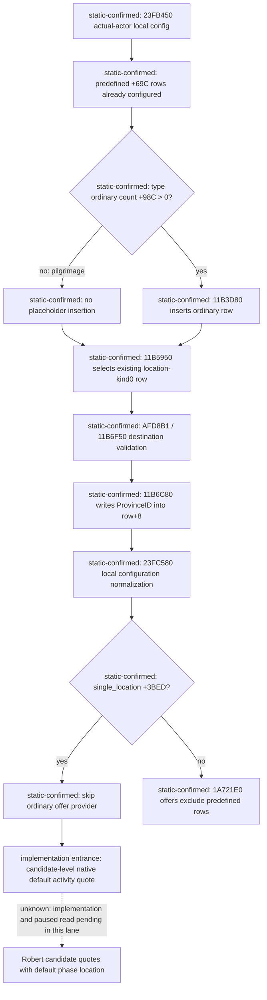

# Exact .3 pilgrimage predefined phase location assignment

Status: `research`; ABI and stock branches are `static-confirmed`. This packet does not connect to CK3, query memory, open or focus a window, compile, run tests, issue a command, or use Git. The root owns implementation, paused Robert observation and report integration.

Frozen build: CK3 1.20.0.3 / Steam build 25652598, EXE SHA-256 `94B55397ABB687A3DCD436805A5D885E6BE90FA6C693FEB44A9E3BBEEADE02A6`. The immutable EXE is `artifacts/migrations/2026-10-02/installed-build/binaries/ck3.exe`. Its already frozen full hash is reused; new bounded function byte hashes are recorded. All RVAs below are relative to that exact image.

## Observed blocker and answer

Parent supplied a real v33 religion frame: actor 29829, DateRaw 53236608, capture epoch 11847, native filter 5 and `single_location=true`. It had five selectable holy-site candidates and five valid routes, but every `phase_choices=[]` and there were zero activity quotes. The native default local configuration contained a genuine predefined phase, definition index 35054, ProvinceID 0, order 0, selected special 5239 and three option categories. Those are supplied live facts, not a new live read in this lane; definition index 35054 is not an implementation constant.

`1A721E0` supplies **non-predefined phase offers**. At `1A723C3`, `PhaseDef+69C != 0` jumps directly to the next definition (`1A7258E`) before the mode gate. Mode 1 does not include predefined phases. Stock `pilgrimage.txt:2133-2134` defines `pilgrimage_phase_solo` with `is_predefined=yes`. The stock `.info:261-281` distinguishes always-present predefined phases from pickable phase types and independently makes `location_source=pickable` the default. Therefore an empty ordinary-phase offer array is correct for this pilgrimage; it does not mean the already configured predefined phase cannot acquire a location.

## Concrete original caller and ABI

The original planner initializer `11B4CF0` calls `23FB450` at `11B4D36`, then copies its owned configuration into `planner+1500` (the pure local config uses the same relative fields). Its `11B4EBF` checks `type+98C`, the ordinary-phase count. `11B4EC6 je 11B4ED0` skips `11B3D80` when this count is zero. The separate `23FB450` loop inserts only definitions whose `+69C` is true (`23FB533-23FB588`). Thus the zero-ordinary-count predefined-only path does **not** manufacture a null-definition placeholder.

Native leaf `11B5950(planner)` finds the first row that needs player location/type selection, reading the phase vector at planner `+15B0` / signed count `+15BC`, stride `38`. It skips a row only if its definition is non-null, its `definition+1160` location-source kind is nonzero **and** its `definition+69C` predefined flag is nonzero (`11B5970-11B598A`). A real predefined phase with location kind 0 is selected directly. It returns null at vector end. During initialization `11B50E8` calls this leaf, `11B50F6` stores the returned row at `planner+1AF8`, and `11B5107` resets that row's ProvinceID `+8` to zero. The default special-option stage can precede this branch; the configuration already contains the actor-evaluated special option and options in the headless query.

The real map-input caller `AFD790` resolves the selected Province from map context `+6AC` against the native Province table (`AFD7C1-7FB`). In map mode `0x10`, `AFD892` gets the activity planner; `AFD8B1` calls `11B6F50(planner, Province*, nullptr)` to validate the destination. On true it calls `11B6C80(planner, Province*)` at `AFD8C0`.

`11B6C80` has concrete location assignment semantics:

1. Load `planner+1AF8`, exit if absent (`11B6CA0-6CAA`).
2. Load signed ProvinceID from `Province+10`, write it to selected phase row `+8` (`11B6CB7-6CBA`).
3. Call `23FC580(planner+1500)` at `11B6CC4`; call UI travel refresh `11B5E60` next. Only step 2 and the pure local-config normalization are reused in the query.
4. Check `type+3BED` at `11B6CD3`. Single-location activities take the `11B6CE0` branch, skipping the offer-provider block entirely. In original stage 0 with ordinary count 0, `11B6D30-6D3C` finishes location picking. The non-single-location branch constructs `{type,actor,special}` and invokes `1A721E0(mode0)` at `11B6DE6`; only a nonempty array replaces the selected row definition.

The pure local equivalent uses owned `config+ B0`, signed count `config+ BC`, phase stride `38`, definition pointer row `+0`, ProvinceID row `+8`. `23FC580(config)` recognizes location-source kind 0 rows and propagates a genuine selected location for single-location configurations. Its `23FC617-63E` searches for the first kind-0 or null-definition row with nonzero ProvinceID; `23FC654-67B` applies that location to applicable single-location rows. With the sole genuine pilgrimage row, assignment and normalization retain its real definition and set its real target ProvinceID. No window or planner receiver is needed for `23FC580`.

## Minimal implementation entrance

Add a separate candidate-level default-configuration quote only for the fixed pilgrimage branch proved here: `single_location=true`, `type+98C==0`, fresh native config phase count 1, a non-null genuine predefined definition with `+69C!=0`, and location kind `+1160==0`. Reuse the actual native row and write only `row+8 = candidate.province_id`; then call existing `config_normalize=23FC580`, read back configured phases/options and call the already wired `2BBE710` / `310E710`. Readback must retain that actual phase definition and candidate ProvinceID. Use candidate native destination legality already obtained by the factory. No ordinary-phase offer or AI score is claimed for this branch.

Keep `phase_choices=[]` unchanged and publish `default_activity_quote` / `default_quote_unavailable_reason` separately with genuine native-default configuration provenance. Do not hardcode 35054. Do not loosen `NativeInsertionIndex` merely to force this branch through insertion; its ordinary-count precondition reflects the original initializer. Existing ordinary-phase offer/quote code can remain separate.

The parent proposed exactly this narrow branch after reading the caller evidence. No generic location assignment, null-definition placeholder, fee/return schedule, CanStart, paid action or religious-loop completion is claimed. Tests and future paused Robert read belong to the implementation owner.

## Evidence and research attempts

`ABI.json` gives the exact offsets and call sites. `PROOF.json` pins new static captures and reused packets/stock. Two file-only research extraction attempts are retained: a range started inside an instruction and a requested leaf lacked `.pdata`; neither is semantic evidence. They were corrected using the enclosing function and an aligned leaf range. No prior suite or native case was rerun.
