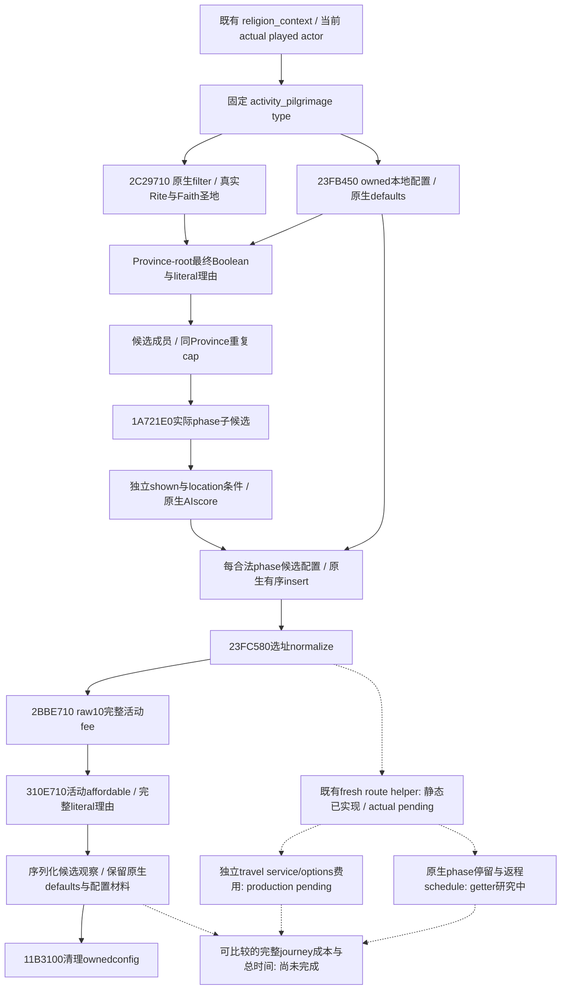

# 朝圣：无窗口圣地候选与原生活动报价（1.20.0.3）

本专题记录当前玩家的原生朝圣候选、选择条件、临时活动配置和活动费用。研究输入已闭合，候选工厂与 owned-config/activity-quote 的四个新生产源文件已外置冻结；唯一合成 native-callback 组合 case 已 GREEN，当前为内部源叶 `static-ready`。尚未接 CMake、mailbox、Python transport、MCP 或完整 DLL，也没有新增 paused 读取。现有 CanPlan 的 `production-live primitive` 资格仍由[原朝圣专题](religion-pilgrimage-native-inputs-12003.md)及其 v29 实机包承担，不能借用为候选或报价验收。

游戏冻结为 **CK3 1.20.0.3 Crozier / Steam build 25652598**，EXE SHA-256 `94B55397ABB687A3DCD436805A5D885E6BE90FA6C693FEB44A9E3BBEEADE02A6`。源码输入使用 ROOT 冻结的 `production-source-8cf176b4`，完整 commit `8cf176b436b6b0024fb591d4114b92448146181a`；未来新 source/DLL 与实机结果单独记录，不把旧 source 或合成角色当当前 Robert。

外置证据根目录：`artifacts/g2-maintainer-2026-10-02/resume-12003/m6-law/religion-pilgrimage-next-inputs-12003/`。本轮读取的是已冻结 exact-build 证据，没有调用游戏、SDK、pipe、窗口、存档或付费动作。

## 原生数据与调用链

| 能力 | exact .3 来源 | 原生含义与所有权 |
|---|---|---|
| 当前角色的圣地候选 | `2C29710(type+3BC0, actualActor, freshNativeProvinceArray)`；圣地分支 `2C28FF0(actualPlayedFaith, array)` | 输入来自真实 actor 的 Rite/Faith，沿完整引用匹配的 HolySite→Title→Province 链。不是按 Catholic 标签写死省份，也不复用教会税务 contextFaith。原生数组 backing store 属于本地读取者，Province/Title/定义对象为借用 |
| 地点最终条件与原文 | Province-root scope、实际 host、实际 selectedSpecial；`type+450 →372DF30` 与原生 `372E4F0` 理由路径 | 直接求值当前脚本 predicate 和完整 UTF-8 理由，保留 Boolean 与文本各自结果。原生 32-byte reason sink 和 evaluator 各自清理 |
| 选择数量限制 | 已捕 `.3 11B6F50`、`31145A0` | `single_location` 只跳过总 phase 添加数量检查，仍执行候选成员检查和同省重复限制；重复数>0 时需 `count < native cap`。不能把旧 `.2` 计数解释当 `.3` ABI |
| 本地活动配置 | caller-owned、align8、`0x550` buffer；`23FB450(type, fullActorID)` 初始化，`11B3100` 销毁 | 原生选择 default options、默认 phases 与 eligible phase/location pairs；不创建或安装 UI planner，不注册 live activity |
| 实际阶段子候选 | `1A721E0({type, actualActor, selectedSpecial}, mode, actualProvince, ownedChoices)` | 每行是借用 PhaseDef/Province 与 signed native AI score。mode1 保留诊断候选；shown、location 条件分别读取。正 AI score 是原生自动选择偏好，不能冒充玩家合法性 |
| 本地阶段插入与选址 | `11BF720` / `11BF8B0`、原生排序规则、`23FC580` | 使用真实 offered PhaseDef 和完整 Province ID，保留原生 nested variables 与配置顺序。`config+1B0` 是 eligible pairs，`config+B0` 才是 configured phase rows |
| 完整活动费用 | 清零 `int64[10]` 后 `2BBE710(config, raw)` | 求值 host、全部 configured phase、实际 selected options/pomp 的原生费用，带真实 activity/current-location/previous-location scope。保留 signed 原始十资源向量；已闭 gold index0、treasury index6、Q100000 |
| 活动费用可负担性与原文 | `310E710(raw10, actualActor, NativeString32)` | 独立 Boolean 与完整 literal reasons，不从金钱余额或 authored 数值重算。`23FC990` 只用于证明该调用 ABI，不作为本次执行入口 |

`2BBE710` 是活动费用，而非完整旅程费用。原生 UI refresh 还单独叠加旅行贡献 `11D75D0`：实际 travel options，以及真实 secondary character 存在时的 service cost。它们使用不同作用域，不能把活动价格直接当全旅程价格，也不能用默认未配置 travel-prefix 推出零旅费。

## 原生树与尚未闭合的结果

实心边表示已闭的 exact-build 功能依赖，尚不表示新增生产口已通过实机；实现和 paused 验收仍需后续证据。路线 helper 的静态成果没有读取当前真实旅程，不推断当前 trip 的存在或缺失。

## 生产接口范围与 counter-policy 输入账本

接手后的具体接线入口是既有 `ck3_query_player_religion_context_v1` 和已有 private opt-in，独立 sibling 为 `player_pilgrimage_headless_activity_terms`，schema 为 `ck3_12003_player_pilgrimage_headless_activity_terms_v1`。输入仅当前 actual played actor 与既有 `expected_revision`；候选工厂自身读取原生候选，不新增手填 Province 参数、flag、gateway 或一般化框架。现有八个 context 组件及其各自 available/status 不应由新 sibling 改写。用户已要求度假收尾，尚未开始的共享接线与 decoder 本轮不继续施工。

可比较的材料包括原生候选身份、地点/阶段条件和原文、适用 cap、native default options、真实 configured phase 顺序、活动 raw10 quote 与独立 afford/reasons。没有选择自动游玩策略，没有 CanStart 或 paid-submit 入口，没有修改当前 Faith/Rite。列出合法 native offers 与其费用，才能为后续选择提供数据。

| 原生分支/输入 | 本轮采用方式 | 后续依赖 |
|---|---|---|
| 固定 type 的当前可规划性 | 复用已生产读取的 CanPlan，独立于地点和报价 | CanPlan=true 不能当 CanStart 或完成朝圣 |
| location 条件、候选 membership、同省 cap | 调原生最终结果及文字；使用真实候选与 owned config | 新 paused 结果决定当前合法地点；不手写通用宗教触发器 |
| phase mode0 正 AI score 自动选择 | 记录偏好来源；本轮列 mode1 实际 offers，分别保留 shown/location | 尚未采用自动偏好策略；后续按生产 outcome 校准 |
| default options 与 phase scopes | 原生初始化并对实际候选配置求值 | 不把 stock defaults 当当前 GUI selection |
| 旅行 service/options | 独立研究原生 inclusion 与费用作用域 | 未合入完整 journey quote；不写合法零值代替缺失 |
| 停留、Hajj 流程及返程 | 保留原生 schedule getter 的具体下一入口 | stock 普通3个月是到达后的阶段，不是全程 ETA；Date raw 不相减为天数 |
| 精神满足度、虔诚收益 | 复用有限 stock 输入树，尚不据此动作 | authored 增益不是实际完成收益；需实际 Rite/host/reward branch 与 completion material |

## 冻结证据与当前验收边界

- `activity-quote-and-holy-sites-next/PROOF.json`，13834 B，SHA-256 `aecbbd6cd382b83f45905f1a89e37c44ef9fec3cfc7d3b3bb802f70e913ea570`。
- `activity-quote-and-holy-sites-next/ENTRY-PLAN.json`，3765 B，SHA-256 `0fd80a17fd4aae5e6059b490a051049ec17d883eb2112feed3f681b56eddb674`。
- `activity-quote-and-holy-sites-next/holy-sites/PROOF.json`，7801 B，SHA-256 `f276b8802c6a2f903694a58758a4ec6d4f697324ac107abb152173b0bfddebdd`。
- `.3 single_location/cap 分支更正将随新 factory receipt 固定：`11B6F9E JNE→11B7101` 只跳 total block；`11B71C0→31145A0` 和后续 duplicate gate 仍执行。旧冻结包原样保留。
- `candidate-route-leaf/OWNER-RECEIPT.json`，5186 B，SHA-256 `6ad2d4c28dfc31c6e360a92dfdfa2b51fb0a146a38926ce0e63ed93772c97010`。唯一 reader→serializer 合成 native-callback case 已 GREEN，状态 `static-ready`，未接 MCP 或实际路线读取。

冻结源码位于 `headless-candidate-activity-terms/candidates` 和 `/quote`，各自 `ROOT-NATIVE.patch` 只包含两个新生产源文件。候选补丁 SHA-256 `5e70ec235db5168c98b519f4bea52cea3475e577c9e3aa271d547b8c8333254e`；报价补丁 SHA-256 `30003aec9b803b39982bb26823ed647ee85827c1dcb053f93a2a8afa34c9b328`。两 owner 的 `OWNER-RECEIPT.json` 分别为 `333783608043aa0af90f1a168ce01711cb71406bc5caacff0bb805b3bb7d7a22` 与 `870eca0c22b209741529af3546d4f1422966b1819ba63a595de7e1104edf9e99`。

唯一组合验证已完成：真实 Context reader→factory→owned config→quote→serializer→既有 `.3` renderer 组件 wire，native callbacks 为合成材料。一个 native case，compile/run exit均0，成功编译6.807759秒；旧测试与 Python query均0。验证两个真实发现的合成候选、完整 UTF-8/control 理由、shown/location=true 且 AI score=-17 的可选阶段、同省 cap、原生 defaults/phase order、十槽 signed quote、独立 affordable=false 与各 owner cleanup。未实现的 mailbox 接线与 Python decoder 没有执行，也不以手造 command_result 冒充其证据。

`combined-fixture/RESULT.json` 为9239 B，SHA-256 `5de50caeace02602aaf77314c66ae75f80da91e65534c5e3eedbbddf1395d55c`；`focused/native-component-wire.json` 为3308 B，SHA-256 `213df33f1b7ccf1ef7d63f28ddff534798f0f45a08a9809294c9688b8a1d86ca`；`FINAL-RECEIPT.json` 为7192 B，SHA-256 `aa00a01395a3145d97a99460550c4299d1fb622c6973594f1eb016d8c1d32d8d`。三次 MAX_PATH 编译失败原样保存在 `attempt01-RED` 至 `attempt03-RED`，属于 HARNESS-RED。最终仅将6个实际 TU、必要 header closure 与5个既有 pinned obj 原样复制到短路径临时编译目录，生产叶 bytes 未变；没有 capability RED。

成功只提升内部源叶的 `static-ready` 资格，不能称已注册 MCP 或实机路线。只有新 exact-source/DLL 的 paused actual snapshot 才能称 `production-live primitive`。本轮付费动作、G2/M6 完成和完整宗教 loop 的信用均为零。所有实现、验证与研究 lane 已按度假收尾指示冻结并停止；后续接线和新实机不得在本轮继续启动。

另一个未采用分支是非 `single_location` 类型的总选址计数：准确 `.3 11B6780` 语义尚未闭合，不能拿 raw configured rows 或旧 `.2` 实现代替。固定朝圣的真实 single-location 分支跳过该总 gate；同省 cap 继续原生求值。此遗留项在工厂收据中保留，不为收尾扩展研究。

后台完整旅费/返程研究已停止并冻结于 `journey-fees-and-return-schedule-next`。service/options 的无窗口 numeric recipe 已回链原生 current-player 与实际 Data.actor 的对应条件；CActivityPhase RTTI 与 loader/postload 仅证明定义类型，尚不是 duration/Date getter。下一入口是 constructor 安装的 nested type 与原 post-route 路径中的纯 evaluator；不能调用 loader/postload 来代替时长读取，不把 stock3个月或 Date raw 差值写成全程 ETA。

## 2026-10-03T11:51 接续源码采用

已闭合Phase+1078是AI分数、+6A0是CScriptedCost；GetProgressPhaseDate与GetActiveStartDate为既有活动纯getter，三个月是到达后停留而非全程ETA。采用两独立内部只读组件与原生专题，唯一新增fixture直接执行exactgetter机器码，/W4 /WX GREEN，Date=-1与对象bytes不变。尚未发布此叶的MCP；同帧active CActivity身份和全旅程CostBreakdown仍有具体施工依赖，完整费用/预先返回日期仍research，不替代现activityquote。

实际记录：`2026-10-03T11:51:26+08:00`。源码已采用；严格组合DLL和Robert暂停实读仍待完成，不能记为live或增加日数/动作/收益/G2信用。ROOT负责正常commit/push。

交付回执：[pilgrimage-journey](Z:/ck3_mod_rewrite_process_assets/g2-resume-20261003/pilgrimage-journey/ROOT-DELIVERY.json)。

## 2026-10-03T12:22 新 PID paused 实读

本专题对应的新只读叶与真实缺口见[统一实读记录](g2-v33-paused-religion-and-event-observations-12003.md)，回链actor/date/native/public revisions和原capture。仅记录primitive，不增加动作、日数或完整OODA；历史fixture与封存状态保留原时点。

## 2026-10-03T12:35 接续源码采用

实际v33五候选/五route成功但offers为空、quote为0。exact .3 1A721E0有意跳过predefined phase，stock朝圣只有predefined；原版11B6C80沿已有kind0 phase写真实ProvinceID并23FC580规范化，single_location/ordinary-count0分支不插placeholder。原生树先冻结，再仅3生产文件新增 candidate.default_activity_quote 和独立reason；保持 phase_choices=[]，不硬编码definition35054，只在fresh owned native config给真实默认row选址，调用既有十槽signed费用/afford/reasons与清理。新增native mailbox→serializer→.3 renderer 1case/131checks GREEN，same genuine wire registered MCP 1request GREEN；旧矩阵不重跑。仍是activity-only quote，不等于整旅程费用/CanStart/返程或收益，实机默认报价待下一v34暂停帧。

实际记录：`2026-10-03T12:35:10+08:00`。源码已采用；严格组合DLL和Robert暂停实读仍待完成，不能记为live或增加日数/动作/收益/G2信用。ROOT负责正常commit/push。

交付回执：[pilgrimage-default-phase-quote](Z:/ck3_mod_rewrite_process_assets/g2-resume-20261003/pilgrimage/default-phase-quote/ROOT-DELIVERY.json)。

## v34 默认阶段报价实际验收

ROOT提供 `runtime-preparation/v34/actual-paused-v34-01/012-ck3_query_player_religion_context_v1.json`（关联snapshot011、PID119724、source/native `5b203 frozen g34`、environment前缀`12ced0ab`）。本lane只读消费该冻结文件一次：50377 B，SHA-256 `e6a7962a83a5e848bcf55c0869fc28e1f8a6bd901c3a98b30413530da11d996f`。同帧actor29829、DateRaw53236608、capture epoch9487，五个candidate的 `default_activity_quote` 全部取得真实原生输出，故默认阶段活动报价从 `static-ready` 升为 **`production-live primitive`**。原v33零报价记录仍保留为已被修复的实际缺口。

| HolySite ID | Title ID | Province ID | 原生活动gold raw（Q100000） | 原生affordable | 真实默认阶段readback |
| --- | --- | --- | --- | --- | --- |
| 0 | 8768 | 5965 | 10000000（100 gold） | true | PhaseDef35319／Province5965／predefined=true／order0 |
| 1 | 2410 | 2577 | 7000000（70 gold） | true | PhaseDef35319／Province2577／predefined=true／order0 |
| 2 | 778 | 2088 | 10000000（100 gold） | true | PhaseDef35319／Province2088／predefined=true／order0 |
| 3 | 7888 | 1785 | 11000000（110 gold） | true | PhaseDef35319／Province1785／predefined=true／order0 |
| 4 | 267 | 1503 | 11000000（110 gold） | true | PhaseDef35319／Province1503／predefined=true／order0 |

所有其他九个费用槽均是本次原生实际合法零值；treasury slot6也为0。五个 `can_select=true`，五个quote unavailable reason为null，五个 `affordability_reasons_available=true`、完整literal reasons为空串。五组普通阶段 `phase_choices=[]` 原样保留，不用默认quote伪造普通offer。实际PhaseDef本次index35319，未沿用v33的35054，正是按本帧真实定义配置/readback的结果。

完整signed raw10、默认选项、configured phase、独立可负担性和理由归档在外置 `default-phase-quote/actual-v34/ACTUAL-PROOF.json`；日报、周报及专题字段在同目录 `REPORT-FIELDS.json`。本消费者未读取新进程、未重发SDK/query、未操作窗口、pipe或Git。上述价格仍为 native默认配置的**活动费用**；全旅程、实际travel service/options、返程排程、CanStart、付费提交、完成及净成长均没有新增信用，G2/M6和完整宗教loop增量仍为0。
