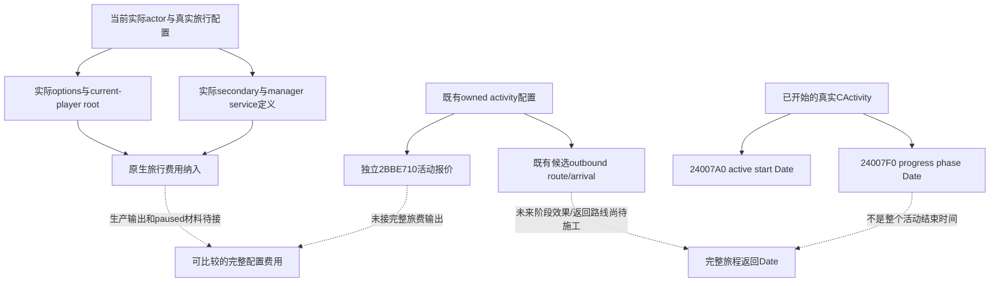

# 朝圣：旅行费用边界与运行期阶段日程（1.20.0.3）

本次接续闭合了阶段日程的具体只读原生入口，新增内部 `activity_phase_dates` 组件达到 `static-ready`。它读取已经存在的 `CActivity`，不创建活动、不执行阶段效果，不是候选朝圣的预先全程 ETA。费用部分继续复用封存的旅行 service/options 原生来源，尚未发布完整旅程报价。既有候选、活动费用和 outbound route 的接线由独立工作包负责。

游戏固定为 CK3 **1.20.0.3 / Steam build 25652598**，EXE SHA-256 `94B55397ABB687A3DCD436805A5D885E6BE90FA6C693FEB44A9E3BBEEADE02A6`。生产基线是 `8cf176b436b6b0024fb591d4114b92448146181a`，新源码只在外置 `Z:/ck3_mod_rewrite_process_assets/g2-resume-20261003/pilgrimage-journey/ROOT-PROJECTION`。本次没有运行 CK3、SDK、pipe、窗口、存档或 Git mutation。

## 已闭合的原生输入

| 输入 | exact .3 来源 | 结论 |
| --- | --- | --- |
| 阶段定义身份与构造 | `CActivityPhase` vtable `48BFDF8`，constructor `3115F80` | 原先 `+1078` 的探索入口已经有确定类型，不能继续作为 duration 猜测 |
| `Phase+1078` | ctor 调 `A07C60`，安装 vtable `44A7B80`；RTTI `CJominiScriptValue<int>`；`1A73CE0` 的 literal `CalculateAIWillPick` 后读取同字段 | 它是阶段原生 AI 选择分数，和停留时间无关。loader 原始 key `28B2` 的该分支留作已纠正研究历史 |
| `Phase+6A0` | ctor 调 `28027C0`，RTTI `CScriptedCost` | 它是已在活动报价中使用的阶段成本，不是 duration |
| `GetActiveStartDate` | GUI literal `472CA98` → registrar `4CBF10` → getter `24007A0` | 完整 getter 只有 `lea rax,[rcx+3F4]; ret`，借用运行期 `CActivity` 的原生 Date |
| `GetProgressPhaseDate` | GUI literal `472CAD8` → registrar `4CC010` → getter `24007F0` | 完整 getter 只有 `lea rax,[rcx+408]; ret`，读取当前阶段已安排的推进 Date |
| 普通朝圣停留 | `pilgrimage.txt:2398–2409` 的 `on_phase_active`，当前角色必须等于 host；非 Hajj 时 `progress_activity_phase_after={months=3}` | 日期是在到达并激活阶段后由效果安排。该三个月不是 outbound、return 或整个旅程时间 |
| Hajj | 同一到达分支排除 `pilgrimage_type_hajj`，注释明确由 railroaded Hajj events 推进 | 不把普通三个月套到 Hajj；候选阶段定义本身不足以产生完整返回 Date |

原 post-route helper `11D8BA0` 的新增捕获显示它维护 planner 的参与者/容器登记并写标志，不是已证明的只读日程 getter；不把这类 planner 调用接入候选查询。该 `.pdata` 入口有 split continuation，保存的首段也不称为完整函数。

## 旅行费用的纳入规则

复用原冻结 `journey-fees-and-return-schedule-next/PROOF.json`（SHA-256 `0bb8a1b4a09888adf932a422074ee69582b258c0f53ff2aa8b2af4a549732274`）及 `activity-quote-and-holy-sites-next/NEW-FUNCTION-11D75D0.json`（SHA-256 `aca6cd1496ae9751bcc813eda8e604d1d3494c8e5670ebfe855e0fcfbd35ffd9`）。原 activity refresh 的 `11BFAF0` 与旅行 `11D75D0` 是独立贡献，`2BBE710` 的活动十资源报价不能据此称为完整旅程价格。

真正的原生 travel options 来自 `CData+B0/countBC`，stride8；费用定义为每个实际 `TravelOptionDef+7F8`。原 `11D75D0` 的 option scope 是 kind4，full CharacterID 来自 current-player global `54DBC00`。无窗口查询应在同一 owner 上确认当前玩家、实际 played actor 与 local CData owner `+8` 一致，然后按实际选择原序求值；不能用随意传入的 actor 替代这个原生 root。明确选择空 options 只表示 options 贡献为空。

service 只在实际 `CData+C` 的 secondary full CharacterID 不等于 `-1` 时纳入。其定义是 actual manager slot `5D1EB18` 指针所指对象的 `+F30` 指针；它不是写死的旅行费。原生以该 secondary 的匹配 generation 指针构造 `B17C70` scope，分别调用 `232E630(out64,secondary,null)` 与 `232E920(out64,secondary,null)`，保留 signed raw64 并作为 kind1 注入 tokens `5D4C0AC/B0`。原生 scope extent `168`，清理使用原 caller 已冻结的 named-map 与 context-container 清理路径。secondary=`-1` 仅排除 service 贡献。

原 UI inclusion 调用 `41D1030`；新增完整 `10F44A0` 证据说明其沿原生 script-value/display-context 路径构造成本明细。现有 `310CEE0` 是另一个 numeric 十槽入口，保留其原生 rounding/clamp 行为；本次没有声称直接加总任意独立 vector 已等同完整 UI 报价，也未实现这项生产口。具体施工顺序是：由当前真正的配置提供实际 options 和 secondary → 按上述原生 scope 纳入 → 输出 component provenance 与完整 native resource 结果 → 在同一 paused snapshot 记录。不能把 route 组件当前明确的空 options/no-secondary 配置扩写成玩家将选择的最终旅行配置。

## 组件与验收边界

新增 `ck3_12003_activity_phase_dates.hpp/.cpp` 只绑定两个 Date getter；输入为调用者在同一个 owner-thread snapshot 已解析的借用 `CActivity*`、现有 DateRaw 与 capture epoch。调用者负责取得实际活动身份；本叶不发现活动、不声称当前罗贝尔存在朝圣活动。输出分别是 `active_start_date_raw` 与 `progress_phase_date_raw`，保留原生 signed int32，包括 sentinel。没有 duration、return Date、CanStart 或费用字段。

唯一新增 native fixture 已 GREEN：复制 exact getter 的两个完整 8-byte x64 函数并在 synthetic CActivity buffer 执行，经生产 reader→serializer 输出 raw Date；验证读取前后对象 bytes 不变，合法观察到 `progress_phase_date_raw=-1` 仍原样保留，resolved activity absence 单独给出 unavailable。编译 `/W4 /WX` exit0，运行 exit0；没有复跑旧 route/candidate/quote 或 ABI 矩阵。fixture 使用的 `53236608` 是合成材料，不能冒充罗贝尔实际暂停帧。

已闭的只读 getter 是可施工入口，状态为内部组件 `static-ready`；共享 mailbox/MCP、当前活动身份发现、actual paused 验收仍未完成。完整旅程报价和预先全程 ETA 继续是 `research`，没有新增 paid action、净收益、宗教 OODA、G2/M6 或自然继承信用。外置包 `ROOT-DELIVERY.json` 固定新增源码、文档、captured functions 和唯一 fixture 的路径与 SHA；协调者合入时同时写入当天/当周报告。
