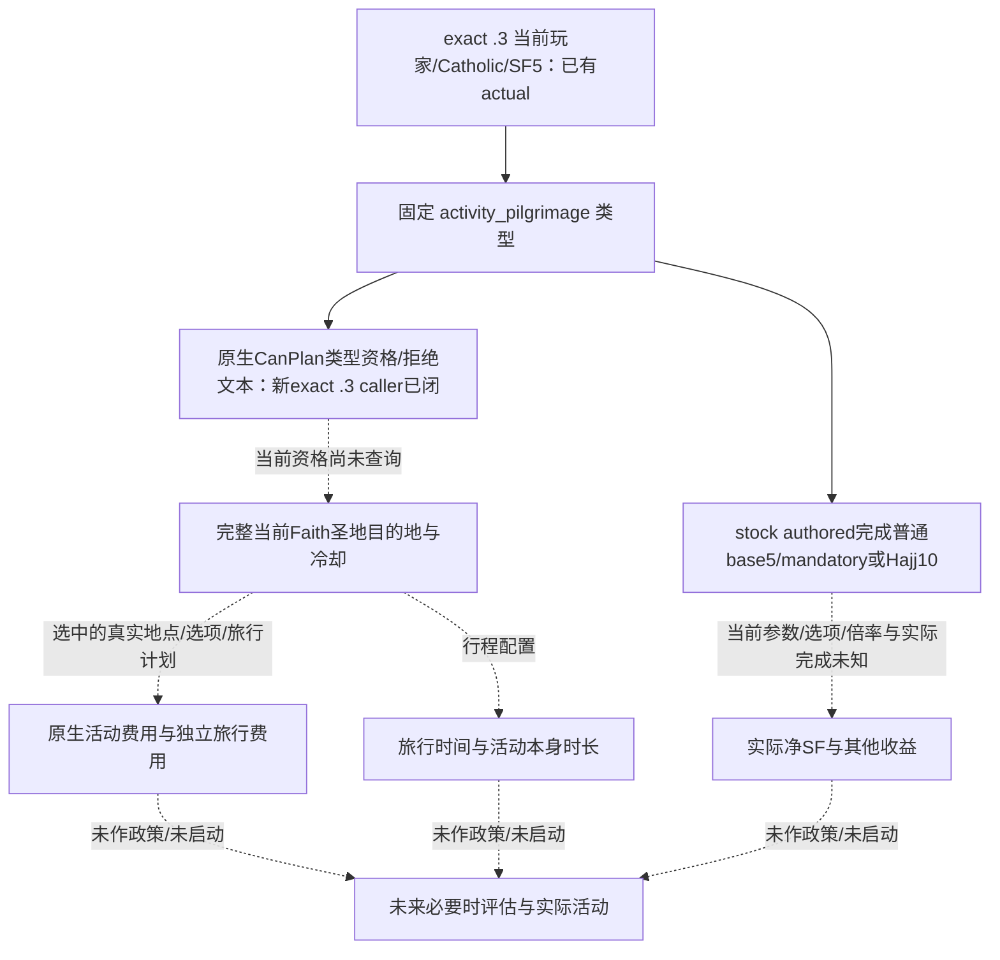

# 朝圣：1.20.0.3 当前玩家的下一项成长观测

2026-10-03，**static-ready／完整外置只读生产包已验证**。宗教域已由项目所有者全面开放。下一项选择固定 `activity_pilgrimage`，本轮交当前普通 Robert 的 **CanPlan 类型资格与完整原生拒绝文本**；独立显示、实际行程费用与时间是后续具体叶。本页不声明现在可以朝圣，不自动提交活动，不制造收益或完整宗教 OODA 信用。

冻结 CK3 **1.20.0.3 Crozier / Steam 25652598**，EXE SHA-256 `94B55397ABB687A3DCD436805A5D885E6BE90FA6C693FEB44A9E3BBEEADE02A6`。源码输入为不可变 `resume-12003/production-source-f30579bf`；ROOT 正在接续 v28，该包进行离线生产接线及 focused 验证，不绑定未知新 PID 或把旧字段冒充新帧。

## 为何先选朝圣

已发布六候选有限研究位于 `resume-12003/m6-law/religion-progression-robert-next-inputs-20261003`。其中朝圣完成有明确 authored 精神满足度普通 +5、mandatory/Hajj +10；它不要求共融的 Mystic 特质。当前 v27 共融原生显示 false、最终可执行 false、可支付 true、费用 100 **虔诚**，所以“付得起共融”不能提供可执行成长机会。

当前已闭合的 v27 宗教上下文仅作输入：actor 29829、Catholic、Rite 152 / Faith 23 / Religion 8、精神满足度 5、level 3/7、区间 −30/+30、原生进度 58.333%。Catholic 不代表朝圣原生合法；已有 `active_event=null` 也不证明没有活动或旅行。其他五候选及其未知保持原有限账本，不重新盘点整个宗教系统。

## 已有活动生产入口的实际边界

| 现存入口 | 已发布内容 | 朝圣边界 |
| --- | --- | --- |
| `ck3_query_player_religion_context_v1(expected_revision)` | 当前 Faith/Rite/SF、独立 progress、共融最终只读 terms | 可复用现有 permission/owner 加固定朝圣 sibling；没有朝圣原生资格或费用字段 |
| `ck3_query_activity_stage5_feast_full_cost_private_v1(expected_revision)` | stage5 的 named gold/treasury/piety/barter goods、原生 CanStart、失败显示文本 | 请求与 decoder 都固定 `activity_feast` / stage5，不能改名称就称为朝圣能力 |
| `ck3_query_activity_feast_stage5_start_inputs_private_v1(expected_revision)` | 现有 Feast 最终输入 | 不提供固定朝圣类型的 UI-independent 显示/可主持资格 |
| `activity_planner_diag_private_transport.py` | planner present/stage/type；`configured_cost_state` 和 `final_can_start_state` 明确为 `unknown` | f305 MCP 注册函数中没有找到对应通用诊断 query；模块/driver flag 不等于注册查询或最终朝圣费用 |

本工作包只复用已有实际 .3 activity getter、definition lookup、CharacterScope 和 owner 机制；不会搬旧 1.19 RVA，也不把 Decision 的 cost/final 接口按名称套到 ActivityType。没有新增总框架、feature flag、安全门禁或 paid submit。

## 当前原生输入树

第一叶优先当前玩家 + 固定朝圣类型的 **UI-independent 原生 CanPlan 类型资格及原因**，不命名为完整 CanStart。新的 exact .3 真实 reflection 路径是 `ActivityType.CanPlanActivity(GetPlayer): 9E0580 → 9DC990`，其 Tooltip 是 `9E08E0 → 9DCC40 → 2BBDA60`。最小公开方法分别为 `CanPlan(type, actual Character)` 和 `Tooltip(out native32, type, actual Character)`；后者内部传当前 actor 的 kind 4 / full id +8 CharacterScope、R9d=0、第五个非空 native 32-byte UTF-8 reason sink、最后 false。callee 不消费入参 RDX，读取 type+0x40、type+0x110 或 +0x2B0、type+0x1E0；原生调用条件和字节 pin 已冻结在独占 `native/` 子包。这里没有开 planner、修改参数 flag 或用 Feast 类型充当朝圣。

固定 pilgrimage ActivityType lookup 已闭合：真实 caller `1642F05 → 8FC200`，`8FC204` 直接读取 global `5C67208`，同 caller `1642F0A/0E/12` 证明 rows +0x50、count +0x5C、pointer stride 8。新 helper 读取相同 global，复用生产 ResolveFeastType 的 exact .3 TypeVT `48BFE50` 和完整 SSO stable-key 算法，仅查 19-byte `activity_pilgrimage`；不调用在未 created 状态会 assert 的 accessor。独立 shown getter 尚未闭合，不把 CanPlan 当 shown。若原生 full quote/time 必须有具体 planner/destination，就继续闭该选中行程的下一只读叶；不能长期仅返回 `null`，也不能凭空创建行程或把 base reward 当 net reward。

本次新 stock 窄读还区分：host cost 按实际 treasury/theocracy 分币种；UI predicted cost 是所有 holy sites 与 pomp 档的平均，不能当所选行程报价。非 Hajj 的三个月是抵达后活动 phase duration，旅途 ETA 必须来自真实 plan，不能叫总旅途固定三个月。完成收益除了普通 +5、mandatory/Hajj +10，还有具体 demon-torment 条件的 authored 额外 +10；当前适用性与净 gain 仍待实际输入，不能套到 Robert。

完成奖励的 `pilgrimage_sp_reward_effect:1191–1206` 检查的是 Rite 的 `doctrine_pilgrimage_mandatory` 或 `doctrine_pilgrimage_mandatory_hajj` **doctrine membership**，不是可用性 parameter，也不能由 Catholic 身份推断。phase.on_end 的 reward dispatch 与 `pilgrimage.7000` 事件是平行路径：完成 log entry effect 直接调用 reward；不能画成 .7000 才发放 SF。

## 本轮最小生产工作包

ROOT 已授权独占宗教 Context 的本轮外置接线。沿 `ck3_query_player_religion_context_v1(expected_revision)`／`query-player-religion-context-v1`／现有 `allow_private_player_religion_context_query`，新两 leaf、既有 mailbox serializer、同 context CMake 分支与 Python optional normalizer 组成可直接 ROOT apply 的包，不新增 MCP 注册、gateway 或 flag。

独立 sibling `player_pilgrimage_activity_type_terms` 恰好 11 keys：schema `ck3_12003_pilgrimage_activity_type_terms_v1`、read_only、available、unavailable_reason、capture_epoch、date_raw、played_character_id、固定 activity_id、can_plan、reasons_available、can_plan_reasons。成功观测 false 或空文本都是合法值；只有读取失败才是 unavailable/null。字段中没有伪造的 shown、CanStart、费用或 ETA。旧 Context 17 keys、progress 19 keys、共融 15 keys 及原 query status 均保持原义。

本包只做一条新的生产 owner/mailbox/reader/serializer focused case，再由既有 Python NativeDriver/private transport 消费同一 genuine native wire。callbacks 属于 synthetic；不冒充 Robert 或实际 EXE 成功。旧 ABI、main23/57、L0 和已闭实机查询不重跑；ROOT 统一构建及 fresh paused 才能升级 production-live primitive。

stock 与 native 两个独立子包已冻结：`resume-12003/m6-law/religion-pilgrimage-next-inputs-12003/{stock,native}`。完整七路径 `ROOT-PILGRIMAGE.patch` 包含两 leaf、既有 mailbox 两文件、CMake、唯一 focused case 与 Python optional normalizer；`PILGRIMAGE-PACKET-PROOF.json` 逐路径绑定 base/projection，并确认补丁还原。

新增 focused **一 case／39 checks** 首次 compile/run GREEN：真实生产 `RunPlayerReligionMailbox → owner → reader → serializer` 经 synthetic 类型数据库和方法 callbacks 保留 false CanPlan、完整中文／换行／制表／反斜杠原因，以及旧 Context、progress、共融。输出完整 2594-byte command_result，SHA-256 `20ce09aab630f1aa493ac411fc8c876f4f591ce489fd2a00530d4a1f84bb75ca`。既有 NativeHeadlessGameplayDriver 和 private query transport 消费该原生 wire 的唯一 Python case 也 GREEN；只关联 request id，不由 Python 重建语义体。两者不是 current Robert 或真实 EXE 回调，live 信用仍为 0。确切结果见 `{native-integration,python-integration}/RESULT.json`；不重跑旧 suite。

下一项按实际 CanPlan 决定：若 false，优先原样发布失败文本并补其中确切缺少输入；若 true，读取当前 Faith 完整圣地、已访问／冷却、所选目的地与真实选项，再闭 chosen host/travel quote 和 ETA。完成净收益还需要当前 Rite doctrine membership、demon-torment 与实际完成后材料，不能把 authored +5／+10 当已兑现。ROOT 独占共享源 apply、严格构建、新 PID paused 查询与 Git；这些必要实机步骤仍 pending。

同批聚合接线额外承载其他 owner 的 `player_confession_decision_terms` 与 `player_church_income_profile`，分别独立读取 fixed `pam_decision_confession` 的最终 terms 和当前／最大月收入。它们不覆盖朝圣或旧 Context，也不把 max-current 称实际收益；各自叶源码、focused 结果与实际边界由对应专题和 owner receipt 负责。
