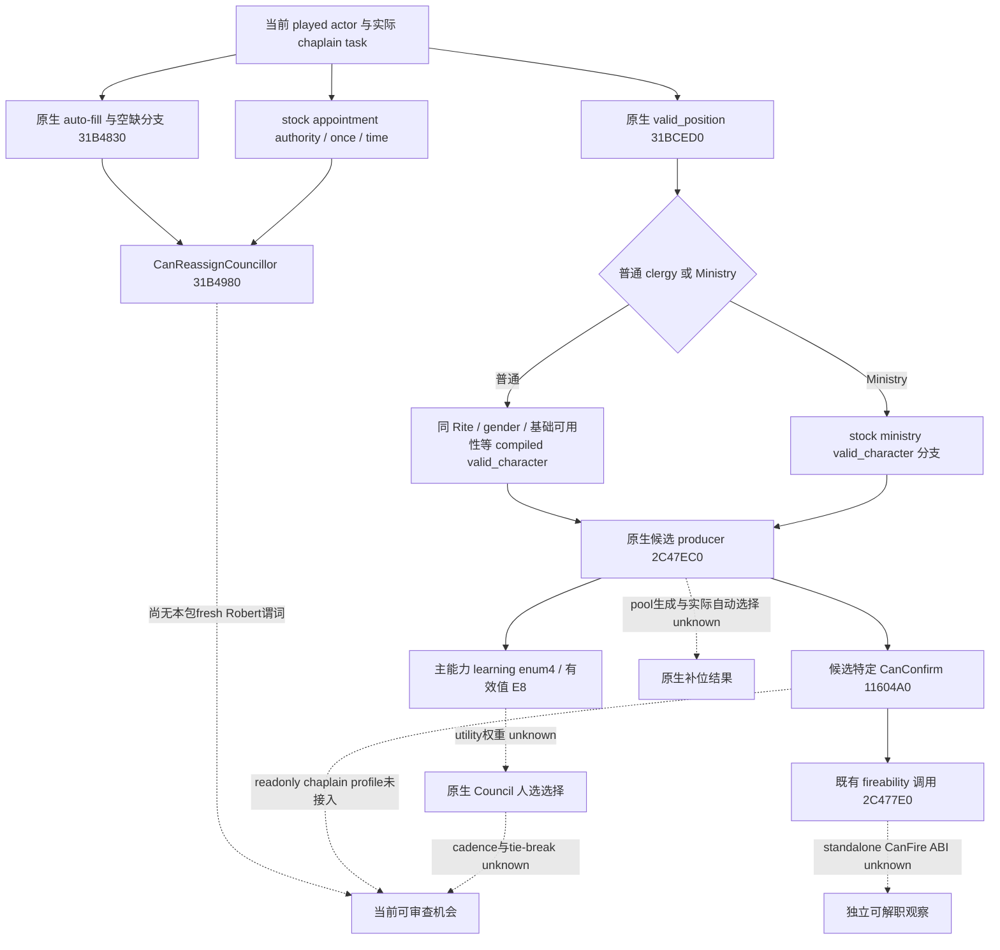
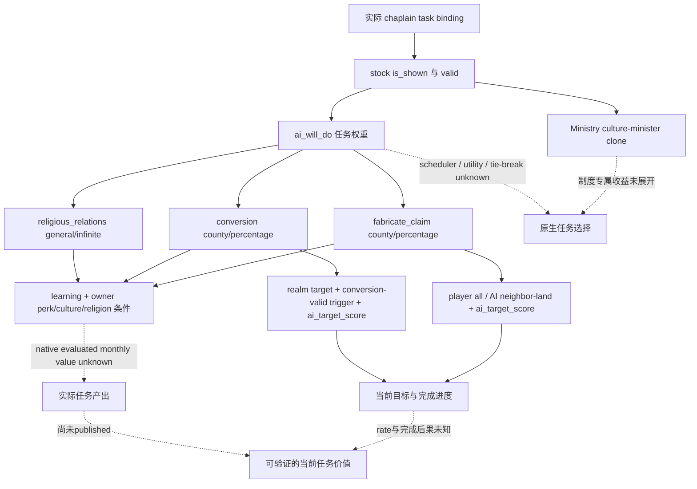

# CK3 1.20.0.3：realm priest 内阁任免与任务原生树

2026-10-03 离线研究。项目所有者已在 2026-10-02 全面开放宗教领域；授权范围见 [原生 AI 入口](README.md)。本页冻结宫廷司祭 `councillor_court_chaplain` 的任免、候选、有效学习技能与任务输入，为后续只读观测和策略施工提供入口。当前 readiness 为 **research**；本次没有连接 CK3、SDK、pipe 或 Steam，没有任免、切换任务、推进日期、源码修改或新测试。已经完成的 Robert Chancellor 循环不在本页重审。

## 版本、输入与证据等级

| 输入 | 冻结值 |
| --- | --- |
| 游戏 | CK3 **1.20.0.3 Crozier**，Steam build **25652598** |
| EXE SHA-256 | `94B55397ABB687A3DCD436805A5D885E6BE90FA6C693FEB44A9E3BBEEADE02A6` |
| EXE | `artifacts/migrations/2026-10-02/installed-build/binaries/ck3.exe`；复用已有 intake 身份回执 |
| 运行输入基线 | source `4ee2e7558dbc32c69cfa1caaeaf232a287a5ee34` 的 immutable v20；本页不把后来工作树改动称为已运行 |
| v20 DLL | `008ac31847c16de15fe6985f087a5c75f0d6d8f6a3da7701045644230dcbcac7` |
| native manifest | `resume-12003/binaries/native-nonwar-12003-family-chancellor-v20/manifest.json`，SHA `9977d9da497c8285672b9e1d2bea87fb1319c675c8ffb7be1e9d78656a2e58d3` |

以下 native RVA 均相对上述 EXE。复用 `ck3_1_20_0_3_abi_reuse.json` 中已记录的 `council_candidates12002_abi.json`、`council_gates12002_abi.json`、`nonwar_council12002_abi.json`、`religion_rite_governance12002_clergy_abi.json` 四个 PASS 模块；本页没有重新运行整套 ABI 校验。函数和文件名中的 `12002` 是复用名称，当前构建身份由 reviewed Crozier adapter 和 `.3` renderer 绑定。

旧 [clergy reader](ck3-1.20.0.2-religion-clergy-appointment.md)、[mailbox](ck3-1.20.0.2-religion-clergy-transport.md)、[Python/MCP 接线](ck3-1.20.0.2-clergy-python-private-transport.md) 已有 static-ready 证据。本页复用其实际生产路径夹具和 SDK 回执，不把旧 `.2` 夹具升级成 `.3` paused 实机。本次新增证据是窄 PE 学习枚举与已知确认调用边、当前 stock 和当前发布口账本。

## 任免与候选树

当前 stock `00_council_positions.txt:554–613` 指定主能力 `learning`、clergy 席位、`fill_from_pool=yes`、`pool_court_chaplain` 和 `inherit=no`。该席位通过 `valid_position` 排除 landless adventurer 与 nomadic；Ministry 使用自己的有效角色分支，普通席位调用 `can_be_court_chaplain_trigger`。另一个 `can_be_landed_realm_priest_trigger` 要求 owner vassal、physically-able adult、theocratic government、同 Rite 和普通 chaplain 资格；不能将这个 landed 分支条件套给所有普通候选。

`00_councillor_triggers.txt:131–175` 把普通候选约束到 councillor 基础可用性、非配偶或 active vizier、owner 当前 Rite 的 clergy gender、**同一个 Rite**、temporal-theocratic 关系、excommunication 和 clergy 婚配等条件。同 Faith 不足以替代同 Rite；owner 当前 Rite、Faith main Rite 和国家 Rite 是不同身份。具体有效性消费原生最终 predicate，不在 Python 重写这些宗教规则。

`can_appoint_own_court_chaplain_trigger:178–186` 涉及本人是否为 religious head/challenger、当前 Rite 是否非 fixed appointment，以及 Ministry 例外。非 Ministry 分支的 `can_fire` 与 `can_reassign` 依赖这个 trigger；`can_reassign` 还有实际空缺分支，Ministry 在这两个 stock block 中没有额外条件。`can_change_once` 记录不可自主任命且已有席位的分支。自动补位是 AI 且非 Ministry 时 yes、Ministry 时 no，其余使用 owner Rite 的 ruler-appointment 参数。自动补位、change-once、解职和可重派分别保留，不能仅凭某个 doctrine key 推导玩家可执行任命。

候选集合与主能力能支持明确的能力差值观察；它们不证明原生 AI 按学习值最大化选择。政治 utility、原生调度、生成池的实际选择与任免后果仍列为缺口，意见/治理来源回链 [religion-governance-opinion](religion-governance-opinion-native-ai-12003.md)，本页不重复该领域研究。

## 已闭合的 `.3` native 入口

| 入口 | `.3` RVA / 合同 | 已证明与边界 |
| --- | --- | --- |
| 候选 producer | `0x2C47EC0(owner Character*, ActiveCouncilTask*, GUI mode R8B, allocator-owned vector*)` | 已 reviewed 的按实际 task/position 取候选路径；当前 bridge role profile 尚未接入 chaplain |
| `valid_position` | `0x31BCED0(CCouncilPosition*, owner full ID)`，compiled condition `+0x1B68` | 既有 clergy reader 已调用 |
| `valid_character` | `0x31BCF90(CCouncilPosition*, candidate full ID)`，compiled condition `+0x1C38` | 既有 clergy reader 已调用 |
| `CanReassignCouncillor` | `0x31B4980(ActiveCouncilTask*, nullable tooltip*)` | reflection `0x15CA30 → 0x11616E0 → 0x31B4980`；内部调用 `31B4830 / 31BDEB0 / 31BD1C0`，返回真实最终 bool |
| auto-fill 与空缺 helper | `0x31B4830` | 结合 position auto-fill 和 incumbent 缺失；其组合返回值不能当作 occupied 席位无条件的 `auto_fill_active` |
| candidate court owner | `0x28BFC70(Character*)` | 既有 reader 观察完整身份与玩家 owner context |
| 候选特定普通替换确认 | `0x11604A0(confirmation*)` | 当前 reviewed，incumbent/candidate fields 为 `+0x130/+0x134`；最终 bool 含该路线的资格与 fireability，独立 `CanFire` ABI 尚未闭合 |
| 下一窄解职入口 | `0x11605AD → 0x2C477E0`；callee 内 `0x2C4784F → 0x31B4A30` | 已知 callee 完整 573 bytes SHA `4302C3226E23BDA163C902A8143ECA03C09C627B88343870A0209A9DE1F9634B`；后者仅记录具体 task-predicate caller，未命名成已可调用 `CanFire` provider |
| 有效学习技能 | `0x28B16B0`，index `4`，`Character+0xD8+4*4 = +0xE8` | signed int32 points；来自 exact named enum 和 indexed getter，不凭偏移猜测 |

学习枚举的新增窄证据为 `0xDA98F7..0xDA990E` 的 23 bytes，SHA `C004A833F031F1C341DE1B0DD68D009E57ABD2A36240C6006BE9C012DE3E2C7B`。`0xDA98FF` 的 RIP-relative literal 为 `0x44EE7E8` 的 `learning\0`，`0xDA9909` 调用 enum map insert `0xDBB7C0`。同能力比较器 `0x115C4BF..0x115C4D2` 对两个人使用相同枚举读取 `28B16B0`，因此主能力观测可按同尺度比较 incumbent 与 candidate。

## 当前 MCP 与任务观察

既有 MCP **`ck3_query_player_clergy_appointment_v1(expected_revision: int, candidate_character_id: int)`** 已在代码注册；CLI `--private-player-clergy-appointment-query` 启用 SDK discovery。它要求明确的实际候选 full CharacterID，owner 固定为实际 played actor，沿 `query-player-clergy-appointment-v1 → player_clergy_appointment_v1` 只读路线返回。

v20 native manifest 已将 `XAR_CK3_ENABLE_G2_PLAYER_CLERGY_APPOINTMENT_PRIVATE_QUERY_V1=ON`。native 接线是 router populate `ExecutePlayerClergyAppointmentMailbox12002` → named `permitted_executor_clergy12002` → handler 的 Reviewed Crozier ABI adapter → `.3` renderer；不需要另造 MCP 或重新开启旧 composition probe。Python leaf 接受已绑定的 `.2/.3` exact-build 身份。当前正式 MCP 配置基线 `MCP-CURRENT-CANDIDATE-PLAN.json` 未带 clergy opt-in；该文件是配置证据，并非本包已运行或最新 tools listing。

`religion-native-ai-12003/INVENTORY.json` 的 21 项按 religion/rite 命名筛选，未列这个 clergy 函数；这项遗漏不表示工具不存在。

| 已有查询 | 可读字段 / 用途 | 当前缺口 |
| --- | --- | --- |
| `ck3_query_campaign_root_context_v1` | 实际 chaplain holder、task key/type、target、frozen、typed current/max progress | 没有主学习值、完整候选或任务 monthly yield |
| `ck3_query_player_clergy_appointment_v1` | owner/candidate full ID、position/task/incumbent、双方 Rite、candidate court owner、context matches；独立 `native_valid_position / native_valid_character / native_can_reassign` | 没有完整 candidate collection、learning、独立 `CanFire`、auto-fill-active 或完整任命 action readiness；`action_eligibility_complete=false` 保留 |
| `ck3_query_player_religion_context_v1` | 当前 Rite → Faith → Religion、spiritual fulfillment、fervor 等真实身份/资源 | 单次总资源不等于 chaplain 任务贡献或收益预测 |
| `ck3_query_player_religion_doctrines_v1` | 当前 Rite / Faith main Rite 的 doctrine 与原生 parameter rows | doctrine 行解释制度；候选/任免仍消费最终 native predicate |
| `ck3_query_player_rite_governance_v1` | State Rite、heads、organization 的独立可用范围 | 不包含 chaplain 候选、任务产出或 clergy approval |
| existing Council composition / final-gates 两个 queries | 已按 `position_key` 读 S/C/Spy 候选、主能力和原生 final gates | 当前只读 role 白名单没有 chaplain/learning；不能直接用该 key 当成已支持 |

clergy 返回中的 native `false` 是已观察的拒绝；合法 Rite ID `0`、没有物化 chaplain task、读取失败保留各自语义。`capture_epoch` 是 owning-pump identity，不是公共 revision。以上三谓词不自行合取成可提交动作许可。初始研究没有新的 Robert clergy 专属 paused packet；后续 v21 root 中的 holder/task 窄 primitive 单列如下，不能替代任免谓词或候选读取。

当前通用 Council reader 已支持 chaplain 的实际 task 绑定：`ActiveCouncilTask` 的 type/progress/frozen/incumbent/owner/target 分别为 `+18/+20/+39/+40/+44/+48,+50`，`CouncilTaskType` 的 key/position/task-kind/progress-kind 为 `+18/+40/+48/+54`。general 无目标；county 使用 ProvinceID tag8；court 使用 CharacterID tag4。infinite 的 current/max 为合法缺失；percentage 的 raw max 为 `10000000`；value 使用 `0x31AB520 / 0x31AB840` 的 Q100000 current/max evaluator。**完成进度不是月度产出或任务 modifier 贡献**；不用旧 `council-and-development` 的历史 layout 替换这份 `.3` 已 reviewed 布局。

## 普通 realm-priest 任务与收益输入

当前 stock 普通分支有以下三项。数字是 authored 基础项，完整 conditional、加乘顺序与最终原生求值保持在输入账本；本页没有将它们称为 Robert 的实际收益或 candidate forecast。

| 任务 | 形状、原版目标/AI | 参与产出与价值的 stock 输入 | 仍需 native 观测 |
| --- | --- | --- | --- |
| `task_religious_relations` | default general/infinite；`ai_will_do` 权重1 | owner monthly-piety 基础 `learning/20`，再读取 owner perk、erudition/family、consulted、culture/celestial 等；theocracy 的同 Faith opinion 基础 `learning/2` 加条件项；玩家两年累计变量及 no-head/lay-clergy 的相应减半分支 | 当前任务 monthly-piety/opinion contribution；相关实际 modifier 与目标集合。总月收入或总 piety 改变量不能全部归因于它 |
| `task_conversion` | county/percentage；player 与 AI realm targets；native valid target 要消费 `task_conversion_valid_county_trigger`；stock AI1000，crypto-religionist factor0、有效 directive +10000 | 基础月 progress `0.5 + learning/10`，再合并 fervor 差、context/development 和 conversion factors，最低0.1 | 当前目标真实 Rite/Faith、county final eligibility、native evaluated monthly progress 与完成结果；当前 progress 不等于 rate |
| `task_fabricate_claim` | county/percentage；player all、AI neighbor-land targets | 基础月 progress `3 + learning/5`，再读取 relation、perk/legacy/family/house、language/culture/tenet 等；距离、vassal 等 factor 按 authored 顺序求值；claim 事件另有费用/结果 | 当前目标最终资格与实际 progress rate、完成时 claim/cost 事件；完成进度不能当作必然取得 claim |

`religious_relations` 的三个 modifier 是 `monthly_piety`、`theocracy_government_opinion_same_faith`、`same_faith_opinion`。玩家 opinion 的实际累计变量每月加 max/24，再 clamp 到当前 maximum；no-religious-head 加 lay-clergy 分支的 `same_faith_opinion` 使用普通 opinion/2，其他分支为0，不能把该减半套给 piety 基础项。

转换目标的 stock `potential_county` 还检查 hold-court religion block、contractual religious protection 与承诺不改宗，并按 Ministry/Faith 关系选择实际将写入的 owner 或 chaplain Rite。任务本身另有 temporal-theocracy 下需要 theological-agent puppet 的分支。完成后有实际 Rite 写入、条件式 Faith change、migration/development/fervor 后果，并将普通 chaplain 返回默认任务；这些属于需要独立结果读取的后果，不是一次 progress 查询能够证明的转换成功。

制造宣称的 `potential_county` 要求 target top liege 在 diplomatic range、非 landless county、holder 不是 owner 且 owner 尚无该 county claim；Ministry 仅在对应 justice-minister 分支显示。stock `ai_target_score` 从1000起再读相对军事强度；`ai_will_do` 包含当前任务 retention +10000、greed/honor、war、gold<100、可用有利 CB 和 struggle agenda。这里只记录这些输入确实参与任务选择，不展开战争专题或推断当前玩家应该使用该任务。完成通过 `task_fabricate_claim_success_effect` 进入事件，county/duchy nominal fee 分别含 `(40-learning)*3` / `(40-learning)*7` 与 struggle multiplier，再有最低范围限制；最终报价、接受与 claim 结果均尚未观测。

Ministry 另有 `task_culture_minister` 指向 `task_kurultai_culture_1` 的 clone 边；这是该制度任务 alias 的已知入口，本页没有展开 Kurultai 其它岗位公式，也不将普通三任务覆盖外推成所有政府的完整任务集。

现有任务进度与 religious identity 已解锁实际状态观察；决策所需的 monthly yield/target legality 缺口需要补观测入口，不能把长期 `null` 或一份手算 forecast 当成完成。`clergy approval`、temple lease 和 political utility 若参与具体任务或任免后果，再从其真实 caller 接入，回链治理专题；本页不套旧版 endorsement 阈值。

## V21 实际 cold 的现任与任务 primitive

ROOT 在 2026-10-03 恢复 v21/source `6443a516` 的原 Robert campaign，新 PID96348、同 episode、cp4140/full4141。现有一次 root 查询在 actor29829、raw53222304、public/native revision2/4 上实际 `available`，`council_ready=true`，观察到 **chaplain56513 / task_religious_relations / general / infinite / frozen=false**；target 和 infinite current/max 为合法 `null`。同帧 Chancellor43696 保持 ForeignAffairs、Steward43706 保持 CollectTaxes、Spymaster34333 保持 DisruptSchemes。

这份 [bounded root extract](Z:/ck3_mod_rewrite/artifacts/g2-maintainer-2026-10-02/resume-12003/m4-council/religion-realm-priest-12003/actual-v21-root-primitive-01/ROOT-COUNCIL-COLD-EXTRACT.json) SHA `826f8f687174d47386bca91d59f80f7e85f92c243b2c3a2f8bc8d4d140dbf56c` 来自 `ewan0801-v21-relation-pre-and-council-cold-01/003-ck3_query_campaign_root_context_v1.json` 的 `/packet/structuredContent`，原 packet SHA `1e762fe611c41887ac5f4da58f3de338b09b181e409e7e6bb2faf5409cd02bb4`。实际 DTO 只证明身份、日期/revision、readiness 和任务绑定；source/PID/episode/checkpoint 是 root cold 回执的独立上下文。

本页现在可把56513称为**该 v21 帧实际现任**，但仍没有其 learning、CanFire、CanReassign、完整合法候选或 monthly-piety/opinion contribution。以后 query 使用新的 snapshot revision 与实际 ID，不能把这个 archived ID 固定为未来现任。readiness 是既有 root 的 **production-live primitive** 加本次原生树 **research**，不是 clergy 任免/改任务 loop。本离线 owner 未触发新查询、动作或日期推进。

## 最小下一施工与策略边界

先由 root 在实际暂停帧复用 current root、religion context/doctrine 和指定候选 clergy 查询。选取 fresh root 中的 incumbent full ID 作权限观察时，保持其“现任”语义；这不是一次候选搜索，也不预设玩家有任免权。当前 native `CanReassign=false` 应记录实际制度/时间结果，候选身份与历史表不覆盖它。

下一独立功能施工是给**两个既有参数化 Council queries** 补只读 `councillor_court_chaplain / learning / +E8` profile。native 最小生产叶子为 `include/xar_bridge/ck3_12002_council_candidates.hpp`；existing capture、producer、projector、serializer、runtime 和 gates 已依 profile 取实际 role。Python candidates/final-gates 合同相应增加 role/skill 识别，SDK signature 不需要新增候选参数或查询协议。源码授权和最终文件 ownership 由 root 另行分配，本页没有实施。

必要的新路径验证只覆盖 chaplain 绑定、learning 与 stewardship/intrigue 的不同值、原生 false 保留和 genuine `.3` wire；现有 fixture 和原默认 Steward 成功循环复用，不重跑旧矩阵。root 随后在 fresh Robert 同帧读取 incumbent/candidates/final-gates 和 clergy 资格，并保留实际 can-reassign/可替换路线。

独立 `CanFire` 若确实使后续任免决策缺少事实，下一窄定位从已经冻结的 `2C477E0 → 31B4A30` caller/name/signature 开始。当前 `CanConfirm` 是候选特定普通替换路线的最终 bool，不能用来冒充独立的解职、改任务或完整 command qualification。

当前动作 transport 与 assign guard 只支持 Steward/Chancellor，formal consumer 也没有 clergy 路线。本页没有放宽这些入口。任免 action 后续需要该宗教制度的真实可执行路线、一次 submit、独立 holder/task 结果、后继正常 consumer 与规定 cold；不能由 query ACK、三谓词或学习值提升领取动作信用。本页没有编写 counter-policy，native 人选/任务总分、未采用政治输入与观测替换入口明确保留。

## 可复用 artifact

- [native 输入账本](Z:/ck3_mod_rewrite/artifacts/g2-maintainer-2026-10-02/resume-12003/m4-council/religion-realm-priest-12003/native/NATIVE-REALM-PRIEST-12003-INPUT-LEDGER.json)：当前 four-module PASS、注册、role guards、task 绑定与具体下一入口。
- [learning exact PE](Z:/ck3_mod_rewrite/artifacts/g2-maintainer-2026-10-02/resume-12003/m4-council/religion-realm-priest-12003/native/LEARNING-PE-EVIDENCE.json)，SHA `4326f8497bbd998b08cf08d660f02626fb368ae733ba54dca7ce6d2206538e85`。
- [fireability 具体入口](Z:/ck3_mod_rewrite/artifacts/g2-maintainer-2026-10-02/resume-12003/m4-council/religion-realm-priest-12003/native/FIREABILITY-ENTRY-POINTS.json)：已知 callee 和未知 standalone ABI；原调用边片段的指令边界修正保存在 `before-alignment-fix/` 与 `ALIGNMENT-FIX-RECEIPT.json`，没有新增实机或能力 RED。
- [stock 与 query 输入账本](Z:/ck3_mod_rewrite/artifacts/g2-maintainer-2026-10-02/resume-12003/m4-council/religion-realm-priest-12003/stock-and-query/STOCK-AND-QUERY-LEDGER.json)：当前 Steam stock 绝对路径、SHA/行号、三任务原版 AI/公式入口、22字段 clergy 合同、current canonical 与 frozen4ee 的独立 pins、SDK opt-in 配置边界。

当前 stock 主要输入为 `00_council_positions.txt` SHA `31fa258dfbf35a07e9ee08d1d1dfdcd26712d3974cd65ec74255c284e4df0a2a`、`00_councillor_triggers.txt` SHA `350a5e375d73e38cdd659fc3221fe8395ad6650b3fd244e03ee2342afc9a8f88`、`00_court_chaplain_tasks.txt` SHA `ddd7e89eb6bd27e485ce254dbe14e63d129fad4e98dc2c6dc13ba39ce6b95661`、`99_court_chaplain_values.txt` SHA `216f07c8b65800faf373691a9247c913fbccd933161c8e2cebe3a37bf144e3f3`。任务文件对应 religious-relations `1–232`、conversion `235–739`、fabricate-claim `741–1182`；script-values 的具体 conditional 入口见上述账本。这些 current `.3` 文件哈希替代历史 `.2/1.19` stock 作为本页输入，不改旧专题的历史记录。

10-03 报告字段由同包外置 `REPORT-FIELDS.json` 收口；日报/周报由 ledger owner 合并。v21 root 新材料仅增加 chaplain 身份/任务 primitive；本页的 `.3` candidate/任务收益与 clergy action 均没有新 live 资格，G2/M4 整体完成状态未提升。
