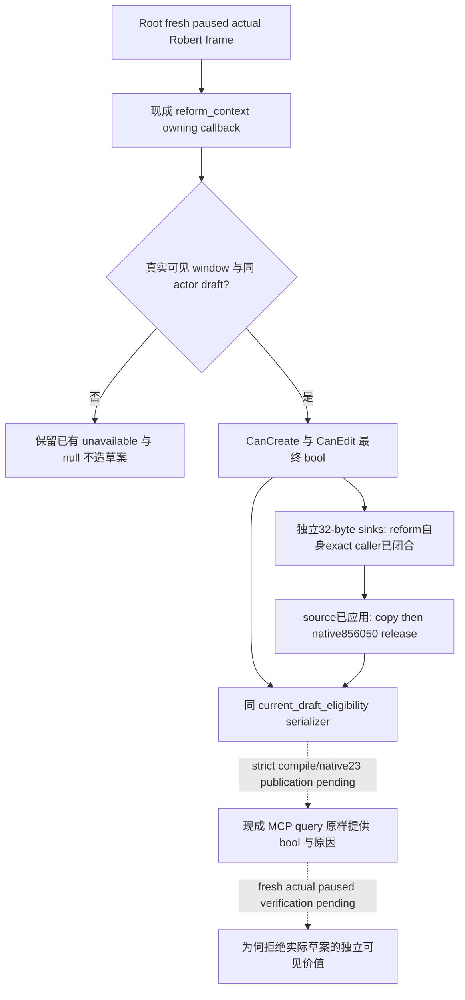

# 1.20.0.3 改革最终拒绝原因：原生 ABI 与最小 source 实现

2026-10-03，**exact native reason ABI 已闭合，Root 已应用两文件 source patch；严格编译和自然草案的实际文本仍 pending**。当前能力记为 research/source implementation，不提前授 static-ready 或 production-live。沿用已发布的[改宗与改革原生树](religion-conversion-and-reformation-native-ai-12003.md)及 source6443 的 exact 研究；本文更新不重扫调用树、字节或旧测试。CK3 1.20.0.3 / Steam25652598，EXE SHA `94B55397ABB687A3DCD436805A5D885E6BE90FA6C693FEB44A9E3BBEEADE02A6`。初始设计背景为 Root 冻结 Robert actor29829/date53222304、feudal、no XAR，**本包没有读取其当前 draft 或法律 permission**。Robert CA1 的既有 production-live loop 与 signed law reader 修复直接复用，不重发、不增加信用。

## 必要性与生产缺口

原 `religion_reform12002_eligibility.cpp:54–55` 真实生产 reader 对 `CanCreateRite 0x14F56D0`、`CanEditRite 0x14F5050` 均传 `nullptr` reason。header 已声明 `DraftEligibilityGetter(const void *window, void *reason)`；原 DTO/serializer 只有 `draft_actor_id/can_create_rite/can_edit_rite` 及读取失败原因。因此 `false` 能直接给出最终拒绝，却无法告诉自动玩家为什么拒绝实际草案。`unavailable_reason` 只描述缺窗口、binding 或 actor，不能替代 native final reason。这是原 source 的确定性观测缺口，**不是声称当前 Robert 已出现拒绝，也不是新的 live 故障**；下方 Root source patch 已接入非空 sink，但当前实机 native 仍为 v22b594，尚未由 native23 strict build 发布。

改宗已有独立 conversion reasons publisher，不再为改宗造重复口。本增量只处理改革的两条最终 getter；不接 Council `ReligiousRelations`，不把 recipient 接受度混入本人 create/edit permission。

## 同一只读查询的最小合同

继续使用 `ck3_query_player_religion_reform_context_v1(expected_revision=<同 owned session fresh public revision>)`、CLI `--private-player-religion-reform-context-query`、原 driver permission、domain 与 paused owning callback。`current_draft_eligibility` 仅增加：

| 字段 | 来源 | 语义 |
| --- | --- | --- |
| `can_create_rite_native_text` | CanCreateRite 独立非空 reason sink | nullable string；`null` 未读/未复制，`""` 成功读到空文本 |
| `can_edit_rite_native_text` | CanEditRite 独立非空 reason sink | 同上；不得以 create 的文本代替 edit |

保留完整当前语言 UTF-8 原文与两个原生返回 bool。非空文字不自动意味着拒绝，空文字不自动意味着允许；native bool 仍是最终许可。无稳定 reason code，不造机器码、不固定字符容量或截断。`current_draft_final_eligibility_ready` 仍表示最终 bool 已观测，文本 readiness 由各自字段非 null 得到，**不新增整个宗教或法律的门禁**。文本读取未完成时不得抹掉已有效的原生 bool。

现有 Python normalizer 对该 nested component 不封闭 keyset，并 `deepcopy(value)` 原样发布；native runtime 已调用 eligibility serializer，MCP 已路由此 getter。因此不需要新增 MCP tool、route、permission、budget 或 top-level readiness。若 native owner 合入后选择同时检查新增字段类型，那只是同一字段的正常 schema 实现，不能借此扩大门禁。

## 两文件 source 已应用，独立 exact reason ABI 已闭合

Root 已仅应用 `include/xar_bridge/religion_reform12002_eligibility.hpp` 中的 DTO/lifecycle binding 与 `src/religion_reform12002_eligibility.cpp` 的两 getter/serializer。每个 getter 使用独立 caller-owned sink，调用一次；先完整复制，再通过 native `0x856050` 释放。保留原 actor/window 检查与两个 returned bool，不再先 null 调用一次后为文字重复调用一次。

原非 null CString lifecycle unknown 已由 **reform 自身 caller** 闭合：create reason wrapper `0x14F5780`、edit wrapper `0x14F5110` 各初始化32-byte string，size `+0x10=0`、capacity `+0x18=15`。真实反射 caller `0x14FB0A0` 在 `0x14FB0CA`、`0x14FAF10` 在 `0x14FAF3A`，各复制后直接调用 `0x856050`；同 `0x14F48A0` 的 inline release 路径均使用 native free `0x4223F64`。这些是八个 actual exact native 窗口的独立证据，**不是从 conversion sink 推断**。完整[ABI evidence](Z:/ck3_mod_rewrite/artifacts/g2-maintainer-2026-10-02/resume-12003/m6-law/reform-final-reasons-12003/reason-sink-native/ABI-EVIDENCE.json) SHA `0b5e68cf7417fde0e0d591e7ccf9c3b7cf4f7218b30f70ca6ea80bd97ba2032c` 与[原生笔记](Z:/ck3_mod_rewrite/artifacts/g2-maintainer-2026-10-02/resume-12003/m6-law/reform-final-reasons-12003/reason-sink-native/ABI-NOTES.md) SHA `8e1ec950c5fedcbd11ddda3e5d37fb778ce8c1d06340180780a40cabf0612deb`直接复用，不重读字节。

Root 已应用的[两文件 patch](Z:/ck3_mod_rewrite/artifacts/g2-maintainer-2026-10-02/resume-12003/m6-law/reform-final-reasons-12003/reason-sink-native/ROOT-ONLY-REFORM-REASON.patch) SHA `90d6e5efac0d6b59f88dfae14b01ac1b752cfbd3dfcce0311a48132c298b439b`，header/source projected SHA 分别为 `8b0614fd8834c8b7af053a3dcf230d31ea2d4475bc2f946c80a98d98f0538448` / `87cfefd50bcd15c423bf5616bafe818b951a2b6830f11e74c978094521b6c8af`。这关闭 source 与 ABI 依赖，**strict compile 与自然可见草案的实际 native text 尚未完成**；不以 patch、八窗比较或已有旧 primitive 领取新的 live 信用。

## 一次验收与能力边界

剩余是 Root 的下一批 strict native23 build/适当 focused production reader 验证，以及后续**自然存在**可见草案时一次同 owned session fresh paused 查询核对 actor、两个 final bool 与各自原文；本次不为此打开窗口或制造草案。未打开/hidden/absent 窗口继续保留既有 unavailable/null，不填 false/0 或假当前材料。本文更新没有再跑 native 代码、旧 suite、函数字节或 fixture matrix，也不把另一个 Clergy domain 的 focused PASS 当作 reform PASS。新 readonly actual reason 成功后只能升级为 **production-live primitive**，不等于改宗、改革、接受度、扣款、下一日或冷恢复动作 loop。

法律侧下一动作仍需要 Root 的 current final candidate permission/cost/value；feudal/government/topology 本身不许可 CA2。本包没有法律源修复依据，不重复 CA1。原外置[设计及源码 pins](Z:/ck3_mod_rewrite/artifacts/g2-maintainer-2026-10-02/resume-12003/m6-law/reform-final-reasons-12003/QUERY-DESIGN.json)保留设计阶段边界；[source applied 报告字段](Z:/ck3_mod_rewrite/artifacts/g2-maintainer-2026-10-02/resume-12003/m6-law/reform-final-reasons-12003/SOURCE-APPLIED-REPORT-FIELDS.json)供 Root 合并10-03/2026-W40，无新 game/live/action/day/G2/M6 credit。
