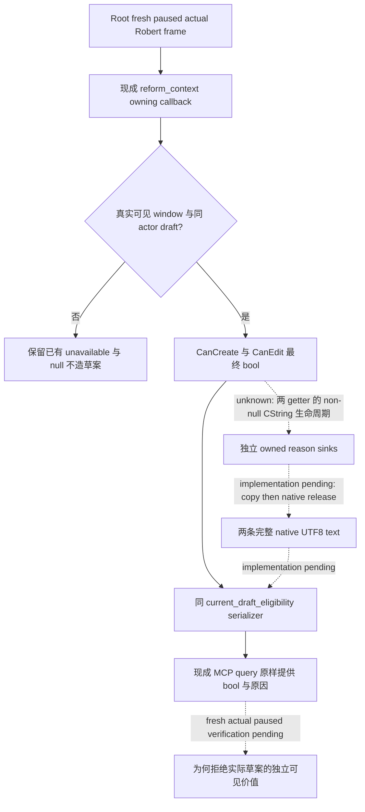

# 1.20.0.3 改革最终拒绝原因：现有查询增量设计

2026-10-03，状态 **research / query design**。沿用已发布的[改宗与改革原生树](religion-conversion-and-reformation-native-ai-12003.md)及 source6443 的 exact 研究；本页不重扫调用树、字节或旧测试。CK3 1.20.0.3 / Steam25652598，EXE SHA `94B55397ABB687A3DCD436805A5D885E6BE90FA6C693FEB44A9E3BBEEADE02A6`。Root 当前冻结 Robert actor29829/date53222304、feudal、no XAR 是本次背景，**本包没有读取其当前 draft 或法律 permission**。Robert CA1 的既有 production-live loop 与 signed law reader 修复直接复用，不重发、不增加信用。

## 必要性与生产缺口

现有 `religion_reform12002_eligibility.cpp:54–55` 真实生产 reader 对 `CanCreateRite 0x14F56D0`、`CanEditRite 0x14F5050` 均传 `nullptr` reason。header 已声明 `DraftEligibilityGetter(const void *window, void *reason)`；DTO/serializer 只有 `draft_actor_id/can_create_rite/can_edit_rite` 及读取失败原因。因此 `false` 能直接给出最终拒绝，却无法告诉自动玩家为什么拒绝实际草案。`unavailable_reason` 只描述缺窗口、binding 或 actor，不能替代 native final reason。这是已证明的现存观测缺口，**不是声称当前 Robert 已出现拒绝，也不是新的 live 故障**。

改宗已有独立 conversion reasons publisher，不再为改宗造重复口。本增量只处理改革的两条最终 getter；不接 Council `ReligiousRelations`，不把 recipient 接受度混入本人 create/edit permission。

## 同一只读查询的最小合同

继续使用 `ck3_query_player_religion_reform_context_v1(expected_revision=<同 owned session fresh public revision>)`、CLI `--private-player-religion-reform-context-query`、原 driver permission、domain 与 paused owning callback。`current_draft_eligibility` 仅增加：

| 字段 | 来源 | 语义 |
| --- | --- | --- |
| `can_create_rite_native_text` | CanCreateRite 独立非空 reason sink | nullable string；`null` 未读/未复制，`""` 成功读到空文本 |
| `can_edit_rite_native_text` | CanEditRite 独立非空 reason sink | 同上；不得以 create 的文本代替 edit |

保留完整当前语言 UTF-8 原文与两个原生返回 bool。非空文字不自动意味着拒绝，空文字不自动意味着允许；native bool 仍是最终许可。无稳定 reason code，不造机器码、不固定字符容量或截断。`current_draft_final_eligibility_ready` 仍表示最终 bool 已观测，文本 readiness 由各自字段非 null 得到，**不新增整个宗教或法律的门禁**。文本读取未完成时不得抹掉已有效的原生 bool。

现有 Python normalizer 对该 nested component 不封闭 keyset，并 `deepcopy(value)` 原样发布；native runtime 已调用 eligibility serializer，MCP 已路由此 getter。因此不需要新增 MCP tool、route、permission、budget 或 top-level readiness。若 native owner 合入后选择同时检查新增字段类型，那只是同一字段的正常 schema 实现，不能借此扩大门禁。

## Native owner 的两文件施工入口

只需 `include/xar_bridge/religion_reform12002_eligibility.hpp` 中的 DTO/lifecycle binding 与 `src/religion_reform12002_eligibility.cpp` 的两 getter/serializer。每个 getter 使用独立 caller-owned sink，调用一次；先完整复制，再通过已定位的 native release 释放。保留原 actor/window 检查与两个 returned bool，不再先 null 调用一次后为文字重复调用一次。

**具体剩余依赖**是这两个已知 getter 的非 null CString caller：初始化、复制布局、原生释放尚未在当前专题证据中闭合。conversion 的 sink 是32-byte MSVC string、destroy `0x856050`，只作比较来源；不能因为都叫 CString 就套到 reform。外部交付精确 query design 与两文件 recipe，**没有提供含猜测 ABI 的可应用 native patch**。Native owner 下一段定位只需该 caller/lifecycle，已有 final predicate、费用、草案、Doctrine/Tenet tree 不重研究。

## 一次验收与能力边界

Native owner 在完成上述 lifecycle 绑定后，用已有 focused production reader case 验证两个 bool 与完整 UTF-8 结果，保留旧 suite 结果，不重跑全矩阵。Root 自主选定宗教目标并准备真实草案后，在同 owned session 一次 fresh paused 查询核对 actor、两个 final bool 与各自原文；hidden/absent 窗口继续是现有 scope，不填 false/0 或假当前材料。新 readonly actual reason 只能升级为 **production-live primitive**，不等于改宗、改革、接受度、扣款、下一日或冷恢复动作 loop。

法律侧下一动作仍需要 Root 的 current final candidate permission/cost/value；feudal/government/topology 本身不许可 CA2。本包没有法律源修复依据，不重复 CA1。外置[设计及源码 pins](Z:/ck3_mod_rewrite/artifacts/g2-maintainer-2026-10-02/resume-12003/m6-law/reform-final-reasons-12003/QUERY-DESIGN.json)限定 owner 两文件入口；[报告字段](Z:/ck3_mod_rewrite/artifacts/g2-maintainer-2026-10-02/resume-12003/m6-law/reform-final-reasons-12003/REPORT-FIELDS.json)供 Root 合并10-03/2026-W40，无新 game/live/action/day/G2/M6 credit。
