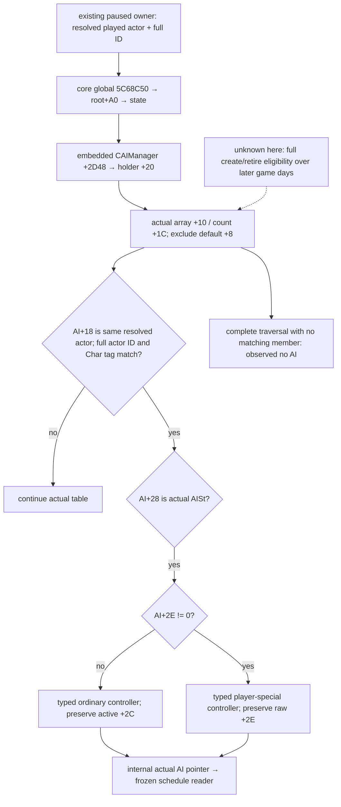

# CK3 1.20.0.2：当前角色的真实 AI holder context

本包补 [schedule 输入 reader](religion-reform12002-schedule.md) 的 `optional_actual_ai` 来源，只读当前真实 controller。原 willingness 7 文件、schedule 8 文件及已有宗教 queries 保持冻结；没有游戏进程、pipe、UI、Steam、动作或战争研究。

Exact build 为 `1.20.0.2 Crozier / Steam25588574`，EXE SHA-256 `AE1BA6FF060BA603842F6F4A2DED0AF4B7D3666B3DD271F75FB01B0DA8E81B2D`。caller 使用已有 paused application-main owner 与 full-generation character resolver，提供当前 played actor 及其完整 32-bit ID；本包不重新发现进程或获取控制游戏的权限。

[新 ABI verifier](../../ck3_autonomous_player/native_bridge/research/religion_reform12002_ai_context_verify.py) 和 [ABI map](../../ck3_autonomous_player/native_bridge/research/religion_reform12002_ai_context_abi.json) 一次冻结 **5 个完整函数、4 个 slice、30 条语义 anchor GREEN**。map SHA-256 `998be5f05a815cf4c28f6b000a4d01f47e2eeee50749366ac6bb4b7f1d28d3c7`；[实际 proof](Z:/ck3_mod_rewrite/artifacts/g2-offline-2026-10-01/religion-reform/ai-context/abi/abi-verification.json) 直接复用已冻结 schedule map，不重跑旧 ABI 或 fixture。

## 实际容器与只读路径

既有 core game-state global 是 **`0x5C68C50`**。其 root **`+0xA0`** 指向 state；state 内嵌 **`CAIManager +0x2D48`**，其 **`+0x20`** 指向 AI holder。holder 的 actual controller **array 在 `+0x10`、count 在 `+0x1C`**。这些字段由 schedule 的 daily stage、manager 构造和 prepare actual traversal 直接闭合，不把 secondary interface 的 `+8` 漏算成另一组字段。

holder **`+0x08`** 是 default AI sentinel，不是实际成员数组。holder 初始化 `0x1ACB5E5–0x1ACB638` 分别写 default pointer 与清空 actual array/count；actual AI constructor **`0x1ACBB90–0x1ACBD22`** 写 **`AI+0x18 = supplied actor`**，写 **`AI+0x28 = AISt (0x41495374)`**，然后将该 owning AI pointer append 到 holder array、增加 count。这些 constructor 仅用于确认字段写源，provider 不调用它们。

normal AI 的角色字段来源由 `0x1A2FA70` 闭合：读 actor **`+0x1B0`** 的 living data，再读 living **`+0x278`**；将其与 holder default `+8` 比较，必要时才调用 constructor，并回写 living `+278`。维护路径 `0x1A2ECF0` 的选定分支在调用 `0x1A2F760` 后将 living 字段恢复为 holder default。本包不把这个可能创建 AI 的函数误绑为只读 getter，也不展开一般 controller 生命周期中的其他 domain。

player special AI 的写源复用 schedule 的 `0x1A32CF0`：它同样将 **manager `+0x20` holder** 传给 `0x1ACBB90`，因此真实 special AI 也由同一个 append 路径加入 actual array；随后设 **`AI+0x2E=1`**，并写 player instance **`+0x2E8`**。故可直接从实际 table 找到它，无需制造一个 AI 或猜测特殊 controller 在表外。

如果同一 actor 当前有多个实际成员，provider 返回全部 typed contexts，不猜普通与 special controller 的优先级，也不把 active=false 变成 absence。一个合法玩家没有普通 AI，或者 holder 中没有任何实际 controller，是可观测的 `no_ai`；不能把 sentinel 的 AISt tag 单独当成真实玩家 AI，也不能把这个结果误写成 reader unavailable。

## 已找到的原生只读 getter 边界

**`0x28CA250–0x28CA2D3`** 是完整只读 player-AI getter，没有 native call 或 memory store：从同一 state 取 player instance array **`+0x22340` / count `+0x2234C`**，比较 instance **`+0xB0`** 与 actor **`+0x18`** 的完整 32-bit ID；通过 `PlIn` tag **`+0xDC`** 和有效 instance ID **`+0xD8`** 后取 instance **`+0x2E8`**，否则返回 global **`0x5D21A10`** default AI。它是 player 路径，不能代替所有普通角色的 getter。

普通 AI predicate leaf **`0x28AC130–0x28AC14F`** 沿 living `+278` 仅返回 AISt type-tag 判定的 bool；special predicate **`0x28AC150–0x28AC168`** 调上述 player getter后返回同一 bool。它们都不是返回 AI pointer 的 `GetAI`。本 provider 走实际 table，不调用这两个 bool predicate，也不调用任何 creator、constructor 或 mutating updater。

## Public input 与资格

[新 header](../../ck3_autonomous_player/native_bridge/include/xar_bridge/religion_reform12002_ai_context.hpp) 与 [actual provider](../../ck3_autonomous_player/native_bridge/src/religion_reform12002_ai_context.cpp) 提供 `BindReformAIContextImage12002(base, exact_sha)` 和 `ReadActorReformAIContext12002(bindings, resolved_actor, full_id)`。API 将 exact root slot 与 caller 已解析的 actor/full ID 结合，返回 typed observation：bindings/actor/container unavailable、完整观测无 AI、或实际 controllers。每个内部 record 包含 actual AI pointer、ordinary/player-special 分类、raw active 与 special byte；pointer 只供同一 paused owner 调 `ReadReformScheduleInputs12002`，`SerializeActorReformAIContext12002` 不发布地址。

角色身份为完整 generation，合法 full ID 0 可以读取。合法空表/default-only 状态可以确认 no AI；传入 stale generation 则不能观察为当前角色。普通和 special 两类都可分别获得 frozen schedule 的当前真实 timer/cache，而不长期保持 `not_supplied`。这解除 context 传参缺口，不提高改革动作、willingness 分数、AI 下一动作、G2 或完整 OODA 资格。

[actual table fixture](Z:/ck3_mod_rewrite/artifacts/g2-offline-2026-10-01/religion-reform/ai-context/fixture/result.json) 经 MSVC **`/O2 /W4 /WX` 一次 9 cases GREEN**，覆盖合法 default-only/no AI、完整 generation、普通/special 两条实际 schedule consumption、多 context/active=false、serializer 无地址、合法零 ID 与 unavailable container。它调用实际新 production reader，并将返回 pointer 直接交给冻结 schedule reader；没有重跑原 schedule 八项矩阵。

状态为 **`static-ready readonly AI-context primitive`**；native tree 为 research/static-confirmed。没有实际 paused artifact，不能提升 live 或完整策略资格。下一步是由 owned query-runtime owner 将当前 played actor 传入新 provider，对每个返回 controller 调冻结 schedule reader；no AI 时发布明确 typed absence。本包不修改 shared query/CMake/MCP。一般 creator/retire 决策语义、native 日 queue consumer 与实际改革结果仍是其他明确的施工入口，不能拿它们阻塞这项真实只读输入。新 ABI 与 fixture 首次完成均 GREEN，没有失败 capability/live attempt。
