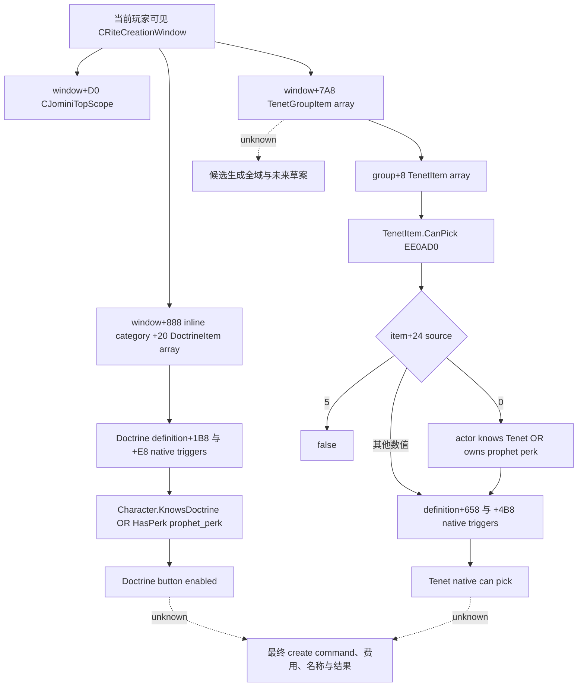

# CK3 1.20.0.2 当前信仰草案 popup choices

2026-10-01 16:58 Asia/Shanghai；范围为用户已授权的宗教迁移。这里只读实际存在、可见、属于当前玩家的 `CRiteCreationWindow` 已生成候选集合。状态为 **static-ready library**，没有本包 paused live artifact，不代表完整创建／改革操作。

冻结游戏：1.20.0.2 Crozier，Steam build 25588574；EXE SHA-256 `AE1BA6FF060BA603842F6F4A2DED0AF4B7D3666B3DD271F75FB01B0DA8E81B2D`。依据原生研究入口 [README](README.md)，复用 [window](religion-reform12002-window.md) 的 actual current window reader，以及 Doctrine knowledge 和 Tenet key helper。没有调用 CK3、UI、pipe、Steam，也没有生成或选择候选。

## 原版 GUI 与 native 树

`gui/window_rite_creation.gui:1251` 的 Doctrine 按钮是 `DoctrineItem.CanPick(TopScope.Self)` 与 `pam_know_doctrine.IsValid` 的 AND。`common/scripted_guis/pam_scripted_guis.txt:82–91` 后者要求实际玩家知道该 Doctrine，或持有 `prophet_perk`。不能把 DoctrineItem.CanPick 单独称作完整按钮合法性。

`window_rite_creation.gui:1450–1478` 先绑定 `RiteCreationWindow.GetFaithScope`，再展开 `TenetGroupItem.GetTenets`，按钮直接使用 `TenetItem.CanPick(RiteCreationWindow.GetFounder.Self, TopScope.Self)`。两类 `CanPick` 同名反射注册有不同签名，不能互换：Doctrine wrapper 是 `EE4E60`，Tenet wrapper 是 `EE47A0`，后者调用 native core `EE0AD0`。

## exact ABI

| 输入 | exact 证据 |
|---|---|
| 当前窗口 | 共用 `ReadCurrentRiteCreationWindow12002`；owner/handler/published window、可见性、当前玩家 full ID 与 paused frame |
| TopScope | `C46360` 返回 `window+D0`；`14FBC60` wrapper；`F05190` metadata `54D7E08` 对应 `CJominiTopScope*` RTTI |
| Doctrine candidates | `GetDoctrineCategoryWindow` 注册 `22CFD0→14FBF30→1070BA0` 返回 inline `window+888`；`14FA96C` 返回 category+20；`15149C6` 确认 stride `0x50` |
| Tenet candidates | `14FBD00→B80140` 返回 window+7A8；`151056B` 确认 group stride `0x20`；`EE49BC` 返回 group+8；`F07720` 确认 item stride `0x70` |
| 两类定义指针 | 实际 item+28；CPdxArray data+0、capacity+8、count+C |
| Doctrine base gate | `D7AC8→EE4E60`；`EE4ECE` definition+28，`EE4ED8/EE4EE8` definition+1B8/+E8，分别调用 `372DF30(trigger,scope)` |
| Doctrine knowledge | 复用 `religion_doctrine12002_choices.hpp` 的 `NativeKnowsDoctrine`，native `28B0C00`，不重跑通用 provider 矩阵 |
| Prophet | 复用既有 LIFE `HasPerk 2919070`；已初始化 database global `5C67128`，cache+EF0；`31EA325` 的 `prophet_perk` literal `48CC598`，`31EA331` 长度12，`31EA377` 写 cache+EF0 |
| Tenet complete native gate | `D58B7→EE47A0` wrapper `EE487C→EE0AD0`；source5拒绝，source0知识／prophet门，其余继续 native triggers |

`8FCD40` 若 global 为空可初始化 perk database，所以 producer 直接读取现存 global/cache。源0 Tenet 的原生判定依赖该已初始化数据库。没有调用数据库初始化 getter。source 数值保持原始枚举，只闭合 source0 与 source5 分支；没有为其他数值创造业务标签。

Doctrine key/group 使用公共 `CopyDoctrineDefinition12002`；Tenet key 使用公共 `CopyTenetDefinitionKey12002`，后者确认 CDB `GDbo` magic 与 CString+18。对象指针仅用于内部执行，不序列化。

`14F4400` 返回“selected Rite 是当前玩家所属 Rite，且玩家是该 Rite head”。它不是旧版 Faith reformed bool。费用链的 window+B28 和最终命令 window+8E8 属于其他包，本文没有把两者宣称为同一草案 layout。

## readonly 交付与验证

API：`BindCurrentDraftChoices12002`、`ReadCurrentDraftChoices12002`、`SerializeCurrentDraftChoices12002`，命名空间 `xar::ck3_12002::religion_reform`。绑定复用共用 window/Doctrine binder。窗口隐藏或缺失返回已观测的无当前草案；可见窗口中的0行是已观测空集合。输出 `scope=already_materialized_current_popup_candidates`；不遍历全 registry，不声称所有未来合法候选。

Doctrine 输出 key/group、popup index、native base gate、按短路实际求值的 knows/prophet、完整 GUI button enabled。短路未求值的知识／perk 为 null，不影响已闭合的按钮 false/true。Tenet 输出 key、group/item index、原始 source 与实际 native can pick。

artifact：`Z:\ck3_mod_rewrite\artifacts\g2-offline-2026-10-01\religion-reform\choices`。

- `native/result.json`：exact EXE、22个函数跨度、20个指令／RIP anchors、scope RTTI、3段原版 GUI/script 证据，GREEN。
- `fixture-attempt-02/result.json`：实际 C++ provider 与 serializer，MSVC `/W4 /WX /Od`、`/O2` 各10检查、6份实际 JSON GREEN。验证当前 actor/scope/item、已知Doctrine短路、prophet替代、原生false、隐藏窗口、物化空列表、变化帧、initialized cache 与 exact binding。
- 保留 `fixture-attempt-01`：初次测试对 native call 次数的预期误算；更正测试后完成上述必要验证。属于 harness RED，不是原生能力 RED。
- `delivery-result.json`：源路径/SHA、可核验证据与日报/周报合并字段。

尚需中央 owner 合并到 owner-thread snapshot/MCP 并在当前游戏暂停帧、真实打开的创建窗口执行只读观测，才能升至 fixture-live / production-live primitive。完整创建／改革操作、候选生成、AI desirability 与最终产出仍由对应包继续；当前独立价值是直接发布现有 popup 候选的真实可选结果。
