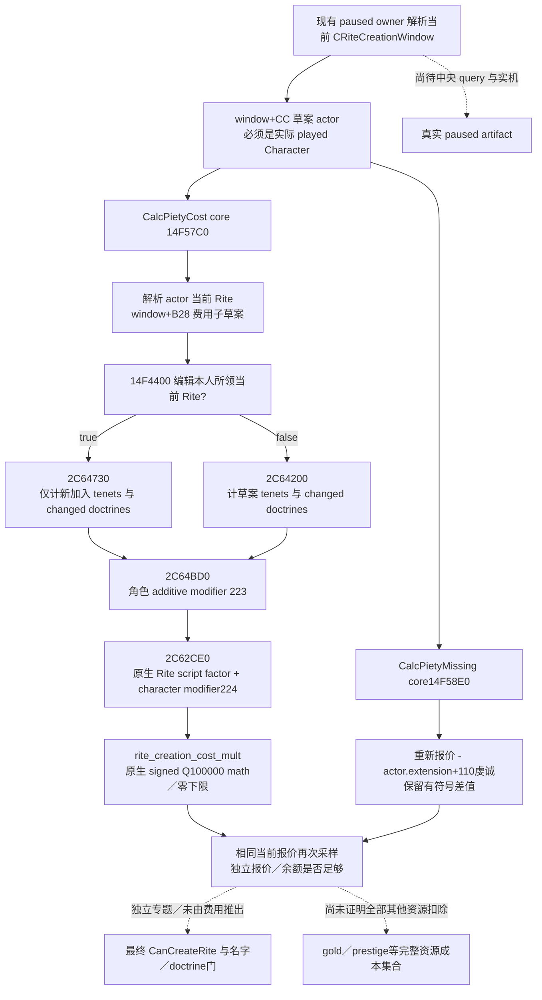

# 1.20.0.2 Rite 创建／编辑：实际虔诚报价

项目所有者已于 2026-10-01 恢复宗教研究，同时停止战争研究。本包只读现有宗教创建草案的报价，不打开窗口、不新建草案、不提交动作，也不研究战争、圣战或 holy order。

冻结版本：CK3 **1.20.0.2 Crozier / Steam25588574**；`ck3.exe` 101,039,736 bytes，SHA-256 **AE1BA6FF060BA603842F6F4A2DED0AF4B7D3666B3DD271F75FB01B0DA8E81B2D**。当前身份解析复用 [Rite→Faith→Religion](ck3-1.20.0.2-religion-context.md)。创建与改革使用 `CRiteCreationWindow` 的 Rite 草案；不能把当前 Faith context 或旧版 CreateFaith 对象当作新版草案。

## 原生报价树

原版 `gui/window_rite_creation.gui` 使用 `CalcPietyMissing` 显示不足警告，创建按钮使用独立 `CanCreateRite`；两者不能互相替代。`GetCostTooltip` 会清空并写回 `window+0x1120` 的 UI tooltip 对象，本只读 provider 不调用它，而调用不写草案的实际数值 getter。

这里的 native bool **不是“创建新 Faith”或“改革”**。完整 `0x14F4400…0x14F449B` 从全局当前 Player 解析 Rite，要求 `window+0xC8` 等于玩家当前 full RiteID，且 `Rite+0x4C0` 的负责人等于 Player 的 full CharacterID。费用分支因此是“编辑本人所领当前 Rite”；Faith divergence／改革资格由别处决定。

`2C64730` 检查选中 tenet 是否已经在当前 `Rite+0x758` collection；新加入者才加成本。`2C64200` 对草案 tenets 逐项调用原生 `Tenet.GetPietyCost` (`0x31D9950`)。两者读取费用子草案 tenet 指针表 `+0x8/count+0x14`、doctrine 表 `+0x50/count+0x5C`；并非只乘一个 stock 固定常数。费用子草案的 `window+0xB28` 与 typed 创建命令复制的整体草案 `window+0x8E8` 相差 `0x240`，本组件直接调用原生窗口 getter，不据此自行构造或提交命令。

## exact ABI

| 方法／边 | RVA／字段 | 实际意义 |
| --- | --- | --- |
| `CalcPietyCost` registration | `0x22A460`，callback LEA `0x22A541` | callback `0x14FB120` → core |
| `CalcPietyCost` core | `0x14F57C0` | `int64_t*(CRiteCreationWindow*, int64_t* out)` |
| `CalcPietyMissing` registration | `0x22A5D0`，callback LEA `0x22A6B9` | callback `0x14FB160` → core |
| `CalcPietyMissing` core | `0x14F58E0` | 同参数／返回同一 out；真实 `price-current_piety` |
| owned-current-Rite edit predicate | `0x14F4400` | `bool(CRiteCreationWindow*)`；Player 当前 Rite 与负责人检查 |
| window actor/source Rite | `+0xCC / +0xC8` | 完整 32 位代际 ID；不截为 storage index |
| window price draft | `+0xB28` | core 传给 evaluator 的现有草案子结构 |
| full native evaluator | `0x2C64BD0` | `out RCX, edit_bool EDX, Character* R8, Rite* R9, draft* stack5, optional text stack6, optional breakdown stack7` |
| ordinary creation/edit pricing | `0x2C64200 / 0x2C64730` | 选中 tenets／changed doctrines；保留原生分支 |
| final factor evaluator | `0x2C62CE0` | 原生 script factor、modifier `0x224`、定点数学和零下限 |
| additive character modifier | `0x223` | 原生 aggregate modifier；不手写其值 |
| current actor piety in missing | `Character+0x1B0 → extension+0x110` | 原生 extension 缺失时按该 getter 原生路径处理 |

`CalcPietyMissing` 没有将差值截为零，原版 GUI 的条件是 `GreaterThan_CFixedPoint(...,0)`。provider 保留 `piety_missing_signed_raw`：小于或等于零表示该报价的虔诚预算充足。`has_enough_piety` **只表示预算**，不是最终创建／编辑合法性，更不是已扣款或动作成功。

script-factor 名称已经闭合：`0x1D62033` 注册 enum `0x22`，`0x1D62038` 指向实际 `rite_creation_cost_mult` 字符串；原生 `0x2C62900` 从 script-value 指针表 `+0x110`（`0x22×8`）读取同一条目。原版 `common/script_values/02_religion_values.txt:3363–3375` 指定角色、旧 Rite、旧 Faith 三个 scope，并从 `old_faith.faith_conversion_fervor_mult` 的一半作 subtract。engine 以 `1+script_factor+character_modifier` 做最终乘数；本 provider 调用原生，不复制公式，也不把字符热忱单独替换成我方猜算成本。

## 最小组件接口与边界

`religion_reform12002_costs.hpp/.cpp` 的 `BindRiteCreationCostsImage12002` 仅计算 exact-build 地址；`ReadCurrentRiteCreationCosts12002` 接收现有 paused application-main owner 提供的 `CurrentDraftView`，读取实际窗口 actor/source Rite，调用实际三 getter，复制数值并确认两次报价一致。组件不搜索进程、不发现 UI、不入队游戏命令；窗口类型／当前 paused frame 由共用创建上下文 provider 解析。

输出 `ck3_12002_rite_creation_costs_v1`，包含完整源 RiteID、是否编辑本人所领当前 Rite、实际 `piety_cost_raw`、有符号不足值、预算是否充足和 `raw_scale=100000`。零费用保持 `0`；无窗口或原生读取失败使 `available=false`、费用为 `null`，同时有明确 failure。它不声称 gold／prestige 成本为零；`other_resource_costs_observed=false`，完整其他资源消费要由 command 执行／扣除语义专题闭合。

尚待当前窗口 discovery／中央只读 query 接线和真实 paused artifact。此组件即使静态夹具通过，也只能称 **static-ready library**，不能称 live，不能用预算充足替代创建最终门。

## 验证记录

exact verifier 记录 **14 个完整 native／registration function、32 条语义指令、6 项实际 provider 常量与3份 stock 文件哈希**。MSVC `/W4 /WX /Od`、`/O2` 各通过 **71 项检查**，每种模式产出 **6 份实际 C++ JSON**，由 Python parser 读回零／absent／完整代际／负预算差值／原生失败语义。callbacks 是夹具进程内的函数，没有执行游戏 EXE 中的函数；它不是 fixture-live。

首轮 `/Od` 的 optional uint32 与整数 `0` 比较触发 `/WX C4389`，属于测试编译 harness RED；原始 `provider/Od/build.log` 保留。测试改为无符号 `0U` 后两种模式通过，原生 provider 与 getter 地址没有因该失败改变。

结果及 source pins 写入 `Z:/ck3_mod_rewrite/artifacts/g2-offline-2026-10-01/religion-reform/costs/native/native-result.json` 与 `provider-v2/result.json`，完整交付清单在 `delivery-result.json`。本专题没有任何 CK3 实机 artifact。
