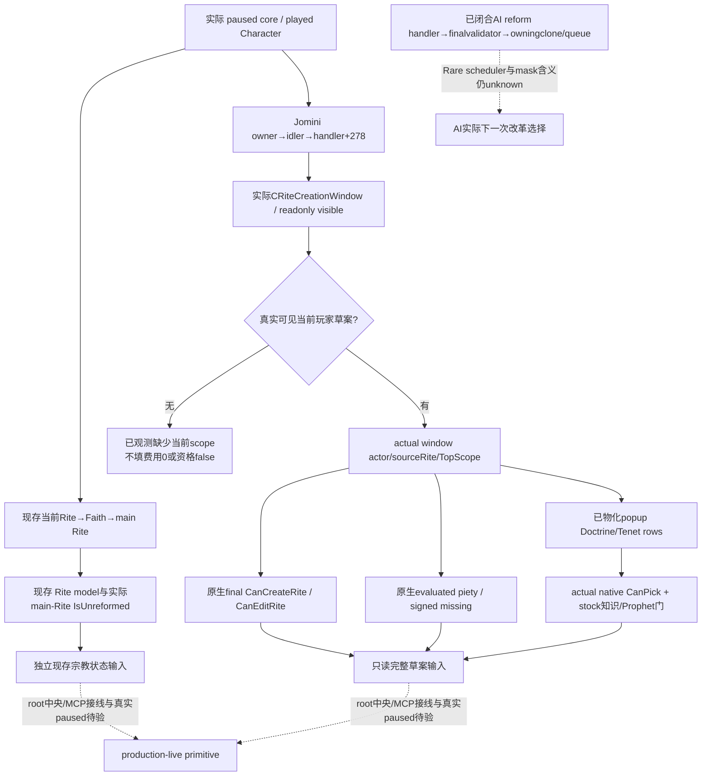

# 1.20.0.2 宗教创建/改革只读增量：首批交付

2026-10-01 17:02（Asia/Shanghai）收口。五个并行子包及其共用现存窗口 reader 已完成：**44 个独占源码/证据/专题文件**，最高为 **static-ready libraries**。它们没有修改首轮已冻结 nonwar DLL/profile，没有 CK3、pipe、UI、Steam、战争研究、宗教动作或 counter-policy。Git 与共享集成由 root 负责。

冻结为 CK3 **1.20.0.2 Crozier / Steam25588574**，EXE SHA-256 `AE1BA6FF060BA603842F6F4A2DED0AF4B7D3666B3DD271F75FB01B0DA8E81B2D`。16:19 的[施工起点](religion-reform12002-overview.md)保留原计划与首批36文件截点；本页记录已闭合的最终增量，不能把旧图中的 ABI 待查状态当成本次当前状态。

| 专题 | 实际独立值 | MSVC `/Od`、`/O2`、`/W4 /WX` 已通过范围 |
| --- | --- | --- |
| [实际现存窗口](religion-reform12002-window.md) | 当前窗口 presence/visible；可见实际玩家草案的内部来源 | 各8 cases、4实际 C++ JSON |
| [最终资格](religion-reform12002-eligibility.md) | 草案最终 `CanCreateRite / CanEditRite` 原生布尔值 | 各16 checks、6实际 C++ JSON |
| [实际报价](religion-reform12002-costs.md) | 当前草案 evaluated piety、signed missing、是否够用及编辑模式 | 各71 checks、6实际 C++ JSON |
| [实际候选](religion-reform12002-choices.md) | 已物化当前 popup Doctrine/Tenet rows；原生按钮门与知识/Prophet 组合门 | 各10 checks、6实际 C++ JSON |
| [现存 Rite 模型](religion-reform12002-rite-model.md) | main/founder/head full refs、实际 divergence、动态 heresy threshold | 各20 checks、5实际 C++ JSON |
| [AI 与主 Rite 状态](religion-reform12002-willingness.md) | 主 Rite 的实际 IsUnreformed；真实 AI reform handler 及非军事结果树 | 各8 cases |

这些是实际生产 C++ reader/copier/serializer 和 fixture-owned native 回调组合，JSON 由 Python 直接解析；未调用游戏 EXE 的函数，不是 fixture-live。初轮 costs signed literal 编译和 choices fixture 调用计数误写的 harness RED 均保留，修正后最终两个模式通过；没有将失败删除或冒充实机能力 RED。

报价中的 `0x14F4400` 是“编辑本人所领当前 Rite”，不是“创建 Faith”。window 费用子结构 `+0xB28`、命令草案 `+0x8E8` 与 TopScope `+0xD0` 分开记录，没有凭它们的地址相近伪造统一 draft ABI。Faith reform/派生走新版 RiteCreationWindow 共同模型；当前 Faith 身份不能代替创建草案。

候选只读范围是 **already-materialized current popup candidates**：Doctrine category `window+0x888` 的 array `+0x20`，Tenet groups `window+0x7A8` 和各 group 内候选 array。观察0条可以是实际 empty；它不表示全 registry 的所有未来合法选择已枚举。知识 getter 及 Doctrine/Tenet key copier直接复用另一宗教包的实际源码，不重复其已通过矩阵；具体依赖与 SHA 在候选 delivery manifest。

完整 source manifest 为 `Z:/ck3_mod_rewrite/artifacts/g2-offline-2026-10-01/religion-reform/final-source-package.json`，含精确44路径/SHA、六个组件回执、report fields和保留失败。首批36的 `ready-source-package.json` 保留原字节，候选新增7文件与本页单独交付；没有回写旧 artifact。

后续依次是 root 将这些库接入同一只读 native/MCP 路径，在真实 paused 帧读取现存宗教模型，并在真实创建窗口已物化时验 positive 草案资格/报价/候选。当前没有 headless 新草案 builder、宗教 typed action、独立创建结果、next turn或cold资格。其它资源费用未证明的部分保持明确缺口；Rare AI调度与通用 AI create caller仍是具体下一研究入口。G2 credit与整局资格不增加；战争停研授权限制已于 2026-10-03 撤销，后续战争研究、实现、策略和实机可继续，未完成能力仍按真实证据记录。
