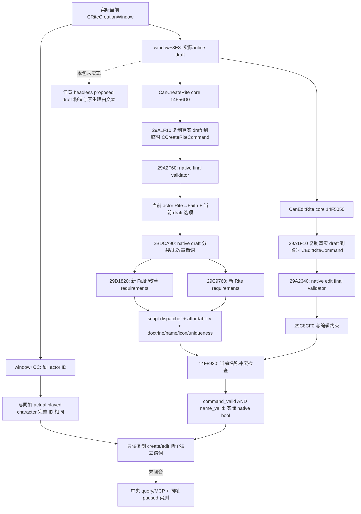

# 1.20.0.2 Rite 草稿创建／改革资格最终原生判定

用户于 2026-10-01 明确恢复宗教研究，同时停止战争研究。本包只读冻结文件和夹具内存，不访问 CK3 进程、pipe、UI、Steam，不提交宗教动作或改变 counter-policy。

冻结构建为 CK3 **1.20.0.2 Crozier / Steam25588574**，EXE SHA-256 **`AE1BA6FF060BA603842F6F4A2DED0AF4B7D3666B3DD271F75FB01B0DA8E81B2D`**。实际 provider 的范围是 **当前真实 `CRiteCreationWindow` 所持草稿**，状态 **`static-ready`**。它不创建任意 headless 草稿，也不把整个改革系统记为完成；中央/MCP/真实 paused frame 尚未验收。

## Stock 与最终树

冻结 `gui/window_rite_creation.gui:593–629` 的编辑按钮使用 `CanEditRite`；新建礼仪与未改革信仰的改革按钮均使用 **`RiteCreationWindow.CanCreateRite`**。`GetPlayer.GetFaith.IsUnreformed` 决定改革按钮可见；`Not(IsObserver)` 是 GUI 另一个外层条件。`FaithWindow.CanCreateRite` 则是另一模型的同名开窗谓词，其 callback `0x14C8580 → 0x14C5BB0` 不能替代草稿最后资格。

冻结 `common/scripted_rules/00_rules.txt:22–33` 明确：`can_create_rite` 规则还用于改革，并且仅是 **在虔诚与教义要求之外**的角色规则。`00_religious_triggers.txt:3140–3253` 的规则包含成年、当前和平、封地层级/领属、神学代理、本人不是 Faith 宗教领袖、未创建过信仰；当前 Faith 未改革时，再判已改革变量、可豁免的圣地要求、当前规则的帝国分支及阻断改革变量。这些是源文件条件，不以手写布尔重做 native 最终门；战争仅作为该现成资格谓词的一个原版输入，没有新增战争研究。



本树记录实际 native 输入与判定，不是我方策略。`2BDCA90` 在 `Faith.IsUnreformed(0x2BD8960)` 为真时直接为真，否则还比较提案变化的 native divergence 与阈值；它不能被重新命名为纯 `IsUnreformed`。Faith 的未改革状态来自 **Faith.main Rite**，由[独立 Faith 原生谓词专题](religion-reform12002-willingness.md)负责；actor 当前 Rite 与 main Rite 仍保持独立身份。

## 绑定与真实读取范围

| 绑定 | RVA / offset | 已冻结语义 |
| --- | --- | --- |
| `RiteCreationWindow.CanCreateRite` reflection | `0x14FB0E0` | 传 `reason=nullptr` 到 `0x14F56D0`，把 AL 原值写入 bool visitor |
| `CanCreateRite` core | `0x14F56D0` | actor `window+0xCC`；draft `window+0x8E8`；native command final AND 名称检查 |
| `RiteCreationWindow.CanEditRite` reflection | `0x14FAF50` | 传 `reason=nullptr` 到 `0x14F5050` |
| `CanEditRite` core | `0x14F5050` | Rite `window+0xC8`、actor `window+0xCC`、相同实际 draft；native edit final AND 名称检查 |
| `CCreateRiteCommand` primary vtable | `0x4770550` | `+0x30` 为 `0x29A2F60` final validator |
| create final validator | `0x29A2F60` | 完整 actor ref；当前 Rite→Faith；当前选项；分派两个原生 requirements |
| shared名称检查 | `0x14F8930` | 当前草稿名称冲突；不是动作或队列提交 |

`29D1820` 与 `29C9760` 均调用 `1D65B00` 的角色规则 selector **3**，随后合并实际费用可支付性和已选教义要求；该 selector 的完整 loader/key 映射没有在本组件独立展开。最终 native method 已直接消费它，本包不将脚本规则通过冒充完整最后门。

实际实现为 [header](../../ck3_autonomous_player/native_bridge/include/xar_bridge/religion_reform12002_eligibility.hpp) 与 [provider/serializer](../../ck3_autonomous_player/native_bridge/src/religion_reform12002_eligibility.cpp)：

```cpp
EligibilityBindings BindEligibilityImage12002(uintptr_t module_base, string_view sha);
bool ReadCurrentDraftEligibility12002(const EligibilityBindings&, const void* real_window,
                                     uint32_t actual_played_character_id, DraftEligibility&);
```

真实窗口的发现由 companion window observer 提供，调用者是既有 paused application-main owner；query request 不提供地址。provider 先核对 `window+0xCC` 与同帧完整 played actor ID，再调用两个 native core（均传 null 理由参数），复制返回的两个真实 bool，并确认窗口主体没发生变化。它没有调用 Create/Edit、clone、command queue，也未使用 AI 的预设草稿初始化器。

输出 schema 为 `ck3_12002_rite_draft_eligibility_v1`，`scope=actual_current_rite_creation_window_draft`。`available=true / can_create_rite=false` 是真实已观测负资格；没有当前窗口则是 `available=false / current_window_unavailable`，两个谓词为 `null`。完整高位 generation 的 actor ID 被保留。`can_create_rite=true` 仍不意味着整个 GUI 外层的可见性/observer 条件、玩家选定动作或材料后置已验收，也不自动把当前窗口称为改革场景。

## 验证与剩余

[exact verifier](../../ck3_autonomous_player/native_bridge/research/religion_reform12002_eligibility_native.py) / [冻结 ABI](../../ck3_autonomous_player/native_bridge/research/religion_reform12002_eligibility_abi.json) 记录 **11 个完整函数、2 个 registration slice、15 条确切 call edge、15 个语义指令、1 个 vtable binding、3 个 stock 窗口及文件 SHA**。native evidence：`Z:/ck3_mod_rewrite/artifacts/g2-offline-2026-10-01/religion-reform/eligibility/native/`。

[组件 fixture](../../ck3_autonomous_player/native_bridge/src/religion_reform12002_eligibility_test.cpp) 直接链接实际 provider/serializer；[runner](../../ck3_autonomous_player/native_bridge/research/religion_reform12002_eligibility_run_tests.py) 在 MSVC `/W4 /WX /Od`、`/O2` 各通过 **16 项检查**，各输出 **6 份实际 C++ JSON** 并由 Python 解析。包括 native false 与 unavailable、独立 create/edit 值、full actor generation 不匹配、不调用错误主体、窗口缺失、无 stale gate 值、主体变化及 exact source binding。fixture native callbacks 属于夹具进程；它证明 bridge 的读取/传输合同，没有调用真实游戏 getter，没有 `fixture-live` 资格。

结果：`Z:/ck3_mod_rewrite/artifacts/g2-offline-2026-10-01/religion-reform/eligibility/fixture/result.json`。后续由 parent 接回实际 window observer 和查询，再由 root 在自然真实草稿场景做 paused 正/负资格互证。没有本包 live artifact，亦未解锁动作、完整改革 OODA 或宗教 AI 决策质量。

```text
python ck3_autonomous_player/native_bridge/research/religion_reform12002_eligibility_native.py --exe <frozen-exe> --output-dir <Z-artifact-dir>
python ck3_autonomous_player/native_bridge/research/religion_reform12002_eligibility_run_tests.py --output-dir <Z-artifact-dir>
```
