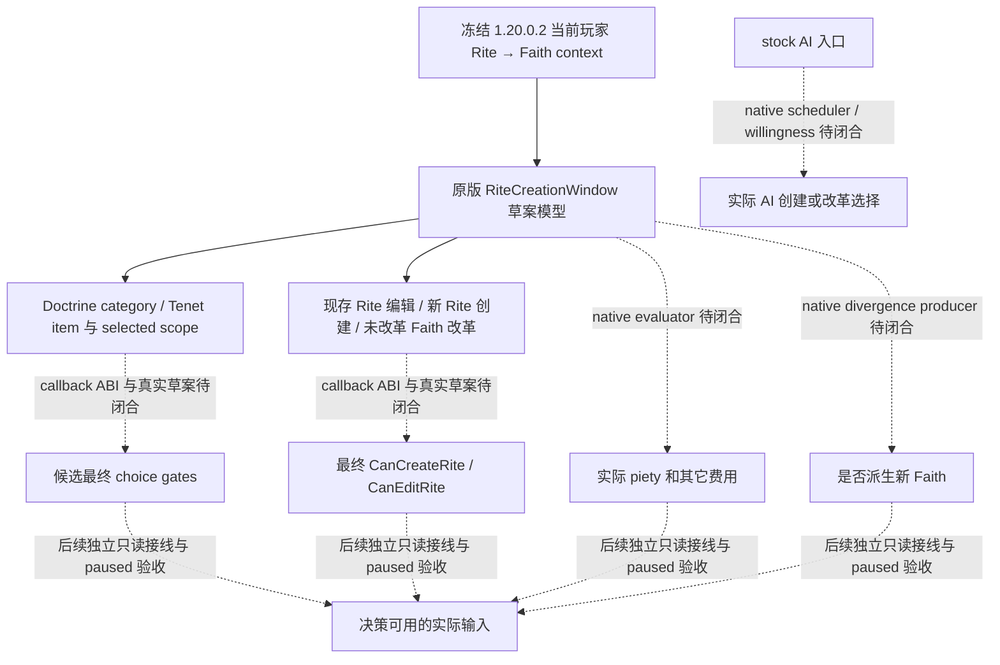

# 1.20.0.2 宗教创建与改革：原生只读施工入口

状态为 **research**。项目所有者于 2026-10-01 明确恢复宗教研究，当时同时停止战争研究。本专题首包处理 Faith/Rite 的创建、派生、改革只读输入，当时未实施创建/编辑动作或修改自动玩家策略；真实 CK3 操作由 root 统一串行负责。

> **2026-10-03 最新授权：** 2026-10-03 项目所有者已取消全部非战限制，全面授权战争与战斗的研究、原生观测、实现、策略及实机执行。旧战争停止及非战专属范围限制已撤销；宗教领域的 2026-10-02 全面授权继续有效。下文保留首包的历史范围和未完成观测/动作，不构成后续禁令。Robert `29829` 原普通战役唯一入口、原生 AI 研究优先、exact-build 绑定、玩家限定及最小化/不抢焦点继续执行；授权不代表相关能力已完成。

冻结构建为 CK3 **1.20.0.2 Crozier / Steam25588574**；EXE SHA-256 为 `AE1BA6FF060BA603842F6F4A2DED0AF4B7D3666B3DD271F75FB01B0DA8E81B2D`。当前身份链与定点资源已由[宗教 context](ck3-1.20.0.2-religion-context.md)提供独立 static-ready 组件；[stock 宗教结构](ck3-1.20.0.2-religion-stock.md)冻结新版脚本和旧版迁移差异。本专题不重复这些 getter 的验证，不把它们误记为完整创建/改革资格。

## 真实入口与对象边界

新版原版 `game/gui/window_rite_creation.gui` 使用 `RiteCreationWindow`：现存 Rite 编辑、创建新 Rite、原未改革 Faith 的改革，以及达到 divergence 门后创建 Faith，共用这套草案模型。创建 Faith 的 UI 状态与结果判断来自 `IsCreatingFaith`、`DivergenceResultsInFaithCreation`，不能因为任务名称为 Faith reform 而沿用旧版窗口或猜测独立的 CreateFaith provider。

原版 GUI 的直接证据如下；它们证明调用的接口和上下文，尚不证明 callback ABI、headless 可调用性或最终结果。

| 冻结来源 | 输入或显示语义 |
| --- | --- |
| `window_rite_creation.gui:190–247` | 当前草案的 Tenet items 与相应费用 tooltip |
| `window_rite_creation.gui:465–625` | edit/create 模式、Rite divergence、Faith heresy threshold、最终 `CanEditRite` / `CanCreateRite` 按钮门 |
| `window_rite_creation.gui:1241–1359` | Doctrine item、选择状态、blockers 与该项实际 cost |
| `window_rite_creation.gui:1409–1478` | 草案 Faith scope、Doctrine category items；Tenet `CanPick(founder, TopScope)` |
| `common/scripted_rules/00_rules.txt:22–33` | `can_edit_rite` / `can_create_rite` 是在 piety 与 doctrine 要求之外叠加的脚本规则 |

`GetPlayer.GetFaith` 是已有角色的当前身份；`RiteCreationWindow.GetFaithScope` 是创建模型使用的 scope，两者不能互换。当前玩家 piety、灵性满足度或 Faith fervor 也不能直接充作最终创建报价。若某个只读 getter 必须读取实际 UI 草案，provider 必须说明该前提，不能以夹具构造的草案宣称游戏已可创建。

## 并行工作包与交付条件

2026-10-01 16:19（Asia/Shanghai）的施工安排如下。时间是预计窗口，实际证据与剩余依赖决定交付资格；首轮非战争候选实机不等待这一新宗教增量。

| 工作包 | 独占内容 | 首次可交付物 |
| --- | --- | --- |
| Eligibility | 创建/编辑/改革最终 native 门及其 scope | exact-build 原生树、实际 getter ABI；闭合后只读结果与 fixture |
| Costs | 实际 evaluated piety 与其它必要费用 | 报价上下文、定点值与 actual callback；不从 defines 猜报价 |
| Choices | Doctrine/Tenet 候选、可见性、pickability 与所选 scope | 一个真实候选读取及最终 gate；不把 authored 全表当作合法候选 |
| Rite model | 当前 Rite 的创建/派生身份、main/head/founder/divergence 等约束 | 有独立价值的只读状态；分清已有 Rite 与创建草案 |
| AI/result | 创建/改革 willingness、caller 与非军事结果来源 | 原版与 native 树；未闭合 scheduler 保持 unknown |

第一轮原生树与具体 getter 入口预计在 **16:35** 前收集；已闭合的独立 provider/fixture 预计于 **16:50–17:15** 交付。未闭合草案或 native caller 的分支保留 research，并写出下一可施工入口。没有真实 paused artifact 的包最高只记 static-ready；MSVC 夹具、完整 JSON 或 command ACK 均不增加 live/G2 credit。

共享 CMake、selector/mailbox permits、Python/MCP registry、Git 和统一日/周报由 root 负责。各子包只写自己的 native/research/topic 文件与 Z 盘 artifact，交付时给出精确路径、SHA、实际通过范围、readiness 与遗留项；最终索引随实际回执更新。

## 首批实际交付

以下组件已经完成生产源码、exact PE 证据、MSVC fixture 与专题，最高为 **static-ready library**。第一版 nonwar DLL/profile 保持其原冻结输入；这些新增宗教组件不倒填进已启动实机的 source pins。

| 实际专题 | 已交付的独立值 | 验证范围与当前边界 |
| --- | --- | --- |
| [现存草案窗口](religion-reform12002-window.md) | 当前窗口 presence/visible 与 actual played draft 内部来源 | `/Od`、`/O2` 各8 cases / 4 C++ wires；不创建或打开窗口 |
| [最终资格](religion-reform12002-eligibility.md) | 真实当前草案 `CanCreateRite / CanEditRite` 原生最终结果 | 各16 checks / 6 C++ wires；没有草案时 typed unavailable，不能说全域可改革 |
| [实际报价](religion-reform12002-costs.md) | evaluated piety、signed missing、是否够用、编辑本人当前 Rite 模式 | 各71 checks / 6 C++ wires；其它资源成本尚未证明，不填0 |
| [现存 Rite 模型](religion-reform12002-rite-model.md) | main/founder/head full refs、实际 divergence、动态 heresy threshold | 各20 checks / 5 C++ wires；创建 Faith threshold 与 heresy threshold 分开 |
| [AI 与主 Rite 状态](religion-reform12002-willingness.md) | `Faith.IsUnreformed` 实际主 Rite 状态；真实 AI reform handler 原生树 | 各8 cases；没有虚构 AI willingness 分数；Rare scheduler 与通用 create AI caller 仍 unknown |

`0x14F4400` 的 bool 已互证是“编辑本人所领当前 Rite”，不是“创建 Faith”，报价树按真实模式解释。Doctrine/Tenet popup 候选集合仍在当前草案 scope 下收口，角色知识 getter 直接复用另一宗教 Doctrine 包，避免重复扫描。

中央与 MCP 下一增量、真实 paused 下的当前 scope、positive 草案最终 gate/费用/候选仍待 root 执行。动作、物质后置、next turn 与 cold 未施工；本包不增加 G2 credit，不宣称完整创建、改革或宗教 OODA。
