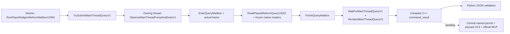

# CK3 1.20.0.2 宗教改革查询：实际 caller / mailbox 夹具

2026-10-01 17:38（Asia/Shanghai）。状态：**static-ready library**。
本页只记录新增只读查询的调用器证据；未访问 CK3、pipe、Steam、UI 或执行宗教动作。
原生字段依据沿用 [改革交付专题](religion-reform12002-delivery.md) 冻结的窗口、费用、资格、候选与现存 Rite 模型，不重复旧组件矩阵。

Exact build 为 CK3 `1.20.0.2`，EXE SHA-256
`AE1BA6FF060BA603842F6F4A2DED0AF4B7D3666B3DD271F75FB01B0DA8E81B2D`。

实际入口为 `query-player-religion-reform-context-v1`；domain key 为
`player_religion_reform_context_v1`，结果对象为 `result.player_religion_reform_context`。
新夹具提供原生布局 backing、只读 getter 与 owning semantic-frame adapter，随后调用实际生产 assembly、mailbox 与序列化器。
夹具不供给 Observation DTO，也不在 C++ 输出之后补 `accepted`、`private_build` 或其他协议字段。



`capture_epoch` 来自 owning pump，本矩阵为 `3`；`snapshot_revision` 来自已发布帧，为 `701`。
两者含义不同。实际结果包含 `protocol_version: 1`、`accepted: true`、`private_build: true`、
`read_only: true`、`advertised: false` 和 exact-build metadata。
`accepted` 只表示只读请求被处理，不能表示改宗、改革或候选选择已经执行。

| 实际 wire | 验证行为 |
| --- | --- |
| `visible-create.json` | 实际可创建 / 不可编辑；当前草案费用 `9000000`，signed missing `-2500000`；真实 0 fervor、负 spiritual fulfillment；popup 已有行保留原生值 |
| `visible-zero-cost.json` | 实际 native getter 的零费用 / 零 missing 保持为 0，`has_enough_piety: true`，独立 Doctrine selection ready |
| `visible-denied.json` | 实际不可创建 / 可编辑；知识按钮 gate 与 tenet helper 为 `false`，仍为 observed |
| `doctrine-hidden-row.json` | 已 materialized 的 Doctrine 原生 ShouldDisplay 为 false；保留 blocker，selectable keys 为空 |
| `empty-popup.json` | 可见窗口的真实零候选为已知空集合；Doctrine selection ready 为 true |
| `hidden-window.json` | window 已缓存但不可见；不调用任何 draft getter，draft 费用、资格与 popup rows 为 null |
| `absent-window.json` | 没有 materialized window；合法 absence 仍可观察当前宗教 / Rite 模型 |
| `cost-unavailable.json` | 原生报价 getter 返回失败；费用为 null，独立的实际资格继续可用 |
| `choices-unavailable.json` | 实际候选读取缺 Prophet 已初始化对象；rows 为 null，独立费用继续可用 |
| `context-unavailable.json` | 实际 fervor getter 读取失败；不得伪造 0，独立 Rite / main Rite 仍可观察 |
| `query-unavailable.json` | 实际 local-player getter 返回 null；新增 assembly Read 失败，完整 caller 返回 typed unavailable |
| `frame-changed-rejection.json` | 实际 owner full snapshot 在 capture 后变化；无 success wire，terminal ticket 已 reclaim |

raw popup 的 `native_raw_trigger_gates_pass`、知识按钮 gate、tenet helper 保留部分输入的原字段合同，
每行 `final_can_pick: null`、`final_choice_legality_readiness: false`。
新增独立 `current_doctrine_selection` 复用实际 popup，补原生 `ShouldDisplay` 与可见 / enabled 合取，
发布 `selectable_doctrine_keys` 和 `readiness.doctrine_final_selection_ready`；这是实际 Doctrine 选择观测，
不是从 raw 字段的 null 推断不可知。Tenet 完整 CanPick 尚未闭合，所以 aggregate readiness 仍为 false。
这些范围不影响独立现存模型、当前草案原生费用与原生最终创建 / 编辑资格的查询价值。
当前草案窗口不是 headless draft；本通道不会打开窗口、生成候选、选择 Doctrine/Tenet、创建或编辑 Rite。

验证命令（仅新增 caller matrix）：

```text
tools/.venv/Scripts/python.exe ck3_autonomous_player/native_bridge/research/religion_reform12002_query_mailbox_tests.py --artifacts artifacts/g2-offline-2026-10-01/religion-reform/query-mailbox/attempt-003
```

MSVC `/Od` 与 `/O2`、`/W4 /WX` 均 GREEN，每种 **12 cases / 66 checks**，
实际生成 **11 条 complete command_result + 1 条 frame rejection**。
输出保留在 `Z:\ck3_mod_rewrite\artifacts\g2-offline-2026-10-01\religion-reform\query-mailbox\attempt-003`；
`result.json` SHA-256 为 `6643893b6b108c70e7a7501438284546c498c5fcea48c95433e9850c82d8bba1`。
两种模式的 complete wire 位于各自 `wire/`，Python/MCP 必须直接消费这些 C++ 字节，仅可替换请求相关 nonce。

首轮 `attempt-001` 在新增 test 的全局 / 局部变量遮蔽上触发 `C4459`，由 `/WX` 拒绝；属于 harness RED。
将夹具全局变量命名为 `current_fixture` 后，仅重跑此新增矩阵通过。首轮编译日志保留，没有改动被冻结的原生 getter 源。

本夹具使用现有 `permitted_executor` 注入 exact typed callback，证明实际 submit / owner drain / wait / reclaim。
生产专用 `permitted_executor_religion_reform12002` 的中央注册、正式 MCP 与真实 paused artifact 另行验收；
本页证据不能称为 `fixture-live`、`production-live primitive` 或完整改革 OODA。

17:34 增量施工：新增 Doctrine selection 观察器改变实际 production assembly，
因此 caller matrix 加入 `doctrine-hidden-row.json`、`empty-popup.json`，并保留 Python 交接所需的真实零费用。
输入冻结后仅执行必要变化后 `/Od`、`/O2` wrapper matrix，取得上述 `attempt-003` GREEN。
前轮 `attempt-002`（9 cases / 51 checks，receipt SHA-256
`f197467fb18adcd17d50ef2696ef6dca7842607f382982be482233c673208d9e`）继续保留为观察器接入前证据；
未重复旧 44 文件 getter 矩阵。
