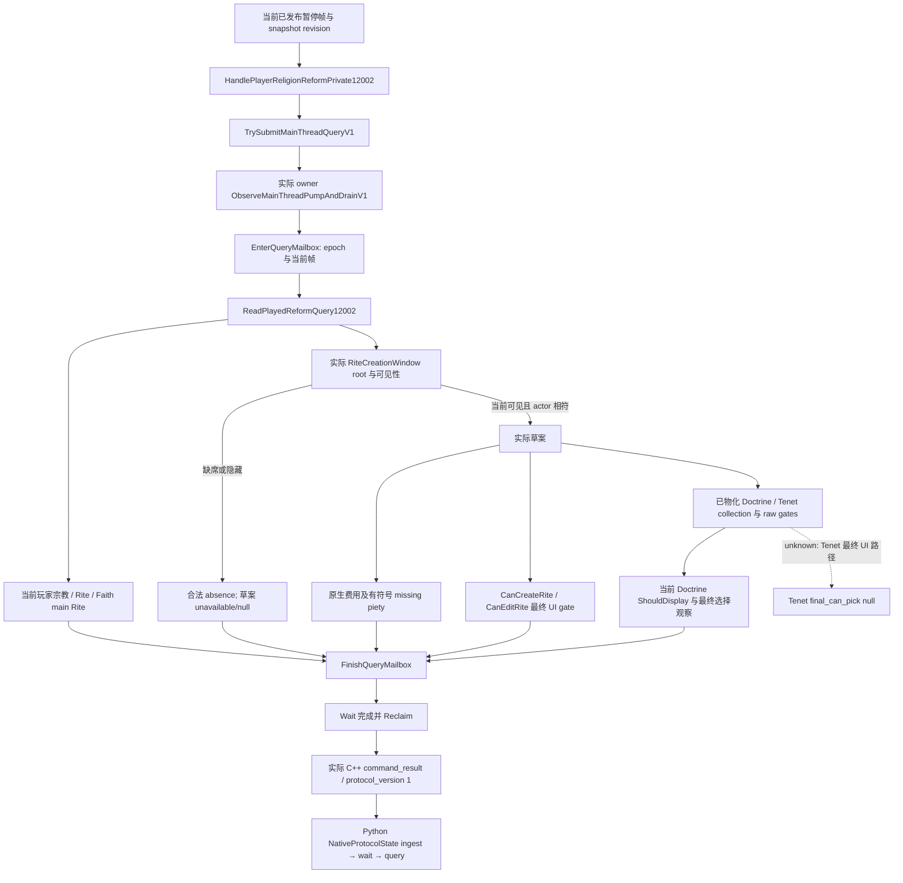

# 1.20.0.2 当前宗教改革输入联合查询

本页记录只读查询 `query-player-religion-reform-context-v1` 的实际调用链。它把当前玩家宗教、Rite、Faith main Rite、当前已经打开的创建窗口、草案虔诚费用、创建/编辑最终判定与已经物化的弹出候选合成一个原生帧。查询不打开窗口、不构造草案、不选择教义、不提交改革命令。宗教研究已由项目所有者于 2026-10-01 明确恢复；战争事务不在本包范围。

## 构建与原生输入

- CK3 `1.20.0.2` Crozier，Steam build `25588574`。
- EXE SHA-256：`AE1BA6FF060BA603842F6F4A2DED0AF4B7D3666B3DD271F75FB01B0DA8E81B2D`。
- 冻结 EXE：`Z:\ck3_mod_rewrite\artifacts\migrations\2026-09-30\post-update-1.20.0.2\installation\binaries\ck3.exe`。
- 原版与 exact EXE 决策输入、Mermaid 与 ABI 证据复用 [已交付的 44 源改革输入包](religion-reform12002-delivery.md)。旧包已由协调者提交冻结，本包不修改其实现或重跑旧 getter 矩阵。

实际窗口来源为 image `+5C6A520` → owner `+10` idler → idler `+88` handler → handler `+278` 的 `RiteCreationWindow`。只在原生可见性 `21603A0` 为真、窗口玩家完整引用与当前玩家相等时，才把当前内部指针交给草案 getter。没有当前窗口或窗口隐藏是合法缺席。

当前草案费用由 `14F57C0` 和 `14F58E0` 读取；后者保留费用减当前虔诚的有符号值。创建/编辑最终原生 UI gate 是 `14F56D0` / `14F5050`，包含命令 validator 与名称条件。Faith main Rite unreformed 使用 `2BD8960`；它与角色当前 Rite 的 unreformed 状态有各自来源。

当前 DoctrineCategory `window+888` 的 items，以及 `window+7A8` 的 tenet groups，只表示已经物化的当前弹出候选。TopScope 来自 `window+D0`。它们不是全教义 registry 的完整目录。原始 trigger、原生知识/prophet 判定和 tenet helper 按实际值发布。[新增 Doctrine selection observer](religion_doctrine12002_selection.md) 已闭合当前行的 ShouldDisplay 与最终可选择结果；联合 raw popup 对象仍保留原始输入，未完成的 tenet 最终 UI 路径继续单独列为 unknown。

新增 selection exact-EXE 证据补全 scope getter 的真实 `.pdata` 范围 `F05190–F051EB`，其中 `F051B0` 的 LEA 指向 RTTI `54D7E08`；FaithScope leaf 为 `C46360–C46368`，RET 在 `C46367`，下一字节是 INT3。旧包记录的 getter 前缀仍保持冻结，不把前缀边界当作完整函数范围。TopScope 类型与 offsets 的结论不变。

## 联合结果与合法缺席

结果域为 `player_religion_reform_context_v1`，backend 为 `ck3-1.20.0.2-native-player-religion-reform-context-v1`，结果对象为 `result.player_religion_reform_context`。完整 `command_result` 带 `protocol_version:1`、request ID、selector、构建 SHA、snapshot revision、日期与只读元数据；Python 不补写这些字段。

联合 DTO schema 为 `ck3_12002_player_religion_reform_query_v1`。各分量保留独立 availability/readiness；当前宗教和 Rite 有独立观察价值，未打开创建窗口不会让这些分量变成缺失。没有当前草案时，费用与最终创建判定保持 unavailable/null，popup collection 为 `null`；已观察到的空 collection 才是 `[]`。合法零费用、负 missing piety 与读取失败分别表示。

`current_popup_choices` 表示 collection 与 raw/helper gates，不发布其未闭合的综合最终门。`current_doctrine_selection` 单独发布已经闭合的当前 Doctrine 行可见性、可选择结果及稳定 key。两者 readiness 分开；Doctrine 分量成功不会把 Tenet 最终路径或完整候选目录变成已完成。

调用者不接收 actor、target、window 指针或草案 payload。当前 actor 与日期来自真实原生帧。外部仅可给预期 revision：`expected_snapshot_revision` 与兼容别名 `expected_revision`；同时给出时必须一致。过时 revision 或 owner 帧变化按已有 mailbox 合同失败。

编译开关 `XAR_CK3_ENABLE_G2_PLAYER_RELIGION_REFORM_CONTEXT_PRIVATE_QUERY_V1` 默认为 OFF。共享 dispatcher、CMake 与 named permit 由协调者登记；本包 owned caller 不修改共享调度代码。

## 新源与验收

- `native_bridge/include/xar_bridge/religion_reform12002_query_runtime.hpp` / `src/religion_reform12002_query_runtime.cpp`：实际 getter 联合帧及 serializer。
- `native_bridge/include/xar_bridge/religion_reform12002_query_mailbox.hpp` / `src/religion_reform12002_query_mailbox.cpp`：实际 owner mailbox 执行器、caller 与完整 command result。
- 新 wrapper 的实际 backing、场景、命令、失败尝试与 readiness 边界见 [caller fixture](religion-reform12002-query-caller-fixture.md)。它只验证新增实际 wrapper，运行生产 getter、实际 submit/drain/finish/wait/reclaim，不重复旧 getter 矩阵。
- Python 独立 leaf 与 SDK 接线合同见 [Python 查询接线](religion-reform12002-query-python.md)。

新增 wrapper 首轮通过的 evidence 为 `Z:\ck3_mod_rewrite\artifacts\g2-offline-2026-10-01\religion-reform\query-mailbox\attempt-002\result.json`，SHA-256 `f197467fb18adcd17d50ef2696ef6dca7842607f382982be482233c673208d9e`：MSVC `/Od`、`/O2` 各 9 cases / 51 checks，8 个完整实际 command_result 与 1 个 owner 帧变化拒绝。首次 C4459 harness RED 保留。2026-10-01 17:27:51 CST，Python 生产 cache ingest → wait → query 使用实际 C++ 原字节通过 4 tests；仅替换请求相关 nonce，不增加元数据。

新增 Doctrine observer 自身 ABI/provider 已 GREEN：4 个完整原生函数、14 个指令锚点、3 份原版窗口证据，MSVC `/O2 /W4 /WX` 15 checks / 6 实际 wire。receipt 为 `religion-doctrines\selection\delivery-result.json`，SHA-256 `7eb63f46aa41b134224d0e6e6c6acb40f39c10be1269c1bbeff6be79ec9ed735`。消费该 observer 后，仅针对新 wrapper 变化运行一次必要增量验收：`query-mailbox\attempt-003\result.json` SHA-256 `6643893b6b108c70e7a7501438284546c498c5fcea48c95433e9850c82d8bba1`，`/Od`、`/O2` 各 12 cases / 66 checks，11 个完整实际 wire 和 1 个拒绝，覆盖实际最终 Doctrine 选择、hidden 行、已观察的空 popup、合法零费用和有符号 missing piety。原 getter 矩阵没有重跑。Python 必要增量消费与所有 source/evidence pins 在 `religion-reform\query-source-package.json` 中收口。

2026-10-01 17:38:16 CST，Python 对新增 Doctrine 字段只运行一个必要增量 test，以实际 attempt-003 的 11 份完整 C++ packet 验证生产 cache → wait → query，GREEN；未重跑旧矩阵。Python 最终 15-file receipt SHA-256 为 `a8ea977d04cfa4f150698939e61815642c57b0de32e186ecd8cdd8c2c1464388`，最终 packet provenance SHA-256 为 `2138ea7597e7df1b3dcc7fe3540a1d17101298eba823047c7f6ac934a06dc417`。共享 NativeDriver/MCP 与官方 SDK case 由协调者登记后验证。

本包未使用 CK3、process、pipe、UI 或 Steam。离线 wrapper GREEN 只提升为 `static-ready`；实机暂停帧与 MCP 实机结果由协调者后续验收，创建/改革操作与完整 OODA 不在本包完成范围。
