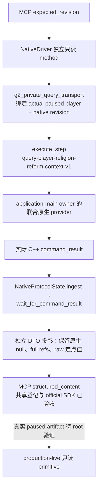

# 1.20.0.2 宗教创建／改革联合只读 MCP 接线

本包处于 **static-ready query**：独立 leaf、共享 NativeDriver/MCP 登记及实际回包的官方 SDK 单例验收已完成，真实 paused 验收待 root 执行。项目所有者已于 2026-10-01 恢复宗教研究并停止战争研究。真实 CK3 操作由 root 统一负责；这里不访问游戏、pipe、UI 或 Steam，不创建或打开草案，不提交宗教动作。旧版 44 文件组件的源输入保持冻结，联合查询是独立增量。

冻结构建为 CK3 **1.20.0.2 Crozier / Steam25588574**；EXE SHA-256 为 `AE1BA6FF060BA603842F6F4A2DED0AF4B7D3666B3DD271F75FB01B0DA8E81B2D`。原生来源见[创建与改革入口](religion-reform12002-overview.md)、[当前草案窗口](religion-reform12002-window.md)、[费用](religion-reform12002-costs.md)、[最终资格](religion-reform12002-eligibility.md)及[当前 popup choices](religion-reform12002-choices.md)。

## 入口与调用合同

| 层 | 约定 |
| --- | --- |
| 原生 selector | `query-player-religion-reform-context-v1` |
| domain key | `player_religion_reform_context_v1` |
| Python leaf | `player_religion_reform_context_private_transport.py` |
| Driver method | `query_player_religion_reform_context_private_v1` |
| MCP tool | `ck3_query_player_religion_reform_context_v1` |
| 私有开关 | `allow_private_player_religion_reform_context_query`；CLI `--private-player-religion-reform-context-query` |
| 输入 | `expected_revision`；不接受 actor、target、地址、候选修改或动作参数 |

leaf 直接复用现有 `read_private_g2_native_query_v1`。public revision 来自调用者最近的 paused snapshot；生产 transport 将 snapshot 的 native revision 同时写入 `expected_revision` 与 `expected_snapshot_revision` 两个原生别名。查询沿现有 execute-step 信封传输，回包仍为真实 `command_result`。`accepted/private_build/read_only/advertised` 必须由 C++ caller 输出，测试不会在 Python 中补造这些字段。

## 结果语义

联合 DTO 以同一 owner callback 的当前 player/frame 为根。当前宗教与 Rite 身份、现存可见草案、实际费用、create/edit 最终门、已物化 popup 候选和独立 Doctrine selection 分别保留其自身可用状态，不把一个组件成功改写成其它组件成功。

- 无现存窗口或窗口隐藏是已经观测到的 scope absence；不是“玩家永远不能改革”。不存在当前草案时，草案费用和最终门不能补成零或 false。
- 可见草案中的候选零行是已物化空集合；不能因为窗口缺失就伪造空候选。
- 实际 `can_create_rite=false`／`can_edit_rite=false` 是最终原生负资格；读取失败保留 null 与原生原因。
- `piety_missing_signed_raw<=0` 仅表示该报价的虔诚预算足够，不表示最终资格或实际支出。Q100000 数值、负差值和合法零值保持原值。
- `current_popup_choices` 保留实际 collection 与 raw/helper 门，rows 的 `final_can_pick` 保持 null；Tenet 完整最后门及 aggregate `final_choice_legality_readiness` 尚未闭合。
- `current_doctrine_selection` 独立发布已经闭合的当前 Doctrine 可见性／可选门：实际 `native_should_display`、`native_can_pick`、知识／prophet button gate、`selectable`、原生 blocker 与可选 key。`readiness.doctrine_final_selection_ready=true` 只属于当前已物化 Doctrine popup，不把 Tenet、最终创建动作或未来候选设为可用。可见空列表可以 selection-ready；组件不可用时保留 serializer 原有 rows/status，不能根据数组空就判断观测成功。

`capture_epoch` 是 native owner callback 标识，不能替换成 snapshot revision。完整代际 ID 保持 32 位原值，合法 identity absence 保持 null；没有 Python registry 枚举或 fallback 公式。

## 分工与验收

宗教原生 parent 拥有联合 provider、caller 与 C++ fixture。Python owner `/root/g2_python_routes` 拥有共享 NativeDriver/MCP 登记，service 无需改。此子包只写独立 leaf、专用测试、原字节 fixture/provenance 与本文。

2026-10-01 **17:27:51 Asia/Shanghai**，首轮 8 份 actual packet 验收通过。唯一测试期修改是内存中的请求相关 nonce；没有补 protocol metadata。生产 `NativeProtocolState.ingest → wait_for_command_result → query` 消费实际完整信封，[新增 unit 模块](../../ck3_autonomous_player/tests/unit/test_ck3_12002_player_religion_reform_context_wire.py) **4 tests GREEN**，逐项核对全部原生子对象的深度等值。这份基线回执和 provenance 保留在外置 `query-python/baseline/`。

**17:38:16 Asia/Shanghai**，新 Doctrine selection 实际增量通过独立的 **1 test / 11 actual C++ packets**。仅执行 `-k actual_final_doctrine_selection`，没有重复基线 4 tests 或其它 query 矩阵；它直接从生产 ingest/wait/query 保留新增 selection 对象与独立 readiness，并验证隐藏 Doctrine、已观测空 popup、合法零报价、absence 与 partial failures。最终 `/O2` 产物已按原字节复制到 [11 份冻结 packet 与 provenance](../../ck3_autonomous_player/native_bridge/research/fixtures/ck3_12002_player_religion_reform_context/provenance.json)，没有添加或猜测顶层字段。

| 实际 C++ case | Python 保留的结果 |
| --- | --- |
| `visible-create` / `visible-denied` | 独立 create/edit 最后门，报价 `9000000`、有符号差值 `-2500000`；零 fervor、负 spiritual fulfillment，Q100000 原值 |
| `hidden-window` / `absent-window` | 当前宗教身份可读，草案资格／费用／popup collection 保持不可用与 null |
| `cost-unavailable` | 报价不可用，独立最终资格可读；不从其它字段补报价 |
| `choices-unavailable` | 草案其它组件可读，popup collection 为 null，完整 final choice 门仍未闭合 |
| `context-unavailable` | 当前 religion context 失败，独立其它组件仍可读 |
| `query-unavailable` | 真实 fixture core 的 local-player 缺失导致整体 unavailable；没有伪造空草案 |
| `doctrine-hidden-row` | selection 可读，真实 ShouldDisplay 为 false，`selectable=false`，保留具体 blocker；不是候选消失 |
| `empty-popup` | 实际可见 popup 已物化空集合，Doctrine selection-ready 为 true；可选 keys 为空 |
| `visible-zero-cost` | 实际报价与有符号不足值均为合法 `0`，Doctrine selection-ready 为 true |

原生 caller fixture 的最终 `/Od`、`/O2` 各 **12 cases / 66 checks GREEN**，包括 11 份完整回包和 1 份变化帧拒绝，属于原生 parent 的验收；旧 9 cases / 51 checks 及第一次 C4459 编译 harness RED 保留，Python 未重复这组构建。所有 callbacks 均来自夹具进程，未执行真实 CK3 getter，不能算 fixture-live。

Python owner 已登记 Driver method、MCP tool、CLI 与 permission。[新增官方 SDK 单例](../../ck3_autonomous_player/tests/unit/test_g2_player_religion_reform_context_mcp_wire.py) **1 passed in 1.28s**：实际 `visible-create` 回包经生产 `NativeProtocolState.ingest → wait`、NativeDriver wrapper 和官方 `mcp.Client` 到达 structured content，整个原生 DTO 深度等值，包括新增 Doctrine selection/readiness；Tenet `final_can_pick` 保持 null。验收同时覆盖 read-only annotation、私有开关关闭时不发现 tool 且不发请求、CLI 默认 false 和缓存已消费。此次只运行新增 SDK 单例，没有重跑既有基线、Doctrine 增量或原生矩阵。

artifact 目录为 `Z:/ck3_mod_rewrite/artifacts/g2-offline-2026-10-01/religion-reform/query-python/`。`baseline/wire-result.json` 和 `doctrine-selection/wire-result.json` 分别记录必要验收及原字节 pins；最终 packet provenance SHA-256 为 `2138ea7597e7df1b3dcc7fe3540a1d17101298eba823047c7f6ac934a06dc417`，Doctrine 增量日志 SHA-256 为 `d88bd200b8c6cdef42796c6406da94d061e9b3a95a89550ef2f95f964f5cd150`。官方 SDK 回执位于 `Z:/ck3_mod_rewrite/artifacts/g2-offline-2026-10-01/python-routes/reform-final-actual-sdk.json`。`final-source-package.json` 提供 16 文件源路径、SHA、SDK 回执及日／周报告合并字段；SDK test 是 Python owner 冻结的第 16 文件。下一步为 root 的候选 DLL 集成与真实 paused 观测。本包不增加 G2 credit，不解锁宗教动作或完整改革 OODA。
