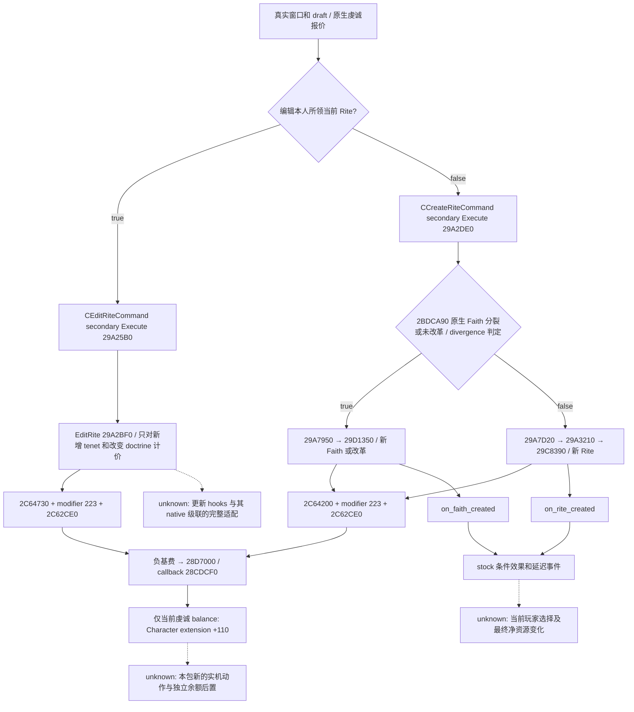

# 1.20.0.2 Rite / Faith 创建和编辑的原生资源基费

本专题补齐[已有虔诚报价](religion-reform12002-costs.md)的 other-resource 未知分支。范围是实际 `CCreateRiteCommand` / `CEditRiteCommand` 的预算检查、直接基费扣款和可复用的只读 draft 基费向量；不执行、构造或入队命令，不开发动作或策略。旧费用七文件、旧 `other_resource_costs_observed=false` 与旧实机 artifact 保持各自冻结范围。

## Exact build 与资格

- CK3 `1.20.0.2 Crozier`，Steam build `25588574`。
- EXE `101039736` bytes，SHA-256 `AE1BA6FF060BA603842F6F4A2DED0AF4B7D3666B3DD271F75FB01B0DA8E81B2D`。
- 仅读冻结安装副本 `Z:/ck3_mod_rewrite/artifacts/migrations/2026-09-30/post-update-1.20.0.2/installation`。
- 新 ABI：`ck3_autonomous_player/native_bridge/research/religion_reform12002_resource_costs_abi.json`；16 个新增完整执行/扣款函数或必要指令区段、50 个语义指令、4 个 vtable 槽、3 个完整预算向量构造区段与10个资源 dispatch 槽。完整字节和 SHA 在 manifest。
- [原生验证](Z:/ck3_mod_rewrite/artifacts/g2-offline-2026-10-01/religion-reform/resource-costs/native/native-result.json) `GREEN / static-confirmed`；ABI SHA-256 `8d23eeb3d3a0c96cb487dcaa3c2b7563daeaa53d8bd0bef2fbe540daf359e392`，完整 disassembly SHA-256 `0eb83cedcc73429eeb993bc20e26b4767777164d1e924a7c7de3d536c9fc5b5b`。本包没有 CK3、进程、pipe、UI、Steam 操作，也没有 paused/live 或新增 G2 credit。

## 命令的真正执行入口

`4770550` 是 `CCreateRiteCommand` primary vtable：`+30 → 29A2F60` validator、`+40 → 29A7030` clone，复用[合法性专题](religion-reform12002-eligibility.md)证明。真正 Execute 是 command `+18` secondary vtable `4770408` 的 `+8 → 29A2DE0`。窗口 `14F5704` 安装该 secondary vtable；Execute 使用 secondary `this+8` 读取 whole-command `+20` 的 actor ID，`this+250` 是 whole-command `+268` 的价格 draft，`this-18` 才回到 primary command。

完整 Execute 为 `[29A2DE0,29A2F5A)`；PE unwind 拆成三段，不能只把第一段16字节视为完整函数。`29A2EB3 → 2BDCA90` 使用当前 Faith 和真实 draft 决定是否创建／改革 Faith：true 走 `29A2EC9 → 29A7950 → 29D1350`；false 走 `29A2ED0 → 29A7D20 → 29A3210 → 29C8390` 创建 Rite。Execute 结束的 `3E66` UI message 不属于扣款证据。

编辑本人所领当前 Rite 是另一命令：secondary slot `4770528 → 29A25B0`，`29A25F9 → 29A2BF0`。它不能与“改革 Faith”混称。已有原生报价的 `14F4400=true` 正是本人所领当前 Rite 的编辑身份条件。



## 十槽 CCost 的原生预算合同

三个合法性检查都清零连续 `0x50` bytes（五次 `movups xmm0`），随后只在 `CCost+10` 写入实际原生计算的虔诚价格，再调用 `310E710` `CCost.CanAfford`。这里的零是明确的原生初始化合同，不能用来推断其他机制或创建后的总净资源变化。

| 分支 | 清零区间 / 唯一写价 | 原生 affordability |
| --- | --- | --- |
| 新 Rite | `29C98A4..29C98C0` 清零 `[rbp+130,rbp+180)`；`29C9983` 写 `rbp+140` | `29C9997 → 310E710` |
| 新 Faith / 改革 | `29D1973..29D198F` 清零 `[rbp+140,rbp+190)`；`29D1A56` 写 `rbp+150` | `29D1A6A → 310E710` |
| 编辑当前自领 Rite | `29C8F4E..29C8F6A` 清零 `[rbp+140,rbp+190)`；`29C8F78` 写 `rbp+150` | `29C8F8C → 310E710` |

`310E7AA` 的10项 jump table 位于 `310EDAC`；`310ED09` 以 `slot*8` 读取费用，`310ED39` 比较10。稳定公开命名只绑定本包实际证明的前三项：

| 原生 slot | offset | dispatch | 本包公开名 | 本分支报价 |
| --- | --- | --- | --- | --- |
| 0 | `+00` | `310E7B7`，`RESOURCE_MISSING_GOLD` | `gold` | 0 |
| 1 | `+08` | `310E807`，`RESOURCE_MISSING_PRESTIGE` | `prestige` | 0 |
| 2 | `+10` | `310E851`，`RESOURCE_MISSING_PIETY`，当前余额 ext `+110` | `piety` | 实际 native getter 的 `P` |
| 3–9 | `+18..+48` | 全部实际 dispatch RVA 见 manifest | 保留 raw slot index | 0 |

因此新只读接口可以给出 `[0,0,P,0,0,0,0,0,0,0]` 的 **native command draft base-fee quote**，`P` 必须来自已有 `ReadCurrentRiteCreationCosts12002`，不能使用 stock 固定数、合法性 ACK 或手工 draft。这个接口没有执行命令、没有读取临时 command 栈上的 CCost，也不是实测 actual charge；向量来自真实原生报价加 exact-build 原生初始化合同。完整创建合法性仍由其独立 provider 决定。

## 实际直接扣款与奉献等级

三个 Execute callee 在执行帧重算价格，分别取负：

- 新 Faith / 改革：`29D1625 → 2C64200`，`29D1671 → 2C62CE0`，`29D16F4 neg price`；`29D1725 → 28D7000`。
- 新 Rite：`29C84C2 → 2C64200`，`29C850A → 2C62CE0`，`29C8513 neg price`；`29C8541 → 28D7000`。
- 编辑 Rite：`29A2CE2 → 2C64730`，`29A2D32 → 2C62CE0`，`29A2D3F neg price`；`29A2D71 → 28D7000`。

以上均把 actor `+1B0` extension 的 `+108` resource object 和 callback `28CDCF0` 传给通用 delta 函数；若 native extension 缺失则原生跳过该余额变更。通用函数 `28D7067` 获取负 raw delta、`28D706F call r15` 调用 callback。leaf `[28CDCF0,28CDD20)` 中非正 delta 直接走 `28CDD1B add [resource+8],rdx`，即 extension `+110` 当前虔诚余额；不会减少 `resource+10` 的累计虔诚／奉献等级进度。因此当前创建基费不是 devotion 等级损失。

新 Faith 内部还在 `29D1581 → 29C81A0` 创建 Rite；完整 helper 包含身份、草稿初始化和注册，未重复调用上述预算扣款。创建、change-Rite、draft 应用和刷新后仍有非资源结果、on_action 和事件级联；本包只闭合命令直接基费合同，不把这些 callee 的全部结果称为已穷尽。

## 原版后续资源变化是独立结果

[stock findings](Z:/ck3_mod_rewrite/artifacts/g2-offline-2026-10-01/religion-reform/resource-costs/post-effects/findings.json) SHA-256 `5b27d9552893c4c617c1dad21f537a902614c2182646e929aa4072cf78c924be`，与同目录 `script-graph.json` 保存原文件 SHA、57 个脚本节点的原始 body、scope、行号、条件和未知边界。

原生创建 wrapper 的 on_action pointers 是 manager `+38` 的 `+190` / `+198`。原生名称注册 `25B0332..25B0363` 为 namesarray `+50` 的 `+640 on_faith_created` / `+660 on_rite_created`：两数组分别每槽8/32字节，索引均为50/51，这是 hook 名称的静态索引关联。具体 scope/root 适配与全部 native 级联仍需运行证据，不把 stock 注释的 root 与 wrapper 初始 actor 直接等同。

已证明会影响结果的 stock 分支包括：

- 新 Rite 之后延迟1日给同 Faith 玩家发 `faith_creation.1020`，后续创始者选项 `faith_creation.1021` 可得 `+50 piety`，或 `+150 prestige / -50 piety`；旁观者的另一选项可得 `+50 piety`。资源归事件 chooser，不能统统加到创始者身上。
- Faith 分裂后的事件可给选择新 Faith 的玩家 `+100 piety`、留旧 Faith 的玩家 `+50 piety`。伊斯兰 temporal HoF 的独立事件选项可得 `+250 piety`；Zandaqa 请求回应事件也有回应者自身 `+100/-100 piety`。触发条件、选择与角色需另观测。
- 创建 hook 移除 `religious_reformer_modifier`；其定义 `rite_creation_piety_cost_mult=-0.95` 是将来的创建费用修正消失，不能称它在此行另扣95%的资源。
- `on_rite_updated` / `on_rite_edited` 的显式脚本闭包没有货币 effect；这不是全部 native 结果、其他 hook、未来事件的零净变化证明。

## 最小只读 provider

独立 header `religion_reform12002_resource_costs.hpp` 公开：

```cpp
bool ReadCurrentRiteCreationBaseResourceCosts12002(
    const CostBindings&, const CurrentDraftView&, BaseResourceCostQuote&) noexcept;
std::string SerializeCurrentRiteCreationBaseResourceCosts12002(
    const BaseResourceCostQuote&);
```

当前 draft view 复用[真实窗口链](religion-reform12002-window.md)；原 `CostBindings` / getter 和 `CostQuote` 保持不变。新 DTO 保存原报价完整身份、epoch、date、edit flag、signed missing；仅原 reader 成功时发布基费向量。`actual_debit_observed=false`、`post_action_net_resource_change_observed=false` 为明确的观测边界。暂不增加共享 registry、CMake、MCP 或策略。

新的 `/O2 /W4 /WX` fixture 已一次通过 **17 checks / 3 actual C++ JSON wires**：[provider result](Z:/ck3_mod_rewrite/artifacts/g2-offline-2026-10-01/religion-reform/resource-costs/provider-O2/result.json)。实际原 CostReader → 新 vector adapter → 新 serializer 覆盖 create missing-piety / edit legitimate-zero / unavailable-null，保留完整 generation Rite ID、frame、signed missing、独立 affordability 和旧 serializer 的冻结字段；旧虔诚与窗口矩阵没有重跑。fixture 的 callback 是测试替身，不是调用 EXE 原生函数；最高 `static-ready library`。实机由中央责任人接入实际当前 draft，同帧与 UI 互证；真正命令余额后置和后续选择是另外的 live 范围。

## 日／周报告字段

2026-10-01 / 2026-W40：完成三条命令直接基费树，补齐旧 other-resource 原生未知分支；gold/prestige 基费为0与原生 piety getter组成十槽基费报价。stock 后续事件可变资源被单列。新增 provider / serializer 达到 `static-ready library`，原生文件验证 GREEN、一次 O2 fixture 17项和3份实际 wire GREEN。当前无新增实机、G2 或完整宗教 OODA 资格；root 统一合并日报／周报及 commit/push。剩余为中央组合接线、真实 paused draft 报价和实际动作后的独立余额／后续事件结果。战争和 holy order 不在本包范围。
