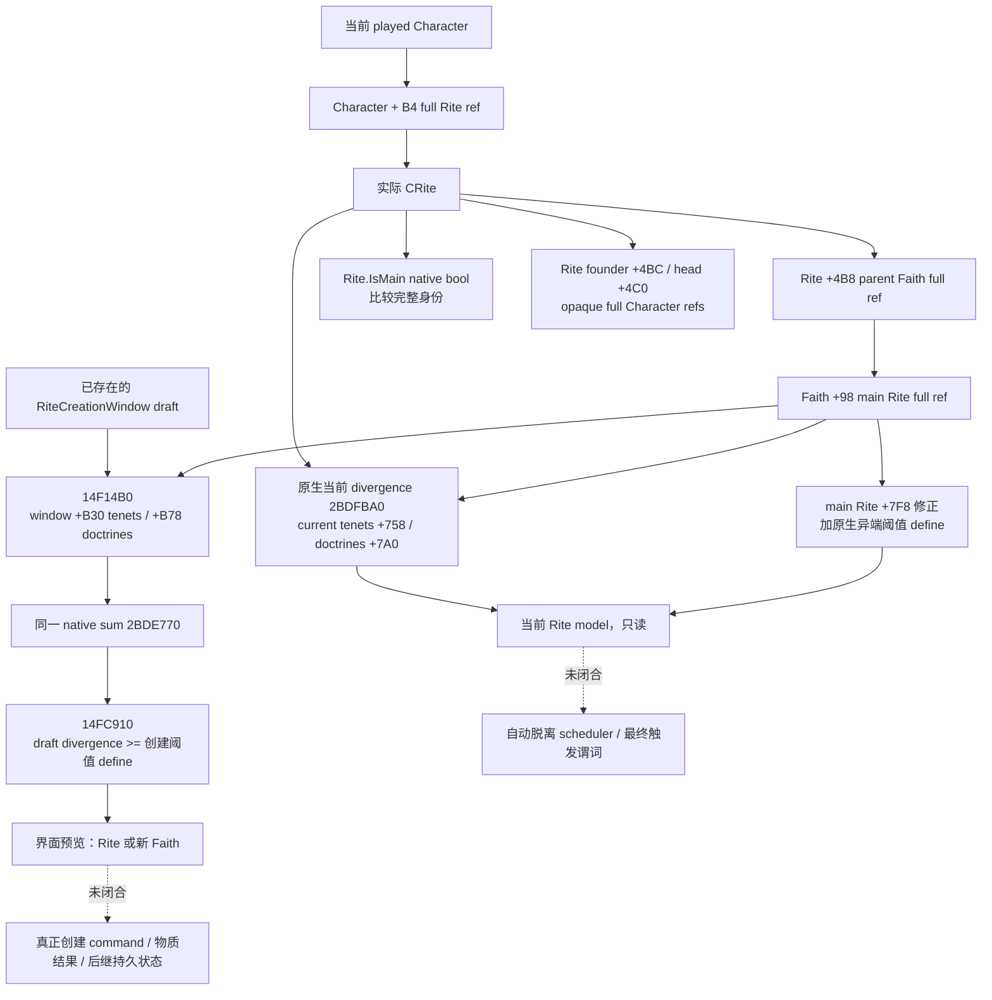

# CK3 1.20.0.2 Rite 创建／派生模型与当前状态观测

本包响应项目所有者 2026-10-01 恢复宗教研究、停止战争研究的指令，只处理非战争 Rite 模型。冻结游戏为 **1.20.0.2 Crozier / Steam25588574**，EXE SHA-256 **`AE1BA6FF060BA603842F6F4A2DED0AF4B7D3666B3DD271F75FB01B0DA8E81B2D`**，大小 `101039736` bytes。原版结构基线见 [religion stock](ck3-1.20.0.2-religion-stock.md)，当前 Rite→Faith→Religion 身份解析见 [religion context](ck3-1.20.0.2-religion-context.md)。

结论：现存 Rite 与创建界面的 draft 复用原生 divergence 求值器，但使用不同输入；创建成新 Faith 的阈值与现存 Faith 的异端阈值也是两个独立原生值。当前玩家 Rite 的 **main 状态、创始者／领袖 full refs、实际 divergence、实际异端阈值**已实现只读 provider 与实际 C++ serializer，组件为 **`static-ready`**。没有本包 paused/live artifact；没有创建／编辑／改宗动作、counter-policy 或战争研究。

## 原版身份与创建路径

`common/religion/rite_types/_rite_types.info:35-40` 明确：Rite 指向 parent Faith；Faith 没有 scripted Rite 时，游戏创建同名 dynamic Rite。Rite type 没有 parent Faith 时不从 history 实例化，保留给 `create_rite_from_type` effect；bookmark 可以覆盖 parent Faith。`create=no` 只表示推迟该类型的 history 创建，不能当作当前已实例化 Rite 的身份，也不能把它误作玩家最终创建门。

该文件 `:59-74` 将 main Rite 的 core tenets 和 Rite-specific doctrines 放在 Rite 上；同 doctrine group 的 Rite 项覆盖 Religion／Faith 项，未填组才补 Faith intrinsic 项。因此当前采用的 Rite、Faith 的 main Rite 和界面准备的新条目必须分开。



这是原生数据解析及创建预览树，不是原生 AI 选择树。自动脱离未闭合的分支保留虚线；provider 的当前数值不授权推断将来必定派生 Faith。

## Exact-build ABI 与两个阈值

| 入口 | RVA / ABI | 已证明语义 |
| --- | --- | --- |
| `Rite.IsMain` core | `0x24F7E40`，`bool(CRite*)` | 解析 `Rite+4B8` 的 Faith，比较 Faith `+98` 与 Rite `+8` 的完整 32-bit refs；不是 masked index 相等 |
| `Rite.IsMain` registration / thunk | callback LEA `0x4EE959` → `0x24FC0E0` | reflection wrapper 实际调用上述 core |
| 当前 Rite divergence | `0x2BDFBA0`，`int64_t*(int64_t*out, CRite*, optional tooltip*)` | 原生解析 parent Faith、main Rite；以当前 Rite `+758/+7A0` 与 main Rite 集合调用 native sum `0x2BDE770`；null tooltip 不构造 UI breakdown |
| `FaithWindow.GetDivergence` core | `0x2618D00` | 在 `0x2618D45` 清零 `r8`，以 out-first ABI 在 `0x2618D4B` 调用上述 current-Rite getter，返回同一 out |
| `Faith.GetHeresyThreshold` core | `0x2440920`，`int64_t*(CFaith*, int64_t*out)` | 实际 main Rite `+7F8` 修正，加动态原生 define 地址 `0x5C68D88`；返回 signed Q100000 |
| `CRiteFounderLink` scope evaluation | `0x1AFE330`；exact RTTI / vtable slot 4 | 从 Rite `+4BC` 复制 full Character ref，并输出 Character scope type 4 |
| Rite head ref getter | `0xD55CF0`，`uint32_t*(CRite*, uint32_t*out)` | 读取 Rite `+4C0`；`GetHeadOfRite` thunk `0x24FC610` 再按完整代际解析 Character `+18` |
| 创建 draft divergence | `0x14F14B0`，`int64_t*(out, CreationWindow*)` | current source Rite 位于 window `+C8`；所选 draft tenets `+B30`／doctrines `+B78` 进入同一 native sum |
| `DivergenceResultsInFaithCreation` | reflection callback `0x14FC910` | 调用 draft divergence，再对原生创建 define `0x5C68C68` 做 signed `>=`，不是 current Rite getter 的结果 |

`common/defines/00_defines.txt:831` 的 stock **`RITE_CREATION_DIVERGENCE_FAITH_THRESHOLD=100`** 明确在创建时达到或超过阈值就创建 Faith；`:833` 的 **`RITE_DIVERGENCE_HERETICAL_THRESHOLD=65`** 是不同 define。现存 Faith 的 getter还叠加 main Rite 修正，所以当前只读 reader **调用实际 getter，不写死 65 或 100**。界面源码 `gui/window_rite_creation.gui:506-522` 同时使用 `Faith.GetHeresyThreshold`、draft divergence 与 `DivergenceResultsInFaithCreation`，这三个值不能合成同一个“reform-ready”布尔。

`religion_on_actions.txt:3-18` 明确 Faith 创建可以来自角色创建／转换或 Rite detach；`scope:founder` 允许缺失，`scope:old_faith` 与 `scope:old_rite` 保留旧身份。`scope:diverged=yes` 指过度 divergence 后的 detach，初始创建 100+ divergence heresy 不算该来源。脚本对前者施加初始 fervor effect，但本包没有执行或宣称该后果已 live；相关改宗效果不进入本包。

## 当前玩家实际只读 provider

[header](../../ck3_autonomous_player/native_bridge/include/xar_bridge/religion_reform12002_rite.hpp) 与 [reader/serializer](../../ck3_autonomous_player/native_bridge/src/religion_reform12002_rite.cpp) 的 namespace 为 `xar::ck3_12002::religion_reform::rite`：

```cpp
Bindings BindRiteModelImage12002(uintptr_t module_base, string_view exe_sha);
bool ReadPlayedRiteModel12002(const Bindings&, uint64_t capture_epoch, Model&);
string SerializePlayedRiteModel12002(const Model&);
```

它复用既有 `CoreBindings`、`ReadCoreSnapshot`、`ResolveCoreCharacter` 与当前 religion getter 常量。只能在已有 paused application-main owner 中读取实际 played Character；没有 process discovery、pipe、UI、创建 draft、任意 target、command queue 或策略。中央 CMake／query 注册与 MCP transport 由父工作包负责，本独立包未修改这些共享文件。

wire schema 为 `religion_reform12002_rite_model_v1`，输出 `capture_epoch`、真实帧日期／玩家身份、`rite_id`、`faith_id`、`faith_main_rite_id`、`founder_character_id`、`head_character_id`、`current_is_main`、`divergence_to_main_raw`、`faith_heresy_threshold_raw` 和 `raw_scale=100000`。founder/head 是 opaque full-generation Character refs；存在 ref不代表活着、可玩、拥有头衔或拥有改革权。没有把 full 32-bit 高位值截为 masked index。

实际没有 Rite 时返回已观察的合法空状态，相关字段为 `null`；已观察到零身份／零数值时保持 `0`。present Rite 的 parent Faith/main Rite 或原生 getter读取失败返回 typed unavailable，不能把失败填成默认阈值或 divergence 零。两个当前样本不一致复用已有暂停状态读取合同，返回 `state_changed`。这一 readiness 只覆盖本页确实发布的当前模型值；没有为创建日期、派生祖先或自动 detach 伪造恒空字段。

## 离线验证与剩余入口

[exact verifier](../../ck3_autonomous_player/native_bridge/research/religion_reform12002_rite_native.py) 从冻结 PE 文件检查 **13 个完整函数、5 个 registration slices、30 条精确语义指令、CRiteFounderLink RTTI/COL/vtable slot，以及 4 个 stock 来源**；[ABI map](../../ck3_autonomous_player/native_bridge/research/religion_reform12002_rite_abi.json) SHA-256 `0a4f6220f26c63f0200fe4cca5f9aadf96fd965e42514c44c9421acc436c31d8`。artifact 为 `Z:/ck3_mod_rewrite/artifacts/g2-offline-2026-10-01/religion-reform/rite/native/native-verification.json`。

[production fixture](../../ck3_autonomous_player/native_bridge/src/religion_reform12002_rite_test.cpp) 与 [runner](../../ck3_autonomous_player/native_bridge/research/religion_reform12002_rite_tests.py) 链接实际 core、reader 和 serializer，以 MSVC `/W4 /WX /Od`、`/O2` **各通过 20 项检查，各产出 5 份实际 C++ JSON**，由 Python 解析。覆盖 non-main/current、main/native zero、无 Rite 的合法空状态、actual getter失败、高位代际、founder absence 与 zero head、实际非默认阈值及 out-first/null-tooltip ABI。native callbacks 与内存是夹具进程提供的替身；没有调用游戏 EXE 内函数，不能称 `fixture-live` 或实机。

首轮 `/Od` 因夹具 `optional<uint32_t> == signed 0` 触发 `/WX C4389`，改为 `0U` 后上述两种模式通过；原始日志保留在 `rite/attempt-001-unsigned-fixture-literal/`，分类 harness RED。研究 verifier 首轮写错 registration 的 textual RIP displacement，实际 callback RVA 一直为 `0x24435C0`，修正及旧期望保留在 `rite/attempt-000-native-registration-displacement.json`；不是 provider ABI 地址迁移或游戏 capability RED。

可复跑命令：

```text
python ck3_autonomous_player/native_bridge/research/religion_reform12002_rite_native.py --exe <frozen-exe> --output-dir <Z-artifact>
python ck3_autonomous_player/native_bridge/research/religion_reform12002_rite_tests.py --output-dir <Z-artifact>
```

下一步是父工作包把当前模型接进同一宗教只读 MCP，并由 root 取得 paused current/model 与后继独立样本；有真实 artifact 才提升 live 资格。后续原生施工入口是创建日期／派生 ancestry getter、自动 divergence detach scheduler 与最终 predicate、真正创建 command 和独立 Rite/Faith 身份结果。本包不以创始者 ref、阈值比较或 ACK 宣称创建／改革完成。
