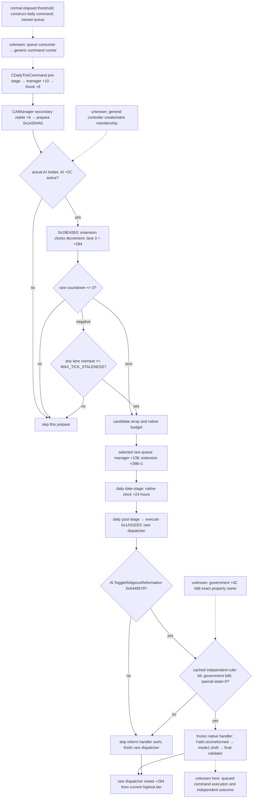

# CK3 1.20.0.2：AI 改革 rare lane 的排队与真实缓存输入

本页是 [原生 AI reform handler 与 Faith 主 Rite](religion-reform12002-willingness.md) 的独立增量。原包 7 functions / 4 slices / 28 anchors 及 reader 保持冻结。本包只读冻结 EXE 与 stock 文件，没有访问 CK3、pipe、Steam 或桌面，没有执行改革或研究战争。

Exact build：`1.20.0.2 Crozier / Steam25588574`，EXE SHA-256 `AE1BA6FF060BA603842F6F4A2DED0AF4B7D3666B3DD271F75FB01B0DA8E81B2D`。以下是原生输入与排队机制，不是 AI willingness 分数或下一次改革日期预测。

[新 ABI verifier](../../ck3_autonomous_player/native_bridge/research/religion_reform12002_schedule_verify.py) 与 [ABI map](../../ck3_autonomous_player/native_bridge/research/religion_reform12002_schedule_abi.json) 绑定 **12 个完整函数/leaf、25 个 slice、53 个语义 anchor**，以及实际 rare lane jump table、daily command/AI vtable 与 RTTI。map SHA-256 `c44a4fe9c1fc3bdd2614999c4c587244801774b7a87a23bd562c1d6ec2fb36c9`；[唯一完成的 frozen-file proof](Z:/ck3_mod_rewrite/artifacts/g2-offline-2026-10-01/religion-reform/schedule/abi/abi-verification.json) 为 GREEN。原 reform map `30d1baac976bcb0fd954cc0e53471cb6668b7f600891692480d57a8f2d7dd1f0` 的 **7/4/28** 直接复用，不重跑旧矩阵。

## 原生 tree 的新增闭合边

`CAIManager` 构造函数将 secondary vtable **`0x45AC5F8`** 放在 manager **`+8`**。RTTI 的 offset 为 8，继承 `CLegacyGameManagerInterface / CManagerInterface`；该表 **`+8 → 0x1A304A0` prepare**，**`+0x30 → 0x1A31EE0` execute**。prepare 内 this-relative rare lane array `+0x130` 与原包 execute 的 manager-base-relative array **`+0x138`** 是同一个数组，不能误作两条 lane。

prepare 从 actual AI holder 的 array/count 遍历 AI，**AI `+0x2C != 0`** 才参与。在 `0x1A3060E` 调 `0x19EA5E0`，然后在 `0x1A3061B` 调 **`0x1A22D30(actor, AI+8)`** 更新缓存。`0x19EA5E0` 有 extension 时清空 `extension+0x298` 的 8 个 selection byte，并对 **`+0x278` 起的 8 个 signed countdown 各减 1**，再复制到 prepare 的临时结果。rare 是 **lane 3**，因此实际 timer 为 **`extension+0x284`**，本次被选择标记为 **`extension+0x29B`**。

这里闭合的是实际 holder 中成员的 active 判定与 rare 候选选择。一般 actor 的 controller 创建、退休及加入 holder 的全部路径尚未闭合；当前 reader 不提供 controller discovery。下一入口是 `0x1A2ECF0` 的角色集合维护与 `0x1A2FA70` 的 actual AI 创建/加入路径，可独立继续逆向而无需游戏进程。

外部日调用现已用实际 `CDailyTickCommand` 闭合。game-state ctor 注册 manager+8；daily command secondary vtable **`0x44B50B0`** 的 `+0x10 → 0x29882A0` 枚举 manager array，通过 binder `0x110CD00` 调 manager vtable `+0x10`。CAIManager 的该 slot 是 **`0x9D09F0`**，它转到自身 vtable `+8`，即 prepare。generic runner `0x29676A0` 随后读取 daily slot `+0x20` 的真实 leaf `0x855AA0`，返回 true；true 路径 `0x29677E0` 调 daily slot `+8 → 0x2988170 → 0x22A0D80`，在 `0x22A0E8D` 将 native game clock 增加 **24 小时**。最后 post-stage `+0x18 → 0x2988FD0` 在 **`0x2989031`** 直接调用 AI execute `0x1A31EE0`。所以正常冻结调用链是 **日命令 prepare → 日期推进 24 小时 → AI execute**，不能把 pre-stage 本身误称日期推进。

常规构造 slice `0x25A9E8F–0x25A9EC7` 创建同一 daily command vtable，并以 priority 7 进入 `0x9E16B0` queue；同函数此前检查 elapsed-time 与 speed-indexed tick length。**该 queue 的 consumer 到 generic runner 的最终外层连接仍 unknown**，完整 pause/network guards 与 worker pool 排程也没有在本包展开。构造链和具体 command stage 链分别已证明，不伪装为全运行周期已实测。

lane countdown 大于 0 不进候选；等于 0 进入当次候选，负数进入 overdue 队列。任意 lane 的逾期达到 **`NAI.MAX_TICK_STALENESS`** 时，prepare 才同时纳入 overdue 候选。该参数 native int32 地址 **`0x5C68758`**，通过 NAI 注册/格式化入口绑定名称 `MAX_TICK_STALENESS`；stock `common/defines/ai/00_ai.txt:95–98` 为 **8**。这是一条共享 load-balancing 条件，不能缩写为“rare 到 0 就保证当日改革”。

选取会使用 array 与 budget。rare lane 的配置来自 global array descriptor **`0x5449D90`**；budget 分支读其 data 的 index 6，实际汇编按参与 AI 数作 quotient/remainder 后加 50。本包保留真实运算与选择顺序，不把它改写为改革概率；selected AI 的 `extension+0x29B` 会置 1，execute 再消费该 rare array。串行调用 `0x1A32234 → 0x19E8780` 及 parallel lambda `0x1A34750` 的同一 dispatcher 已由原包证明。

## Cadence 配置与初始化

`RARE_TASK_TICK` 的 stock 文件 SHA-256 为 `3af5d4100789bad56570e05c5852f35783605813957de7a5129d23142a116120`。lines 32–40 的 7 个 tier index 为 **`[180,720,360,180,180,180,180]`**；stock 的说明是“每 tier 的 rare task recalculation 间隔天数”。本页保留 numeric tier index；最高层 index 6 的 Hegemony 名字由 stock 明确给出，不猜特殊无主头衔/landless 的返回路径。

getter **`0x28AC6B0`** 返回实际当前最高 tier。初始化分支 `0x19E7DC2–0x19E7E83` 先读这个 getter，再按 lane 选择其配置。rare 的初始值为 unsigned 32-bit 运算 **`((actor_full_id + 101*3) % rare_tick[actual_tier]) + 1`**，写入 extension `+0x284`。它是按 full ID 错开初次排队的确定性相位，不是随机改革意愿。完整 rare dispatcher 结束处 **`0x19E8AE7–0x19E8AF9`** 再读实际 tier 和同一 global 配置，将 `+0x284` 重置为其 period。即使改革开关关闭或 handler 的 final validator 不通过，dispatcher 的 timer reset 仍属于 rare lane；这个 period 不能直接解释为成功改革周期。

## Handler raw gate 的写源

| 原 handler 门 | 实际写源与已闭合语义 | 边界 |
| --- | --- | --- |
| `AI+0x16 bit0=1` | `0x1A22D30` 写 cache `AI+8+0xE`，其 actor landed-state/SbCo 判断与 **`Character.IsIndependentRuler` leaf `0x28C0000`** 完全一致；reflection 名称 `0x4761EA8` 的 callback `0x28CF2B0` 调同一 leaf | 这是更新过的 AI cache；当前 actor native predicate 可独立读取，不能保证缓存永远与当前值同步 |
| `AI+0x14 bit6=1` | prepare 传 `AI+8`，writer 通过 actor getter **`0x28C2E10`** 取得 government，然后把 **`government+0x4C` word** 复制到 cache `+0xC`；只重写 bit8，故 bit6 完整来自政府 flags | bit6 的 script/reflection 属性名仍 unknown；不把它标作和平、成年、虔诚或 UI CanReform |
| `AI+0x2E=0` | actual AI state constructor `0x1ACBB90` 用 dword `[AI+0x2C]=1` 初始化，故 `+2E=0`；`0x1A32CF0` 为 player-instance 构造 special AI 后明确 `[AI+2E]=1` 并挂到 instance `+2E8` | getter `0x28CA250` 通过实际 player-instance identity (`PlIn`) 返回 `+2E8`；这不是一般角色的 AI getter，不能借它声称遍历到所有 AI |

IsIndependentRuler reflection 注册 slice `0x55A013–0x55A0A4` 复制字面名并绑定 `0x28CF2B0 → 0x28C0000`。leaf 与缓存写源使用 actor `+1C0`、其 `+1C0` 对象，以及对象 `+C=SbCo / +8=FFFFFFFF` 的同一判断；语义闭合不依赖猜测 type tag。

## 独立 public input 与 readiness

最小只读输入分两部分：已解析同帧 actor 提供 full ID、native highest tier、native current IsIndependentRuler、当前配置 period 和 actual global religious-reformation toggle；**optional 实际 AI pointer 必须由既有 paused application-main/context caller 提供**，另输出它的 raw `+14/+16/+2C/+2E` cache、extension 是否存在、signed rare countdown 与 selected byte。没有提供 AI pointer 时标 `not_supplied`；不能伪造一个 controller，也不能把未提供误报为角色没有 AI。

输入完整不自动获得 `CanReform`、next-action 或 OODA 资格。配置 period 读 live define array 的当前值，不能以 stock 常数替代本帧实际值；API timer 名称保留 **prepare ticks**，本页已证明正常 daily route 每推进 24 小时消耗一次 prepare。全局 master AI 门（prepare 在 `0x1A304C3` 读 `0x542FF82`）也会阻止整条 prepare；该值没有在这个最小 reader 发布，不能据其输出单独宣称下一次 dispatch 已安排。合法 toggle=false、countdown=0/负数、未选中以及 no-extension 均可明确表达，不能统一塞成 unavailable。

状态：本页 tree **research / static-confirmed**；[header](../../ck3_autonomous_player/native_bridge/include/xar_bridge/religion_reform12002_schedule.hpp) 与 [实际 reader](../../ck3_autonomous_player/native_bridge/src/religion_reform12002_schedule.cpp) 为 **static-ready**。`BindReformScheduleImage12002(base, sha)` 绑定 exact build；`ReadReformScheduleInputs12002(bindings, actor, expected_full_actor_id, optional_actual_ai)` 只发布上述真实输入。[实际源码 fixture](Z:/ck3_mod_rewrite/artifacts/g2-offline-2026-10-01/religion-reform/schedule/fixture/result.json) 经 MSVC `/O2 /W4 /WX` 一次 **8 case GREEN**，覆盖有效 false toggle、未提供 AI、AI actor association、当前 predicate 与缓存不同、负 timer、无 extension、实际 define 变化和完整 generation。没有本包 paused artifact，不能提升 live。原包的 Faith main Rite primitive 和同域 eligibility final validator 仍须分别消费；本包不创建 draft、命令、策略或 G2 credit。

下一施工入口：将这批真实 raw input 接入既有 paused owner → 同帧独立查询验收；政府 bit6 名称继续追其注册/parse 写源。通用非 unreformed Rite 创建、command outcome 与动作 OODA 仍由各自原生专题负责。

验证中两次初始 verifier attempt 在手算 master-AI RIP target 错误处为 harness RED；实际 target 是 `0x542FF82`，已由 Capstone 与 exact bytes 修正。没有 provider compile/fixture RED，也没有 capability/live RED。失败记录保留在 [research-attempts.json](Z:/ck3_mod_rewrite/artifacts/g2-offline-2026-10-01/religion-reform/schedule/research-attempts.json)，不能将这次静态 GREEN 写成 paused/live。
