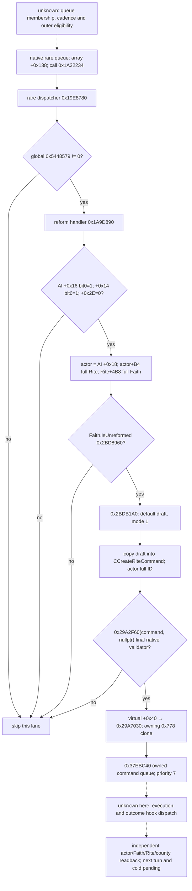

# CK3 1.20.0.2：原生 AI 改革入口与 Faith 主 Rite 状态

2026-10-01 16:31（Asia/Shanghai）更新。项目所有者已开放非战争宗教研究；本包没有访问 CK3 进程、pipe、Steam 或桌面，也没有研究战争、圣战或 holy order。

状态：原生调用链与 stock 后果为 **`research / static-confirmed`**；独立当前状态 reader **`static-ready`**。没有 paused/live、宗教动作、完整改革 OODA 或 AI 下一动作预测资格。

## Exact build 与实际证据

冻结 CK3 `1.20.0.2 Crozier / Steam25588574`；EXE 为 `Z:/ck3_mod_rewrite/artifacts/migrations/2026-09-30/post-update-1.20.0.2/installation/binaries/ck3.exe`，SHA-256 `AE1BA6FF060BA603842F6F4A2DED0AF4B7D3666B3DD271F75FB01B0DA8E81B2D`。

- [ABI verifier](../../ck3_autonomous_player/native_bridge/research/religion_reform12002_willingness_verify.py)读取冻结 PE 和三个 stock 文件；[ABI map](../../ck3_autonomous_player/native_bridge/research/religion_reform12002_willingness_abi.json) SHA-256 `30d1baac976bcb0fd954cc0e53471cb6668b7f600891692480d57a8f2d7dd1f0`，绑定 **7 个完整函数、4 个 slice、28 条语义指令**、真实 command vtable 和 `IsUnreformed` reflection 名称。
- [原生反汇编](Z:/ck3_mod_rewrite/artifacts/g2-offline-2026-10-01/religion-reform/willingness/abi/native-disassembly.txt) SHA-256 `754db38e9976c502031ef7e42ae53b3e976cbf20cdfb49ba8eb9ea9fcc015a2d`；[stock 窗口](Z:/ck3_mod_rewrite/artifacts/g2-offline-2026-10-01/religion-reform/willingness/abi/stock-evidence.txt) SHA-256 `0d5d3e58fd9ea2e39a9fb269536646648e4fef430a139c95c6ca0dac5e9df242`。
- [实际 reader fixture](Z:/ck3_mod_rewrite/artifacts/g2-offline-2026-10-01/religion-reform/willingness/fixture/result.json)：MSVC `/Od` 与 `/O2`，均 `/W4 /WX`，各 **8 case GREEN**。它调用实际生产 reader，验证主 Rite 与 actor 当前 Rite 不同、合法 false/零 ID、完整 generation、unavailable 和读取过程中主 Rite 变化。fixture 没有执行 CK3 原生 AI handler 或命令。

## 原生 AI reform lane

`AI.ToggleReligiousReformation` 字符串 RVA `0x45AA3D8` 的 console 注册完整函数 `0x337820–0x3379F8` 将 generic toggle 绑定到 bool RVA **`0x5448579`**。实际 AI rare dispatcher 在 **`0x19E87C8`** 读取同一 bool；非零才在 **`0x19E87D4`** 调用 **`0x1A9D890`**。这证明功能开关与真实调用点的关系，而不是仅凭字符串推断。



完整 handler `0x1A9D890–0x1A9DA1F` 内没有独立随机 roll、角色 trait 权重或手写评分分支；它在上述门与 final validator 通过后直接复制并排队命令。**这一结论只覆盖这个改革 handler。** 本包没有证明外层 rare queue 的周期/成员选择，也没有证明非 unreformed Faith 的通用 AI 创建 Rite/分裂 Faith 行为。AI 三个 mask 的语义名称仍未知，暂保留原始 offset/bit，不擅自标作“成年、和平、虔诚”或套用 UI 门。

Native draft construction `0x2BDB1A0` 使用 mode `1`；它不是人工随机选三 Tenet 的模型。本包只冻结真实输入/调用边，具体 draft Doctrine/Tenet 候选、成本与 final reason 由同域的 eligibility/cost 专题负责。command vtable **`0x4770550`** 的 `+0x30` 是 `0x29A2F60`，`+0x40` 是 `0x29A7030`。排队不是改革完成，owning clone 也不证明创建的 Faith/Rite 身份。

## 已实现的独立只读值

[生产 header](../../ck3_autonomous_player/native_bridge/include/xar_bridge/religion_reform12002_willingness.hpp)和[source](../../ck3_autonomous_player/native_bridge/src/religion_reform12002_willingness.cpp)提供：

```cpp
MainRiteBindings BindFaithMainRiteUnreformedImage12002(base, exact_sha);
MainRiteUnreformed ReadFaithMainRiteUnreformed12002(bindings, faith, expected_full_faith_id);
```

输出实际 Faith full ID、其 main Rite full ID、`is_unreformed` 与明确 status。调用者须是既有 paused application-main owner，并提供同帧已解析的 Faith。provider 不遍历游戏进程，不创建 draft、不排队命令、不调整自动玩家策略。

**Faith.IsUnreformed 的实际来源是 Faith 的主 Rite。** native getter **`0x2BD8960`** 从 Faith **`+0x98`** 取 main Rite full ID，经 Rite DB 完整 generation 解析后读取 Rite **`+0x8B0`** bool。reflection `0x2444600` 调用同一 getter；注册 slice `0x4D5B19–0x4D5BB7` 复制名称 `IsUnreformed` 并绑定 `0x2444600`。不能把 actor 的另一个当前 Rite 的状态替代这个值。

reader 复用 `Faith.GetMainRite` **`0x2444360`**，发布上述 bool 的实际值；合法 false 不等于 unavailable，full identity 为零也可以合法。无法解析 Faith/main Rite 时 status 说明失败，不把 native default object 的 bool 当成有效当前身份。此值是完整改革 gate 的一个依赖，**不是 final CanReform，也不是 AI willingness 分数**。该 library 尚未在本包注册 MCP 或完成实际 paused 观测；同域 eligibility provider 可以直接复用它。

## Stock 非军事结果与独立后置

本节冻结脚本定义，不声称本次已执行。来源统一为 `installation/game/`；完整文件 SHA 见 ABI map。

| 入口 | 已证明的非军事后果 | 结果验收必须读回 |
| --- | --- | --- |
| `on_faith_created:3–17` | root 是新 Faith；founder 可缺省；old Faith/Rite 是明确 scopes；`diverged=yes` 时调用起始 fervor effect | 新 Faith full ID、actor 当前 Faith/Rite、fervor；不可把 absence founder 当成 actor 改革成功 |
| `on_faith_created:207–225` | 新 Faith 获得 `free_holy_site_actions=3`；founder 当前 Faith 确实等于新 Faith 才写 `has_created_a_faith` 并清相关冷却 | Faith variable、founder 是否仍属于新 Faith；这里没有展开 holy site 操作 |
| `on_rite_created:390–436` | root 是创建角色；执行 `pam_on_conversion_effect`、移除 religious reformer modifier；现已属于新 Rite 的 founding wave 带 court/domain 转换；Rite 写 grace period 与 1 年 founding window | actor Rite；独立 court/domain county Rite；Rite variable。尚未接受 offer 的玩家封臣不能提前计成已经转换 |
| `on_rite_created:483–537` | old Faith unreformed 时写 `has_been_reformed`；新 Faith 移除两类 unreformed doctrine；forced-conversion flag 子链对旧 Faith 封臣/县分别有 `chance=75` | old Faith 变量、新 Faith Doctrine；每个实际角色/县独立读回。75 是该脚本随机门，不是 AI 改革意愿/总体成功率 |
| `on_rite_created:565–572,694–701` | 创建角色写 `has_created_a_faith`，调用同 doctrine/tenet popularity 后续，并触发 capital/family/notification events | 创建限制状态及实际后继事件；notification/ACK 不能替代 Faith/Rite 状态 |

`diverged_faith_starting_fervor_effect` 在 `00_religion_effects.txt:338–344` 调 `add_fervor`，其 value `02_religion_values.txt:4805–4806` 为 **50**。所以 stock 注释“分裂 Faith native 初始为0”不能用作脚本处理后 fervor 仍为0的结论；这也不证明所有首次创建都走 `diverged=yes`。

## 下一施工入口与资格边界

现已闭合真实 AI reform handler、精确原生状态来源和独立非 null 状态 reader。下一步由现有 context/eligibility owner 接入同一 paused query，冻结实际当前 Faith/main Rite/bool；最终 gates/cost 走已有真实 native draft/validator，禁止据上述 bool 单独启用改革动作。只有实际动作后新身份、必要资源/变量/Doctrine 和后继消费、checkpoint/cold 都有独立证据，才能提升相应 OODA 资格。

未闭合项：rare queue 周期/成员来源、AI mask 的确切名称、通用非 unreformed AI Rite 创建、native outcome hook 调度、本轮实际 paused/后置。未新增 G2 credit、整局或百年 qualification；没有战争研究增量。
