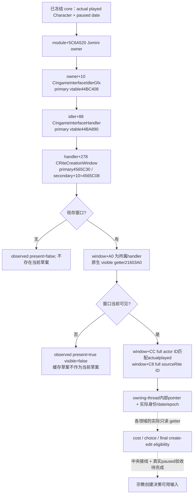

# 1.20.0.2 当前 Rite 创建草案窗口：只读来源

状态为 **static-ready library**；无 CK3 进程、UI、pipe 或 Steam 操作，无 paused/live artifact。项目所有者已恢复宗教研究，并停止战争研究。本包为[创建与改革](religion-reform12002-overview.md)的费用、候选和最终门提供**实际现存且可见的当前玩家草案**，不创建草案，不打开窗口，也不执行宗教命令。

冻结为 CK3 1.20.0.2 Crozier / Steam25588574，EXE SHA-256 `AE1BA6FF060BA603842F6F4A2DED0AF4B7D3666B3DD271F75FB01B0DA8E81B2D`。

## 原生来源

根链与 idler/handler vtable 复用现有 1.20 `event_window_context` / `title_map` 的已冻结证据；不把 event manager 的 `+0x28` / event-window vector 当作通用窗口集合。新窗口由 `CIngameInterfaceHandler` factory `0xB07EE0` 分配 `0x1200` bytes，调用 `0x14F21F0`，在 `0xB07F18` 发布至 handler `+0x278`。构造函数在 `0x14F2264` 将传入 handler 写进 window `+0xA0`；完整 RTTI/COL 证明 primary base offset 0、secondary base offset 16。

`0x21603A0` 是窗口主 vtable `+0x38` 的只读 visibility 查询：读取 window `+0x60` GUI 实例和原生可见状态，不调用 Show/Hide。当前草案 actor/source Rite 分别是 `+0xCC/+0xC8`。角色仍保留完整 generation，不以 masked index 判同一主体。

## 实际组件

[header](../../ck3_autonomous_player/native_bridge/include/xar_bridge/religion_reform12002_window.hpp)和[reader/serializer](../../ck3_autonomous_player/native_bridge/src/religion_reform12002_window.cpp)在 namespace `xar::ck3_12002::religion_reform` 提供 `BindCurrentRiteCreationWindow12002`、`ReadCurrentRiteCreationWindow12002`、`SerializeCurrentRiteCreationWindow12002`。输出的 `DraftWindowView.window` 只供同一 application-main 回调中的其它组件使用；serialized JSON 不含该指针，不接受任意地址输入。

已观测缺窗口或隐藏窗口的 scope 结果为 `available=true`，同时 `draft_observed=false`。它并不表示玩家不能创建/改革宗教，费用与最终资格也不得在此填 false/0。只有可见实际草案才交内部 pointer；native layout 或实际主体读取失败则为 typed unavailable，窗口内容不会编造成默认草案。

本包使用既有 paused core 观测合同，并在实际 getter 后再次读回根、actor/date 与现存窗口 publication。它不发现进程、不注入、不创建 native command，也不修改 GUI 状态。

## 实际验证与剩余

[exact verifier](../../ck3_autonomous_player/native_bridge/research/religion_reform12002_window_native.py)冻结四个完整函数、十一条语义指令、两个 exact RTTI/COL/vtable 和十项 actual header constants。[fixture](../../ck3_autonomous_player/native_bridge/src/religion_reform12002_window_test.cpp)链接实际 core、root reader 与 serializer；MSVC `/Od`、`/O2`、`/W4 /WX` 各 **8 cases GREEN**，每种模式产生四份实际 C++ JSON，由 Python 直接解析。覆盖真实可见当前草案、隐藏缓存、已知 absence、不同 actor generation、读期间真实主体变化、paused 合同、window owner 与 exact production binding。

artifact 为 `Z:/ck3_mod_rewrite/artifacts/g2-offline-2026-10-01/religion-reform/window/`。这些 getter callbacks 与内存对象属于夹具进程，没有调用游戏 EXE 中的函数，不是 fixture-live。

下一入口是领域联编和同一 MCP query 的实际 owner callback；root 在真实 paused 状态先读取 scope。如要验证费用/choices/final gate 的 positive 场景，需真实宗教创建窗口已打开且有当前草案，随后独立核对 native UI/input；本包自身不执行这一步。当前没有 headless 创建输入、宗教动作或完整改革 OODA 资格。
