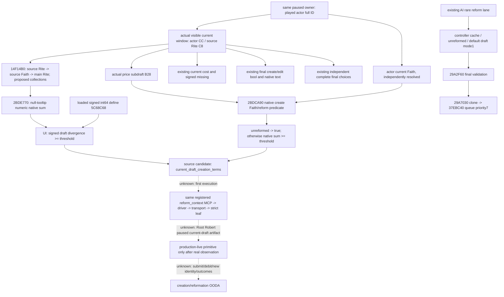

# Current draft Faith creation and reformation terms — 1.20.0.3

October 6 / 2026-W41 increment. Research inputs use source baseline `df87fd8562120b901413793ded4680b7b4dabd8e`; the integrated source candidate starts from `be06a134b9a5472275e08ea452a8e3542b192fb8` in the exclusive `reform-terms` worktree. Qualification is **research: integrated source candidate, unbuilt and untested**. This document describes the candidate behavior; no new packet, paused artifact, action, debit, new Faith/Rite identity or OODA result exists from this work. Root owns first execution, live work, canonical reports and the final integration/push.

The exact identity is CK3 `1.20.0.3 Crozier`, Steam `25652598`, SHA-256 `94B55397ABB687A3DCD436805A5D885E6BE90FA6C693FEB44A9E3BBEEADE02A6`. It is the supplied frozen identity and existing comparison evidence, not a new hash. Religion and war are fully authorized. Robert `29829` in the original ordinary campaign remains the unique live entry.

## Native inputs and the actual gap

The existing quote's non-edit label is `create_rite_or_faith`. The current-Rite model exposes current divergence and the heresy threshold, while the proposed draft uses different collections and the creation define. The existing MCP does not publish the proposed divergence or its native create-command lane. The new component makes these current draft terms observable in the existing `ck3_query_player_religion_reform_context_v1(expected_revision)` query.

Existing current cost, final CanCreate/CanEdit bool and native text, and independent complete Doctrine/Tenet final-choice queries remain the reusable inputs. The current final-gate source already owns independent non-null native reason sinks and releases them after copying. An aggregate popup's fixed `final_can_pick=null` and `final_choice_legality_readiness=false` do not invalidate the independent complete choice providers. This increment neither repeats those implementations nor changes the quote's existing `draft_kind`.

| Reused complete cached body | Extent | Existing .3 comparison |
| --- | --- | --- |
| Draft numeric divergence | `[14F14B0,14F15C9)`, 281 bytes | rite manifest span 11, PASS |
| UI divergence-creates-Faith reflection thunk | `[14FC910,14FC95B)`, 75 bytes | rite manifest span 12, PASS |
| Faith proposed-draft split/unreformed predicate | `[2BDCA90,2BDCB01)`, 113 bytes | eligibility manifest span 7, PASS |
| Native null-tooltip Doctrine/Tenet divergence sum | `[2BDE770,2BDF404)`, 3220 bytes | rite manifest span 7, PASS |

The existing manifests are `native_bridge/research/religion_reform12002_rite_abi.json` and `religion_reform12002_eligibility_abi.json`. The already recorded comparison artifacts are under `artifacts/migrations/2026-10-02/abi-comparison/religion-supplement/`. Cached disassembly remains under `artifacts/g2-offline-2026-10-01/religion-reform/`: `rite/native/native-disassembly.txt:958` and `eligibility/native/native-disassembly.txt:774`. No fresh native byte request is needed for this adapter.

The current owner resolves `5C6A520 → owner+10 → idler+88 → handler+278`. A real visible current window provides actor `+CC`, source Rite `+C8`, full inline draft `+8E8`, and price/selection subdraft `+B28`.

`14F14B0` is `int64_t*(int64_t* out, CreationWindow*)`. It resolves the source Rite's Faith and main Rite, supplies main collections `+788/+7A0` and proposed window collections `+B30/B78` to `2BDE770`, and uses a null tooltip. The adapter calls this numeric getter once. It does not call the reflection visitor or tooltip materializer.

`14FC910` is a reflection thunk. It directly loads signed Q100000 int64 at module `+5C68C68`, then compares signed divergence `>=` threshold. Its visitor return is not the comparison result. The adapter reads the actual loaded define and performs that exact comparison; equality and negative thresholds are valid. The heresy define `5C68D88` and a stock 100 value are different inputs.

`2BDCA90` is `bool(Faith*, price_draft)`. Final validator `29A2F60` passes the actor's current Faith and proposed command draft before choosing `29D1820` or `29C9760`. The corresponding window subdraft is `+B28`. The predicate returns true immediately for Faith.IsUnreformed; otherwise it computes proposed divergence and compares it to the same creation define. This boolean selects a native create-command branch. It is independent of the UI boolean, final legality, edit mode and actual created identity. The adapter passes actor Faith separately from the window source Faith and calls this predicate once.

Final create validation remains `14F56D0 → 29A1F10 → 29A2F60 → 2BDCA90 → 29D1820 / 29C9760`, AND name `14F8930`. Final edit validation remains `14F5050 → 29A2640 → 29C8CF0`, AND the same name check. Actual current cost and signed missing remain `14F57C0` and `14F58E0`; `14F4400` is the existing owned-current-Rite edit predicate. Their native values remain independent of the new terms.

The native AI lane above remains input research. This query observes the actual player draft and supplies no player command, draft builder, strategy or AI timer substitute.

## Additive .3 component

Schema is `ck3_12003_current_draft_creation_terms_v1`, with exactly 17 keys. It carries the actual `.3` game version and executable SHA, `available`, `unavailable_reason`, owner `capture_epoch/date_raw/played_character_id`, four independent full references (`source_rite_id/source_faith_id/source_main_rite_id/actor_faith_id`), two signed raw int64 values (`draft_divergence_raw/faith_creation_threshold_raw`), two independent booleans (`divergence_results_in_faith_creation/native_create_faith_or_reform`) and `raw_scale=100000`.

Readiness key is `current_draft_creation_terms_ready`. An available component requires all eight observed IDs/raws/bools to be non-null, including legitimate zero and false. Hidden, absent or failed reads retain owner metadata and an explicit reason while all eight observations remain null. Hidden draft absence leaves independently observed current context available. A visible draft with missing terms remains unfinished observation work; this schema is not a permanently-null completion claim.

Source references use the established full-generation Rite/Faith storage reader. The independent actor Faith pointer is verified against its full ID and Faith storage. The owner passes the actual current window and actor Faith. The existing after-window and paused core checks keep the composed observation in the same frame. The existing outer owner DTO uses an int32 actor carrier; unavailable -1 corresponds to the new uint32 absent ID 0xFFFFFFFF, so its unavailable metadata comparison uses the same full ID bits. Capture epoch belongs to the application-main owner and is not a snapshot revision.

The new binder accepts the actual `.3` descriptor SHA. Existing `.3` reused readers still obtain the reviewed `.2` ABI identity, so the new binder is called separately after those bindings are assembled. It rejects the borrowed `.2` SHA. Existing `.2` binding leaves the new component disabled and does not publish the additional component or readiness key. The Python transport expands the expected key sets only for `.3` and preserves the existing direct MCP-to-driver route.

## First six composed packets

The new producer reuses the old fake-memory and mailbox helpers, renames the old main, and never executes old cases. Its new main runs exactly six cases through the actual new leaf, composed runtime, owner mailbox, command-result serializer and `.3` build renderer. Its native callback values are synthetic; no native result fields are created or edited after serialization.

| New case | Required observation |
| --- | --- |
| Visible zero below threshold | divergence 0, loaded threshold 13,700,000, UI false, native false |
| Visible exact threshold | divergence = loaded threshold 9,300,000, UI true |
| Visible above threshold | divergence 0 > signed threshold −500,000; final CanCreate false remains independent |
| Unreformed native branch | UI false, native true, main-Rite unreformed true |
| Different source and actor Faith | separate full IDs; UI true and native false |
| Hidden existing window | current context available; new observations null; both new native call counts 0 |

The sole new Python compound test reads the six newly produced complete native packets through `XAR_CREATION_TERMS_NATIVE_WIRE_DIR`. It calls the existing registered MCP tool through `create_server(driver).call_tool`, the production driver method, actual protocol ingest/wait, existing transport and new strict leaf. Only envelope request-nonce correlation changes for offline replay. The complete native result is compared unchanged. No Service forwarder, MCP route change, malformed packet expansion, older packet fallback or normalized-row stub is added.

No test or build has been run by this package. Future success establishes this synthetic composed path only. Root must record actual execution, native packet provenance and the actual Robert paused sample separately before assigning fixture or live qualification.
