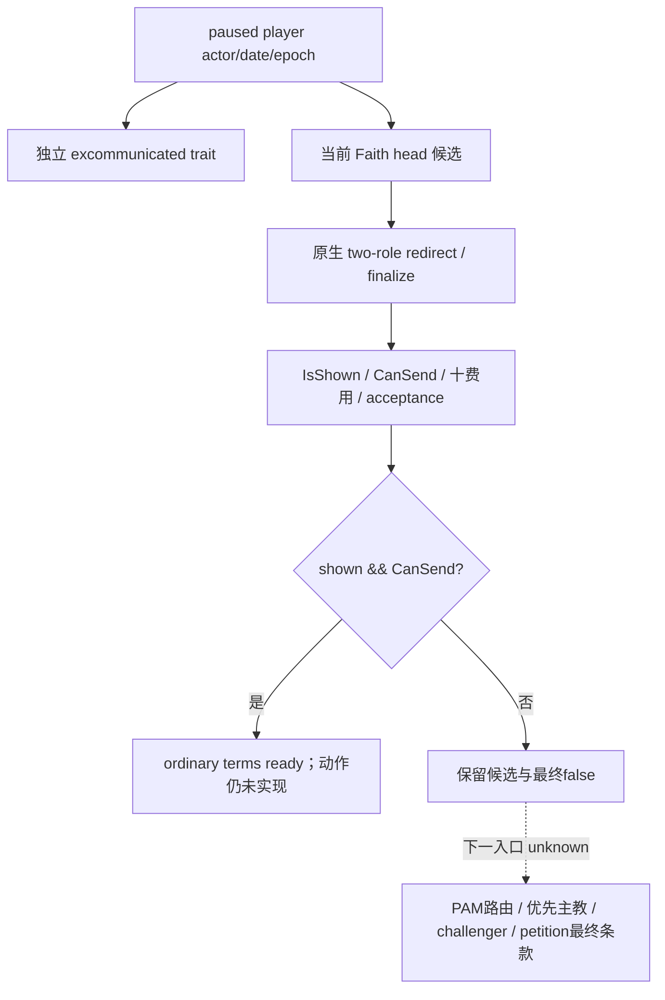

# CK3 1.20.0.3：绝罚与普通悔罪请求只读接口

2026-10-03，readiness **static-ready**；外置源码投影基线 `8cf176b436b6b0024fb591d4114b92448146181a`。尚未应用生产、组合 DLL 或取得 Robert 新 paused sample。

原生研究输入完整复用[绝罚/悔罪41段树](religion-excommunication-repentance-native-ai-12003.md)及其 `STOCK-TERMS.json`，没有重查已修 HoF 金额故障。实际必要性是 v32 order4 final hire reason 里的绝罚阻点，但本接口独立读 trait，不从该文本推定 trait=true。

新增 `ck3_query_player_repentance_context_v1(expected_revision)` 使用既有 `allow_private_player_religion_context_query`、application-main paused owner、fresh played full ID/date/epoch；固定 key 为 `declaration_of_repentance_interaction`，没有请求发送、hook/pilgrimage 选择或解除动作。

| 字段 | 读取语义 |
| --- | --- |
| `player_excommunication.{available,reason,value}` | stable-key trait DB lookup + native HasTrait；成功 false 表示没有 trait，读取失败才是 null；与其余 terms 独立保存 |
| `identity.actor_rite_id/faith_id/faith_main_rite_id/head_title_id/requested_recipient_character_id` | 同 paused date/actor/epoch 的现成 head reader 实读 |
| `identity.effective_actor_id/effective_recipient_id/secondary_actor_id/secondary_recipient_id/intermediary_id/sixth_role_id` | 原生 two-role constructor、redirect、refresh/finalize 后的六角色，不覆盖成原请求 ID |
| `recipient_source` / `candidate_scope` | `faith_religious_head_holder_candidate` / `faith_head_only`，仅当前 faith head 候选，不冒充完整优先主教集合或 `religious_head_or_challenger` |
| `options` | 原生 declared flags 全 unset 后 readback；ordinary preview 必须 selected_count=0 |
| `shown` / `can_send` | 独立原生 IsShown / final CanSend；false 是有效数据，shown=false 的候选不视为普通合法 recipient |
| `declared_costs.raw` | 原生十列 evaluator，scale100000；顺序 gold/prestige/piety/renown/influence/herd/treasury/treasury_or_gold/merit/barter_goods；只表示 on_send declared quote |
| `auto_accept` / `acceptance_preview` | 原生 auto-accept、recipient/intermediary raw scores、outer status；分值不是概率 |
| `ordinary_request_terms_ready` | 全部 sample 可用、独立 trait=true、shown=true、final CanSend=true；不表示策略已评估接受后果或可执行动作 |

trait 读取先于 head/interaction。头身份缺失或同帧不符时仍保留独立 trait；trait reader 缺失时仍保留已采 final terms。这个接口没有发布“永远 null 的 PAM 字段”。普通请求接受的 -750威望/等级-1、Purgatory -350分支、hook以及请愿 setup预扣250虔诚仍以冻结 stock 树解释，不被 declared quote 替代。

仍需施工：stock `excommunicated_recovery_find_cleric_effect` 的优先级所需 chaplain superior、capital clerical-region holder、actor superior 与其他候选；当前 `pope_excom`/recent modifier、PAM predicate、challenger 身份；正确 petition/antipope decision 的最终条款。当前 CanSend 只调用既有已证 bool getter，未绑定 error-text sink，因此没有 native refusal literal。若新 Robert shown=false，则依据这次真实帧推进上述具体路由，不用当前 head ID 假装可请求，也不由王爵或旧文本猜 PAM 结果。

一次新增必要验证：production reader + 既有 single-trait resolver + full-wire serializer 的六语义场景 GREEN；新 mailbox / changed router / registration / main-thread mailbox 四对象 `/W4 /WX` 编译 GREEN；六个真实 C++ wire 经 production NativeDriver、transport/normalizer、注册 MCP 服务 GREEN。六场景是 trait=true/final拒绝、trait=false、trait不可读但terms保留、head同帧不符但trait保留、head隐藏且CanSend=true、ordinary final允许。原首 Python harness 的缺 `build_release` import RED 保留，修复外置测试搜索路径后 GREEN，不修改产品逻辑。

证据目录 `Z:/ck3_mod_rewrite_process_assets/g2-resume-20261003/repentance/focused-attempt-01/`。`RESULT.json`、`PYTHON-REGISTERED-RESULT.json` 记录源码和wire pins；新 reusable fixture 是 `native_bridge/src/ck3_12003_player_repentance_context_test.cpp`，注册 `xar_ck3_12003_player_repentance_context_test`；Python复用 `research/repentance12003_registered_wire_tests.py <wire-dir> <report-path>`。当前通过的是直接 MSVC 聚焦链接/运行及对象编译，不把未执行的组合 CMake/CTest 写成 GREEN。

没有 CK3、pipe、SDK、窗口操作或 Git mutation；零宗教动作、paid/material/game-day/G2 credit。Robert累计3845保存天、自然继承0，G2 5/8、NW 2/4 不变。ROOT负责共享 hunk 合并、strict组合构建、真实新 PID paused read和日报/周报发布。
