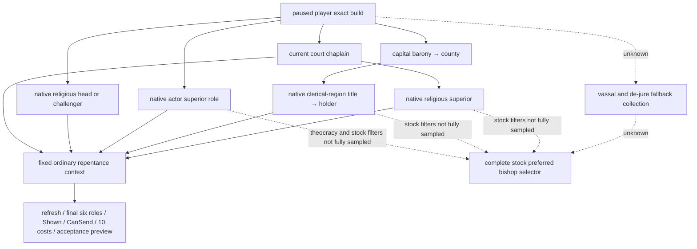

# 悔罪 recipient 原生角色输入（2026-10-03，施工前冻结）

研究基线为 CK3 1.20.0.3 / Steam 25652598，EXE SHA-256 `94B55397ABB687A3DCD436805A5D885E6BE90FA6C693FEB44A9E3BBEEADE02A6`。原版 41 段 stock terms 复用 `religion-excommunication-12003/stock-terms/STOCK-TERMS.json`（SHA-256 `1bfeb7a76de93ca9252bb363e0ba189d0d1ec2aac34c79a1785e9f0ed99ca7fa`）；新增 17 个 code spans、8 条直接调用边、4 张 selector vtable 与 5 个 literal 冻结在 `native-superior/REPENTANCE-CURRENT-CLERGY-ABI.json`（SHA-256 `c8a6707b4b84ef101b0e61895ae97048184e1071086f4409050164cda7c8872b`）。本段在候选接线之前落盘，属于 `research`。

actual v33-03 中玩家 `29829` 独立绝罚 trait=true，但当前 Faith head `29097` 的普通悔罪 interaction Shown=false / CanSend=false。当前 court chaplain `56513` 来自已有实际 clergy query；该帧不证明没有合法地方神职申请入口。

原版 preferred bishop 先检查 court chaplain 的宗教 superior，再检查 capital county clerical-region title holder，再在玩家为 theocracy 时检查玩家 superior，最后遍历 vassal/de-jure clerical-region holder。每一支还使用 tier、faith、clergy/church government、PAM/petition、recent-excommunication 与 war 等 stock trigger。普通 interaction 使用独立原生 Shown / CanSend gate；只凭角色关系不能猜合法 recipient。

可以直接只读接线的 exact-build 输入：

- `religious_head_or_challenger` scope `0x1B9CF70` 直接调用 `void* (Character*)` `0x2BE1BA0`，优先当前 challenger，否则返回 Faith head。Character full ID 在 `+0x18`；合法缺席为 -1。
- `superior` scope `0x1B9C890` 使用 `GameState` 槽 `0x5C68C50` → `+0xA0` GameData → `+0x1F1E0` lease manager；先 `int32_t* (manager,out,fullID)` `0x2A22FA0`，只有 -1 才调用 `int32_t* (out,fullID)` `0x2A268A0`，fallback 等于输入自身才映射 -1。复用 church-tax 已闭合 ABI。
- 当前 chaplain 使用已发布 `ResolveCurrentClergySeat12002` seam；它按 `councillor_court_chaplain` 找当前 seat，而非硬编码实际人物。
- `capital_county` scope `0x1B9F000` 先调用 `int32_t* (Character*,out)` `0x28B2220` 得 capital barony full TitleID，再读 Title `+0x108` county full ID。Title storage `0x5D1DAF8`，rows `+0x20` / count `+0x2C` / stride16 / pointer `+8`，身份 `+0x10`。
- `clerical_region_title` scope executor `0x1B9C9E0` 的签名为 `Scope16* (ignored,out,const Scope16** input)`，仅读 `input[0]`；输入 kind5、county full TitleID，输出 kind5、clerical-region title full ID，-1 是合法缺席。该 title 的 `+0x128` 为 holder full CharacterID。

最小施工以有限角色源取得真实 full ID，然后逐候选执行已经实机 GREEN 的固定 `declaration_of_repentance_interaction` ordinary final-context reader。输出每个角色的 available/reason/full ID、去重后候选及各自六角色/Shown/CanSend/full10 cost/接受度；第一项 final native Shown=true 且 CanSend=true 只叫“首个已观测可请求 recipient”，不冒充完整 stock preferred bishop。合法缺席返回 -1，读取失败返回 null。该增量没有动作，不执行 stock scripted effect，不声称 live。PAM named trigger、完整 preferred selector 和 fallback 遍历仍是后续原生输入入口。

## 新接线与验证

同一 `ck3_query_player_repentance_context_v1(expected_revision)` 增加 `recipient_candidates`：上述五个有限角色源的独立 available/reason/full ID、capital barony/county/clerical title ID、按首次源去重的实际候选、每候选固定 ordinary interaction 的原生 final 六角色/Shown/CanSend/十资源/auto-accept/接受度。原有顶层 `faith_head_only` preview 保持兼容；新增合法入口只由 `recipient_candidates.first_observed_ordinary_legal_recipient_character_id` 与 `any_observed_ordinary_request_terms_ready` 表达。角色缺席为公开 -1，失败为 null；原生 Scope16 以零扩展32位 payload传递（原生缺席 UINT32_MAX），公开 wire映射回有符号full ID。

新增 `petition_decision_terms` 使用两固定决议 `petition_head_of_faith_decision` / `petition_antipope_decision` 的原生 Shown、CanTake、full10 cost、affordable 和完整 CanTake reason。上下文明确为 `unselected_player_root`，`repentance_option_quote_ready=false`；一般决议可用不证明悔罪 widget可用、requires-petition trigger=true或选项费用为零。S08 输入是 `has_character_flag = pope_excom`，不能写成variable。需要选择的 `scope:petition_head_of_faith_repentance` 尚未构造，完整stock fallback与preferred selector仍未实现；这些字段没有 null占位冒充完成。

资格增量为 **static-ready**；2026-10-03聚焦验证中，11个 production units `/W4 /WX` 编译 GREEN，新候选 executable 与既有 repentance fixture 的新增链接依赖均链接 GREEN；仅运行四个新角色采集场景：地方神职合法而head隐藏、角色合法缺席、superior fallback与native clerical region缺席、clergy读取失败保留head。四个实际C++wire 经 production NativeDriver/transport/normalizer/NativeProtocolState/注册MCP服务GREEN。两个固定请愿决议 leaf另有四场景/133检查GREEN，复用其已有结果不重跑。旧head/trait语义矩阵未重跑。测试runner首次错误为 `KeyError: link` 的 harness RED：保留原attempt，复用已编译object改取cl同目录link.exe后完成链接与新场景；无产品逻辑改动。

验证artifact：`Z:/ck3_mod_rewrite_process_assets/g2-resume-20261003/repentance/candidate-focused-attempt-01/{RESULT.json,PYTHON-CANDIDATES-REGISTERED-RESULT.json,HARNESS-ATTEMPT-01-RED.json}`；请愿leaf为 `native-pam/focused-attempt-02/RESULT.json`。可复用consumer：`research/repentance12003_candidates_registered_wire_tests.py <wire-dir> <report-path>`；CMake新target为 `xar_ck3_12003_repentance_recipient_candidates_test` 与 `xar_ck3_12003_repentance_petition_decision_terms_test`。这些是synthetic callbacks的生产reader/wire证明，没有真实 paused候选、策略、动作或loop credit。

本增量基于 `Z:/g35` 的source head `5b2030b09041dbfcea11104e15d155a3b9aac1d6`，仅外置独占projection修改。ROOT负责shared hunk合入、strict组合build和新实际候选sample。实际sample后如果有限候选都不可请求，下一施工为stock vassal/de-jure fallback实际collection和编译named PAM/petition trigger入口；不能拿head隐藏结束解除绝罚决策。
