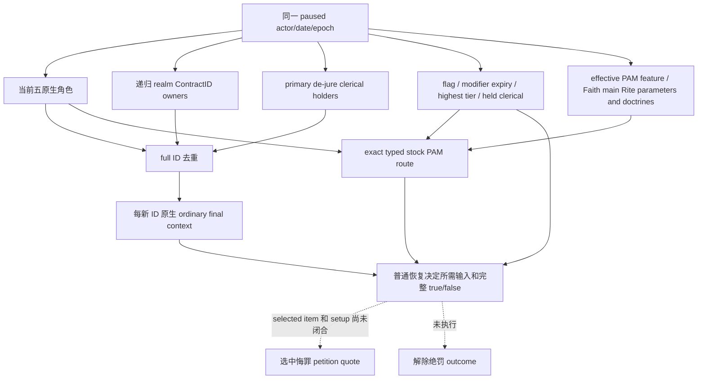
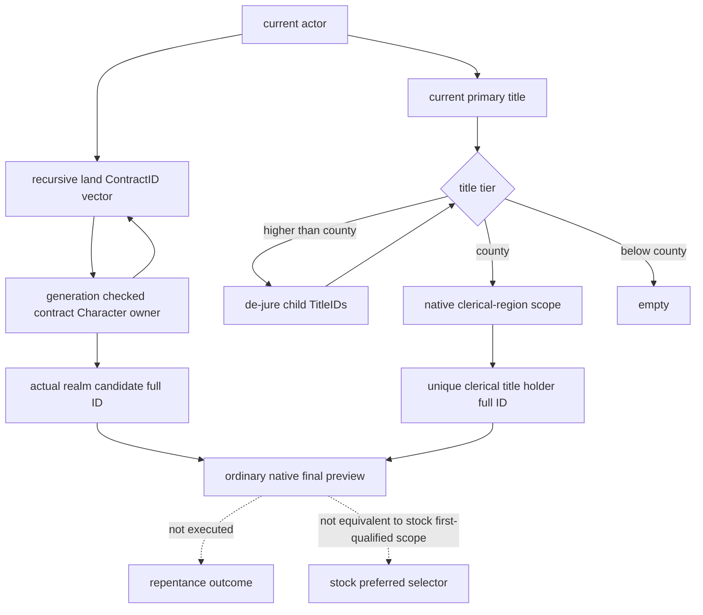
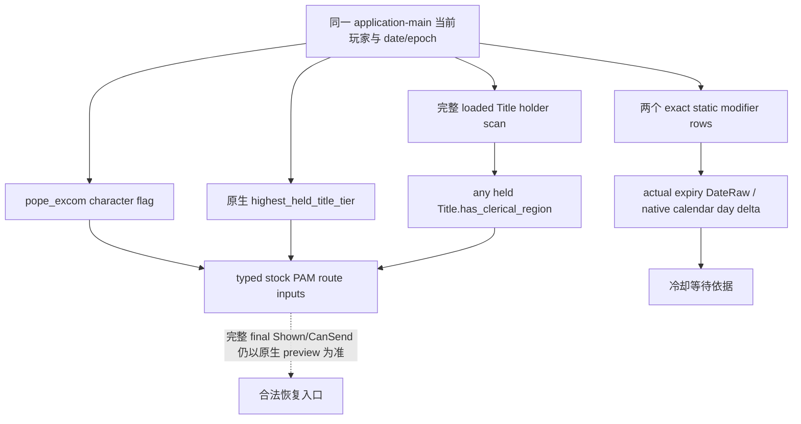
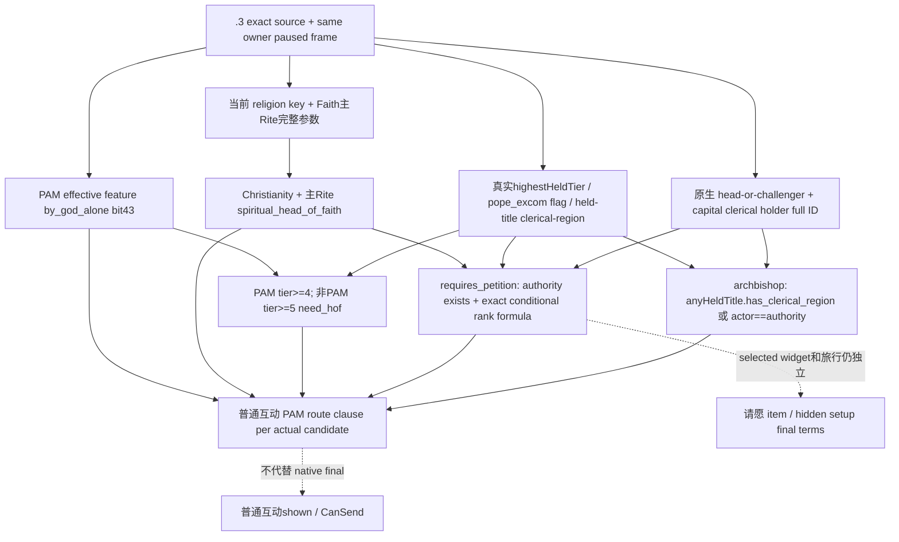

# CK3 1.20.0.3：悔罪候选完整集合、当前冷却与 PAM 路由

2026-10-03。当前必要性复用 actual v35 `012-ck3_query_player_repentance_context_v1.json`，SHA `018634db4795da75cc90ff72d6d550262d65fc2180cf0f1eec3699978c98f887`：actor 29829，DateRaw 53236608，epoch 35754；独立 excommunicated=true，29097 的三条来源以及 chaplain 56513 的普通 final Shown/CanSend 均 false。此帧只说明有限角色不可请求，不能猜 PAM 或近期绝罚原因，也不能代替其他日期的新查询。

新增原生树/ABI 分别先冻结再施工，继续使用同一 `ck3_query_player_repentance_context_v1(expected_revision)`、同一 application-main owner 内新读的 actor/date/epoch，没有新动作、SDK query 或窗口操作。原 `.3` Faith-head 兼容 preview 和 v35 actual 保留 production-live primitive 资格；本文新增集合、旗标/冷却和 typed PAM route 资格为 **static-ready**，待 ROOT 组合 DLL 的新 paused artifact。

## 同一 MCP 的具体接口

- `repentance_fallback_sources`：递归实际 realm land ContractID owners、primary title de-jure county clerical-region holders、源遍历成功/部分失败、完整 full ID 与 origin title ID。
- `recipient_candidates` 新 coverage=`native_current_roles_and_stock_fallback`。当前五角色和新增 source full ID 去重；同一个 current ID 的原生 final context 不重复求值；新增 ID 才构造固定普通 `declaration_of_repentance_interaction`，保留六角色、Shown/CanSend、full10 cost、auto-accept 与三个接受度样本。`source_candidate_evaluation_complete` 同时要求源采集完整与每个 actual candidate final terms 可用。集合是 stock 两类 fallback 的实际 source superset，未应用 stock preferred selector 的资格过滤和顺序，不声称复刻该 selector。
- `repentance_recovery_inputs`：`pope_excom` character flag、两个 modifier presence/实际 expiry DateRaw/原生 calendar remaining days、原生最高 held tier、完整 loaded Title holder scan 得出的 `any_held_title_has_clerical_region`。五叶独立 available/reason；冷却读取失败不抹掉三路由输入。
- `repentance_pam_route`：有效 PAM feature、fresh religion key/Faith/current Rite/main Rite ID、main Rite `spiritual_head_of_faith` 参数、effective main Rite central-sacraments doctrine、authority 存在与 full ID 比较、requires-petition、need_hof、archbishop 和每候选 PAM 普通路由条款。明确 `evaluator=stock_exact_typed_inputs`、`compiled_named_trigger_invoked=false`。最终交互合法性继续由 native final Shown/CanSend 决定。
- `ordinary_recovery_readiness`：必要叶、完整来源和所有 final samples 可用时 `ordinary_recovery_decision_inputs_ready=true`；给出 ordinary 合法入口，或 `ordinary_request_route_currently_absent=true` 的完整负结论。部分 source 或必要叶读取失败时 absent 为 null，并保留已成功的候选。它的 scope 是普通候选集和当前路由输入，`selected_repentance_petition_terms_ready=false`；一般 petition CanTake/成本不能代替选中悔罪 item 的 quote。

## 施工前输入树与 ABI

### 真实 stock fallback 来源

# CK3 1.20.0.3 repentance fallback source tree

2026-10-03，implementation 前冻结；exact EXE `94B55397ABB687A3DCD436805A5D885E6BE90FA6C693FEB44A9E3BBEEADE02A6`。复用 previous current clergy ABI，不重查已证 authority/superior/capital getter。

必要性由父工作包 actual 012 提供：actor 29829、epoch 35754，已观察的 clergy sources 29097/56513 均 ordinary shown/CanSend=false，capital region=-1。stock `excommunicated_recovery_find_cleric_effect` 的最后 fallback 必须补真实 realm/de-jure 候选 ID；不重复运行这些已失败的角色预览。

stock 先 `every_vassal_or_below`，随后 `primary_title.every_clerical_region_in_dejure_title.holder`；各自 stock limit 调用 valid-cleric trigger 后写 temporary list，最后 try-save 首个 qualified scope。本施工只读两种真实来源，不执行该 effect 或写 temporary scope。qualification 可以留给每个真实 ID 的固定 ordinary native final preview。

原生 `vassal_or_below` 注册 0x36DE80 → 0x1BEF100，iterator 0x1BFF470 → source 0x1BE2830。source读取 Character+0x1C0 的 land，遍历 land+0x218/count+0x224 的完整 ContractID，storage 0x5D1EB88 以低24位索引并核对 contract+8 完整 ID，取 contract+0x20 真实 Character*，输出 Character+0x18 完整身份后递归。可选原生 government context filter 在非默认 context 下存在，本 collector 明确绕过该 context filter，输出 actual recursive contract owners。

`clerical_region_in_dejure_title` 注册 0x372490 → 0x1D0DB70，builder 0x1CFB850 先调 0x2BF3F80 收集 de-jure county active state，再 0x2C60CA0 通过既有 map 0x2A0CB90 得唯一非 -1 clerical region IDs，最后 region+0x50 发 kind5 title scope。0x2BF3F80：tier<2为空；tier2调用 0x1B756F0（已有 province/active-state seam）；tier>2调 0xD55CC0 返回 Title+0x110 的 de-jure 子 TitleID vector，count位于+0x11C，full-ID解析后递归。collector以已证 clerical-region-title scope 0x1B9C9E0 逐 county得到同源 title，然后读+0x128 holder；duplicate clerical title只发一次。

`traversal_complete` 仅表示该源全部当前 full-ID edges/holder读取成功；读失败应保留已观察 rows，并分别标 incomplete，不让另一来源成功冒充它完成。成功空源可 complete=true。完整源遍历仍不等于完整 stock preferred selector、合法请求或已解除绝罚。

### 当前旗标、modifier 到期与持有教区

# CK3 1.20.0.3：悔罪恢复的当前玩家旗标、冷却与教区身份输入

2026-10-03，施工前冻结，readiness `research`。Exact EXE SHA `94B55397ABB687A3DCD436805A5D885E6BE90FA6C693FEB44A9E3BBEEADE02A6`。当前必要性来自 actual v35 同一 MCP 的两个普通请求候选 `Shown=false/CanSend=false` 与两个一般请愿决议 `CanTake=false`；复用已保存 payload，不再查询游戏。

Stock S01 对玩家检查 `recent_excommunication` 与 `promised_pilgrimage_to_clergy_modifier` 两个 **character modifier**；S08 的 `pope_excom` 是 **character flag**，不是变量。S31 在选择 pilgrimage 后添加十年 modifier；这不允许用默认十年倒算当前到期日。最高头衔使用原生 `0x28AC6B0(Character*)`，包含原生特殊 tier 分支，不能用 primary title 代替。`any_held_title.has_clerical_region` 的独立布尔值可在当前 loaded Title storage 完整扫描 holder=玩家，再依据原生 `has_clerical_region` evaluator 的 `Title+0x328==4` 判断；只返回完整布尔值，不声称 stock 候选遍历顺序。

FlagSet 复用现有 StringAtom lookup-only `3F8A3A0`、`1D67200`；rows `+10`、count `+1C`、stride `20`、key row`+8`。已注册键不存在、无 script data、index=-1 合法空集合都是 false；不可读取才 unavailable。Static modifier definitions 由 `8FD4E0 -> 3F7E240 -> AB8D20` 与实际 stable key 核对。原生 presence `1AFA160` 扫 script data `188/194`，stride48，definition row`+0`；原生 duration `1AF9340` 读取同一 row`+8` 的实际 DateRaw。实际删除入口 `2AC5D17` 比较此 DateRaw 和当前游戏 clock，闭合其到期语义。剩余天数沿用原生 duration 的 `trunc((date-0x29C55C0)/24)` 差；不得把 expiry 改写 presence，也不按 stock 默认时长计算。

每个 leaf 独立 available/reason/value；modifier 失败不得丢失 flag/rank/archbishop 输入。父查询负责现有 paused frame 与 played actor binding，本 leaf 携带相同 actor/date/epoch，不另读 snapshot。没有动作、脚本 effect、flag insertion、偿付或 G2 信用。Frozen ABI 与字节见同目录 `REPENTANCE-RECOVERY-INPUTS-ABI.json` / `NATIVE-DISASSEMBLY.txt`；已有 trait、head、candidate 与请愿矩阵直接复用。

施工后：独立实际reader/serializer与六个必要新增场景已MSVC严格编译、链接、执行GREEN，readiness提升至 `static-ready`。同目录 `focused-attempt-01/RESULT.json` 与六个JSON为证据；此叶尚无真实paused sample，不能记为live。

### PAM typed 条件与原生 scalar 比较

# PAM 悔罪路由：施工前原生输入树

2026-10-03，CK3 1.20.0.3，EXE SHA `94B55397ABB687A3DCD436805A5D885E6BE90FA6C693FEB44A9E3BBEEADE02A6`。本树与 `NATIVE-TREE-AND-ABI.json` 在新 leaf 施工前冻结。当前实际 trait 为 true、两候选普通互动 shown/CanSend 都为 false，两个一般请愿决议 shown/CanTake 都为 false；需要观测路由，不能从这些 false 猜具体原因。

本叶的求值方式明确是 **`stock_exact_typed_inputs`**。它使用完整原版公式和现有只读 native providers 的实际 typed inputs；没有声称调用已编译的 named scripted trigger。通用 named-trigger lookup/eval 尚未闭合，不作为本轮可见观测的依赖。

PAM stock `has_pam_dlc_trigger` 精确展开为 `has_dlc_feature=by_god_alone`。本叶新读这个固定 feature 的实际有效 bit，不读取商店 entitlement。`.3` enum table、CString record/literal、feature root 和 manager bit layout 已分别冻结到 contract。

S08 的 `pope_excom` 是 `has_character_flag`。requires-petition 的 rank 条件只在三个绕过分支全部 false 时才执行，不能简化为“国王或教皇绝罚”。S15 的 need_hof 根据 PAM 有效 feature 选择 kingdom/empire 阈值。S17 的 archbishop-or-higher 是任意已持有头衔有 clerical-region，或 actor 自己是 head-or-challenger；不是普通最高头衔 rank 的同义词。

religion、Tenet parameters、Faith main Rite doctrines、recipient candidates 和 sibling recovery raw inputs 必须在本次 owner 内新读，并与 actor/date/epoch 对齐。主 Rite 集合中不存在对应 parameter 或 doctrine 是合法 false；不能拿 actor 自身 Rite、个人 tenets、上次外部 query 或“Catholic”名字代替当前集合。

Faith.HasDoctrine/GetDoctrines 的当前 native 语义已经由现有 `religion_doctrine12002_intrinsic.hpp/.cpp` 闭合到 Faith main Rite。故 S18 的 Faith HasDoctrine 或 main Rite HasDoctrine 两支都读取同一个有效 doctrine 集合；本叶公开这条来源和 `doctrine_sacraments_central` 结果。

这些输出只解释源定义中的路由条款。它们不覆盖 `broader_clergy_show_hof_or_superior_interactions_trigger`、年龄、trait、战争、modifier、pending petition、完整原生 CanSend、repentance item 成本或 audience outcome。

## 可核验验证与后续

- 原生证据 `Z:\ck3_mod_rewrite_process_assets\g2-resume-20261003\repentance\native-superior\v36\FALLBACK-ABI.json`，SHA `e381a9d1fc41bca2dbf86baa8eb07a599e4af64c270934222e6ee26d552a316d`。
- 原生证据 `Z:\ck3_mod_rewrite_process_assets\g2-resume-20261003\repentance\native-recovery-bits\REPENTANCE-RECOVERY-INPUTS-ABI.json`，SHA `7399b7fa658ba777f8e725793320f831f54830e42ca93cbf8277bb85c6d4f75f`。
- 原生证据 `Z:\ck3_mod_rewrite_process_assets\g2-resume-20261003\repentance\native-pam\v36\NATIVE-TREE-AND-ABI.json`，SHA `f2b171cb2e0117b05c771eddd9a97fa50089b688d68974efc4b646303da9249c`。
- 原生证据 `Z:\ck3_mod_rewrite_process_assets\g2-resume-20261003\repentance\native-pam\v36\OPTIONAL-SCALAR-EQUALITY-ABI.json`，SHA `9ae64f68b65f3e54dbe346c65a254fd891ddf57b7c53d7c1b82520700ffe7ed8`。

独立新 leaf fixture 复用交付结果：fallback 5、recovery inputs 6、PAM 12 scenes/115 checks；仅新增 merge 分支再验证 5 scenes。父级 11 个 production/new-fixture units `/W4 /WX` 编译、native link/run GREEN；5 个实际 C++ 生成 wire 经过 production NativeDriver、NativeProtocolState、normalizer 和注册 MCP GREEN。旧语义矩阵没有重跑；不因新增 link dependency 重跑旧场景。

父级证据目录 `Z:/ck3_mod_rewrite_process_assets/g2-resume-20261003/repentance/v36-integration-focused-attempt-01/{RESULT.json,PYTHON-V36-REGISTERED-RESULT.json}`。独立 leaf 证据位于 `native-superior/v36/focused-*`、`native-recovery-bits/focused-attempt-01/RESULT.json` 和 `native-pam/v36/focused-attempt-02/RESULT.json`；PAM 第一次 fixture signed/unsigned warning 是 harness RED，保留失败 attempt 后只修该 fixture 并完成新分支验证，不改产品语义。

ROOT 合入后需要一次同 MCP 新 paused capture；新实际输入若全部成功，则普通恢复决策得到真实合法入口或完整的当前无入口结论。若 requires-petition=true，下一项可施工入口是选中 `scope:petition_head_of_faith_repentance` 的 widget/setup/cost/CanTake，而不是把未选中一般决议当作已可发送；若 recent modifier=true，则 actual expiry/remaining days 直接供等待分支。通用 compiled named-trigger lookup/eval 保留为研究替换入口，本次 typed stock route 已有完整源公式与 native scalar/field 证据。

## 2026-10-03 actual v36：共同主线程前置故障，悔罪新增叶尚未执行

Source `6b0e6bdfa6b18396394ce8f12301e464825f1f46`，DLL `bdb08f2e6cc7bc5afd4d65119e8d19ca5cf19fba50c1e356eb8fa892c1702c16`，ROOT PID90596。实机capture `Z:\ck3_mod_rewrite_process_assets\g2-resume-20261003\runtime-preparation\v36-retry-02\actual-new-leaves-v36-01` 的 `030-ck3_query_player_repentance_context_v1.json` SHA `1a42f9a3e0d07d6fedcafa6d8082d86d0b4404f96e07ffadccd43b3f183f74c9`、610bytes，为保存的RED错误包；没有native result body。不能把此包写成PAM/expiry/候选来源已观测，也不能从它得出普通请求不存在、requires-petition或冷却布尔值。

已有027 snapshot的mailbox为failure=0、ready=true、published/completed/executed=12。028 battle查询后029为failure=512、ready=false、三计数13；030悔罪请求后的031仍failure=512、ready=false、三计数13，pump从77420增长到77684。请求前后actor29829、episode native-29829-2bc2d599f7f9、DateRaw53236728、paused/mapready、public/native revision2都稳定。由已保存的计数可确认：该悔罪attempt没有执行新增reader；目前可复现前置阻点是共同mailbox状态，不是具体悔罪ABI叶或原生合法性false。512的具体异常归因由ROOT的runtime_prepare lane负责，本lane不重复展开共同故障。

新增五个sidecars仍保持static-ready；此前v35 current-role final terms和unselected petition production-live primitive保留为其历史日期证据，不能补入本次不同日期的空body。最高优先级依赖已经交给运行时lane：恢复共同mailbox后，使用fresh public revision/actor/episode/date，**一次**同MCP新paused capture，再依据实际requires-petition/expiry/完整候选legal判断下一原生primitive。当前没有支持新增宗教观察字段或改PAM公式的真实叶子失败，因此没有派生无依据新native lane。

本分析仅文件消费；ROOT累计3850日，本lane零新增日、动作、SDK/pipe/window/Git/shared-source操作；旧测试零重跑。逐包SHA、counter和资格存于同目录OBSERVATION-QUALIFICATION.json。

运行时负责人追加源码闭合：实际512为 `main_thread_query_failure_executor_exception`；executor SEH catch置该flag（其hpp132/cpp1782证据）。后续Submit在非零flags时直接`infrastructure_failed`（cpp1433/1463），Reclaim只回idle不清flags；因此实际持续seq13/readyfalse对应共同executor异常后的拒绝，悔罪叶没有被执行。具体最初battle terminal异常由该owner修复；本lane无悔罪产品代码修改。

## 2026-10-03 actual v37：完整普通恢复决策输入已可用，当前没有合法请求

实机artifact `Z:\ck3_mod_rewrite_process_assets\g2-resume-20261003\runtime-preparation\v37\actual-new-leaves-v37-01` 的014 packet SHA `12601d01a4fbb90293f2d42ebdc22f953a669d83d577f9eaeb35bfbf174bab5a`，178627bytes，MCP isError=false。Source `f42522f7f176ad67b000d66341a17a02a3f82ae7` / DLL `e6c114d82d31900d0a07bf6c43eb89a26f3fd55e2ffb3a3c9a1b5385af7c4585` / ROOT PID62452。actor29829，episode native-29829-2bc2d599f7f9，DateRaw53236800，epoch11125；请求public revision2正确映射native revision3。013/015前后暂停、身份/episode/date相同；mailbox ready=true/failure0，published/completed/executed5→6，证明这次新reader真实执行。ROOT维持窗口最小化、foreground=false；本lane只消费保存文件。

本次新增 source/raw/PAM/completeness 资格提升为 **production-live primitive**。五当前角色完整：chaplain superior/actor superior/authority29097、capital clerical holder=-1、chaplain56513；barony2143/county2142/region=-1。Realm遍历18nodes，17个actual fallback角色；primary title2141的de-jure遍历4nodes，合法空集合。合计19个去重actual候选，每个普通 final identity/六角色、Shown/CanSend、full10 declared cost、autoaccept和接受度都available；全部Shown=false/CanSend=false，full10均0、autoaccept均false，recipient score/outer status仍是preview，不是发送许可。

`ordinary_candidate_collection_complete=true`、`ordinary_recovery_decision_inputs_ready=true`、`ordinary_request_route_currently_absent=true`；legal recipient=null是完整集合没有可发送项的确定结果，不是漏读或长期null占位。Stock preferred selector的过滤/顺序仍未声明完成，观测集合是已冻结stock两源的actual superset。

独立excommunicated=true；pope_excom flag=false、最高held tier3、any-held clerical=false。recent_excommunication和promised_pilgrimage modifier均available且present=false；expiry/remaining null是合法不存在，不能倒推默认到期日，也不能宣称已实测有modifier的到期日期路径。PAM feature=true、Christian/mainRite spiritual-head=true、authority存在，requires-petition=false、need-hof=false、archbishop=false；head29097的PAM ordinary clause=false，其余18候选PAM条款true。

至少一个共同visibility必要条件已经闭合：fresh Faith23/mainRite152有效doctrine的central-sacraments=false。冻结S18等价Faith/mainRite的`doctrine_sacraments_central` membership；S01普通互动和S04/S05一般petition的is_shown均要求该条件=true。本次19 nativeShown=false及两decision nativeShown/CanTake=false与之相符；不能把正接受度或zero declared cost当可发送，换recipient或等待不存在的冷却也不解除这项条件。本文不把它称为每个CanSend false的唯一原因。

两一般petition仍是unselected-player-root，native costs均0/affordable=true，reasons完整保存；`selected_repentance_petition_terms_ready=false`保留诚实边界。当前requires-petition=false且两一般decision隐藏，新增selected item primitive并非这帧解除普通决策所必需，没有依据派生额外native lane。若以后fresh Faith/mainRite/rank改变使petition相关，再从已冻结selected widget/setup/final quote入口续接。本次不是解除绝罚动作、恢复loop或G2完成。

R14/v36共同executor_exception512导致下游未执行的失败artifact原样保留；本次新PID实际成功与该attempt分开记。ROOT累计3853日，本lane0新增日/SDK/State/pipe/window/shared/Git/动作；没有重跑旧测试。全部逐候选表、每叶资格和source证据回链在本目录OBSERVATION-QUALIFICATION.json/CANDIDATE-MATRIX.json。
