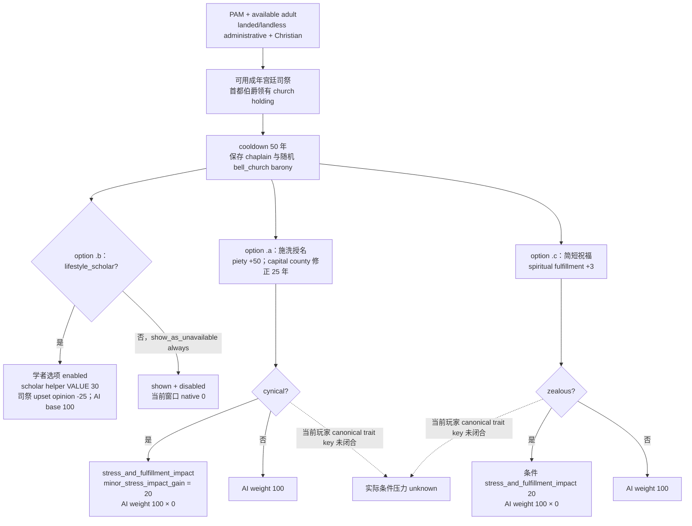

# CK3 1.20.0.3：教堂钟施洗事件 `.0055`

本文针对 Robert `29829` 普通战役中实际出现的 `pam_secular_faith_events.0055`（event instance `31`），先冻结原版条件、AI 权重和玩家当前选项，再记录普通选项后态。它不扩展通用 event effect preview，也不把数字 trait ID 猜成特质键。

## 版本与输入

- CK3 `1.20.0.3`，Crozier / Steam build `25652598`；复用既有冻结 EXE SHA-256 `94B55397ABB687A3DCD436805A5D885E6BE90FA6C693FEB44A9E3BBEEADE02A6`，本包未读取或重新哈希 EXE。
- 文档施工基线 `65f033d202c0630b0674e95911d834f07be3bf9e`；源码包 `Z:/ck3_mod_rewrite_process_assets/g2-background-20261006/secular-faith-bell-event31/`，真实起始时间 `2026-10-06 06:14:56 +08:00`。
- 原版 `game/events/dlc/pam/pam_secular_faith_events.txt:7690–7780`，全文件 SHA-256 `3f426901da4b9f71d10cf320ed8102c7d9df23ade3e41b1955d8467d4bdb4789`；相关 trigger/value/modifier 的原文片段和全文件 pin 在包内 `TOKEN-SOURCE-PINS.json`。没有二进制捕获、编译、测试或本代理实机操作。
- Root 已归档的实机前态：`Z:/ck3_mod_rewrite_process_assets/g2-resume-20261006/gameplay-responses/692-event31-window-context.json` 与 `693-event31-religion-before.json`，同一 raw date `53286144`、public revision `1006` / native revision `1005`、暂停帧。本文只离线读取这些既有产物。

## 原版事件树

这是 Christian theme 的 `character_event`，自身 cooldown `50` 年。`pam_secular_faith_christian_actor_trigger` 展开为 PAM DLC、`is_available_adult`、`is_landed_or_landless_administrative`、宗教为 `christianity_religion`；事件另外检查可用成年 AI 宫廷司祭和首都伯爵领中的教堂 holding。该原版 actor trigger 不限玩家；本包只用于已授权玩家 `29829` 的当前窗口。

`immediate` 把宫廷司祭存为 `chaplain`，在首都伯爵领随机选择符合 `church_holding` 的 county province，再把其 barony 存为 `bell_church`。当前实际 saved scopes 为 character `56513` 和 landed title `2146`。施洗选项的修正目标仍是 `capital_county`，不能把修正写成施加给 `bell_church`。

这里的 `100` 是原版 `ai_chance` 基础权重，乘数只改变相应候选的权重；它不是保证选择率。本文没有闭合本事件调度器、候选集合归一化或随机种子，也不把普通玩家选择等同原生 AI 抽样。

## 当前实际窗口与选项身份

事件 calculated ID `3430055`、runtime ordinal `5070`，root scope 为 type `4` / character `29829`。下面的 public API ordinal 是 `native_option_index + 1`；`rendered_index` 仅用于显示顺序。实际 enabled/shown 来自 `.3` 当前窗口产物，未套用旧 `.6` RVA。

| authored key | rendered / native / API | 实际 shown / enabled | 源码条件和效果 |
|---|---|---|---|
| `.0055.b` 学者告诫 | `0 / 0 / 1` | `true / false` | 要求 `lifestyle_scholar`；`show_as_unavailable = always`。调用 `add_scholar_trait_or_xp_effect VALUE=30`，司祭对 root 的 `upset_opinion=-25`；AI base `100`。helper 内部未因本次禁用选项展开。 |
| `.0055.a` 施洗授名 | `1 / 1 / 2` | `true / true` | `add_piety=minor_piety_gain=50`；首都伯爵领添加 `pam_sf_blessed_bell_county_modifier` `25` 年；cynical 条件压力/满足感 impact 基值 `20`。cynical 时 AI factor `0`。 |
| `.0055.c` 简短祝福 | `2 / 2 / 3` | `true / true` | `change_spiritual_fulfillment=minor_spiritual_fulfillment_value=3`；zealous 条件压力/满足感 impact 基值 `20`。zealous 时 AI factor `0`。 |

首都修正定义为 `county_opinion_add=5`、`travel_danger=-5`。这些是已闭合的脚本输入；条件 stress helper 的最终运行时增量仍不能只凭基值宣称为 `+20`。

窗口 `.b` 的 unavailable reason 明确指出玩家没有 `lifestyle_scholar`，对应原生 effect indicator 的 trait key 也为 `lifestyle_scholar`（该行 native ID `303`）。这是该窗口的实际条件证据，不是给全部玩家 numeric trait ID 建表。Root 报告的 generic snapshot 将三个选项都标成可用；该 generic 结论不能替代实际 window rows。本包没有额外读取该 generic snapshot 产物。

当前 window query `current_event_window_context_ready=true`，三项都 shown、都不是 fallback/cancel。`.a` indicator rows 为空；`.c` 有 fulfillment/increase row，magnitude unavailable。`complete_effect_set=false`，通用 `semantic_decision_ready=false`，原因为 indicator subset 没有完整性信号。源码已给出本事件窄例效果，因此本次普通选项决策可以依据这里的 source tree 与实际 enabled row；本包不增加 preview 门禁或改变通用 schema/readiness。

## 本次选择的证据边界

Root 本次计划选择 public API `2`，与已有 first-enabled fallback 得到的候选相同，并以源码中的虔诚和首都修正为依据。前态宗教 query：Catholic faith `23` / rite `152` / Christianity religion `8`；`spiritual_fulfillment_raw=1000000`、scale `100000`；piety devotion `current_devotion_total_raw=150926266`、level `2`。玩家 trait ID 列表没有发布 canonical keys，因此 cynical/zealous 条件保留 unknown，不按数字、图标或邻接表猜测。

本包目前为 **source-confirmed + observed current presentation input**。实际提交、事件移除和独立 state/religion 后态由 Root 执行与归档；提交 ACK 不能证明虔诚变化、修正已添加或条件压力效果。只在后态有相应字段时给实机效果信用；修正持续期、目标和数值在未有后态字段时维持 source-confirmed。无本包新 bridge primitive、测试或完整通用事件策略信用。

后续最小入口是 Root 的本次普通选择后独立玩家 state/religion 与 current event/window readback。若实际效果与本文有差异，先对照同实例与 raw date，再定位对应脚本效果；不先扩展全事件目录或加入猜测的 trait 映射。
