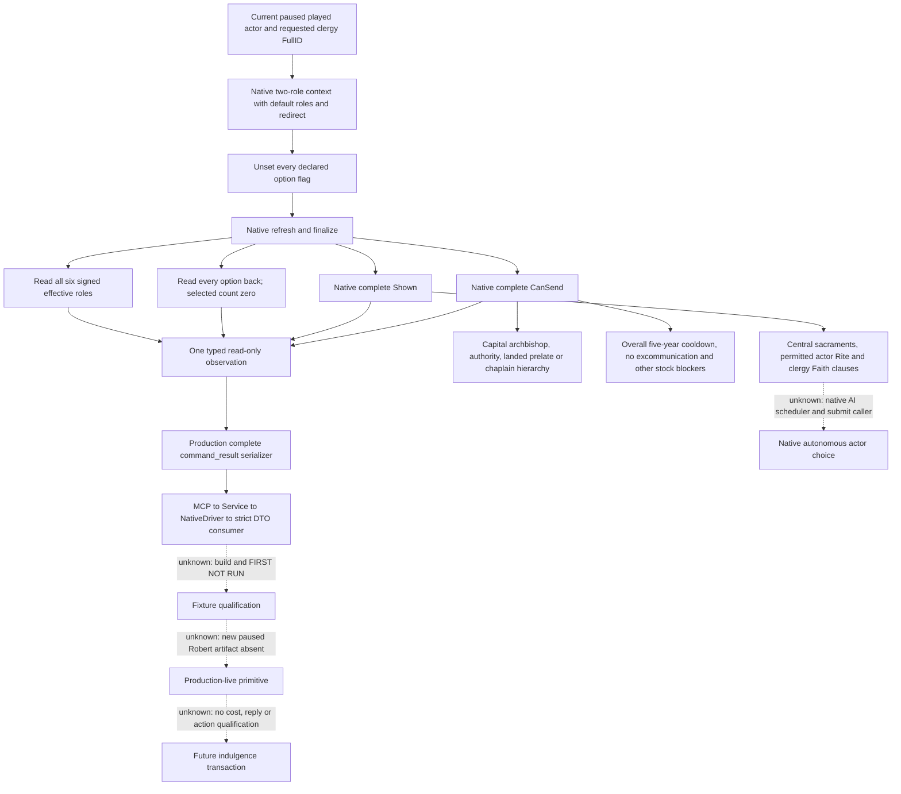

# Ordinary indulgence visibility and final eligibility, CK3 1.20.0.3

2026-10-06: **research / source-prepared; build, imports, tests and live NOT RUN**.
This leaf reads the current player's fixed-key ordinary
`seek_indulgences_interaction` against one explicitly selected recipient. It
publishes native visibility and final eligibility. It adds no interaction
submission, resource quotation, acceptance prediction or action readiness.

Exact target: Steam CK3 **1.20.0.3 Crozier / build 25652598**, EXE SHA-256
**94B55397ABB687A3DCD436805A5D885E6BE90FA6C693FEB44A9E3BBEEADE02A6**.
The existing .3 ABI proof is reused; this package reads zero new EXE bytes and
computes zero EXE hashes. Implementation base is `bcdbc27e972df477cc9b01f167c066a691c23a7b`
in isolated `Z:/gfdi1`. Initial source study read `Z:/gb0` at
`db88efa9da76b7a3647f4dda549b549963880dbb`.

## Source-first selection

The [ordinary self-conversion observations](religion-conversion-native-ai-12003.md)
already resolve candidates, paid final eligibility, quotation, reasons and target
inputs. A historical Robert frame needed 777 piety and held 365.7625 piety.
Those values motivate observing another piety route; they are not a current
balance or quotation. The [HoF gold topic](religion-catholic-head-of-faith-gold-native-ai-12003.md)
records indulgences as a source-only alternative. Existing religion, Doctrine,
confession and repentance fields do not supply indulgence-specific final terms.

The installed .3 game source is
`Z:/SteamLibrary/steamapps/common/Crusader Kings III/game`.
The frozen stock excerpts and original source tree are outside Git at
`Z:/ck3_mod_rewrite_process_assets/g2-parallel-20261006/faith-doctrine/seek-indulgences-stock-excerpts.txt`
and `faith-doctrine-indulgence-final-terms-12003.md` in that same directory.
The older repository game reference was excluded from this study.

The relevant stock contract is in `common/character_interactions/00_religious_interactions.txt`:

- `cooldown = { years = 5 }` at line 2461 is the **overall interaction cooldown**.
  It is not a recipient cooldown. `_character_interactions.info:214–220`
  distinguishes `cooldown` and `cooldown_against_recipient`.
- `NOT excommunicated` at lines 2527–2528 blocks this route for an excommunicated
  actor. It does not remove excommunication. The [repentance route](religion-excommunication-repentance-native-ai-12003.md)
  remains a separate interaction. A historical absolute trait value is not
  assumed to describe the next frame.
- The capital-archbishop/head/landed-prelate/chaplain clauses select the recipient
  hierarchy. `doctrine_sacraments_central`, permitted current Rite and authored
  clergy/faith clauses participate in visibility and eligibility.
- Lines 2568–2578 declare one `offer_pilgrimage` option. A hidden option still
  exists in the definition. Ordinary terms require all actual declared flags
  unset and native readback confirming selected count zero.
- The cynical, `hof_request_cooldown` and liquidity prefilters at lines
  2411–2422 occur only under `is_ai = yes`; the player reader does not reproduce
  them as player requirements.

The stock AI targets and willingness are inputs to the recorded tree. The native
AI scheduler and submission caller remain unknown. This implementation reads the
full current native final result instead of reconstructing it from Doctrine names.



## Reused native seam

The frozen cache is under
`Z:/ck3_mod_rewrite/artifacts/g2-maintainer-2026-10-02/resume-12003/religion-head-of-faith-gold-12003/native/`:
`TWO-ROLE-CONTEXT-PROOF-12003.json`, `SHOWN-PROOF.json` and
`EXISTING-CONTEXT-PINS.json`. No new metadata/body extraction is requested.

| Cached .3 binding | Meaning retained by this reader |
| --- | --- |
| `89DA60`, `3F7E240`, `A055E0` | Definition DB, fixed-key hash and lookup; verify stored hash at `+14` and CString at `+18` |
| `3076C90(ctx338, definition, actor, requested, null, true)` | Native default roles and redirect once; preserve six `int32` roles at `+2D8..+2EC` |
| `30788E0`, `3078880` | Set every actual option false and read it back |
| Definition `+2258`, `+2264`, stride `730`, option flag `+368` | Declared option enumeration, independent from selected count |
| `3078A60`, `3078C90`, `30773A0` | Existing refresh, finalize and disposable-context destruction |
| `30796B0` | Complete native menu visibility |
| `307C040(context, null)` | Complete final native eligibility |

Only a local preview context is mutated. No submission binding is exposed.
The requested recipient remains an unsigned full 32-bit ID, excluding the absent
`FFFFFFFF` sentinel. Its bit pattern reaches the native signed constructor
argument without truncation. All six effective native roles remain signed;
`-1` is a legitimate sampled absence. The actor is resolved from the current
played character by the existing paused application-main query owner.

## Delivered API and availability semantics

```text
MCP:        ck3_query_player_seek_indulgences_terms_v1(expected_revision, recipient_character_id)
step:       query-player-seek-indulgences-terms-v1
domain:     player_seek_indulgences_terms_v1
schema:     ck3_12003_player_seek_indulgences_terms_v1
body key:   player_seek_indulgences_terms
permission: allow_private_player_religion_context_query (existing)
```

The collector, DTO and serializer are in
`ck3_12003_player_seek_indulgences_terms.hpp/.cpp`; the mailbox and complete wire
are `ck3_12003_player_seek_indulgences_mailbox.hpp/.cpp` and
`ck3_12003_player_seek_indulgences_wire.cpp`. Existing executor registration,
router and bridge revision parsing route this step under the existing religion
query build flag. The Python transport requires the exact build, frame, actor,
recipient and typed sample groups through `GameplayBridgeService` and
`NativeHeadlessGameplayDriver`; the MCP tool is declared read-only.

The 15 top-level DTO keys contain build/frame provenance, fixed definition key
and hash, identity, options, shown and can_send. Each sample group carries its
own availability and reason. Sample failure produces null sample values.
`available=true` requires complete identity, option readback with all flags
unselected, shown and can_send samples. It does **not** require either bool to
be true: a native false remains an observed result. A request or frame failure
continues to use the existing transport error contract.

The query evaluates one requested recipient. It does not search every landed
prelate. Existing current religious-role providers can select a requested
recipient. A complete negative sample can let the planner skip this candidate;
a positive sample alone does not qualify a financial action. Full payment terms,
reply obligations and independent outcomes remain separate work.

## Qualification handoff

No build, product import, native test, Python test, SDK operation, game/Steam/pipe
operation or live query was performed for this implementation. Readiness remains
**research / source-prepared**. The only local verification is the final Git
diff whitespace check. Root owns the next combined build and qualification.

The native target `xar_ck3_12003_player_seek_indulgences_terms_test` links the
actual collector and production complete command-result serializer. It emits
four whole command frames: `negative-final.json`, `positive.json`,
`shown-false.json` and `sample-failure.json`. Its world and predicates are
synthetic callbacks. Separate `hello.json` and `semantic-snapshot.json` sidecars
are explicitly marked synthetic. Their revision is 701, capture epoch 41,
player 29829, date raw 53226000 and high unsigned requested ID 4026532341.
These are fixture constants, not live CK3 state.

There is exactly one Python wholewire FIRST test method in
`tests/unit/test_player_seek_indulgences_terms_wholewire.py`. It consumes those
four compiled complete frames through the actual MCP, Service, NativeDriver and
protocol ingest/wait path using an in-memory endpoint. Only the request ID is
rebound for correlation; command envelopes and DTO bodies are preserved.

Root's next combined build should enable the existing
`XAR_CK3_ENABLE_G2_PLAYER_RELIGION_CONTEXT_PRIVATE_QUERY_V1` and `BUILD_TESTING`.
Run the one native fixture, then the sole consumer, using a fresh external wire
directory and receipt path:

```text
<combined-build>/xar_ck3_12003_player_seek_indulgences_terms_test.exe <external-wire-directory>
python -B -X utf8 ck3_autonomous_player/tests/unit/test_player_seek_indulgences_terms_wholewire.py --wire-dir <external-wire-directory> --receipt <external-first-receipt.json> -v
```

After that qualification, Root can use the next authorized paused Robert 29829
original ordinary-campaign boundary to observe one current candidate. Only a
new frozen paused artifact advances this leaf to production-live primitive.
The already qualified conversion, HoF and repentance matrices need not be rerun.
Costs, acceptance, submission, actual piety changes and a complete religion loop
remain unimplemented by this leaf.
