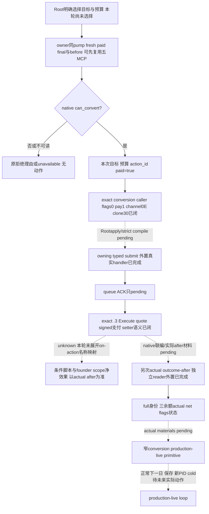

# 1.20.0.3 本人改宗：typed submit 与独立结果施工入口

2026-10-03，状态 **research / exact `.3` 提交及执行 ABI 已闭合，完整外置接线包与唯一 Python 生产路径 case GREEN，native 联编/live pending**。本页沿已公开的[改宗与改革原生树](religion-conversion-and-reformation-native-ai-12003.md)推进当前玩家对明确 target Rite 的付费改宗提交及独立结果。本轮 Root 保持 Robert 的 Catholic 身份，未选转换目标、未执行动作。CK3 1.20.0.3 / Steam25652598，EXE SHA `94B55397ABB687A3DCD436805A5D885E6BE90FA6C693FEB44A9E3BBEEADE02A6`；既有 source6443 研究与当前生产子集 pins 分别记账，不声称尚未发布的 submit 已进入 strictv23。

## 现有输入与最小动作边界

已有五个 self-conversion MCP 提供 choices、inputs、paid terms、reasons、outcome；直接复用[已冻结 conversion proof](Z:/ck3_mod_rewrite/artifacts/g2-maintainer-2026-10-02/resume-12003/m6-law/religion-12003-20261003/conversion/PROOF.json)。`terms.can_convert` 是不同 Rite 与 native paid final 的结果，费用是 native whole-piety quote 乘 Q100000，reason 为独立 native 原文。inputs 可供之后明确的价值选择，不能重建或覆盖 native 最终许可；原生规则允许的合法 signed 余额继续保留，不新增零余额门。

计划的动作输入仅为 fresh public `expected_revision`、完整 `target_rite_id`、本次 `max_piety_cost_raw` 与新的 `action_id`。actor 由同 owned session 当前玩家捕获，无 actor override；ordinary conversion 的 `pay_piety=true` 固定，不把 unpaid quote=0 当成免费改宗入口。target 是 full Rite ID，零值合法、absent sentinel `0xFFFFFFFF` 不作为目标，不能用 Faith ID 或 ordinal 替换。目标和预算由 Root 明确选择；本包没有自动目标选择策略。

现成五查询可先获得目标、原生决策输入、最终许可、费用、原因与 independent outcome；typed submit 的 admission 直接使用 native owner 同 pump 重捕的 before、paid final 与 reasons，不强制再发五次独立 RPC 或另开五个查询 flag。native owning submit 使用同帧实际 command，而不是将旧 SDK 样本当作当前 admission。native final 拒绝就返回原文；query 无法读取保持 unavailable，不编造当前玩家输入。

## 真实 conversion caller 与 owning seam 已闭合

已有 `SubmitCommandCopy` 的提交算法提供 native allocator 所属的 command clone（primary vtable `+0x40`）、scalar deleting destructor（vtable `+0`），并交接 command manager `0x5CC1240` 至 queue `0x37F06F0`。AL 仅表示 queue 接受。它可作为最小 player-owned 提交的现成接口，不能把 queue 接受写成 Execute 或改宗结果。

第一轮只读 preview 不能证明提交；Root 随后授权只读 exact PE 闭合三个具体缺口。现已找到 conversion 自身 registration `[0x22FB60,0x22FCE4)`，其 literal `ConvertFaithAndRite` 位于 `0x4566510`，callback `0x1516EF0` 调真实 core `0x1516880`。core 构造0x30-byte command，flags=0、metadata `+C/+10/+14=0`、actor `+0x20`、full target Rite `+0x24`、pay `+0x28=1`；`0x15168CA` 获取 clone，`0x15168F9` 写 R8D=`0x0E`，`0x1516902` 取 embedded manager，`0x1516909` 调 queue `0x37F06F0`。**channel0x0E 现来自转换自身实际 caller，已经不是套 LAW 参数**。

primary VT `0x4770340` 的 slot`+0x40` 是 owning clone `0x29A7140`，通过 game allocator `0x4223BB4` 分配0x30并复制所有实际字段、重设双 vtable；slot0 是 scalar deleting destructor `0x9D1560`，DL&1 时以 size0x30 调 native free `0x4223F64`。caller 交接 owning pointer、move 后清原 outstorage；残余也走 game destructor。上述新 native 文件及精确 pins 位于 [native-entry](Z:/ck3_mod_rewrite/artifacts/g2-maintainer-2026-10-02/resume-12003/m6-law/conversion-action-12003/native-entry/)。原 readonly/old ABI 与队列算法直接复用，只读取原先未闭的新 conversion caller/clone/dtor。

## `.3` Execute、支付与 setter 已闭合

独立[执行与支付 proof](Z:/ck3_mod_rewrite/artifacts/g2-maintainer-2026-10-02/resume-12003/m6-law/conversion-action-12003/execute-payment/EXECUTION-PAYMENT-PROOF.json) SHA `06232dc696a05c1f3c67e319131da7fc63230986d3d53d4c1947c07c17bea0c8` 来自本次 exact frozen `.3` EXE，而不是旧 `.2` RVA 的推断。secondary VT `0x47703D8` slot1 是 `0x29A3370`，receiver 为 primary+0x18；dispatch 在 `0x29A349D` 调 wrapper `0x29A8040`。

wrapper 在 `0x29A813A` 调原报价 `0x29A3DE0`，`neg eax/cdqe/×100000` 得 signed raw delta；在 `0x29A8178` 经 resource wrapper `0x28D7000` 调 callback `0x28CDCF0`。resource object base 为 Character resource extension `+0x108`，实际 spendable piety 是 object+8，即 extension+0x110。完整48-byte callback `0x28CDCF0–0x28CDD20` 包含全部分支：负 delta 直接加到 signed spendable，**不 clamp 到零**；正 delta 先偿已有 debt，超出部分才累计 object+0x10。这里只证明原生语义，不冒称 Robert 当前已扣费。

wrapper 在 `0x29A81F7` 调 `0x28B01A0(actor,resolved target Rite,0,0)`；完整 setter span `0x28B01A0–0x28B0902` 中 `0x28B0516` 把 target full Rite ID 写 `Character+0xB4`，跨 Faith 才处理 `+0xB8` 缓存，并调用 baseline、knowledge 与 old Rite/Faith on-action。setter 有同 Rite、非法对象等早退，且返回 void；不能以函数返回、ACK 或静态写入指令当作动作成功。branch indexes 与 on-action 名称未扩展的映射继续具体记 unknown，不阻塞本人付费转换及实际独立读回。Root 实现应提交该原生 owning command，**不直接手写扣款或调用 setter 替代完整命令**。

## 独立结果必须保持的语义

原 `conversion_outcome` 明确 `target_reached_is_identity_only=true`、`conversion_causality_inferred=false`、state `is_conversion_gain=false`，actor 只提供 piety/gold/prestige 三个 signed raw 余额。这些旧 readonly 元数据继续保留；新 consumer 不能改为动作因果证明，也不能虚填 influence/merit。

动作材料另行关联新的 action/request、owning pending record 与实际 before/after，复用 LAW typed consumer 的提交后 material readback模式。before 已是目标只作 noop/当前状态，不提交、不计改宗。queue ACK 只进入 pending；只有该请求的 baseline 与之后实际独立材料才能形成动作 material receipt，裸 after identity 恰好匹配不够。**不要求新增 Execute instrumentation 或通用收据门**；静态 void 不是成功 bool，owning pending 与独立实际材料可提供本动作的请求关联。之后 independent outcome 核对同 actor 的 full Rite/Faith/Religion、知识/满足度、真实 flags 与三个余额；callback founder scope 的收益不能自动写成玩家转换收益。

native quoted base piety fee 与 actual resource net change 分列。原 callback 有多 scope、条件奖励与后续事件；未闭其实际净效果时，不将净 delta 等于 quote 当作通用结果条件，也不由总净 delta 声称独立证明 base debit。费用、本轮授权预算、actual net 与执行关联各自诚实发布；若结算原因尚未被观测，返回明确 pending/未观测而不重投动作。资源变化仅来自真实材料，不从 ACK 的占位值复制。

## public2c 完整接线包与必要回归

第三轮 [Python 完整 patch](Z:/ck3_mod_rewrite/artifacts/g2-maintainer-2026-10-02/resume-12003/m6-law/conversion-action-12003/python-consumer/round3/ROOT-PYTHON-ROUND3.patch) SHA `8cdebbbc939c858310256e52a75da36330b0886bc877de9396cd3ad8c3011be0` 基于不可变 source `2c435dcb7ef0a0cfd775c3bfd26e7b37daea0d1d`，接上现 `NativeDriver`、`GameplayBridgeService` 与 MCP 注册；new leaf SHA `9bfbd7efefa5a4d77cb3727025cfcc52c27b4353c1daabbfd9b0e18f8fb46739`。复用 `--private-player-religion-conversion-terms-query` / `allow_private_player_religion_conversion_terms_query`，没有另建 feature 或永久 unavailable action。MCP `ck3_convert_player_religion_private_v1(expected_revision,target_rite_id,max_piety_cost_raw,action_id)` 通过 `submit-player-religion-conversion-private-v1`；MCP `ck3_query_player_religion_conversion_result_private_v1(expected_revision,request_id,action_id)` 通过 `query-player-religion-conversion-result-private-v1`。wire 中 `expected_revision/expected_snapshot_revision` 是 native revision，另列 public revision；poll 当前 request ID 与原 submitted request ID 分离。

native submit response 保留 `Submission`，poll 发布同一 retained `submission` 与一次 fresh `independent_result`；Python 无新增保存 ledger。before normalizer 使用 retained date/native/public frame，after 使用当前 frame，允许正常日期推进；不会把旧 before 强行当成当前日期，也不会复发原 action。完整 [native patch](Z:/ck3_mod_rewrite/artifacts/g2-maintainer-2026-10-02/resume-12003/m6-law/conversion-action-12003/native-entry/shared-round3/ROOT-SHARED.patch) SHA `ac29fdb6121521db4ca30436bd210b773339deeffc759219503dbca28fb274bc` 补齐现有 mailbox executor、main-thread install/copy/admission callback 链，以及 router/CMake；这些都是已有 pump 的正常注册依赖。四个新 native 文件（两原冻结 helper 与两 mailbox）和七个 shared hunk 均仅为外置 projection，当前生产源未由 worker 更改。

[两份补丁应用 proof](Z:/ck3_mod_rewrite/artifacts/g2-maintainer-2026-10-02/resume-12003/m6-law/conversion-action-12003/PACKET-APPLICATION-PROOF.json) GREEN，SHA `5b7172a57ef28653ef15a5f0868cb065cdb3d2660e28931f01a227cbb42321b3`：仅在内存一次将 unified hunks 应用于冻结 public2c 的原文，与完整 15 个投影文件对齐（Python4、native11），没有 Git 或 canonical 写入。native 主线程 owning callback 调实际 `SubmitPaidPlayerConversion12003` 并保留 Submission；后次 callback 只调用一次 `ReadPlayerConversionResult12003`。没有手动 Execute、piety debit 或 setRite 替代原命令。当前完整 packet 待 Root sole apply/strict compile，未授 native static-ready/live。

唯一 [production Python path case](Z:/ck3_mod_rewrite/artifacts/g2-maintainer-2026-10-02/resume-12003/m6-law/conversion-action-12003/focused-round3/RESULT.json) GREEN，SHA `023712e1aa4d845271cc93ecfcb3a5a6fe0f0b554fe627c944df82f7f36aaf32`，使用明确 **synthetic/test-only `.3`** packet，直接调用真实 registered tool function → service → NativeDriver → leaf → 两个 owner wire。submit 只 pending；后次 owning before/after、full Rite/Faith 与三实际净余额才得 material。case 保留 piety `-100000`、`can_afford_piety=false` 但 native `can_convert=true` 的最终允许；quote `37700000` 与 actual piety net `-37500000` 分列，不假称独立 base debit 或 native Execute 观测。没有 SDK client、pipe、native command execution 或任何当前 Robert 动作。这项仅证明外置 Python 生产路径，native compile/live 仍 pending，不授整体 static-ready 或 live。

两次 pre-consumer **harness RED** 原包均保留：错误旧 interpreter 缺 `pydantic`，以及测试把标准 mutating tool 的默认 `annotations=None` 错当必须显式 false。改用已有正式 `tools/.venv`、修正测试断言后同一必要 case GREEN，生产源码未因此变化。未添加其它 case 或重跑旧 suite。

## 外置交付与后续验收

两个 disjoint 离线子包分别位于 [native-entry](Z:/ck3_mod_rewrite/artifacts/g2-maintainer-2026-10-02/resume-12003/m6-law/conversion-action-12003/native-entry/) 与 [python-consumer](Z:/ck3_mod_rewrite/artifacts/g2-maintainer-2026-10-02/resume-12003/m6-law/conversion-action-12003/python-consumer/)。初始 Python projection 的 `native_submit_unavailable/material=false` 仅保留为未绑定协议的外置 draft，**不进 production，也不作为施工完成**；其四参数、paid final、quote/actual net 分列可复用。

第二轮真正 [Python consumer](Z:/ck3_mod_rewrite/artifacts/g2-maintainer-2026-10-02/resume-12003/m6-law/conversion-action-12003/python-consumer/round2/player_religion_conversion_private_action_v1.py) SHA `02eac0929c187d86b9f27c00cad99e5c728531161b46214c7a1b3c5e6ef74972` 已调用 owner submit 与后次 owner result；[外置 leaf patch](Z:/ck3_mod_rewrite/artifacts/g2-maintainer-2026-10-02/resume-12003/m6-law/conversion-action-12003/python-consumer/round2/ROOT-real-conversion-consumer.patch) SHA `47ce87ace1f4b0722387482e6c51d2dd69056f9794f691209b035cf0345d8da5` 保留为可复用实现。它明确将 queue ACK 留在 pending，按 retained before/full target Rite 与 Faith/后次 epoch/三资源 actual net 验证独立 material，不要求新增 Execute hook；既有 readonly causality 与 base-payment 未观测字段不变。Root 随后授权补齐 transport/router/CMake 与 NativeDriver/service/MCP 外置 hunks，基线为不可变 source `2c435dcb7ef0a0cfd775c3bfd26e7b37daea0d1d`。worker 只提交外置补丁，Root sole apply；这部分接线正在施工，尚未进入当前生产版本。

现有真正 native [header projection](Z:/ck3_mod_rewrite/artifacts/g2-maintainer-2026-10-02/resume-12003/m6-law/conversion-action-12003/native-entry/ROOT-PROJECTION/ck3_12003_religion_conversion_action_v1.hpp) SHA `021709845d8fecf94cd5168a123407c08d193b7b8051ba63163d9beb7b3271dd` 和[source projection](Z:/ck3_mod_rewrite/artifacts/g2-maintainer-2026-10-02/resume-12003/m6-law/conversion-action-12003/native-entry/ROOT-PROJECTION/ck3_12003_religion_conversion_action_v1.cpp) SHA `9b2a3b6c86998fdc65221529d1f152b5dee6279fe3ef9b29c3608cc47f920a6b`：`SubmitPaidPlayerConversion12003` 调真实 `SubmitCommandCopy(...,0x0E)`，不是永久 unavailable stub；`ReadPlayerConversionResult12003` 消费 retained request 与之后独立 outcome，分别发布 quote、实际三资源 net、请求关联 material，保留 base-payment/native-execute 未直接观测为 false/null。完整[提交与所有权 exact proof](Z:/ck3_mod_rewrite/artifacts/g2-maintainer-2026-10-02/resume-12003/m6-law/conversion-action-12003/native-entry/EXACT-SUBMIT-OWNERSHIP-12003.json) SHA `5d7b87d40f5ef5ed5861574df19ea2c006c35ab2a8bf0e5417eebfa3ceacd558`、[Root 接入说明](Z:/ck3_mod_rewrite/artifacts/g2-maintainer-2026-10-02/resume-12003/m6-law/conversion-action-12003/native-entry/ROOT-INTEGRATION.md)限定 header 的 `include/xar_bridge/` 与 cpp 的 `src/` 路径；现 conversion ON source list 增一 cpp即可进入下一联编。现有 router/owner mailbox 的 selector、serializer、retained pending record 与 Python transport接线仍由 Root 应用，worker 不写共享 driver/service/MCP/CMake 或任何生产源。本候选未编译或运行，不把外置代码称 static-ready。

本包无 build/game/SDK/pipe/window/state/Git，无旧 suite 重跑、current actor fixture 或新增 live 信用。新 PE 提取有一次 no-pdata leaf 误按 runtime span 请求的 **harness RED**，成功 body 原文保留后只修采集器并收口；它不构成 native capability RED。负支付 leaf 最初只到首个 return 的 partial span 没有用作完整语义证据，最终完整控制流含全部正/负分支。Root 当前 strictv23 无需等待本包；原 CA1、既有 religion primitives 与另 domain fixture PASS 不计为 conversion submit 验证。后续真正源接线、必要 focused production validation 与实际完整 before/once-submit/after 后，才分别升级 static-ready、production-live primitive；next/day/save/cold 在相应真实动作材料出现后再记 loop，不借旧 Catholic 状态或其它角色结果。
