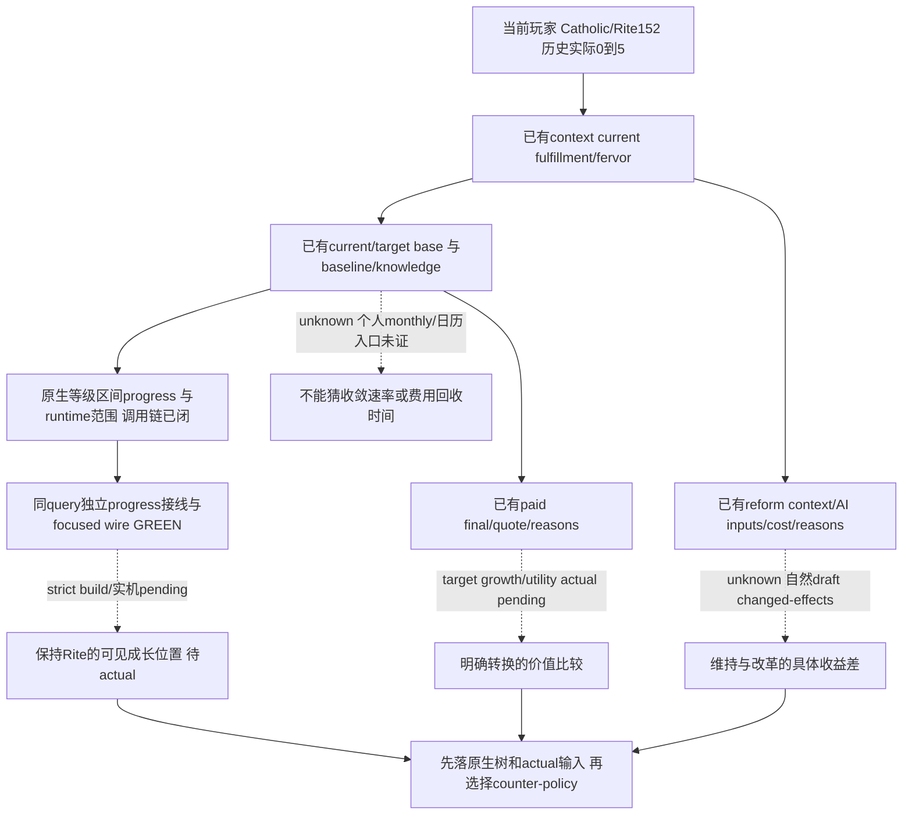

# 1.20.0.3 宗教维持与精神成长的原生收益输入

2026-10-03，状态 **static-ready 外置完整接线包：exact 原生调用链已闭合，Native/Python 同一 genuine wire 的唯一 focused cases GREEN；ROOT apply、strict build 与当前 paused 观测待执行**。当前目标是比较保持当前 Rite、精神成长、明确 target Rite 转换与未来改革所需的原生收益输入，不为验证而改 Robert 的 Catholic 身份。基线 CK3 `1.20.0.3 Crozier` / Steam `25652598`，EXE SHA `94B55397ABB687A3DCD436805A5D885E6BE90FA6C693FEB44A9E3BBEEADE02A6`。getter 研究复用 `6c87eb77568601499ab98a43f9cbea4c2ee870f6`；本完整接线包以不可变 `82c0317448eb8c83c4bf17364a02373b61c0775b` / `production-source-82c03174` 为 base，交 ROOT 下一 v25 batch。source packet 与 focused test 通过不等于 growth publisher 已进入生产。

先复用[宗教身份与现有查询](religion-native-ai-faith-identity-12003.md)、[Rite growth 原生树](religion-native-ai-rite-growth-12003.md)、[效果材料](religion-native-ai-effect-material-12003.md)、[改宗与改革](religion-conversion-and-reformation-native-ai-12003.md)及[已发布 typed conversion 接线](religion-self-conversion-action-native-ai-12003.md)。旧已闭 ABI、已通过 case、实际操作不重复执行；本页只推进决策所缺的新读取入口。

## 已发生的 Robert 成长材料

现 [before packet](Z:/ck3_mod_rewrite/artifacts/g2-maintainer-2026-10-02/resume-12003/m2-events/robert-rite-fulfillment-before-01/001-ck3_query_player_religion_context_v1.json) 与 [after packet](Z:/ck3_mod_rewrite/artifacts/g2-maintainer-2026-10-02/resume-12003/m2-events/robert-rite-fulfillment-after-01/001-ck3_query_player_religion_context_v1.json) 已由 ROOT 执行并关闭。两 finite result 都 GREEN、`official_driver_close_returned=true`；before 当前事件 instance13、after `active_event=null`。本包仅一次文件判读，不重新查询或计为新 action。

| 材料 | before | after | 含义 |
| --- | --- | --- | --- |
| actor / date | 29829 / 53222280 | 29829 / 53222280 | 同玩家、同 paused 日期；不是新 h4191/date53222952 的当前值 |
| Rite / Faith / Religion | 152 / 23 / 8 | 152 / 23 / 8 | Catholic / Christianity 身份保持 |
| fulfillment raw | 0 | 500000 | 实际 signed delta `+500000`，scale100000，即 +5 |
| fervor raw | 6808550 | 6808550 | 此次未变化；不推断长期不变 |
| native revision | 23 | 26 | 两次独立实际材料 |
| owner capture epoch | 292901 | 495453 | epoch 与 snapshot/public revision 独立 |

这证明一次既有 notice 的真实成长收益，不证明月增、长期收敛速率、精神等级收益或“保持 Catholic 是全局最优”。旧 SDK176 的0不替代这次真实 before；本页也不把这次 after500000冒充 ROOT 最新 h4191 的 fresh fulfillment。

## 最小下一读取入口与策略输入账本

现 context 已有 current fulfillment/fervor/full identities；现 conversion outcome 有 baseline 与 target knowledge，conversion inputs 有 current/target base 与 expected base difference，native paid final/费用/reasons 和 owning submit/result 均已有入口。**`predicted_base_change` 不能重命名为月增或实际转换收益。** 本轮新 evidence 说明先补当前玩家的原生等级进度与 runtime范围更有独立价值；不能先假定存在个人月增 getter，再用 UI 信号或传播参数拼出假字段。

| 原生分支 | 已有材料 | 本轮未采用/尚缺 | 影响与下一入口 |
| --- | --- | --- | --- |
| 当前 notice 保持 Rite、stock +5 | 已闭 stock/实际 shown-enabled；独立0→5；身份不变 | 原生 weighted selector 未展开 | bounded event 路线已经可玩；不为它增新门 |
| 保持当前 Rite 的当前成长位置 | current/baseline/base raw 已有 query；同 query progress/range publisher 完整外置接线与 focused case 通过 | ROOT apply、strict build 与实际 paused progress 待完成 | 可显示到下一原生等级的实际进度；独立 primitive，不要求假月增 |
| 个人 fulfillment 的长期演化 | 已有当前值与实际事件增量 | 个人 monthly getter/日历演化入口尚未证明存在 | 明确 unknown；不由 base difference、GUI signal 或 county传播率推收敛时间 |
| 明确 target Rite 付费转换 | full choices/inputs/paid final/quote/reasons/owning submit/result | actual target 对月增、等级 utility 与后续脚本的完整收益未观察 | native final 决定合法性；policy 尚不因 positive base difference 自动转换 |
| 未来自然 draft 的改革 | reform context/AI inputs/resource costs/nonnull final reasons 已有 source | 当前未开自然 draft，缺实际 changed doctrine/tenet 与玩家收益对比 | 不造 draft/null当零；先复用当前 context 与 native最终结果，独立缺口由 Faith lane 限定 |
| Fervor未来增益/保护 | current fervor/numeric特殊参数已发布 | final evolution/保护的当前量未发布 | 不由历史单帧热忱推未来变化；仅在原生比较实际依赖时补同族观测 |

本页尚未提出自动选择 Faith/Rite 或新通用宗教评分。后续 counter-policy 可先用现原生 final、实际费用与有限材料做明确有价值的选择；未采用的 native schedule/权重/条件脚本记录为质量差距，不能把这些分支全部变成 notice 或已有普通 campaign 的前置 gate。

新 Rite lane 只读取原先未闭的新入口：`.3` reflection `GetSpiritualFulfillmentProgress` 注册 `0xD99C0` → `0xEE5590` → `0xEDEB20` → `0x1870650`。`0xEE5590` 的真实 receiver 是 `Character*`；`0xEDEB20` 提取原生复杂返回对象 `+0xE8` 的数值，`0x1870650` 读取当前 fulfillment、原生 type/level 与等级 thresholds。普通等级由 `0x1870020` 计算 `(current−lower)/(upper−lower) × 100000 × 100`，零跨度返回0，最高等级返回 `10000000`：单位是 Q100000 百分比，10000000即100%，没有时间输入。该结论、完整三段 numeric 函数、type/level 的 exact 边与新字节 pins 见 [Rite PROOF](Z:/ck3_mod_rewrite/artifacts/g2-maintainer-2026-10-02/resume-12003/m6-law/religion-growth-maintenance-12003/rite/PROOF.json)；未实际查询当前 Robert。

外置 headless reader 使用真实数据库 slot `0x5D1F6D0`、`0x3181BF0(database, character)` 与 `0x3181370(type, current_raw)`；type 的 level rows/count 在 `+0x58/+0x64`，level stride `0x218`，lower/upper/index 在 `+0x1E0/+0x1E8/+0x210`。原生 runtime min/max slots 是 `0x5C68E00/0x5C68DF8`。它复用本次已读取 Context 的 current value、actor、date、capture epoch，读取实际 played-character pointer，并调用原生 `0x1870020`；没有手工构造或析构 GUI 的复杂返回对象。typed API 与单位已在 [QUERY-CONTRACT](Z:/ck3_mod_rewrite/artifacts/g2-maintainer-2026-10-02/resume-12003/m6-law/religion-growth-maintenance-12003/rite/QUERY-CONTRACT.json) 冻结。reader 的两个文件分别是 [header](Z:/ck3_mod_rewrite/artifacts/g2-maintainer-2026-10-02/resume-12003/m6-law/religion-growth-maintenance-12003/rite/ROOT-PROJECTION/ck3_autonomous_player/native_bridge/include/xar_bridge/ck3_12003_spiritual_fulfillment_progress.hpp)（SHA `8aded05808b057089622825e676a55f115e5bf2286434f405a8e10461c5d41cf`）和 [source](Z:/ck3_mod_rewrite/artifacts/g2-maintainer-2026-10-02/resume-12003/m6-law/religion-growth-maintenance-12003/rite/ROOT-PROJECTION/ck3_autonomous_player/native_bridge/src/ck3_12003_spiritual_fulfillment_progress.cpp)（SHA `96b651349974a7040b47526d9cce361105d5644cfd474719956acd185754d8b6`）。两叶已原样并入完整接线包并随 focused production path 编译通过；ROOT strict build 与实际 getter 当前帧结果仍待执行，不授予 live。

`GetBaseFulfillmentDelta` 的 `0xD3170` → `0xEE4010` 只取 window `+0x68` 缓存；`spiritual_fulfillment_change` 的 `0xDF07B0` 是 GUI 变动 signal，两者均不是个人月增。当前 `.3` defines913–917 的2%/邻居/月只影响同 Faith county 的 Rite spread，不能填进个人 fulfillment rate。

完整接线使用既有 `ck3_query_player_religion_context_v1(expected_revision)` / `query-player-religion-context-v1`，在同一个实际 app-main envelope 先按原流程读取 Context，再由既有 CoreBindings 解析实际 played-character pointer，调用 `ReadPlayerSpiritualFulfillmentProgress12003`。保留 `player_religion_context` 原 DTO/serializer 和 Python `_CONTEXT_KEYS`，添加独立 sibling `player_spiritual_fulfillment_progress`；它自身 unavailable 不重写原 Context 的 availability。conversion outcome 复用同一 Context serializer，因此不能直接把新字段插进旧 Context 或 paid final。既有 FinishQueryMailbox、预算、授权、expected revision、executor、CMake context 开关保持原合同；source 只加入该现有 context 编译分支和已有 mailbox test target 的必要 link source。本包不新增 feature、gateway、test framework 或原生 Execute 调用。

## 完整生产接线与唯一新路径验证

Native 外置 shared hunk 仅 `ck3_12002_religion_mailbox.hpp/.cpp` 与 `CMakeLists.txt`，加原已闭的两 getter 叶及一份 focused fixture。现 `HandlePlayerReligionMailbox12002` 绑定 actual descriptor/module 下的 progress callbacks，现 owner callback 在读取 Context 后解析当前玩家并读取独立 progress，原 `RunPlayerReligionMailbox12002` 完成 submit/drain/wait/reclaim 和两 sibling 序列化。既有 runtime mailbox 契约保持原样。

Python 外置 shared hunk 仅 `src/xar_autoplayer/bridge/player_religion_context_private_transport.py`。它保留旧 `_CONTEXT_KEYS` 和 context normalizer 的逐文本 pins，追加独立19字段 progress decoder；wire缺 sibling 时仍缺 key，显式 null 保持 null，actual对象保留自身 availability、literal原因与 signed/nullable raw。旧 query status 仍依据旧 Context，不 AND 进度读取。现 MCP `1626–1630` 与 NativeDriver `2832–2840` 直接返回已有 query 结果，无新增注册/service/schema层。decoder 不重算百分比、不 clamp runtime值、不推月增长。

一条 Native focused case（[RESULT](Z:/ck3_mod_rewrite/artifacts/g2-maintainer-2026-10-02/resume-12003/m6-law/religion-growth-maintenance-12003/native-integration/RESULT.json)）实际运行生产 `RunPlayerReligionMailbox12002`、owner executor、Core resolve、Context及新 progress reader、mailbox 生命周期与 serializer，并编入真实 `.3` build renderer。最终 compile/run exit0，stdout `PASS cases=1 checks=12`；它不执行游戏模块的实际 RVA callbacks，synthetic fixture 标识与当前 Robert 分开。输出 [genuine native wire](Z:/ck3_mod_rewrite/artifacts/g2-maintainer-2026-10-02/resume-12003/m6-law/religion-growth-maintenance-12003/native-integration/focused/native-wire.json)（1587 bytes，SHA `b2b30af233cd65af9252c11250b392ea883039203dc50d599e378bdfa4c1ed61`）中的 current750000、区间−3000000至3000000、progress6250000即62.5%；这些是 fixture 数据，不能写为 Robert 当前值。

一条 Python focused case（[RESULT](Z:/ck3_mod_rewrite/artifacts/g2-maintainer-2026-10-02/resume-12003/m6-law/religion-growth-maintenance-12003/python-integration/RESULT.json)，SHA `be6de99ef633b40a6c3f09cb65a7e50b5a547bfd65e03f9bcb4d1ad28813e29e`）仅运行一次/1RPC，由 actual `NativeHeadlessGameplayDriver` 方法进入生产 query/private transport，直接解上述 native serializer完整 command_result。19个进度字段与全部旧 Context 原样；没有 Python 重造 wire，没有旧 suite 重跑。两次最初 Native compile/link **harness RED**分别是新fixture namespace误写与未调用 adapter construction link符号。第二轮完整 raw日志/argv 保留；第一轮因归档命令 quoting 失败，原 raw日志被后续 attempt 覆盖，现只保留 exact原fixture与实际工具 diagnostic摘录，明确不能称原 raw日志。修复仅外置fixture限定名及添加永不调用的 abort construction stubs，未替换真实 renderer/reader/mailbox、未改生产接线。成功的同一 case 不再重复。

ROOT 可直接应用的完整文件与统一 patch 为 [ROOT-APPLY-PROJECTION](Z:/ck3_mod_rewrite/artifacts/g2-maintainer-2026-10-02/resume-12003/m6-law/religion-growth-maintenance-12003/ROOT-APPLY-PROJECTION) 和 [ROOT-GROWTH-INTEGRATION.patch](Z:/ck3_mod_rewrite/artifacts/g2-maintainer-2026-10-02/resume-12003/m6-law/religion-growth-maintenance-12003/ROOT-GROWTH-INTEGRATION.patch)，每文件 base/after pins 与 exact-hunk apply证明见 [完整 receipt](Z:/ck3_mod_rewrite/artifacts/g2-maintainer-2026-10-02/resume-12003/m6-law/religion-growth-maintenance-12003/INTEGRATION-OWNER-RECEIPT.json)。后台包按 static-ready 收口；ROOT strict v25 后只需一次当前 paused 的既有 context query 获取 progress 材料，没有改宗操作前置。若 actual progress unavailable，沿实际返回的具体原因定位同 capability，不能以 ACK 或这个 fixture 冒充当前成长观测。

Faith 的 `GetYearlyFervorChange` 是 Faith 热忱演化，与个人 fulfilled/growth 是不同材料；年度量只在实际年度 Faith 比较需要时扩同 numeric-query。未来自然 draft 的 `GetRiteDivergence`、`DivergenceResultsInFaithCreation` 才分类这份草案是否产生新 Faith；current Rite divergence 或本轮 Catholic identity 不能替代草案结果。现改革 final、quote、nonnull reasons 不重做；本轮没有制造或打开 draft。

Faith lane 的 [source facts](Z:/ck3_mod_rewrite/artifacts/g2-maintainer-2026-10-02/resume-12003/m6-law/religion-growth-maintenance-12003/faith/SOURCE-FACTS.json) 与 [bounded input ledger](Z:/ck3_mod_rewrite/artifacts/g2-maintainer-2026-10-02/resume-12003/m6-law/religion-growth-maintenance-12003/faith/FAITH-MAINTAIN-GROWTH-NOTES.md) 冻结现有覆盖与两个条件性入口。`.3 window_faith.gui` 的 `Faith.GetYearlyFervorChange` 是 final annual getter，现有5个 cache 参数及 final heresy threshold 不能拼成该值；需要该比较时应闭其 `.3` reflection，并追加 `numeric.faith_evolution_final`。自然草案出现且需要分类时，`.3 window_rite_creation.gui` 的 `GetRiteDivergence`、`DivergenceResultsInFaithCreation` 与动态 creation threshold 对应 `reform_context.current_draft_preview`，不能以当前 Rite 的 divergence 或硬编码100/65代替。原先的 `.2` 字节窗口只作旧研究回链，不授予新的 `.3` getter ABI 信用；这两个入口不阻塞当前 notice 和等级进度的独立价值。

## 当前工作包边界

两个 disjoint 离线研究 lane 在 `artifacts/g2-maintainer-2026-10-02/resume-12003/m6-law/religion-growth-maintenance-12003/{rite,faith}`，完整接线分别在 `{native-integration,python-integration}`。Rite lane 只补新 progress/range native入口与个人演化的精确未知，Faith lane 只记现维持/改革收益输入缺口与具体 source入口。已有 `.3` getter与效果链直接回链，不重跑 bytes/ABI/旧 fixtures。game/SDK/pipe/窗口/state/Git及 canonical source apply/strict build 全由 ROOT 独占；本包仅外置接线与必要 focused 构建/运行。当前 root h4191/date53222952、queued19 只作 ROOT 提供的基线，不替它捏造新的宗教观测。

本工作包零新 live/action/game days/M6/G2 credit；旧 CA1 complete窄 loop、已完成 notice与原 conversion/reform资格保持各自证据范围。新 getter/prototype/实际 paused 验收按后续真实 receipt逐项更新，不把 research文档或 old +5当成完整宗教 OODA。
