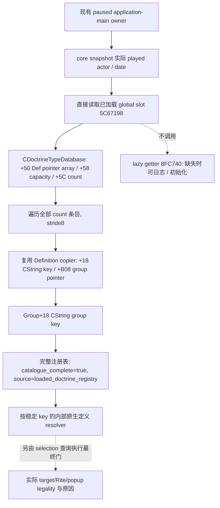

# CK3 1.20.0.2 已加载 Doctrine 注册表

必要性是实际候选输入：当前宗教 popup 的 choices 仅覆盖那个 widget 的作用域，不是全部已加载 Doctrine；原版文本扫描也不能覆盖玩家实际启用模组的定义。此包读取游戏已经加载的 `CDoctrineTypeDatabase` 完整条目，给 current/selection 查询提供定义输入账本。注册表条目不等于该角色、该 Rite 或该 popup 的最终合法 choices。

冻结为 CK3 1.20.0.2 Crozier / Steam25588574，EXE SHA-256 `AE1BA6FF060BA603842F6F4A2DED0AF4B7D3666B3DD271F75FB01B0DA8E81B2D`。该首包实际只做宗教注册表的只读观测，没有宗教操作、战争或 holy order 研究。2026-10-03 项目所有者已取消全部非战限制并全面授权战争与战斗的研究、原生观测、实现、策略及实机执行；旧范围仅记录首包事实，不能作为后续禁令。授权不改变本 provider 的 static-ready 等级或补齐尚未实现的观测与动作。

## 原生树与复用证据

global、数据库 array/count、Def/group 稳定 key 与 linkage 的 exact-build 字节和调用链直接复用 [Faith/mainRite 定义专题](religion_doctrine12002_intrinsic.md) 及其 `research/religion_doctrine12002_intrinsic_abi.json`（SHA `fe2e219c19e63bd92222bc4f8c0ee2f5ccf38b1ad80be4411aa9911c192a1ccd`）。已证 getter `0x8FC744` 读 global `0x5C67198`；缺失分支会调用原生日志/registry 初始化，因此本包仅读取 global slot，绝不调用该 getter。group postload `0x31E1161` 取得实际 DB，`0x31E1166/+0x31E116A` 读取 `+0x50/+0x5C`，Def stride8。复用 `CopyDoctrineDefinition12002`，不重新冻结或测试旧 span。

`+0x58` 是同一 CPdxArray 的 capacity；本 reader 只需已证 pointer/count，不引入对新 getter 的调用或依赖未证的候选评分。完整性表示全部已加载 Doctrine rows 已复制，合法空表仍为 complete，读取失败为 unavailable。定义对象没有已证 full-generation runtime ID，wire 仅公开原生 stable key/group key；scope 身份仅为当前 played actor/date/epoch。

## 实际 provider 与验证

[header](../../ck3_autonomous_player/native_bridge/include/xar_bridge/religion_doctrine12002_catalogue.hpp) 与 [实际 provider](../../ck3_autonomous_player/native_bridge/src/religion_doctrine12002_catalogue.cpp) 提供 exact-image binder、当前玩家完整 catalogue reader、serializer，以及仅内部使用的 `ResolveDoctrineDefinitionByStableKey12002`。该 helper 按已经加载的实际定义 key 查找；完整查表无匹配返回 success+null，数据库读失败返回 false+原因。native 指针只供原生 selector/current consumer 使用，从不写入外部 DTO。

reader 从现有 CoreBindings 取得 paused 实际 played actor/date，读取当前 global 的全 count rows，再次读回同一帧和完整列表。源为 `loaded_doctrine_registry`，`catalogue_complete=true` 只表示全部 loaded rows 已复制，未推断某个 actor/Rite 的合法性。没有以 stock 名单筛掉 mod 定义，也没有把不存在 DB 当成空表或触发 lazy 初始化。

[实际 C++ fixture](../../ck3_autonomous_player/native_bridge/src/religion_doctrine12002_catalogue_test.cpp) 与 [runner](../../research/religion_doctrine12002_catalogue_tests.py) 在新增生产路径以 MSVC `/O2 /W4 /WX` **一次通过 11 项检查**，生成 **3 份实际 JSON**：非 stock 自定义定义/中文引号 key 的完整列表、known-empty、database-unavailable，由 Python 解析。包括实际 stable-key resolver、当前 actor/date、完整性与 unavailable 区分、exact global-slot binder。旧 `/Od` 矩阵和旧 ABI span 不重跑。

artifact 为 `Z:/ck3_mod_rewrite/artifacts/g2-offline-2026-10-01/religion-doctrines/catalogue/provider/result.json`，保存实际 source、executable 和 wire SHA。此独立 provider 为 **`static-ready`**，未访问 CK3/pipe/Steam/UI；后续 domain query 文档独立在 `religion_doctrine12002_catalogue_mailbox.md`。root 真实 paused sample 是 live primitive 的剩余边界。
