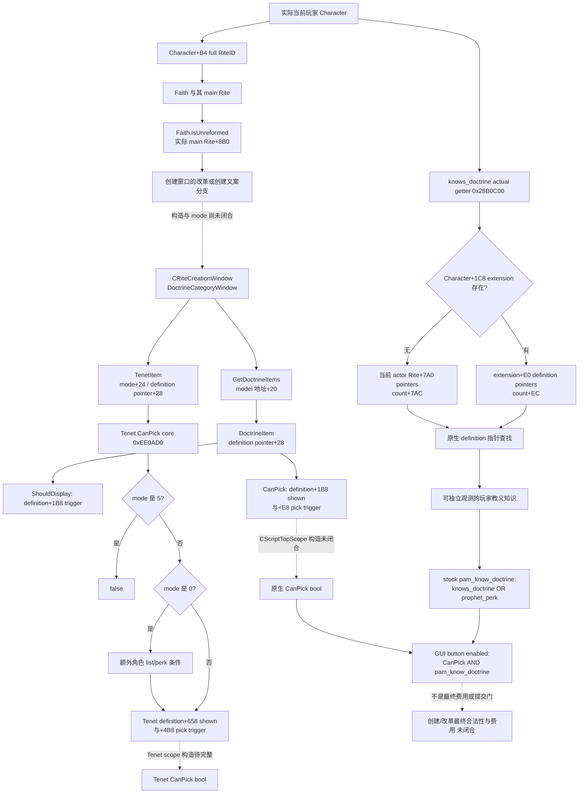

# 1.20.0.2 教义选择模型与玩家知识输入

冻结 CK3 **1.20.0.2 / Steam 25588574**，EXE SHA-256 `AE1BA6FF060BA603842F6F4A2DED0AF4B7D3666B3DD271F75FB01B0DA8E81B2D`。项目所有者于 2026-10-01 允许宗教研究，同时停止战争研究；本包只研究教义选择与只读知识输入，不触碰游戏进程、战争、宗教动作或我方策略。

原生树已 **static-confirmed**，实际当前玩家知识 provider、稳定 key lookup 与 serializer 已 **static-ready**。没有本包 paused/live artifact，完整可选列表和最终创建/改革合法性仍未闭合。

## 原生与 stock 输入树



这张树描述实际 UI 输入与原生读取关系，未宣称已闭合宗教 AI 的选择策略。

## 列表、显示与合法性不是同一个结果

`game/gui/window_rite_creation.gui:1236–1293` 的教义按钮先建立 Doctrine/Faith/Rite 上下文，`visible = DoctrineItem.ShouldDisplay(TopScope.Self)`。按钮启用要求 **`DoctrineItem.CanPick(TopScope.Self)` 且 `pam_know_doctrine` 脚本有效**。后者位于 `common/scripted_guis/pam_scripted_guis.txt:82–92`，真实条件是 `knows_doctrine = scope:doctrine OR has_perk = prophet_perk`。知识 bool 不包含 Prophet perk；它单独不是最终按钮启用结果。

创建窗口通过 `DoctrineCategoryWindow.GetDoctrineItems` 枚举教义，通过 `TenetGroupItem.GetTenets` 枚举信条。`GetDoctrineItems` reflection thunk `0x14FA960` 只把 `DoctrineCategoryWindow+0x20` 交给集合包装器；完整记录构造、模式枚举和值的来源仍待研究，不把 registry 全集称为可选列表。

**DoctrineItem 与 TenetItem 有同名 reflection 方法，必须按类型区分。** `DoctrineItem.ShouldDisplay` callback `0xEE4CC0` 从 `item+0x28` 取 Doctrine definition，调用 `0x372DF30(definition+0x1B8, CScriptTopScope*)`；`DoctrineItem.CanPick` callback `0xEE4E60` 提取 TopScope 后分别求值 definition 的 `+0x1B8` shown 与 `+0xE8` pick trigger。对应 registration callback LEA 是 `0xD7887`、`0xD7AC8`。

`TenetItem.ShouldDisplay` 是另一 callback `0xEE46F0`，求值 Tenet definition `+0x658` trigger。`TenetItem.CanPick` callback `0xEE47A0` 提取 Character 和 TopScope 后调用 core `0xEE0AD0(TenetItem*, Character*, CScriptTopScope*)`。其 `item+0x24` 模式为 5 时直接拒绝；0 另检查角色已知信条列表/原生 perk 条件，其他未命名模式不能擅自标作 create 或 reform。之后分别求值 Tenet definition `+0x658` 与 `+0x4B8` trigger。只有完整 `CScriptTopScope` 及 item 构造闭合后，才能接成相应原生选择判定。首轮把 Tenet 同名回调标为 Doctrine 的研究记录已保留 `choices/attempt-002-reflection-disambiguation/`；当前 ABI/tree 已纠正，知识 provider 不调用这组 gate，未受该命名错误影响。

窗口根据 `GetPlayer.GetFaith.IsUnreformed` 分别显示改革与普通创建文案；`IsEditing`、`IsCreating` 又是窗口模式，不能用 unreformed bool 替代这两种 mode。`Faith.IsUnreformed` reflection callback `0x2444600` 调用 core `0x2BD8960(Faith*)`，后者解析 Faith 的 `+0x98` main Rite，再读取该 Rite 的 `+0x8B0`，不是直接读取玩家当前 Rite，也不是旧版 Faith 布尔字段。

## `knows_doctrine` 的真实只读来源

原生注册 `0x592AA0` 对应字符串 `knows_doctrine`；工厂 `0x2B30020` 的 trigger vtable `0x47BCAB0`，`+0xC8` slot 为 `0x2B2C130`。这个实现完成 Character scope full identity 解析与 doctrine operand 解析，tail-call **`bool 0x28B0C00(Character*, DoctrineDefinition*)`**。

该 getter 首先读取 Character 的 `+0x1C8`。有扩展状态时，在 `extension+0xE0` 的 definition pointer array、`+0xEC` 的 count 中查找。没有扩展时，原生解析角色 `+0xB4` 的 full RiteID，并在当前 Rite 的 `+0x7A0` pointer array、`+0x7AC` count 中查找。它返回真实指针成员关系，没有拿 Faith 的 intrinsic seed 或 main Rite 教义代替当前玩家的已知教义。`TenetItem.CanPick` 的 `0x28B0B60` 返回 `extension+0xC8` 的另一 collection，不能与 doctrine 知识列表混为一谈。

当前 provider 读取当前玩家 learned rows，并按原生 registry 稳定 key 解析知识 bool。Doctrine 定义是静态对象，公开稳定 doctrine/group key，不公开地址，也不把定义地址或数值当作生成代际实体 ID。稳定 key 拷贝复用 [intrinsic definition helper](../../ck3_autonomous_player/native_bridge/include/xar_bridge/religion_doctrine12002_intrinsic.hpp)。

原生 registry getter `0x8FC740` 读取 global `0x5C67198`，但 global 为空时会触发初始化，因此 provider **只读已存在的 global**，不调用该 getter。DB 的 definition pointer array 位于 `+0x50`、count 位于 `+0x5C`；完整登记表证明由 intrinsic 同一包冻结。by-key 查找成功后调用真实 `0x28B0C00`，不能把 registry 全集或查找成功当作创建候选或可选合法性。

## 实际只读接口与验证

实现位于 [choices header](../../ck3_autonomous_player/native_bridge/include/xar_bridge/religion_doctrine12002_choices.hpp) 和 [provider/serializer](../../ck3_autonomous_player/native_bridge/src/religion_doctrine12002_choices.cpp)，namespace `xar::ck3_12002::religion::doctrine12002`：

```cpp
KnowledgeBindings BindDoctrineKnowledgeImage12002(uintptr_t base, string_view exe_sha);
bool ReadPlayedDoctrineKnowledge12002(const KnowledgeBindings&, uint64_t epoch,
                                     PlayedDoctrineKnowledge&);
bool ReadPlayedDoctrineKnowledgeByKey12002(const KnowledgeBindings&, string_view doctrine_key,
                                          uint64_t epoch, PlayedDoctrineKnowledgeLookup&);
```

Bindings 复用现有 `religion::Bindings/CoreBindings`；subject 始终为 actual core snapshot 的实际 played Character，接口没有 actor 参数。`knowledge_source` 为 `character_extension` 或 `rite_default`；`learned_rows` 保存真实 definition 稳定 key、group key 与逐项真实 `native_knows_doctrine` 结果。默认列表来源始终是 actor Rite，未替换为 Faith 的 main Rite。合法零 ref 保留；合法 absent Rite 只有在真实 native absent-reference object 提供实际 collection 时才可观察为空，getter 读取失败不会冒充 empty。

两个接口在现有 paused owning-thread context 中取两个独立样本，保留 date、实际 played ID、完整 actor Rite ref 与原生知识值；它们不发现或附加进程、不操作 UI、不入队游戏命令。by-key 响应区分：已存在定义且已知 `true`、已存在定义但未学会 `false`、登记表内没有该稳定 key（`available=true`，`definition_found=false`，knowledge 为 `null`），以及登记表未可读（`available=false`，reason 保留）。`false` 是真实查询结果，不能因 optional bool 为空值判断而丢失。

这两个 serializer 的 schema 分别是 `ck3_12002_played_doctrine_knowledge_v1`、`ck3_12002_played_doctrine_knowledge_lookup_v1`。knowledge bool 未包含 Prophet perk，也未声称完整 `CanPick`、费用或创建/改革最终门已就绪。中央 query/MCP composition 由协调者负责，当前包没有独立 command handler 或私造公共 action。

[exact verifier](../../research/religion_doctrine12002_choices_abi.py) 与 [ABI manifest](../../research/religion_doctrine12002_choices_abi.json) 记录 **14 个完整函数、38 条语义指令、4 个 stock 窗口和 7 个 provider 常量**。无 `.pdata` 的 `Faith.IsUnreformed` core 使用明确 reviewed leaf body `[0x2BD8960,0x2BD89B6)`；其余函数使用 PE exception directory 边界。首轮 verifier 把所有函数都要求为 `.pdata` 项导致 **research harness RED**，原记录保留 `choices/native-attempt-001.json`；更正 leaf 边界后 verifier GREEN。补充 Doctrine/Tenet 同名消歧后只更新原生 extraction；知识生产源未改变，不重复已通过的 provider 矩阵。

[actual production fixture](../../ck3_autonomous_player/native_bridge/src/religion_doctrine12002_choices_test.cpp) 链接实际 core、religion context、intrinsic definition copier、knowledge reader 与 serializer。[runner](../../research/religion_doctrine12002_choices_tests.py) 以 MSVC `/W4 /WX /Od`、`/O2` 各通过 **19 项检查**，每种模式生成并解析 **8 份实际 C++ JSON**。覆盖缓存列表、actor Rite 默认列表、完整 generation、中文与引号稳定 key、合法 empty、native absent-Rite object、by-key true/false/缺定义/缺登记表、实际只读输入失败，以及两次原生 bool 读取漂移；callbacks 与对象内存都在 fixture 进程中，不是 CK3 实机。

完整 artifact 在 `Z:/ck3_mod_rewrite/artifacts/g2-offline-2026-10-01/religion-doctrines/choices/`。`native/result.json` 与 `provider/result.json` 分别冻结 native extraction 和实际 C++ source/wire hashes；`delivery-result.json` 为 exact tracked path 与依赖哈希清单。后续 live 最小验收是同一实际 paused actor 查询 learned rows，并选一个真实已存在 definition key 对照 true/false 知识结果；root 独占实机。

未闭合入口：完整创建/改革候选模型、所有模式的语义、TopScope 构造、Prophet perk 额外门、最终费用和提交条件。当前知识观测具备独立价值，不以这些未知分支阻止读取已证明的实际知识列表。
