# 1.20.0.2 当前玩家教义知识：实际私有 mailbox

本包扩展 [已冻结的知识原生树与 provider](religion_doctrine12002_choices.md)，只提供当前玩家已知教义和指定 authored key 的知识判定。冻结 CK3 **1.20.0.2 / Steam 25588574**、EXE SHA-256 `AE1BA6FF060BA603842F6F4A2DED0AF4B7D3666B3DD271F75FB01B0DA8E81B2D`。项目所有者已经允许宗教研究并停止战争研究；本包无宗教动作、战争工作或 counter-policy。

实际 reader、definition copier、主线程 mailbox runtime 和完整 command-result serializer 已 **static-ready**。MSVC `/W4 /WX /Od`、`/O2` 各通过 **43 项检查**，各生成 **6 份实际 C++ 传输包**。callbacks 和 native memory 均属于离线 fixture；没有本包真实 paused artifact，不能称为 `fixture-live` 或 `production-live primitive`。中央 named permit/开关/路由、MCP consumer 与实机由对应协调者继续集成。

## 请求与响应

私有 selector 为 `query-player-religion-doctrine-knowledge-v1`，domain 为 `player_religion_doctrine_knowledge_v1`，backend 为 `ck3-1.20.0.2-native-player-religion-doctrine-knowledge-v1`。正式发布默认不启用 `XAR_CK3_ENABLE_G2_PLAYER_RELIGION_DOCTRINE_KNOWLEDGE_PRIVATE_QUERY_V1`。subject 来自 actual core 的实际 played Character，request 没有选择 actor 的语义。

Payload 可包含非空 `doctrine_key`，及现有 revision expectation：

```json
{"expected_snapshot_revision":709}
{"expected_revision":709,"doctrine_key":"doctrine_polygamy"}
```

不提供 key 时返回 `query_mode=learned_rows`、内层 schema `ck3_12002_played_doctrine_knowledge_v1`。`knowledge_source` 区分 `character_extension` 与 `rite_default`；`learned_rows` 每项含稳定 doctrine/group key、真实 source 与实际 native `knows_doctrine` bool。

提供 key 时返回 `query_mode=by_key`、内层 schema `ck3_12002_played_doctrine_knowledge_lookup_v1`。读取已经初始化的原生 definition registry，按 authored key 找到实际 definition 后调用原生知识 getter。`definition_found=true` 与 `native_knows_doctrine=false` 是有效的未学会结果；找不到定义时 `available=true`、`definition_found=false`、bool 为 `null`；无法读取登记表时 `available=false` 且 reason 保留。原生 getter 可能初始化登记表，因此 producer 只读实际 global，不调用初始化入口。

Revision 可省略；若提供则必须为非零并匹配当前 published revision。`expected_snapshot_revision` 与 `expected_revision` 同时提供时必须相等。authored key 使用现有 `JsonStringField` 的控制字符串边界，不另造 transport parser。

实际 packet 顶层含 `type=command_result`、`protocol_version=1`、真实 `request_id` 和 `ok=true`。`result` 含 `accepted=true`、`private_build=true`、`read_only=true`、`advertised=false`、`status=observed|unavailable`、exact game version/EXE SHA、domain/backend、published `snapshot_revision`、`date_raw`，以及 **`player_religion_doctrine_knowledge`** 原生 DTO。原生 `capture_epoch` 为真实 main-thread pump epoch，不能替代 published revision；原生读取失败但 query frame 稳定时，inner 仍记录这个真实 date 与 played ID。

知识 bool 不包括 `prophet_perk`，也不是完整 Doctrine/Tenet `CanPick` 或创建/改革费用与最终提交合法性。按 key 查找真实 registry 的成功结果不会被命名为“可选候选”。完整候选模型继续由创建窗口专题研究。

## 实际生产路径

实现为 [mailbox header](../../ck3_autonomous_player/native_bridge/include/xar_bridge/religion_doctrine12002_choices_mailbox.hpp) 和 [runtime/handler/serializer](../../ck3_autonomous_player/native_bridge/src/religion_doctrine12002_choices_mailbox.cpp)。

```mermaid
flowchart LR
    A[worker: private selector\noptional authored doctrine key] --> B[解析真实 revision aliases/key]
    B --> C[实际 TrySubmit\nowned query context]
    C --> D[原生 paused owner pump/drain]
    D --> E[EnterQueryMailbox\npublished完整帧]
    E --> F{有 doctrine_key?}
    F -->|无| G[actual current-player learned rows]
    F -->|有| H[actual registry key resolve\nactual native KnowsDoctrine]
    G --> I[FinishQueryMailbox]
    H --> I
    I --> J[真实 Wait/Reclaim]
    J --> K[完整 command_result serializer]
    K --> L[actual packet fixture供SDK读取]
    L -. 中央与MCP增量接线 .-> M[当前玩家只读 MCP]
    M -. root实机待采样 .-> N[production-live primitive]
```



`RunPlayerReligionDoctrineKnowledgeMailbox12002` 为实际 handler 与夹具共同调用的 owned-context runtime；`ExecutePlayerReligionDoctrineKnowledgeMailbox12002` 从 envelope 获取保留的 typed context，调用未替换的知识 provider。中央生产部署应给现有主线程 mailbox 的 named `permitted_executor_religion_doctrine_knowledge12002` 登记该 executor。离线 fixture 使用现有 primary permit，不修改共享 slot 表，也不冒充已经完成中央 named registration。

Query frame 漂移时不生成成功传输包。原生读取失败但 envelope 保持同一真实帧时返回 typed unavailable。ACK、accepted 和 wrapper `ok` 仅代表完整只读传输结果，并不证明原生值已成功读取，更不代表创建动作或完整策略循环。

## 本次验证与失败记录

[fixture](../../ck3_autonomous_player/native_bridge/src/religion_doctrine12002_choices_mailbox_test.cpp) 使用真实 `TrySubmitMainThreadQueryV1`、`ObserveMainThreadPumpAndDrainV1`、`WaitForMainThreadQueryV1`、`ReclaimMainThreadQueryV1`、`QueryMailboxEnvelope`、实际 core/provider/copy helper 及 full serializer。bare adapter 的 identity unwrap 是 fixture shim，未替换 production WorkerAdapter。所有借用的其他 GameAdapter 接口仅返回 unavailable，没有执行游戏或战争能力。

[runner](../../research/religion_doctrine12002_choices_mailbox_tests.py) 两种模式各通过 43 项检查，包括 current learned rows、by-key native true/false、登记表没有定义、登记表 unavailable、合法空 cached list、owner 帧漂移、revision alias 与 actual handler stale reject，随后由 Python 解析各 **6 份完整 C++ JSON**。便携 [wire fixture](../../research/religion_doctrine12002_choices_mailbox_wire_fixtures.json) 冻结 `/O2` actual packets、source pins 与原始 packet SHA，供正式 SDK consumer 直接使用，避免用 mock 增补必需的 metadata。

Artifact 根目录为 `Z:/ck3_mod_rewrite/artifacts/g2-offline-2026-10-01/religion-doctrines/choices/mailbox/`。首轮编译漏传 `JsonStringField` 的必要 bound 参数，编译 **harness RED** 的原日志和状态保留在上级 `mailbox-attempt-001-build.log` / `mailbox-attempt-001.json`；补用现有 `kMaximumControlStringBytes` 后本次矩阵 GREEN。这轮只测试新增 mailbox，未重复已通过的 19×2 基础 provider 矩阵。

可复跑：

```text
python research/religion_doctrine12002_choices_mailbox_tests.py --output-dir <Z-artifact-dir>
```

若明确要刷新便携 actual packets，再加 `--record-wire-fixtures`，并审阅 fixture diff。完整 path/SHA/依赖与日周报告字段在 `choices/mailbox-delivery-result.json`。下一步是中央新 incremental route/flag/named permit 和 SDK 接线，随后 root 在真实 paused actor 上取得 learned rows 与实际 key 知识结果；不会因此重启已冻结的战争研究。
